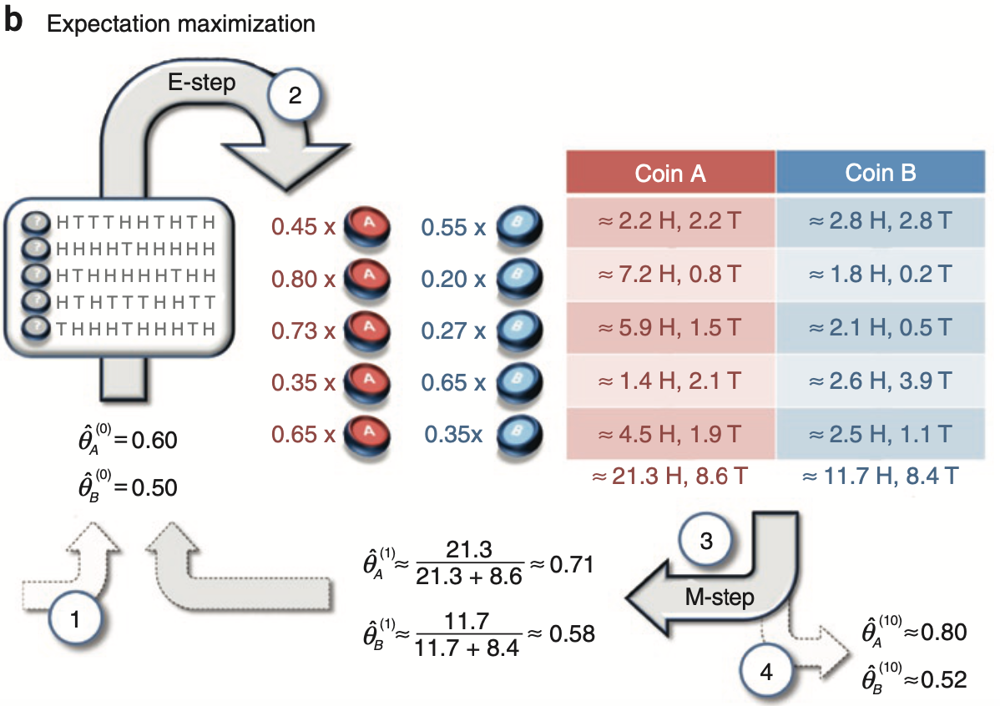
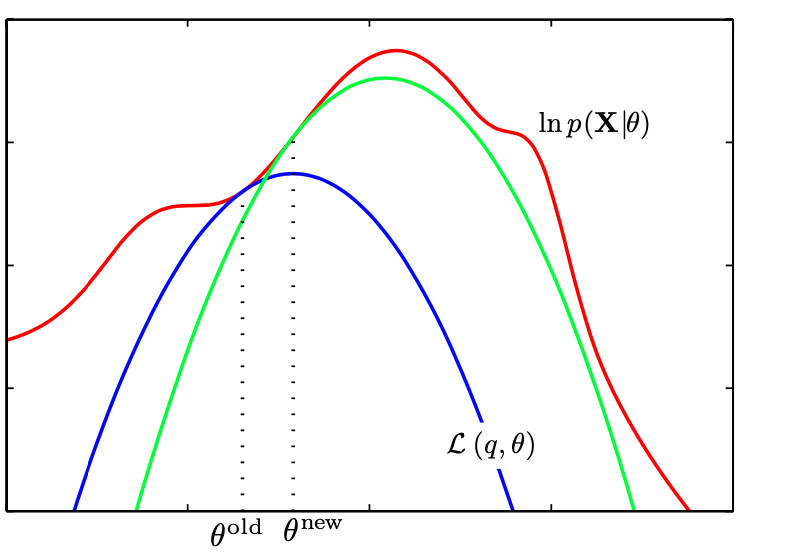

---
title: "Coding and Visualizing the Expectation-Maximization (EM) Algorithm"
summary: 'In this post, I provide two segments of code. The code segment reproduces a coin-tossing example in a popular publication on the expectation-maximization (EM) algorithm. The second code segment reproduces a population depiction of the EM algorithm whereby a likelihood function is approximated and optimized by a lower-bounding function.' 
draft: false
date: "2023-05-03"
article_type: coding
output:
  bookdown::html_document2:
     keep_md: true
always_allow_html: true
header-includes: 
bibFile: content/coding_tricks/em_demo/refs.json    
tags: []
---   


```{r package_loading_1, include=F}
#load packages   
library(easypackages) 
packages <- c('devtools','tidyverse', 'reticulate', 'RColorBrewer')
libraries(packages)  

knitr::opts_chunk$set(comment = NA, echo = TRUE, eval = TRUE, warning = FALSE)
# knitr hook to use Hugo highlighting options
knitr::knit_hooks$set(
  source = function(x, options) {
  hlopts <- options$hlopts
    paste0(
      "```", "r ",
      if (!is.null(hlopts)) {
      paste0("{",
        glue::glue_collapse(
          glue::glue('{names(hlopts)}={hlopts}'),
          sep = ","
        ), "}"
        )
      },
      "\n", glue::glue_collapse(x, sep = "\n"), "\n```\n"
    )
  }
)

chunk_class <- function(before, options, envir) {
    class_name = options$class_name

    
    if (!is.null(before)) { 
      
        lines <- unlist(strsplit(x = before, split = "\n")) #separate lines of code at \n
        n <- length(lines)  #determines numbers of lines
        
        #if (line_numbers) { 
           res <- paste0("<pre><code class='", class_name, "'>", before, "</code></pre>")
                            
                            #paste0("<pre><code class='", class_name, "'>", before, "</code></pre>")
        #}
        
       
          
          #res <- paste0("<pre>", paste0("<span class='line-number'>", 1:n,
                            #"</span><code class ='", class_name, "'>", lines, "</code>"), "</pre>")
    }
        return(res)
    
}

knitr::knit_hooks$set(output = chunk_class, preserve = TRUE)

#knitr::knit_hooks$set(output = function(x, options) { 
#  paste(c("<pre><code class = 'r-code'>",
#        gsub('^## Error', '**Error**', x),
#        '</pre></code>'), collapse = '\n')
#})

#use_virtualenv("EM_post")
options(reticulate.autocomplete = TRUE)

#create and use conda environment
#conda_create(envname = 'blog_posts',  python_version = '3.10.11')
use_condaenv(condaenv = 'blog_posts')

#install packages in conda environment
#py_packages <- c('numpy', 'pandas', 'scipy')
#conda_install(envname = 'blog_posts', packages = py_packages)

#useful for checking what packages are loaded
#py_list_packages(envname = 'blog_posts', type = 'conda')

#pandoc content/coding_tricks/em_demo/refs.bib -t csljson -o content/coding_tricks/em_demo/refs.json

```


Two points require mentioning before beginning this demonstration post on the expectation-maximization (EM) algorithm. First, given that this post focuses on providing demonstrations of the expectation-maximization (EM) algorithm, any readers seeking a deeper understanding of this algorithm can consult my technical post on the [EM algorithm](https://sebastiansciarra.com/technical_content/em/). Second, Python and R code are used throughout this post such that objects created in Python are brought into R for plotting. To use Python and R interchangeable, I use the `reticulate` package made for R and create a conda environment to use Python (see lines <a href="#1">1--12</a> below).

```{r python-r-setup, eval=F, echo=T} 
library(reticulate)

#create and use conda environment
conda_create(envname = 'blog_posts',  python_version = '3.10.11')
use_condaenv(condaenv = 'blog_posts')

#install packages in conda environment
py_packages <- c('numpy', 'pandas', 'scipy')
conda_install(envname = 'blog_posts', packages = py_packages)

#useful for checking what packages are loaded
py_list_packages(envname = 'blog_posts', type = 'conda')
```


# Coding the Expectation-Maximization (EM) Algorithm: Reproducing Three Steps in the Coin-Flipping Example From Do and Batzoglou (2008)

One popular publication of the expectation-maximization (EM) algorithm is presented in . In their paper, they present a coin-flipping example that is solved by the EM algorithm. I have reprinted Figure \ref{fig:do-batzoglou} from their paper, which contains the following four steps: 

- **Step 1**: Initial guesses are made for probability of heads for Coin A, $\mathit{\hat{\theta}_A}^{(0)}$, and Coin B, $\mathit{\hat{\theta}_B}^{(0)}$, and are entered into the EM algorithm. 
- **Step 2**: Responsibilities are computed for each of the five coin-flipping sessions. For instance, for the first session, the responsibility for Coin A is .45 and the responsibility for Coin B is .55.
- **Step 3**: The responsibilities and data are used to compute new parameter estimates for the probability of heads of Coin A and Coin B. 
- **Step 4**: After 10 iterations of EM algorithm, the final parameter estimates are obtained such that $\mathit{\hat{\theta}_A}^{(10)} = 0.80$ and $\mathit{\hat{\theta}_B}^{(10)}$ = 0.52.

<div class="figure">
  <div class="figDivLabel">
    <caption>
      <span class = 'figLabel'>Figure \ref{fig:do-batzoglou}<span> 
    </caption>
  </div>
   <div class="figTitle">
    <span>Example of EM Algorithm Application on Coin-Flipping Scenario From Do and Batzoglou (2008)</span>
  </div>
     
  <div class="figNote">
     <span><em>Note. </em>Step 1: Initial guesses are made for probability of heads for Coin A, $\mathit{\hat{\theta}_A}^{(0)}$, and Coin B, $\mathit{\hat{\theta}_B}^{(0)}$, and are entered into the EM algorithm. Step 2: Responsibilities are computed for each of the five coin-flipping sessions. For instance, for the first session, the responsibility for Coin A is .45 and the responsibility for Coin B is .55. Step 3: The responsibilities and data are used to compute new parameter estimates for the probability of heads of Coin A and Coin B. Step 4: After 10 iterations of EM algorithm, the final parameter estimates are obtained such that $\mathit{\hat{\theta}_A}^{(10)} = 0.80$ and $\mathit{\hat{\theta}_B}^{(10)}$ = 0.52. From "What is the expectation maximization algorithm?" by C. Do and S. Batzoglou, 2008, <em>Nature Biotechnology</em>, <em>26</em>(8), p. 898 (<a href="https://doi.org/10.1038/nbt1406">https://doi.org/10.1038/nbt1406</a>).</span> 
  </div>
</div>

In the sections that follow, I will go through each step of Figure \ref{fig:do-batzoglou} except the first step. Importantly, before going through Steps 2--4, I will first provide go through the necessary code for setting up the data set. 

## Creating the Data 

In the Python code block below (lines <a href="#13">13--31</a>), I construct a short pre-processing pipeline for constructing the data set that can be used for each step. The pre-processing pipeline below takes the original raw string that can be copied from the figure in  and converts it into a list of five elements, where each element contains the number of heads obtained in each of the five coin-flipping sessions. 

```{python pre-processing, echo=T, eval=T, results = 'hold',  class_name = 'python-code', hlopts=list(language = 'python')}
import numpy as np
import pandas as pd
#string copied from Do & Batzoglou (2008)
raw_string = 'HTTTHHTHTHHHHHTHHHHH H T H H H H H T H H HTHTTTHHTT T H H H T H H H T H' 

#remove spaces between elements 
raw_string = raw_string.replace(" ", "")

#convert Hs to 1s and Ts to 0s
binary_string = raw_string.replace('H', '1').replace('T', '0')

#convert to numeric format 
binary_array = np.fromiter(iter = binary_string, dtype=int)

#divide binary_array into five lists, where each list contains the flips of a session
coin_flipping_sessions = np.array_split(ary = binary_array, indices_or_sections = 5)

#take the sum of each coin-flipping session
analytical_data_coin_flip = [np.sum(session) for session in coin_flipping_sessions]
```

## Step 2: Computing Responsibilities in the Expectation (E) Step

In Step 2 of Figure \ref{fig:do-batzoglou}, responsibilities are computed for each coin-flipping session. As a brief review, *responsibilities* represent the probability of a mixture producing the observed data. In the current example, two responsibilities would be computed for each coin-flipping session: one responsibility for Coin A and another for Coin B. To compute the responsibilities, Equation \ref{eq:ind-posterior} below is computed for each $n$ data point in $\mathbf{x} = \[5, 9, 8, 4, 7\]$

$$
\begin{align}
P(z_{nk} |x_n, \mu_k, \theta_k) &= \gamma(z_{nk}) = \frac{\mu_k B(x_n|\theta_k, f)}{\sum_k^2 \mu_k B(x_n|\theta_k, f)},
\label{eq:ind-posterior}
\end{align}
$$
where $B(x_n|\theta_k, f)$ is the binomial probability of obtaining $x_n$ heads given a $\theta_k$ probability of heads and $f$ number of flips. Because each session has 10 flips, $f = 10$, which is explicitly indicated in the binomial probability function below (Equation \ref{eq:binom-exp}):

$$
\begin{align}
B(x_n|\theta_k, f = 10) = {x_n \choose f} \theta_k^{x_n}(1 - \theta_k)^{(f - x_n)}.
\label{eq:binom-exp}
\end{align}
$$


Note that, the probability of picking either $k$ coin, $\mu_k$, is fixed to .50, and so $\mu_k$ is not an estimated parameter. In the Python code block below, I compute the responsibilities (lines <a href="#32">32--76</a>). 

```{python e-step, echo=T, eval=T, results = 'hold',  class_name = 'python-code', hlopts=list(language = 'python')}
import numpy as np
import pandas as pd
from scipy.stats import binom

def e_step(data, p, n, mu):
  """
  Compute expectations (i.e., responsibilities) for each data point's membership to each mixture
  Parameters:
      - data: data set 
      - mu: Probability of each component 
      - p: Probabilities of success for each binomial distribution
  Returns:
      - pandas dataframe
  """
    
  assert len(mu) == len(p), "Number of estimates in mu is equal to the number of sucsess probabilities"
  assert sum(mu) == 1, "Sum of mu should be equal to 1"
  
  #unnormalized responsibilities for each data point for each mixture (i.e., numerator)
  unnormalized_responsibilities = [mu * binom.pmf(x, n=n, p= np.array(p)) for x in data]
  
  #normalized responsibilities (i.e., probabilities)
  normalized_responsibilities = [rp / np.sum(rp) for rp in unnormalized_responsibilities]
  
  column_names = ['coin_{}'.format(coin) for coin in ['A', 'B']]

  df_responsibilities = pd.DataFrame(np.vstack(normalized_responsibilities), 
                                    columns = column_names)
  
  #insert data column as the first one
  df_responsibilities.insert(0, 'data', data)                

  return(df_responsibilities)


#Initial guesses
mu_fixed = [0.5, 0.5] #fix values at .50 for each coin 
p = [0.6, 0.5] #initial guesses from Step 1 in Do & Batzoglou (2008)
n = 10 #number of coin flips in each session 

#compute responsibilities in the E step
responsibilities = e_step(data = analytical_data_coin_flip, mu = mu_fixed, p = p, n = n)

#print responsibilities rounded to two decimal places
np.round(responsibilities.filter(like = 'coin'), 2)
```


## Step 3: Computing New Parameter Estimates in the Maximization (M) Step

In Step 3, new parameter estimates are computed for each coin's probability of success, $\hat{\theta}_A^{(1)}$ and $\hat{\theta}_B^{(1)}$. To compute new parameter estimates, the responsibilities obtained in the E step are used such that 

$$
\begin{align}
\theta_k^{(i+1)}&= \frac{\sum_{n = 1}^5 x_n \gamma(z_{nk})}{\sum_{n = 1}^5 \gamma(z_{nk})} = \frac{H_k}{N_k}.
\label{eq:param-est}
\end{align}
$$

Thus, as shown above in Equation \ref{eq:param-est}, each $k$ coin's probability of heads is updated by dividing the sum of weighted responsibilities, where the weight is the number of heads in each $n$ coin-flipping session, by the sum of the responsibilities. In other words, for each $k$ coin, the effective number of heads, $H_k$, is divided by the effective number of flips, $N_k$. Because the table in Figure \ref{fig:do-batzoglou} also computes the effective number of heads for each $k$ coin, $T_k$, I also provide the function for computing $T_k$ in Equation \ref{eq:effective-tails} below: 


$$
\begin{align}
T_k &= \sum_{n = 1}^5 (f - x_n) \gamma(z_{nk}),
\label{eq:effective-tails}
\end{align}
$$
where the responsibilities in each $n$ coin-flipping session are weighed by the number of tails obtained in that session, $f - x_n$ (note that $f = 10$). Note that the effective number of flips for a $k$ coin can be obtained by summing the corresponding effective number of heads and tails, $N_k = H_k + T_k$. The Python code block below computes the effective number of heads and tails (lines <a href="#83">83--102</a>). 

```{python effective-numbers, echo=T, eval=T, results = 'hold',  class_name = 'python-code', hlopts=list(language = 'python')}
def compute_effective_number_heads(responsibilities, n = 10):
  
  #specify axis=1 so that operations are conducted along rows 
  return responsibilities.filter(regex='^coin').mul(responsibilities['data'], axis=0)


def compute_effective_number_tails(responsibilities, n = 10):
  
  #multiply the responsibilities by the number of tails (number of flips - number of heads)
  return responsibilities.filter(regex='^coin').mul(n - responsibilities['data'], axis=0)

#effective number of heads and tails
eff_number_heads = compute_effective_number_heads(responsibilities = responsibilities)
eff_number_tails = compute_effective_number_tails(responsibilities = responsibilities)

#add rows of total sums
eff_number_heads.loc['Total'] = eff_number_heads.sum()
eff_number_tails.loc['Total'] = eff_number_tails.sum()

np.round(eff_number_heads, 1)
```


The Python code block below prints the effective number of tails. 

```{python effective-tails, echo=T, eval=T, results = 'hold',  class_name = 'python-code', hlopts=list(language = 'python')}
np.round(eff_number_tails, 1)
```

```{r effective-number, echo=F, message = F, warning=F} 
library(kableExtra)

#import dataframes from Python 
heads_df <- round(x = py$eff_number_heads, digits = 1)
tails_df <- round(x = py$eff_number_tails, digits = 1)

#join dataframes and include additional information that is contained in figure table
effective_number_data <- data.frame('Coin A' = paste0("$\\approx$ ", heads_df$coin_A, " H, ", tails_df$coin_A, " T"), 
                         'Coin B' = paste0("$\\approx$ ", heads_df$coin_B, " H, ", tails_df$coin_B, " T"), 
                         check.names = F)
```

Given that this post is a demo, I also decided to print out the effective number of heads and tails in a table that is styled to resemble the table in Figure \ref{fig:do-batzoglou}. To recreate this table, I used a combination of the CSS (see lines <a href="#118">118--130</a>) and R code blocks below (see lines <a href="#131">131--168</a>). 

```{r table-css, engine =  'css', echo=T, eval=T, hlopts=list(language = 'css')}
/*change colour of header background colours*/
.do_batzoglou_table th:nth-child(1) {background-color: #C3625B}
.do_batzoglou_table th:nth-child(2) {background-color: #5F8DB9}


/*change colour of 'approximately equal to` signs*/
.do_batzoglou_table td:first-child > .MathJax.CtxtMenu_Attached_0[aria-label="almost equals"] {
        color: #8F4944;
}

.do_batzoglou_table td:nth-child(2) > .MathJax.CtxtMenu_Attached_0[aria-label="almost equals"] {
    color: #476685;
}
```


```{r effective-number-table, echo=T, eval = T, message = F, warning=F} 
library(kableExtra) 

#import dataframes from Python 
heads_df <- round(x = py$eff_number_heads, digits = 1)
tails_df <- round(x = py$eff_number_tails, digits = 1)

#join dataframes and include additional information that is contained in figure table
effective_number_data <- data.frame(
  'Coin A' = paste0("$\\approx$ ", heads_df$coin_A, " H, ", tails_df$coin_A, " T"), 
  'Coin B' = paste0("$\\approx$ ", heads_df$coin_B, " H, ", tails_df$coin_B, " T"), 
  check.names = F)

#alternate row colouring 
first_col_colours <- rep(x = c('#E8C3BE', '#F6E5E2'), length.out = nrow(effective_number_data) )
second_col_colours <- rep(x = c('#C7D7E0', '#E5ECF0'), length.out = nrow(effective_number_data))

kbl(x = effective_number_data, format = 'html', digits = 2, booktabs = TRUE,
    align = c('c', 'c'), escape = F,
    caption = 'Effective Number of Heads and Tails for Each of Two Coins',    
    
    #CSS styling
    ##make all borders white
    table.attr = 'style="border-bottom: 1pt solid white"') %>%
    ##replace header bottom border with white one 
    row_spec(row = 0, extra_css = 'border-bottom: 1pt solid white; color: white ', bold= F)  %>%
  #row colouring
  column_spec(width = '4cm', column = 1, color = '#8F4944', background = first_col_colours) %>% 
  column_spec(width = '4cm',column = 2, color = '#476685', background = second_col_colours) %>% 
  
  #place after so that white colour overrides previous colours
  row_spec(row = nrow(effective_number_data), background = 'white') %>%

  
  #footnote
   footnote(general =  "<em>Note</em>. Table was recreated to resemble the table in Step 3 of Figure \\ref{fig:do-batzoglou}.",  threeparttable = T,  escape = F, general_title = ' ') %>%
  
  #give table class name so that above CSS code is applied on it
  kable_styling(htmltable_class = 'do_batzoglou_table', position = 'center', html_font = 'Arial')
```


Having computed the effective number of heads and tails for each $k$ coin, new estimates can be computed for each coin's probability of heads, $\hat{\theta}_A^{(1)}$ and $\hat{\theta}_B^{(1)}$, using Equation \ref{eq:param-est}. The Python code block below computes new parameter estimates (see lines <a href="#169">169--182</a>).  

```{python m-step, echo=T, eval=T, results = 'hold',  class_name = 'python-code', hlopts=list(language = 'python')}
def m_step(responsibilities, n = 10):
  
  #isolate columns that contain responsibilities
  resp_cols = responsibilities.filter(like = 'coin')

  #New estimate for the probability of heads
  eff_number_heads = compute_effective_number_heads(responsibilities = responsibilities, n = n)
  eff_number_tails = compute_effective_number_tails(responsibilities = responsibilities, n = n)

  theta_new = np.sum(eff_number_heads)/(np.sum(eff_number_heads) + np.sum(eff_number_tails))
  
  return theta_new

np.round(m_step(responsibilities=responsibilities, n = 10), 2)
```


Thus, as in Step 3 of Figure \ref{fig:do-batzoglou}, the estimate for $\hat{\theta}_A^{(1)}$ = 0.71 and the estimate for $\hat{\theta}_B^{(1)}$ = 0.58. 

## Step 4: Iterating the Expectation-Maximization (EM) Algorithm Ten Times

To iterate the EM algorithm 10 times, I have created the nested the e_step() and m_step() functions into the em_algorithm() function in the Python code block below (see lines <a href="#186">186--208</a>). 

```{python em-algorithm, echo=T, eval=T, results = 'hold',  class_name = 'python-code', hlopts=list(language = 'python')}
def em_algorithm(data, mu, probs_heads, num_iterations, n = 10): 
  
  #define iteration counter
  iteration = 0
  
  #EM algorithm iterates until iteration = num_iterations
  while iteration  < num_iterations:
    responsibilities = e_step(data = data, mu = mu, p = probs_heads, n = n)
    probs_heads = m_step(responsibilities = responsibilities, n = n)
    iteration += 1
  
  return probs_heads


mu_fixed = [0.5, 0.5] #mu parameter fixed and not estimated
probs_heads = [0.6, 0.5] #initial guesses from Do and Batzoglou (2008)
n = 10 #number of flips in each session

#run EM algorithm for 10 iterations 
est_ten_iter = em_algorithm(data = analytical_data_coin_flip, mu = mu_fixed, probs_heads = probs_heads, num_iterations = 10)

#print estimates
np.round(est_ten_iter, 2)
```

Therefore, after 10 iterations, the estimates shown in Figure \ref{fig:do-batzoglou} are obtained such that $\hat{\theta}_A^{(10)}$ = 0.80 and $\hat{\theta}_B^{(10)}$ = 0.52. 

# Visualizing the Expectation-Maximization (EM) Algorithm 

In many explanations of the EM algorithm, one popular visual is often used. Specifically, it is common to see a figure that shows how the incomplete-data log-likelihood can be indirectly optimized by repeatedly creating a lower-bounding function E step and then maximizing it in the M step. I have reprinted one of these visualizations from  in Figure \ref{fig:em-visual}. 

In looking at Figure \ref{fig:em-visual}, it is important to note that only a cross-section of the optimization problem is shown. In other words, the incomplete-data log-likelihood and evidence lower bounds are shown across all values of only one parameter. Because Figure \ref{fig:em-visual} is a 2D plot and the likelihood values are represented on the y-axis, the optimization problem can only be shown across the values of one parameter using the x-axis. 

<div class="figure">
  <div class="figDivLabel">
    <caption>
      <span class = 'figLabel'>Figure \ref{fig:em-visual}<span> 
    </caption>
  </div>
   <div class="figTitle">
    <span>Depiction of EM Algorithm from Bishop (2006)</span>
  </div>
     
  <div class="figNote">
     <span><em>Note. </em> The incomplete-data log-likelihood is shown in red, $\ln p(\mathbf{x}, \theta)$. The first evidence lower bound is shown in blue, $\mathcal{L}(q, \theta)$, and the second evidence lower bound is shown in green. From <em>Pattern Recognition and Machine Learning </em> (p. 453) by C. Bishop, 2006, <em>Springer New York</em> (<a href="bit.ly/411YnEq">bit.ly/411YnEq</a>).</span> 
  </div>
</div>

To show a cross-section of the optimization problem, I will similarly only show compute likelihood across all the values of one only parameter. As in the previous example, a set of coin-flipping data, $\mathbf{x} = \[1, 1, 1, 1, 0, 0, 0, 0, 0, 0\]$, will be used where each flip could be the result of two coins: Coin 1 and Coin 2. Each coin has its independent probability of heads, $p_1$ and $p_2$, and its corresponding probability of being selected for a flip, $\mu_1$ and $\mu_2 = 1 - \mu_1$. In order to create a cross-section of the optimization problem, I will compute the incomplete-data log-likelihood and evidence lower bounds across all values of $p_1$ and fix $p_2 = .50$ and $\mu_1 = \mu_2 = .50$. 

To recreate a depiction of the EM algorithm similar to the one in Figure \ref{fig:em-visual}, I will do so in two parts. First, I will show how to compute and visualize the incomplete-data log-likelihood. Second, I will show how to compute and visualize the evidence lower bounds. 

## Coding the Incomplete-Data Log-Likelihood 

Beginning with the incomplete-data log-likelihood, the Python code block below computes it across all probability values of the first coin, $p_1$ (see lines <a href="#212">212--249</a>). I also provide the function for computing the incomplete-data log-likelihood below in Equation \ref{eq:log-incomplete-data}: 

$$ 
\begin{align}
\log L(p_1, p_2 = .10, \mu_1 = \mu_2 = .50|\mathbf{x}) &= \sum_{n=1}^{10} \log\Big(\sum_{k=1}^{2} \mu_k B(x_n|p_k) \Big). 
\label{eq:log-incomplete-data} \\\\
&= \log L(p_1|\mathbf{x}) 
\end{align}
$$
Briefly, for each of the 10 $x_n$ data points, the binomial probability of each $k$ mixture producing data point, $B(x_n|p_k)$, is computed and then summed, with the logarithmic sum being taken. The sum of all the logarithmic sums is then computed to obtain the incomplete-data log-likelihood. As a reminder, the probability of selecting each $k$ coin is fixed to 50%, $\mu_1 = \mu_2 = .50$, and the second coin's probability value of heads is fixed to .10, $p_2 = .10$. Given that only $p_1$ is allowed to vary, Equation \ref{eq:log-incomplete-data} can be represented as only a function of $p_1$, $\log L(p_1|\mathbf{x})$. 

```{python lower-equal-incomplete, echo=T, eval=T, results = 'hide',  class_name = 'python-code', hlopts=list(language = 'python')}
def compute_incomplete_log_like(data, mu, p):
  """
  Compute incomplete-data log-likelihood 
  Parameters:
      - data: data set 
      - mu: Probability of each component 
      - p: Probability of success for each binomial distribution
  """
  
  #probability of each data point coming from each distribution
  mixture_sums = [np.sum(mu * binom.pmf(flip_result, n=1, p= np.array(p))) for flip_result in binom_mixture_data]
  
  #log of mixture_sums
  log_mixture_sums = np.log(mixture_sums)
  
  #sums of log of mixture_sums
  incomplete_like = np.sum(log_mixture_sums)

  return(incomplete_like)


#data given to researcher
binom_mixture_data = [1, 1, 1, 1, 0, 0, 0, 0, 0, 0]

#initial guesses for E step 
mu_fixed = [0.5, 0.5] #mixture probabilities are fixed so that convergence does not occur in one trial


#1) Incomplete-data log-likelihood
##create Dataframe with all possible probability combinations [x, 0.1], such that 
##the probability of heads for the second coin is fixed to 1
incomplete_data_like = pd.DataFrame({'p1': np.arange(start = 0, stop = 1, step = 0.01)})
incomplete_data_like.insert(0, 'p2', 0.1)   #fix probability of heads for second coin to 0.1 

##compute incomplete-data log-likelihood across all combinations of [x, 0.1]
incomplete_data_like['likelihood'] = incomplete_data_like.apply(lambda row: 
  compute_incomplete_log_like(data = binom_mixture_data, 
  mu = mu_fixed, p = [row['p1'], row['p2']]), axis = 1)
```


## Coding the Two Evidence Lower Bounds

Ending with the two evidence lower bounds, the Python code block below computes them (see lines <a href="#250">250--316</a>). Briefly, Equation \ref{eq:lower-bound} shows that the lower bound is computed by taking the sum of the expected complete-data log-likelihood and the entropy.  I have provided Equation \ref{eq:lower-bound-exp} below to show the computation of the evidence lower bound.

$$
\begin{spreadlines}{0.5em}
\begin{align}
\mathcal{L}\big(P(\mathbf{z}|\mathbf{x}, p_1)\big) &=  \underbrace{\mathbb{E}\_{P(\mathbf{z}|\mathbf{x}, p_1)}\log (L(p_1|\mathbf{x},\mathbf{z}))}\_{\text{Expected complete-data log-likelihood}} \phantom{e x} \underbrace{-\mathbb{E}\_{P(\mathbf{z}|\mathbf{x}, p_1)} \log({P(\mathbf{z}|\mathbf{x}, p_1)})}\_{\text{Entropy}} \label{eq:lower-bound}\\\\
&= \sum_{n=1}^{10} \sum_{k=1}^2\gamma(z_{nk})\big(\log(\mu_k) + x_n\log(p_k) + (1 - x_n)\log(1 - p_k)\big) - \gamma(z_{nk})\log\big(\gamma(z_{nk})\big)
\label{eq:lower-bound-exp}
\end{align}
\end{spreadlines}
$$
As a reminder, because the probability of selecting each $k$ coin is fixed to 50%, $\mu_1 = \mu_2 = .50$, and the second coin's probability value of heads is fixed to .10, $p_2 = .10$, the evidence lower bound is only a function of $p_1$. To compute two lower bounds, the E step needs to be computed twice and the M step once. In other words, two sets of responsibilities need to be computed and new parameter estimates need to be computed once.   

```{python lower-bounds, echo=T,  eval=T, hlopts=list(language = 'python'), tidy=F}
#evidence lower bound = expected complete-data log-likelihood + entropy of responsibilities
def compute_lower_bound(responsibilities, mu, p):
  
  #expected complete-data log-likelihood 
  expected_complete_data_like = responsibilities.apply(compute_expected_complete_like, mu = mu, p = p, axis=1).sum()

  ##compute entropy
  entropy = compute_entropy(responsibilities = responsibilities)

  return expected_complete_data_like + entropy

#entropy: sum of rs*log(rs) for all rs (responsibilities)
def compute_entropy(responsibilities):
  
  ##extract responsibility columns and then compute entropy
  resp_colummns = responsibilities.filter(like = 'coin')
  
  ##take sum of x*log(x) for each responsibility
  entropy = -np.sum(resp_colummns.values * np.log(resp_colummns.values))
  
  return entropy
  
#expected complete-data log-likelihood
def compute_expected_complete_like(row, mu, p):
  resp_columns = [col for col in row.index if 'coin' in col]
  resp_values = [row[col] for col in resp_columns]
  
  return np.sum(
      [resp_values * (np.log(mu) + 
      row['data'] * np.log(p) + #non-zero if flip result is success (i.e., 'heads')
      (1 - row['data']) * np.log(1 - np.array(p)) #non-zero if flip result is failure (i.e., 'tails')
      )]
  )
    
    
#data given to researcher
binom_mixture_data = [1, 1, 1, 1, 0, 0, 0, 0, 0, 0]

#initial guesses for E step 
mu_fixed = [0.5, 0.5] #mixture probabilities are fixed so that convergence does not occur in one trial
p = [0.1, 0.1] #probabilities of heads
n = 1 #number of flips in each session 

#1) Old evidence lower bound 
##compute first (i.e., old) responsibilities
old_responsibilities = e_step(data = binom_mixture_data, mu = mu_fixed, p = p, n = n)

old_lower_bound = pd.DataFrame({'p1': np.arange(start = 0.01, stop = 1, step = 0.01)})
old_lower_bound.insert(0, 'p2', 0.1)  #fix probability of heads for second coin to 0.1 

old_lower_bound['likelihood'] = old_lower_bound.apply(lambda row: 
  compute_lower_bound(responsibilities = old_responsibilities, 
  mu = mu_fixed, p = [row['p1'], row['p2']]), axis = 1)


#2) New evidence lower bound
##compute new (i.e., new) responsibilities byt first computing estimates
estimates = m_step(responsibilities = old_responsibilities, n = n) #compute new estimates first 
estimates[1] = 0.1  #fix probability of heads for second coin to 0.1 
new_responsibilities = e_step(data = binom_mixture_data, mu = mu_fixed, p = estimates, n = n)

new_lower_bound = pd.DataFrame({'p1': np.arange(start = 0.01, stop = 1, step = 0.01)})
new_lower_bound.insert(0, 'p2', 0.1)  #fix probability of heads for second coin to 0.1 

new_lower_bound['likelihood'] = new_lower_bound.apply(lambda row: 
  compute_lower_bound(responsibilities = new_responsibilities, 
  mu = mu_fixed, p = [row['p1'], row['p2']]), axis = 1)
```
`    

## Visualizing the Incomplete-Data Log-Likelihood and the Evidence Lower Bounds

Having computed the incomplete-data log-likelihood and the two evidence lower bounds, they can now be visualized. To visualize the expectation-maximization (EM) algorithm, I use the `ggplot2` package in R (see lines <a href="#317">317--453</a>). Note that I also depict two other phenomena of the EM algorithm. First, I show the increase in the evidence lower bound after the M step with braces (see Figure \ref{fig:em-plot}). Following the M step, the evidence lower bound increases as much as the expected complete-data log-likelihood, as shown below in Equation \ref{eq:lower-bound-increase}. Note that the increase in the evidence lower bound after the M step can also be shown with auxiliary functions in Equation \ref{eq:auxiliary}. 

$$
\begin{spreadlines}{0.5em}
\begin{align}
\mathcal{L}\big(P(\mathbf{z}|\mathbf{x}, p_1^{old}),p_1^{new}) \big) - \big(P(\mathbf{z}|\mathbf{x}, p_1^{old}), p_1^{old}\big) &= \mathbb{E}\_{P(\mathbf{z}|\mathbf{x}, p_1^{old})} \log \big( L\big(p_1^{new}|\mathbf{x},\mathbf{z})\big) -\mathbb{E}\_{P(\mathbf{z}|\mathbf{x}, p_1^{old})}\log \big(L\big(p_1^{old}|\mathbf{x},\mathbf{z})\big) 
\label{eq:lower-bound-increase} \\\\
&= Q(p_1^{old}|p_1^{new}) -Q(p_1^{old}|p_1^{old}) 
\label{eq:auxiliary}
\end{align}
\end{spreadlines}
$$ 
Second, I show the increase in the incomplete-data log-likelihood after the M step with braces (see Figure \ref{fig:em-plot}). Following the M step, the incomplete-data log-likelihood increases by as much as the expected complete-data log-likelihood and the Kullback-Lielber divergence between the old responsibilities and new responsibilities (see Equation \ref{eq:incomplete-increase}), which I also represent with auxiliary functions (see Equation \ref{eq:incomplete-inc-aux}). 

$$
\begin{spreadlines}{0.5em}
\begin{align}
\log L(p_1^{new}|\mathbf{x})  - \log L(p_1^{old}|\mathbf{x}) &= \mathcal{L}\Big(P(\mathbf{z}|\mathbf{x}, p_1^{old}),p_1^{new}\Big) - \mathcal{L}\Big(P(\mathbf{z}|\mathbf{x}, p_1^{old}),p_1^{old}\Big) + KL\big(P(\mathbf{z}|\mathbf{x}, p_1^{new})\|P(\mathbf{z}|\mathbf{x}, p_1^{old})\big)
\label{eq:incomplete-increase} \\\\
&= Q(p_1^{old}|p_1^{new}) -Q(p_1^{old}|p_1^{old})  + KL\big(P(\mathbf{z}|\mathbf{x}, p_1^{new})\|P(\mathbf{z}|\mathbf{x}, p_1^{old})\big)
\label{eq:incomplete-inc-aux}\\\\
\end{align}
\end{spreadlines}
$$ 

```{r em-plot, echo=T, eval=F}
#devtools::install_github("nicolash2/ggbrace")
library(latex2exp)
library(ggbrace)

incomplete_data_like <- py$incomplete_data_like
old_lower_bound <- py$old_lower_bound
new_lower_bound <- py$new_lower_bound

#combine old and new lower bounds data sets and introduce factor variable to track old/new status 
lower_bounds_df <- bind_rows(
  data.frame(old_lower_bound, iteration = "Old"),
  data.frame(new_lower_bound, iteration = "New")) %>% 
  mutate(iteration = as.factor(iteration))


#Four components for making EM algorithm plot 
#1)Vertical dashed line data that shows intersection points 
##old lower bound and value where it intersects the incomplete-data log-likelihood 
old_p_value <- py$p[1]
old_intersection <- py$compute_lower_bound(responsibilities = py$old_responsibilities, 
                                           mu = py$mu_fixed, 
                                           p = c(old_p_value, 0.1))

##old lower bound and value where it intersects the incomplete-data log-likelihood 
new_p_value <- py$estimates[1]
new_intersection <- py$compute_lower_bound(responsibilities = py$new_responsibilities, 
                                           mu = py$mu_fixed, 
                                           p = c(new_p_value, 0.1))

##vertical line data set 
intersection_data <- data.frame('p1_value' = c(old_p_value, new_p_value), 
                                'y_min' = c(-20, -20), 
                                'intersection_point' = c(old_intersection, new_intersection))
    

#2) X-axis labels to show the new and old parameter values
x_axis_labels <- sprintf("%0.2f", seq(from = 0, to = 1, by = 0.1))  

##modify second and fifth elements to include theta labels
x_axis_labels[2] <- expression(atop("0.10", p^old))
x_axis_labels[5] <- expression(atop("0.40", p^new))


#3) Math text data to show mathematical notation 
##create latex math to be shown on the plot 
incomplete_data_log <- "$L(\\textit{p}_1|\\textbf{x})$"
lbound_new <- "\u2112$(\\textit{P}(\\textbf{z}, \\textbf{x}|\\textit{p_1^{new}}), \\textit{p_1})$"
lbound_old <- "\u2112$(\\textit{P}(\\textbf{z}, \\textbf{x}|\\textit{p_1^{old}}), \\textit{p_1})$"

##create data frame
math_text_data <- data.frame('latex_math' = c(incomplete_data_log, lbound_new, lbound_old), 
                            'x' = c(0.95, 0.97, 0.83), 
                            'y' = c(-6.5, -8.2, -13.5))


#4) Brace data information for KL divergence and increase in lower bound 
kl_divergence <- "$KL(\\textit{P}(\\textbf{z}, \\textbf{x}|\\textit{p_1^{new}})\\|\\textit{P}(\\textbf{z}, \\textbf{x}|\\textit{p_1^{old}}))$"
lbound_increase <- "$\\textit{Q}(\\textit{p_1^{new}}|\\textit{p_1^{old}}) - \\textit{Q}(\\textit{p_1^{old}}|\\textit{p_1^{old}})$"

max_old_lbound <- old_lower_bound$likelihood[which.max(old_lower_bound$likelihood)]
  
  
em_plot <- ggplot(data = incomplete_data_like, mapping = aes(x = p1, y = likelihood)) + 
  
  #vertical dashed lines 
  geom_segment(data = intersection_data, 
                #aesthetics
               mapping = aes(x = p1_value, y = y_min, xend = p1_value, yend = intersection_point), 
               #formatting
               linetype = 2, color = '#002241') + 
  
  #horizontal dashed line for showing height of first intersection between 
  #(i.e., old lower bound with incomplete-data log-likelihood)
  geom_segment(inherit.aes = F, 
               #aesthetics
               mapping = aes(x = old_p_value, xend = new_p_value, 
                             y = old_intersection, yend = old_intersection), 
               #formatting
               color = '#9ECAE1', linetype = 3, size = 1) + 
  
  #curly brace for KL divergence 
  geom_brace(inherit.aes = F, inherit.data = F,
             #aesthetics
             mapping = aes(x = c(0.4, 0.43), y = c(max_old_lbound, new_intersection),  
                       label=TeX(kl_divergence, output="character")), 
             #formatting
             color = '#002241', labelsize = 3.75, rotate = 90, labeldistance = 0,
             #Latex rendering
             parse=T) + 
  
  #curly brace for increase in evidence lower bound  
  geom_brace(inherit.aes = F, inherit.data = F,
             #aesthetics
             aes(x = c(0.4, 0.43), y = c(old_intersection, max_old_lbound), 
                 label=TeX(lbound_increase, output="character")), 
             #formatting
             color = '#002241', labelsize = 3.75, rotate = 90, labelrotate = -1,
             labeldistance = 0, mid = 0.25,
             
             #Latex rendering
             parse=T) + 
  
  #likelihoods 
  geom_line(linewidth = 1, color = '#002241') +  
  geom_line(inherit.aes = F, data = lower_bounds_df, 
            mapping = aes(x = p1, y = likelihood, group = iteration, color = iteration),
            linewidth = 0.5) + 
  
  #colour details 
  scale_color_manual(values = c('Old' ='#9ECAE1', 'New' =  '#2171B5')) + 
  
  #math text
  geom_text(inherit.aes = F, data = math_text_data, parse = TRUE, size = 3.75, 
          mapping = aes(x = x, y = y, label=TeX(latex_math, output="character")), 
          color = "#002241") + 
  
 
  #axis & legend details 
  scale_x_continuous(name = expression(Coin~1~Probability~of~Heads(italic(p)[1]*';'~italic(p)[2]~'= 0.10')),  
                     breaks = seq(from = 0, to = 1, by = 0.1), 
                     limits = c(0, 1.1), 
                     labels = x_axis_labels) + 
  scale_y_continuous(name = 'Log-Likelihood', 
                     limits = c(-20, -5), 
                     expand = c(0, 0)) + 
  labs(color = 'Lower bound') + 
  
  #other aesthetics 
  theme_classic(base_family = 'Helvetica', base_size = 14) + 
  theme(text = element_text(color = "#002241"),
        axis.line = element_line(color = "#002241"), 
        axis.ticks = element_line(color =  "#002241"), 
        axis.text = element_text(color = "#002241"))


#high resolution needed for special characters to print clearly
ggsave(filename = 'images/em_plot.png', plot = em_plot, width = 10, height = 6, dpi = 300) 
```

<div class="figure">
  <div class="figDivLabel">
    <caption>
      <span class = 'figLabel'>Figure \ref{fig:em-plot}<span> 
    </caption>
  </div>
   <div class="figTitle">
    <span>Depiction of how the Expectation-Maximization (EM) Algorithm Indirectly Estimates the Incomplete-Data Log-Likelihood </span>
  </div>
     
  
  <div class="figNote">
  <span><em>Note. </em>The dark blue line represents the incomplete-data log-likelihood, $L(p_1|\mathbf{x})$. The blue line represents the new evidence lower bound, $\mathcal{L}(P(\mathbf{z}|\mathbf{x}, p_1^{new}, p_1))$. The light blue line represents the old evidence lower bound, $\mathcal{L}(P(\mathbf{z}|\mathbf{x}, p_1^{old}, p_1))$. By repeatedly optimizing lower bounds to create new lower bounds, the otherwise unoptimizable incomplete-data log-likelihood can be optimized. After the maximization (M) step, the evidence lower bound increases by the increase in the expected complete-data log-likelihood, $Q(p_1^{old}|p_1^{new}) -Q(p_1^{old}|p_1^{old})$, whereas the incomplete-data log-likelihood increases by this amount in addition to the Kullback-Liebler (KL) divergence between the new and old responsibilities, $KL\big(P(\mathbf{z}|\mathbf{x}, p_1^{new})\|P(\mathbf{z}|\mathbf{x}, p_1^{old})\big)$.</span> 
  </div>
</div>


# Conclusion

In conclusion, this post provides two demonstrations of the expectation-maximization (EM) algorithm. First, the application of the EM algorithm on a coin-flipping scenario from  is reproduced. Second, a popular depiction of the optimization process in the EM algorithm is produced. 

# References





```{python binom-mixture-function, echo=F, eval=F, hlopts=list(language = 'python'), tidy=F}
def generate_binomial_mixture(num_components, size, p, mix):
  """
  Generate data according to a mixture of binomials.
  Parameters:
      - num_components (int): Number of mixture components
      - size (int or tuple of ints): Size of the generated data
      - p (list or array): List or array of probabilities of success for each binomial distribution
      - mix (list or array): List or array of mixing coefficients for each component
  Returns:
      - data (ndarray): Generated data according to the mixture of binomials
  """
  assert num_components == len(p), "Number of components must match the length of the probability list."
  assert num_components == len(mix), "Number of components must match the length of the mixing coefficient list."
  assert sum(mix) == 1, "Mixture probabilities sum to 1"
  
  # Generate data for each binomial distribution 
  binomial_mixture_data = np.random.binomial(n=1, p=p, size=(size, num_components))
  
  # Compute dot product between mixture values and binomial mixture data. If dot product >= 0.5, value = 1, else, value = 0. 
  binomial_mixture_data = (np.dot(binomial_mixture_data, mix) >= 0.5).astype(int)
  
  return binomial_mixture_data

```
