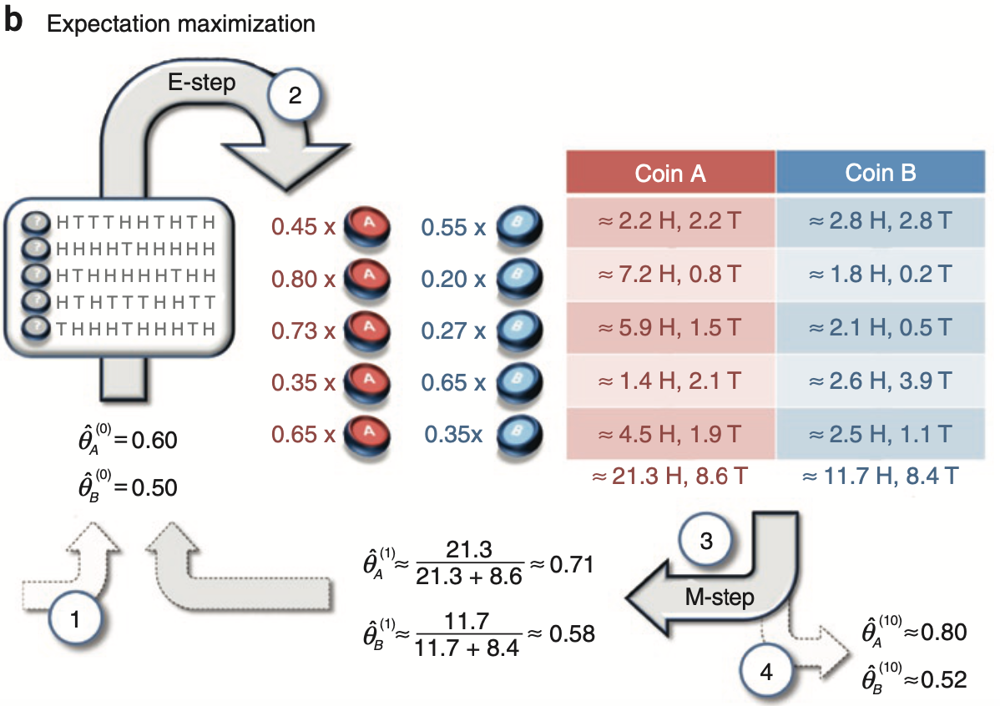

---
title: "Coding and Visualizing the Expectation-Maximization (EM) Algorithm"
summary: 'In this post, I provide two segments of code. The code segment reproduces a coin-tossing example in a popular publication on the expectation-maximization (EM) algorithm. The second code segment reproduces a population depiction of the EM algorithm whereby a likelihood function is approximated and optimized by a lower-bounding function.' 
draft: false
date: "2023-04-29"
article_type: coding
output:
  bookdown::html_document2:
     keep_md: true
always_allow_html: true
header-includes: 
bibFile: content/coding_tricks/em_demo/refs.json    
tags: []
---   


Two points require mentioning before beginning this demonstration post on the expectation-maximization (EM) algorithm. First, given that this post focuses on providing demonstrations of the expectation-maximization (EM) algorithm, any readers seeking a deeper understanding of this algorithm can consult my technical post on the [EM algorithm](#https://sebastiansciarra.com/technical_content/em/). Second, Python and R code are used throughout this post such that objects created in Python are brought into R for plotting. To use Python and R interchangeable, I use the `reticulate` package made for R and create a conda environment to use Python (see lines below).

```r 
library(reticulate)

#create and use conda environment
conda_create(envname = 'blog_posts',  python_version = '3.10.11')
use_condaenv(condaenv = 'blog_posts')

#install packages in conda environment
py_packages <- c('numpy', 'pandas', 'scipy')
conda_install(envname = 'blog_posts', packages = py_packages)

#useful for checking what packages are loaded
py_list_packages(envname = 'blog_posts', type = 'conda')
```


# Replicating the Three Steps in the Coin-Flipping Example From Do and Batzoglou (2008)

One popular publication of the expectation-maximization (EM) algorithm is presented in . In their paper, they present a coin-flipping example that is solved by the EM algorithm. I have reprinted Figure \ref{fig:do-batzoglou} from their paper, which contains the following four steps: 

- **Step 1**: Initial guesses are made for probability of heads for Coin A, $\mathit{\hat{\theta}_A}^{(0)}$, and Coin B, $\mathit{\hat{\theta}_B}^{(0)}$, and are entered into the EM algorithm. 
- **Step 2**: Responsibilities are computed for each of the five coin-flipping sessions. For instance, for the first session, the responsibility for Coin A is .45 and the responsibility for Coin B is .55.
- **Step 3**: The responsibilities and data are used to compute new parameter estimates for the probability of heads of Coin A and Coin B. 
- **Step 4**: After 10 iterations of EM algorithm, the final parameter estimates are obtained such that $\mathit{\hat{\theta}_A}^{(10)} = 0.80$ and $\mathit{\hat{\theta}_B}^{(10)}$ = 0.52.

<div class="figure">
  <div class="figDivLabel">
    <caption>
      <span class = 'figLabel'>Figure \ref{fig:do-batzoglou}<span> 
    </caption>
  </div>
   <div class="figTitle">
    <span>Example of EM Algorithm Application on Coin-Flipping Scenario From Do and Batzoglou (2008)</span>
  </div>
     
  <div class="figNote">
     <span><em>Note. </em>Step 1: Initial guesses are made for probability of heads for Coin A, $\mathit{\hat{\theta}_A}^{(0)}$, and Coin B, $\mathit{\hat{\theta}_B}^{(0)}$, and are entered into the EM algorithm. Step 2: Responsibilities are computed for each of the five coin-flipping sessions. For instance, for the first session, the responsibility for Coin A is .45 and the responsibility for Coin B is .55. Step 3: The responsibilities and data are used to compute new parameter estimates for the probability of heads of Coin A and Coin B. Step 4: After 10 iterations of EM algorithm, the final parameter estimates are obtained such that $\mathit{\hat{\theta}_A}^{(10)} = 0.80$ and $\mathit{\hat{\theta}_B}^{(10)}$ = 0.52. From "What is the expectation maximization algorithm?" by C. Do and S. Batzoglou, 2008, <em>Nature Biotechnology</em>, <em>26</em>(8), p. 898 (<a href="https://doi.org/10.1038/nbt1406">https://doi.org/10.1038/nbt1406</a>).</span> 
  </div>
</div>

In the sections that follow, I will go through each step of Figure \ref{fig:do-batzoglou} except the first step. Importantly, before going through Steps 2--4, I will first provide go through the necessary code for setting up the data set. 

## Creating the Data 

In the Python code block below, I construct a short pre-processing pipeline for constructing the data set that can be used for each step. The pre-processing pipeline below takes the original raw string that can be copied from the figure in  and converts it into a list of five elements, where each element contains the number of heads obtained in each of the five coin-flipping sessions. 

```r {language=python}
import numpy as np
import pandas as pd
#string copied from Do & Batzoglou (2008)
raw_string = 'HTTTHHTHTHHHHHTHHHHH H T H H H H H T H H HTHTTTHHTT T H H H T H H H T H' 

#remove spaces between elements 
raw_string = raw_string.replace(" ", "")

#convert Hs to 1s and Ts to 0s
binary_string = raw_string.replace('H', '1').replace('T', '0')

#convert to numeric format 
binary_array = np.fromiter(iter = binary_string, dtype=int)

#divide binary_array into five lists, where each list contains the flips of a session
coin_flipping_sessions = np.array_split(ary = binary_array, indices_or_sections = 5)

#take the sum of each coin-flipping session
analytical_data_coin_flip = [np.sum(session) for session in coin_flipping_sessions]
```

## Step 2: Computing Responsibilities in the Expectation (E) Step

In Step 2 of Figure \ref{fig:do-batzoglou}, responsibilities are computed for each coin-flipping session. As a brief review, *responsibilities* represent the probability of a mixture producing the observed data. In the current example, two responsibilities would be computed for each coin-flipping session: one responsibility for Coin A and another for Coin B. To compute the responsibilities, Equation \ref{eq:ind-posterior} below is computed for each $n$ data point in $\mathbf{x} = \[5, 9, 8, 4, 7\]$

$$
\begin{align}
P(z_{nk} |x_n, \mu_k, \theta_k) &= \gamma(z_{nk}) = \frac{\mu_k B(x_n|\theta_k, f)}{\sum_k^2 \mu_k B(x_n|\theta_k, f)},
\label{eq:ind-posterior}
\end{align}
$$
where $B(x_n|\theta_km f)$ is the binomial probability of obtaining $x_n$ heads given a $\theta_k$ probability of heads and $f$ number of flips. Because each session has 10 flips, $f = 10$, which is explicitly indicated in the binomial probability function below (Equation \ref{eq:binom-exp}):

$$
\begin{align}
B(x_n|\theta_k, f = 10) = {x_n \choose f} \theta_k^{x_n}(1 - \theta_k)^{(f - x_n)}.
\label{eq:binom-exp}
\end{align}
$$


Note that, the probability of picking either $k$ coin, $\mu_k$, is fixed to .50, and so $\mu_k$ is not an estimated parameter. 

```r {language=python}
import numpy as np
import pandas as pd
from scipy.stats import binom

def e_step(data, p, n, mu):
  """
  Compute expectations (i.e., responsibilities) for each data point's membership to each mixture
  Parameters:
      - data: data set 
      - mu: Probability of each component 
      - p: Probabilities of success for each binomial distribution
  Returns:
      - pandas dataframe
  """
    
  assert len(mu) == len(p), "Number of estimates in mu is equal to the number of sucsess probabilities"
  assert sum(mu) == 1, "Sum of mu should be equal to 1"
  
  #unnormalized responsibilities for each data point for each mixture (i.e., numerator)
  unnormalized_responsibilities = [mu * binom.pmf(x, n=n, p= np.array(p)) for x in data]
  
  #normalized responsibilities (i.e., probabilities)
  normalized_responsibilities = [rp / np.sum(rp) for rp in unnormalized_responsibilities]
  
  column_names = ['coin_{}'.format(coin) for coin in ['A', 'B']]

  df_responsibilities = pd.DataFrame(np.vstack(normalized_responsibilities), 
                                    columns = column_names)
  
  #insert data column as the first one
  df_responsibilities.insert(0, 'data', data)                

  return(df_responsibilities)


#Initial guesses
mu_fixed = [0.5, 0.5] #fix values at .50 for each coin 
p = [0.6, 0.5] #initial guesses from Step 1 in Do & Batzoglou (2008)
n = 10 #number of coin flips in each session 

#compute responsibilities in the E step
responsibilities = e_step(data = analytical_data_coin_flip, mu = mu_fixed, p = p, n = n)

#print responsibilities rounded to two decimal places
np.round(responsibilities.filter(like = 'coin'), 2)
```
<pre><code class='python-code'>   coin_A  coin_B
0    0.45    0.55
1    0.80    0.20
2    0.73    0.27
3    0.35    0.65
4    0.65    0.35
</code></pre>


## Step 3: Computing New Parameter Estimates in the Maximization (M) Step

In Step 3, new parameter estimates are computed for each coin's probability of success, $\hat{\theta}_A^{(1)}$ and $\hat{\theta}_B^{(1)}$. To compute new parameter estimates, the responsibilities obtained in the E step are used such that 

$$
\begin{align}
\theta_k^{(i+1)}&= \frac{\sum_{n = 1}^5 x_n \gamma(z_{nk})}{\sum_{n = 1}^5 \gamma(z_{nk})} = \frac{H_k}{N_k}.
\label{eq:param-est}
\end{align}
$$

Thus, as shown above in Equation \ref{eq:param-est}, each $k$ coin's probability of heads is updated by dividing the sum of weighted responsibilities, where the weight is the number of heads in each $n$ coin-flipping session, by the sum of the responsibilities. In other words, for each $k$ coin, the effective number of heads, $H_k$, is divided by the effective number of flips, $N_k$. Because the table in Figure \ref{fig:do-batzoglou} also computes the effective number of heads for each $k$ coin, $T_k$, I also provide the function for computing $T_k$ in Equation \ref{eq:effective-tails} below: 


$$
\begin{align}
T_k &= \sum_{n = 1}^5 (f - x_n) \gamma(z_{nk}),
\label{eq:effective-tails}
\end{align}
$$
where the responsibilities in each $n$ coin-flipping session are weighed by the number of tails obtained in that session, $f - x_n$ (note that $f = 10$). Note that the effective number of flips for a $k$ coin can be obtained by summing the corresponding effective number of heads and tails, $N_k = H_k + T_k$. The Python code block below computes the effective number of heads and tails. 

```r {language=python}
def compute_effective_number_heads(responsibilities, n = 10):
  
  #specify axis=1 so that operations are conducted along rows 
  return responsibilities.filter(regex='^coin').mul(responsibilities['data'], axis=0)


def compute_effective_number_tails(responsibilities, n = 10):
  
  #multiply the responsibilities by the number of tails (number of flips - number of heads)
  return responsibilities.filter(regex='^coin').mul(n - responsibilities['data'], axis=0)

#effective number of heads and tails
eff_number_heads = compute_effective_number_heads(responsibilities = responsibilities)
eff_number_tails = compute_effective_number_tails(responsibilities = responsibilities)

#add rows of total sums
eff_number_heads.loc['Total'] = eff_number_heads.sum()
eff_number_tails.loc['Total'] = eff_number_tails.sum()

np.round(eff_number_heads, 1)
```
<pre><code class='python-code'>       coin_A  coin_B
0         2.2     2.8
1         7.2     1.8
2         5.9     2.1
3         1.4     2.6
4         4.5     2.5
Total    21.3    11.7
</code></pre>


The Python code block below prints the effective number of tails. 

```r {language=python}
np.round(eff_number_tails, 1)
```
<pre><code class='python-code'>       coin_A  coin_B
0         2.2     2.8
1         0.8     0.2
2         1.5     0.5
3         2.1     3.9
4         1.9     1.1
Total     8.6     8.4
</code></pre>


Given that this post is a demo, I also decided to print out the effective number of heads and tails in a table that is styled to resemble the table in Figure \ref{fig:do-batzoglou}. To recreate this table, I used a combination of the CSS (see lines) and R code blocks below. 

```r {language=css}
/*change colour of header background colours*/
.do_batzoglou_table th:nth-child(1) {background-color: #C3625B}
.do_batzoglou_table th:nth-child(2) {background-color: #5F8DB9}


/*change colour of 'approximately equal to` signs*/
.do_batzoglou_table td:first-child > .MathJax.CtxtMenu_Attached_0[aria-label="almost equals"] {
        color: #8F4944;
}

.do_batzoglou_table td:nth-child(2) > .MathJax.CtxtMenu_Attached_0[aria-label="almost equals"] {
    color: #476685;
}
```

<style type="text/css">
/*change colour of header background colours*/
.do_batzoglou_table th:nth-child(1) {background-color: #C3625B}
.do_batzoglou_table th:nth-child(2) {background-color: #5F8DB9}


/*change colour of 'approximately equal to` signs*/
.do_batzoglou_table td:first-child > .MathJax.CtxtMenu_Attached_0[aria-label="almost equals"] {
        color: #8F4944;
}

.do_batzoglou_table td:nth-child(2) > .MathJax.CtxtMenu_Attached_0[aria-label="almost equals"] {
    color: #476685;
}
</style>


```r 
library(kableExtra) 

#import dataframes from Python 
heads_df <- round(x = py$eff_number_heads, digits = 1)
tails_df <- round(x = py$eff_number_tails, digits = 1)

#join dataframes and include additional information that is contained in figure table
effective_number_data <- data.frame(
  'Coin A' = paste0("$\\approx$ ", heads_df$coin_A, " H, ", tails_df$coin_A, " T"), 
  'Coin B' = paste0("$\\approx$ ", heads_df$coin_B, " H, ", tails_df$coin_B, " T"), 
  check.names = F)

#alternate row colouring 
first_col_colours <- rep(x = c('#E8C3BE', '#F6E5E2'), length.out = nrow(effective_number_data) )
second_col_colours <- rep(x = c('#C7D7E0', '#E5ECF0'), length.out = nrow(effective_number_data))

kbl(x = effective_number_data, format = 'html', digits = 2, booktabs = TRUE,
    align = c('c', 'c'), escape = F,
    caption = 'Effective Number of Heads and Tails for Each of Two Coins',    
    
    #CSS styling
    ##make all borders white
    table.attr = 'style="border-bottom: 1pt solid white"') %>%
    ##replace header bottom border with white one 
    row_spec(row = 0, extra_css = 'border-bottom: 1pt solid white; color: white ', bold= F)  %>%
  #row colouring
  column_spec(width = '4cm', column = 1, color = '#8F4944', background = first_col_colours) %>% 
  column_spec(width = '4cm',column = 2, color = '#476685', background = second_col_colours) %>% 
  
  #place after so that white colour overrides previous colours
  row_spec(row = nrow(effective_number_data), background = 'white') %>%

  #increase row heights
  
  #footnote
   footnote(general =  "<em>Note</em>. Table was recreated to resemble the table in Step 3 of Figure \\ref{fig:do-batzoglou}.",  threeparttable = T,  escape = F, general_title = ' ') %>%
  
  #give table class name so that above CSS code is applied on it
  kable_styling(htmltable_class = 'do_batzoglou_table', position = 'center', html_font = 'Arial')
```
<table style="border-bottom: 1pt solid whiteborder-bottom: 0; font-family: Arial; margin-left: auto; margin-right: auto;" class=" do_batzoglou_table">
<caption>(\#tab:effective-number-table)Effective Number of Heads and Tails for Each of Two Coins</caption>
 <thead>
  <tr>
   <th style="text-align:center;border-bottom: 1pt solid white; color: white "> Coin A </th>
   <th style="text-align:center;border-bottom: 1pt solid white; color: white "> Coin B </th>
  </tr>
 </thead>
<tbody>
  <tr>
   <td style="text-align:center;width: 4cm; color: #8F4944 !important;background-color: #E8C3BE !important;"> $\approx$ 2.2 H, 2.2 T </td>
   <td style="text-align:center;width: 4cm; color: #476685 !important;background-color: #C7D7E0 !important;"> $\approx$ 2.8 H, 2.8 T </td>
  </tr>
  <tr>
   <td style="text-align:center;width: 4cm; color: #8F4944 !important;background-color: #F6E5E2 !important;"> $\approx$ 7.2 H, 0.8 T </td>
   <td style="text-align:center;width: 4cm; color: #476685 !important;background-color: #E5ECF0 !important;"> $\approx$ 1.8 H, 0.2 T </td>
  </tr>
  <tr>
   <td style="text-align:center;width: 4cm; color: #8F4944 !important;background-color: #E8C3BE !important;"> $\approx$ 5.9 H, 1.5 T </td>
   <td style="text-align:center;width: 4cm; color: #476685 !important;background-color: #C7D7E0 !important;"> $\approx$ 2.1 H, 0.5 T </td>
  </tr>
  <tr>
   <td style="text-align:center;width: 4cm; color: #8F4944 !important;background-color: #F6E5E2 !important;"> $\approx$ 1.4 H, 2.1 T </td>
   <td style="text-align:center;width: 4cm; color: #476685 !important;background-color: #E5ECF0 !important;"> $\approx$ 2.6 H, 3.9 T </td>
  </tr>
  <tr>
   <td style="text-align:center;width: 4cm; color: #8F4944 !important;background-color: #E8C3BE !important;"> $\approx$ 4.5 H, 1.9 T </td>
   <td style="text-align:center;width: 4cm; color: #476685 !important;background-color: #C7D7E0 !important;"> $\approx$ 2.5 H, 1.1 T </td>
  </tr>
  <tr>
   <td style="text-align:center;width: 4cm; color: #8F4944 !important;background-color: #F6E5E2 !important;background-color: white !important;"> $\approx$ 21.3 H, 8.6 T </td>
   <td style="text-align:center;width: 4cm; color: #476685 !important;background-color: #E5ECF0 !important;background-color: white !important;"> $\approx$ 11.7 H, 8.4 T </td>
  </tr>
</tbody>
<tfoot>
<tr><td style="padding: 0; " colspan="100%"><span style="font-style: italic;"> </span></td></tr>
<tr><td style="padding: 0; " colspan="100%">
<sup></sup> <em>Note</em>. Table was recreated to resemble the table in Step 3 of Figure \ref{fig:do-batzoglou}.</td></tr>
</tfoot>
</table>


Having computed the effective number of heads and tails for each $k$ coin, new estimates can be computed for each coin's probability of heads, $\hat{\theta}_A^{(1)}$ and $\hat{\theta}_B^{(1)}$, using Equation \ref{fig:param-est. The Python code block below compues new parameter estimates.  

```r {language=python}
def m_step(responsibilities, n = 10):
  
  #isolate columns that contain responsibilities
  resp_cols = responsibilities.filter(like = 'coin')

  #New estimate for the probability of heads
  eff_number_heads = compute_effective_number_heads(responsibilities = responsibilities, n = n)
  eff_number_tails = compute_effective_number_tails(responsibilities = responsibilities, n = n)

  theta_new = np.sum(eff_number_heads)/(np.sum(eff_number_heads) + np.sum(eff_number_tails))
  
  return theta_new

np.round(m_step(responsibilities=responsibilities, n = 10), 2)
```
<pre><code class='python-code'>coin_A    0.71
coin_B    0.58
dtype: float64
</code></pre>


Thus, as in Step 3 of Figure \ref{fig:do-batzoglou}, the estimate for $\hat{\theta}_A^{(1)}$ = 0.71 and the estimate for $\hat{\theta}_B^{(1)}$ = 0.58. 

## Step 4: Iterating the Expectation-Maximization (EM) Algorithm Ten Times

To iterate the EM algorithm 10 times, I have created the nested the e_step() and m_step() functions into the em_algorithm() function in the Python code block below. 

```r {language=python}
def em_algorithm(data, mu, probs_heads, num_iterations, n = 10): 
  
  #define iteration counter
  iteration = 0
  
  #EM algorithm iterates until iteration = num_iterations
  while iteration  < num_iterations:
    responsibilities = e_step(data = data, mu = mu, p = probs_heads, n = n)
    probs_heads = m_step(responsibilities = responsibilities, n = n)
    iteration += 1
  
  return probs_heads


mu_fixed = [0.5, 0.5] #mu parameter fixed and not estimated
probs_heads = [0.6, 0.5] #initial guesses from Do and Batzoglou (2008)
n = 10 #number of flips in each session

#run EM algorithm for 10 iterations 
est_ten_iter = em_algorithm(data = analytical_data_coin_flip, mu = mu_fixed, probs_heads = probs_heads, num_iterations = 10)

#print estimates
np.round(est_ten_iter, 2)
```
<pre><code class='python-code'>coin_A    0.80
coin_B    0.52
dtype: float64
</code></pre>

Therefore, after 10 iterations, the estimates shown in Figure \ref{fig:do-batzoglou} are obtained such that $\hat{\theta}_A^{(10)}$ = 0.80 and $\hat{\theta}_B^{(10)}$ = 0.52. 

# Coding and Visualizing the Expectation-Maximization (EM) Algorithm

## Coding the Incomplete-Data Log-Likelihood 


## Coding the Two Evidence Lower Bounds

With an understanding of the EM algorithm, I will now show how to produce one of its popular visualizations. 


```r 
#devtools::install_github("nicolash2/ggbrace")
library(latex2exp)
library(ggbrace)

incomplete_data_like <- py$incomplete_data_like
old_lower_bound <- py$old_lower_bound
new_lower_bound <- py$new_lower_bound

#combine old and new lower bounds data sets and introduce factor variable to track old/new status 
lower_bounds_df <- bind_rows(
  data.frame(old_lower_bound, iteration = "old"),
  data.frame(new_lower_bound, iteration = "new")) %>% 
  mutate(iteration = as.factor(iteration))

#Three components for making EM algorithm plot 
#1)Vertical dashed line data that shows intersection points 
##old lower bound and value where it intersects incomplete-data log-likelihood 
old_p_value <- py$p[1]
old_intersection <- py$compute_lower_bound(responsibilities = py$rs_old, 
                                           mu = py$mu_fixed, 
                                           p = c(old_p_value, 0.1))

##old lower bound and value where it intersects incomplete-data log-likelihood 
new_p_value <- py$estimates$p_new[1]
new_intersection <- py$compute_lower_bound(responsibilities = py$rs_new, 
                                           mu = py$mu_fixed, 
                                           p = c(new_p_value, 0.1))

##vertical line data set 
intersection_data <- data.frame('p1_value' = c(old_p_value, new_p_value), 
                                'y_min' = c(-20, -20), 
                                'intersection_point' = c(old_intersection, new_intersection))
    

#2) X-axis labels to show the new and old parameter values
x_axis_labels <- sprintf("%0.2f", seq(from = 0, to = 1, by = 0.1))  

##modify second and fifth elements to include theta labels
x_axis_labels[2] <- expression(atop("0.10", p^old))
x_axis_labels[5] <- expression(atop("0.40", p^new))

#3) Math text data to show mathematical notation 
##create latex math to be shown on the plot 
incomplete_data_log <- "$L(\\textit{p}_1|\\textbf{x})$"
lbound_new <- "\u2112$(\\textit{P}(\\textbf{z}, \\textbf{x}|\\textit{p^{new}}), \\textit{p_1})$"
lbound_old <- "\u2112$(\\textit{P}(\\textbf{z}, \\textbf{x}|\\textit{p^{old}}), \\textit{p_1})$"

##create data frame
math_text_data <- data.frame('latex_math' = c(incomplete_data_log, lbound_new, lbound_old), 
                            'x' = c(0.95, 0.95, 0.85), 
                            'y' = c(-6.5, -8.2, -13.5))

#4) Brace data information for KL divergence and increase in lower bound 
kl_divergence <- "$KL(\\textit{P}(\\textbf{z}, \\textbf{x}|\\textit{p^{new}})\\|\\textit{P}(\\textbf{z}, \\textbf{x}|\\textit{p^{old}}))$"
lbound_increase <- "$\\textit{Q}(\\textit{p}^{new}|\\textit{p}^{old}) -\\textit{Q}(\\textit{p}^{old}|\\textit{p}^{old})$"

max_old_lbound <- old_lower_bound$likelihood[which.max(old_lower_bound$likelihood)]
  
  
em_plot <- ggplot(data = incomplete_data_like, mapping = aes(x = p1, y = likelihood)) + 
  
  #vertical dashed lines 
  geom_segment(data = intersection_data, 
               mapping = aes(x = p1_value, y = y_min, xend = p1_value, yend = intersection_point), 
               linetype = 2) + 
  
  #curly brace for KL divergence 
  geom_brace(aes(x = c(0.4, 0.45), y = c(max_old_lbound, new_intersection),  
                 label=TeX(kl_divergence, output="character")), 
             inherit.data=F, labelsize=4, rotate = 90, parse=T) + 
  
  #curly brace for increase in evidence lower bound  
  geom_brace(aes(x = c(0.4, 0.45), y = c(old_intersection, max_old_lbound),  
                 label=TeX(lbound_increase, output="character")), 
             inherit.data=F, labelsize=4, rotate = 90, parse=T, mid = 0.25) + 
  
  #likelihoods 
  geom_line(linewidth = 1) +  
  geom_line(inherit.aes = F, data = lower_bounds_df, 
            mapping = aes(x = p1, y = likelihood, group = iteration, color = iteration),
            linewidth = 0.5) + 
  
  #colour details 
  scale_color_manual(values = c('old' ='#9ECAE1', 'new' =  '#2171B5')) + 
  
  #math text
  geom_text(inherit.aes = F, data = math_text_data, parse = TRUE, size = 4, 
          mapping = aes(x = x, y = y, label=TeX(latex_math, output="character"))) + 
  
 
  #axis & legend details 
  scale_x_continuous(name = expression(Coin~1~Probability~of~Heads(italic(p)[1]*';'~italic(p)[2]~'= 0.10')),  
                     breaks = seq(from = 0, to = 1, by = 0.1), 
                     limits = c(0, 1.1), 
                     labels = x_axis_labels) + 
  scale_y_continuous(name = 'Log-Likelihood', 
                     limits = c(-20, -5), 
                     expand = c(0, 0)) + 
  labs(color = 'Lower bound') + 
  
  #other aesthetics 
  theme_classic(base_family = 'Helvetica', base_size = 14) + 
  theme(text = element_text(color = "#002241"),
        axis.line = element_line(color = "#002241"), 
        axis.ticks = element_line(color =  "#002241"), 
        axis.text = element_text(color = "#002241"))


#high resolution needed for greek letter to print clearly
ggsave(filename = 'images/em_plot.png', plot = em_plot, width = 10, height = 6, dpi = 1000) 
```

<div class="figure">
  <div class="figDivLabel">
    <caption>
      <span class = 'figLabel'>Figure \ref{fig:em-plot}<span> 
    </caption>
  </div>
   <div class="figTitle">
    <span>Depiction of how the Expectation-Maximization (EM) Algorithm Indirectly Estimates the Incomplete-Data Log-Likelihood </span>
  </div>
     
  
  <div class="figNote">
  </div>
</div>


# Conclusion

# References





