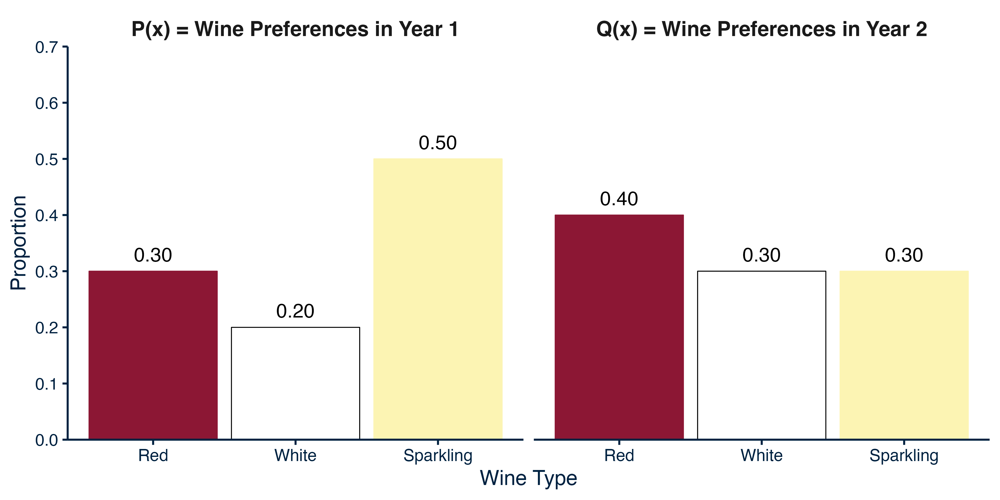

---
title: "The Expectation-Maximization Algorithm: A Method for Modelling Mixtures of Distributions" 
draft: false
summary: 'Upcoming post' 
date: ""
article_type: technical
output:
  bookdown::html_document2:
     keep_md: true
always_allow_html: true
header-includes: 
tags: []
---   


To write this post on the expectation-maximization algorithm, I used the following academic sources: Bishop (2006), Do & Batzoglou (2008). I also used the following lectures/blogs as aids: [EM blog](#https://gregorygundersen.com/blog/2019/01/22/kld/) and [EM lecture](#https://www.youtube.com/watch?v=lMShR1vjbUo&t=1161s). 

# Introduction to Mixture Models

Consider a situation where a researcher entrusts a colleague to flip coins and record the results of 10 flips. Flips that result in heads are recorded as `1` and flips that result in tails are recorded as `0`. Importantly, before each flip, the colleague picks one of two coins (according to another probability mass function) but does not tell the researcher which coin was flipped. When the colleague records the results of the 10 coin flips, they provide the researcher with the following data: $\mathbf{x} = \[1, 1, 1, 1, 0, 0, 0, 0, 0, 0\]$. With these data, the researcher wants to estimate the following three parameters: 

1) The probability of picking each of the two coins (i.e., a probability mass function), $\mu_1, \mu_2$. Given that both these probability values sum to one, only the probability of picking one coin must be estimated, $\mu_1$, with $\mu_2 = 1 - \mu_1$.
2) The first coin's probability of heads, $p_1$. 
3) The second coin's probability of heads, $p_2$. 

# Mixture Models Cannot be Estimated With Maximum Likelihood Estimation 

One way to estimate the parameters ($\mu_1$, $\mu_2$, $p_1$, $p_2$) is to use maximum likelihood estimation (for a review, see my post on [maximum likelihood estimation](https://sebastiansciarra.com/technical_content/mle/)). In maximum likelihood estimation, we solve for the parameter values $\boldsymbol{\theta} = \mu_1, p_1, p_2$ that maximize the probability of observing the data, $P(\mathbf{x}|\boldsymbol{\theta})$. Because the values being maximized are not technically probabilities and are instead likelihoods, $L(\boldsymbol{\theta}|\mathbf{x})$, maximum likelihood estimation solves for the parameter values with the highest likelihood, as shown below in Equation \ref{eq:mle}:

$$ 
\begin{align}
\boldsymbol{\theta}_{MLE} &= \underset{\boldsymbol{\theta}}{\arg\max}  L(\boldsymbol{\theta}|\mathbf{x}).
\label{eq:mle}
\end{align}
$$
In the current example, the likelihood values can be calculated by using Equation \ref{eq:incomplete-data} shown below: 

$$ 
\begin{align}
L(\boldsymbol{\theta}|\mathbf{x}) &= \prod_{n=1}^{10} \sum_{k=1}^{2} \mu_k B(x_n|p_k),
\label{eq:incomplete-data}
\end{align}
$$

where $B(x_n|p_k)$ is the binomial probability of the $n^{th}$ data point given the the $k^{th}$ coin, and this probability is weighted by the corresponding probability of selecting the $k^{th}$ coin. Importantly, because the researcher does not know which of the two coins produces the result of any flip, then any flip could be the result of flipping the first or second coin. To model this uncertainty, the calculation of the likelihood for each coin flip result, $x_n$, computes the sum of weighted binomial probabilities, $\sum^{2}_{k=1} \mu_k B(x_n|p_k)$. The lack of information surrounding the identity of the coin that produces each flip result also explains why Equation \ref{eq:incomplete-data} above is often called the *incomplete-data likelihood*.
To prevent *underflow* (the rounding of small numbers to zero in computers), the log-likelihood is taken, resulting in the incomplete-data log-likelihood shown below in Equation \ref{eq:log-incomplete-data}: 

$$ 
\begin{align}
\log L(\boldsymbol{\theta}|\mathbf{x}) &= \sum_{n=1}^{10} \log\Big(\sum_{k=1}^{2} \mu_k B(x_n|p_k) \Big).
\label{eq:log-incomplete-data}
\end{align}
$$

To find maximum likelihood estimates for the parameters, partial derivatives can be computed with respect to each parameter ($\mu_1, p_1, p_2$) and then set to equal zero. In computing the partial derivatives of the incomplete-data log-likelihood (Equation \ref{eq:log-incomplete-data} with respect to the parameters, it is important to note that the existence of the summation symbol within the logarithm will oftentimes yield a complex and lengthy derivative because the chain rule has to be applied for each data point. Although computing the partial derivatives does not yield overly complex equations in the current example, solutions (often called closed-form solutions) for the parameters cannot be obtained. As an example, I will show how maximum likelihood estimation would be implemented for estimating the probability of selecting coin 1, $\mu_1$. To compute the likelihood, we can expand the binomial term in the incomplete-data log-likelihood function above (Equation \ref{eq:log-incomplete-data}) to produce 

$$ 
\begin{align}
\log L(\boldsymbol{\theta}|\mathbf{x}) &= \sum_{n = 1}^{10} \log \Big(\sum_{k=1}^{2} \mu_k  {n \choose h}p_k^h (1-p_k)^{n-h} \Big).
\label{eq:log-incomplete-data-expanded}
\end{align}
$$
To allow the partial derivative to be computed, I will apply the binomial calculation on each flip. Thus, $n = 1$ and $h = \{0, 1\}$, which means that ${n \choose h} = 1$. In expanding Equation \ref{eq:log-incomplete-data-expanded} over the summation sign within the logarithm, Equation \ref{eq:log-incomplete-data-binom-expanded} is obtained 

$$ 
\begin{align}
\log L(\boldsymbol{\theta}|\mathbf{x}) &= \sum^{10}_{n = 1} \log \Big( \mu_1 p_1^h (1-p_k)^{n-h} + (1-\mu_1) p_2^h (1-p_2)^{n-h}  \Big).
\label{eq:log-incomplete-data-binom-expanded}
\end{align}
$$
Because $h = \{0, 1\}$ for any given $n$ flip, the term inside the logarithm will only ever take on one of the two following forms: 

$$
\begin{spreadlines}{0.5em}
\begin{align}
    \log L(\boldsymbol{\theta}|\mathbf{x}_i) =
    \begin{cases}
      \text{If } \mathbf{x}_i = h, & \log(\mu_1 p_1 + (1 - \mu_1)p_2), \\\\ \\\\
      \text{If } \mathbf{x}_i = t, & \log(\mu_1(1 - p_1) + (1 - \mu_1)(1 - p_2))
    \end{cases}
    \label{eq:log-terms}
\end{align},
\end{spreadlines}
$$
where $h$ indicates a coin flip that results in 'heads' and `t` indicates a coin flip that results in 'tails' (i.e., $h = 0$). To expand Equation \ref{eq:log-incomplete-data-binom-expanded} over the summation sign outside the logarithm, we can apply Equation \ref{eq:log-terms} and obtain a simplified expression of the incomplete-data log-likelihood shown below in  Equation \ref{eq:incomplete-simplified}: 

$$
\begin{align}
\log L(\boldsymbol{\theta}|\mathbf{x}) &= H\log(\mu_1 p_1 + (1 - \mu_1)p_2) + T\log(\mu_1(1 - p_1) + (1 - \mu_1)(1 - p_2)), 
 \label{eq:incomplete-simplified}
\end{align}
$$
where $H$ indicates the total number of heads and $T$ indicates the total number of tails. In the current data set, $\mathbf{x} = \[1, 1, 1, 1, 0, 0, 0, 0, 0, 0\]$, four heads and six tails are obtained. Although we can compute the partial derivative of Equation \ref{eq:incomplete-simplified} with respect to $\mu_1$ and obtain a closed-form solution, Equation \ref{eq:unsolvable-mu1} shows that it is inadmissible because it always yields negative values for $\mu_1$. 


$$ 
\begin{spreadlines}{0.5em}
\begin{align}
\log L(\boldsymbol{\theta}|\mathbf{x}) &= 4\log(\mu_1 p_1 + (1 - \mu_1)p_2) + 6\log(\mu_1(1 - p_1) + (1 - \mu_1)(1 - p_2))  \nonumber \\\\
\frac{\partial L(\boldsymbol{\theta}|\mathbf{x})}{\partial \mu_1} &= \frac{\partial}{\partial \mu_1} \Big( 4\log(\mu_1 p_1 + (1 - \mu_1)p_2) + 6\log(\mu_1(1 - p_1) + (1 - \mu_1)(1 - p_2))\Big) \nonumber \\\\
&= \frac{4(p_1 - p_2)}{\mu_1 p_1 + (1 - \mu_1)p_2} + \frac{6(p_2 - p_1)}{\mu_1(1 - p_1) + (1 - \mu_1)(1 - p_2)} \nonumber \\\\
\text{Set } \frac{\partial L(\boldsymbol{\theta}|\mathbf{x})}{\partial \mu_1}& = 0  \nonumber \\\\
0 &= \frac{4(p_1 - p_2)}{\mu_1 p_1 + (1 - \mu_1)p_2} + \frac{6(p_2 - p_1)}{\mu_1(1 - p_1) + (1 - \mu_1)(1 - p_2)} \nonumber \\\\
&= \frac{4(p_1 - p_2)}{\mu_1 p_1 - \mu_1p_2 + p_2} + \frac{6(p_2 - p_1)}{\mu_1 - \mu_1p_1 + 1 - \mu_1 + \mu_1p_2 - p_2} \nonumber \\\\
&= \frac{4(p_1 - p_2)}{\mu_1(p_1 - p_2) + p_2} + \frac{6(p_2 - p_1)}{ \mu_1(p_2 - p_1) + 1 - p_2} \nonumber \\\\
&= \frac{4}{\mu_1 + p_2} + \frac{6}{ \mu_1 + 1 - p_2} \nonumber \\\\
&= 4(\mu_1 + 1 - p_2) + 6(\mu_1 + p_2) \nonumber \\\\
&= 10\mu_1 + 2p_2 + 4 \nonumber \\\\
\mu_1 = \frac{-p_2 - 2}{5} 
\label{eq:unsolvable-mu1}
\end{align}
\end{spreadlines}
$$
Therefore, although the summation symbol within the logarithm does not result in an overly complex partial derivative in the current example, maximum likelihood estimation results in inadmissible estimates for parameter values, and so is not a viable method for modelling mixture distributions.[^1]

[^1]: It should also be noted that maximum likelihood estimation can result in singularities with Gaussian mixture models. In short, if the estimate for a $k^{th}$ mixture's mean, $\mu_k$, happens to exactly match the value of an individual $n$ value, $x_n$, then the mixture in question can become 'stuck' on this data point with all the other data points being modelled by the other mixtures. With the mixture fixed on the one data point, the variance of the mixture will decrease to zero and the log-likelihood will increase to infinity. 


# Mixture Models Can be Estimated with the Expectation-Maximization (EM) Algorithm 

Unlike maximum likelihood estimation, the expectation-maximization (EM) algorithm provides viable parameter estimates for modelling mixture distributions. The EM algorithm works because it indirectly maximizes the incomplete-data log-likelihood; that is, it does not directly operate on the incomplete-data log-likelihood. To act as an indirect estimation method, the EM algorithm begins by modelling the uncertainty of the coin's identity on each flip as a *latent variable*: A variable that is assumed to exist but has not been directly measured, whether by choice or because direct measurement is impossible. To model the coin's identity on each $n$ flip as a latent variable, one-hot (or 1-of-*K*) encoding is used. In one-hot encoding, the levels of a categorical variable can be represented numerically with a binary vector that sums to one and has a length equal to the number of levels in the categorical variable. In the current example, the categorical variable is the coin's identity, and the two levels (i.e., coin 1, coin 2) can be represented in each $n$ flip by $\mathbf{z}_n$, as shown below in Equation \ref{eq:one-hot} below: 

$$
\begin{align}
    \mathbf{z}_n =
    \begin{cases}
      \text{If coin 1 }, & \[1, 0\] \\\\ \\\\
      \text{If coin 2 }, & \[0, 1\]
    \end{cases}
    \label{eq:one-hot}
\end{align}.
$$
By modelling the coin's status as a latent variable with one-hot encoding, the incomplete-data likelihood (Equation \ref{eq:incomplete-data}) can be modified to produce the *complete-data likelihood* shown below in Equation \ref{eq:complete-data}:

$$ 
\begin{align}
L(\boldsymbol{\theta}|\mathbf{x}, \mathbf{z}) &= \prod_{n=1}^{10} \prod_{k=1}^{2} \mu_k B(x_n|p_k)^{z_{nk}},
  \label{eq:complete-data}
\end{align}
$$

where $k$ is used to index each value of $\mathbf{z}_n$. Note that, because the likelihood of each $x_n$ data point is raised to an exponent value of either 0 or 1, we now take the product over the *K* classes. Thus, data points that do not belong to a mixture do not contribute to the likelihood computation; these likelihoods are raised to the power of zero, and, therefore, contribute a redundant multiplication factor of one. 


Although including a binary exponent on the likelihood computation seems inconsequential, it provides two desirable outcomes. First, it allows viable parameter estimates to be computed. In taking the logarithm of the complete-data likelihood to prevent underflow, the *complete-data log-likelihood* is obtained and is shown below in Equation \ref{eq:log-complete-data}: 

$$ 
\begin{align}
\log L(\boldsymbol{\theta}|\mathbf{x}, \mathbf{z}) &= \sum_{n=1}^{10} \sum_{k=1}^{2} z_{nk}\Big(\log(\mu_k) + \log\big(B(x_n|p_k)\big)\Big).
  \label{eq:log-complete-data}
\end{align}
$$
Because the summation over *K* is now outside the logarithm, this means that the partial derivatives will be much less complex and yield admissible solutions. 

Second, using one-hot encoding creates an equivalence between the complete- and incomplete-data log-likelihoods. As shown below, the complete-data log-likelihood becomes the incomplete-data log-likelihood after summing over all $z$ possible latent variable representations for each $n$ data point (see Equation \ref{eq:complete-incomplete} below). Therefore, we can optimize the incomplete-data log-likelihood by optimizing the complete-data log-likelihood. 


$$
\begin{spreadlines}{0.5em}
\begin{align}
\log L(\boldsymbol{\theta}|\mathbf{x}) &=  \log \Big( \sum_{\mathbf{z}}L(\boldsymbol{\theta}|\mathbf{x}, \mathbf{z} \Big) \nonumber \\\\
&=\log \Big(\sum_{\mathbf{z}}  \prod_{n=1}^{10} \prod_{k=1}^{2} \mu_k B(x_n|p_k)^{z_{nk}} \Big) \nonumber \\\\
&= \log \Big(\mu_1 B(x_1|p_1)^1 \cdot \mu_2 B(x_1|p_2)^0 \cdot ... \cdot \mu_1 B(x_{10}|p_1)^1 \cdot \mu_2 B(x_{10}|p_2)^0 + \nonumber \\\\
 &\qquad\quad\text{ }\text{ } \mu_1 B(x_1|p_1)^0 \cdot \mu_2 B(x_1|p_2)^1 \cdot ... \cdot \mu_1 B(x_{10}|p_1)^0 \cdot \mu_2 B(x_{10}|p_2)^1 \Big) \nonumber \\\\ 
 &= \log \Big(\prod_{n=1}^{10} \sum_{k=1}^{2} \mu_k B(x_n|p_k)\Big)  \nonumber \\\\
 &= \sum_{n=1}^{10} \log \Big(\sum_{k=1}^2 \mu_k B(x_n|p_k) \Big).
 \label{eq:complete-incomplete}
\end{align}
\end{spreadlines}
$$
As an aside, in computing the sum over $z$, we are marginalizing over $z$, which explains why the incomplete-data log-likelihood is often called the *marginal log-likelihood* and the complete-data log-likelihood is often called the *joint log-likelihood*.

Despite the benefits of using one-hot encoding, one challenge remains. The complete-data log-likelihood cannot yet be computed because the latent variable memberships for each $n$ data point, $\mathbf{z}_n$, are unknown. Recall that the researcher does not know which coin produced the result of any flip. Related, and as an aside, Equation \ref{eq:complete-data} is called the complete-data likelihood because it can only be computed if we know the mixture membership of each $x_n$ data point; that is, we must have the complete data. 

Although the complete-data log-likelihood cannot be directly computed, the EM algorithm finds a clever way to circumvent this problem in the E step. 

## Expectation (E) Step: Using Expectations to Estimate the Distribution of the Latent Variable

The E step takes advantage of the equivalence between the incomplete- and complete-data log-likelihoods and applies two clever tricks to work with the complete-data log-likelihood. First, it applies what appears to be an inconsequential algebraic manipulation, whereby the complete-data log-likelihood is multiplied and divided by some distribution on the latent variable $q(\mathbf{z})$ as shown below in Equation \ref{eq:variation-method}:

$$
\begin{spreadlines}{0.5em}
\begin{align}
\log L(\boldsymbol{\theta}|\mathbf{x}) &= \log \sum_{\mathbf{z}} L(\boldsymbol{\theta}|\mathbf{x},\mathbf{z}) \nonumber \\\\
&=\log \sum_{\mathbf{z}} q(\mathbf{z})\frac{L(\boldsymbol{\theta}|\mathbf{x},\mathbf{z})}{q(\mathbf{z})}.
\label{eq:variation-method}
\end{align}
\end{spreadlines}
$$

Second, given that the logarithm is a concave function, Jensen's inequality can be applied to convert Equation \ref{eq:variation-method} into an inequality. Briefly, Jensen's inequality states that, for concave functions, the function of the expected value, $f(\mathbb{E}\[x\])$), is greater than or equal to the expected value of the function, $\mathbb{E}\[f(x)\]$ (for a proof, see [Appendix A](#jensen)), and is shown below in Equation \ref{eq:jensen-concave}:

$$
\begin{align}
f(\mathbb{E}\[x\]) \ge \mathbb{E}\[f(x)\].
\label{eq:jensen-concave}
\end{align}
$$

In other words, Equation \ref{eq:jensen-concave} above shows that $\mathbb{E}\[f(x)\]$ is a lower bound on $f(\mathbb{E}\[x\])$. Applying Jensen's inequality to Equation \ref{eq:variation-method}, a lower bound for the incomplete-data log-likelihood is obtained, $\mathcal{L}(q, \boldsymbol{\theta})$, resulting in the inequality shown below in Equation \ref{eq:variation-inequality}: 

$$
\begin{spreadlines}{0.5em}
\begin{align}
\log L(\boldsymbol{\theta}|\mathbf{x}) &\ge \sum_{\mathbf{z}} q(\mathbf{z})\log \Bigg(\frac{L(\boldsymbol{\theta}|\mathbf{x},\mathbf{z})}{q(\mathbf{z})}\Bigg) \nonumber \\\\
&\ge \mathbb{E}_{q(\mathbf{z})}\log \Bigg(\frac{L(\boldsymbol{\theta}|\mathbf{x},\mathbf{z})}{q(\mathbf{z})}\Bigg) = \mathcal{L}(q, \boldsymbol{\theta}),  
\label{eq:variation-inequality}
\end{align}
\end{spreadlines}
$$

where the summation over $z$ of $q(\mathbf{z})$ is the expected value of $q(\mathbf{z})$, and can be represented as $\mathbb{E}_{q(\mathbf{z})}$. As a note, the lower bound,  $\mathcal{L}(q, \boldsymbol{\theta})$, is often called the *evidence lower bound* because it is a lower bound on the marginal log-likelihood, which is often called the evidence in Bayesian inference. 

Although we still do not have a way for computing $q(\mathbf{z})$, a closer inspection of the above inequality provides a way forward. In the E step, it is in our best interest to obtain the most accurate approximation of the distribution $q(\mathbf{z})$. By obtaining the best estimate of $q(\mathbf{z})$, the greatest improvements in the parameter can be realized in the M step. To obtain the best estimate of $q(\mathbf{z})$, and thus maximize the potential for improvement in the parameter estimates in the M step, we need to maximize the evidence lower bound with respect to $q(\mathbf{z})$. Thus, the inequality of Equation \ref{eq:variation-inequality} must be transformed into an equality. To do so, we can compute $q(\mathbf{z})$ such that the logarithm, $\log \Big(\frac{L(\boldsymbol{\theta}|\mathbf{x}, \mathbf{y})}{q(\mathbf{z})}\Big)$, returns constant values, and this can be accomplished if the probability values computed for the latent variable $\mathbf{z}$ are proportional to the numerator, $q(\mathbf{z}) \propto L(\boldsymbol{\theta}|\mathbf{x},\mathbf{y})$. Fortunately, Bayes' theorem provides one way for us to compute $q(\mathbf{z})$ to maximize the evidence lower bound such that 

$$
\begin{spreadlines}{0.5em}
\begin{align}
q(\mathbf{z})= P(\mathbf{z}|\mathbf{x}, \boldsymbol{\theta}) &= \frac{P(\mathbf{x}|\mathbf{z}, \boldsymbol{\theta})P(\mathbf{z}|\boldsymbol{\theta})}{ P(\mathbf{x}|\boldsymbol{\theta})} 
\label{eq:bayes} \\\\
&= \frac{P(\mathbf{z}, \mathbf{x}|\boldsymbol{\theta})}{\sum_{z\prime}P(\mathbf{z\prime}, \mathbf{x}|\boldsymbol{\theta})} \nonumber \\\\
&= \frac{L(\boldsymbol{\theta}|\mathbf{z}, \mathbf{x})}{\sum_{z\prime}L(\boldsymbol{\theta}|\mathbf{z\prime}, \mathbf{x})}
\label{eq:posterior}
\end{align}
\end{spreadlines}
$$

where I have used likelihood notation in Equation \ref{eq:posterior} to highlight the equivalence with the calculation of probabilities and likelihoods. It is important to note that, because latent variable memberships exist for each $n$ data point for each $k$ mixture in the complete-data log-likelihood (Equation \ref{eq:log-complete-data}), Equation \ref{eq:posterior} above is computed for each $n$ data point such that 

$$
\begin{align}
P(z_{nk} |x_n, \boldsymbol{\theta} = \[\mu_k, p_k\]) &= \gamma(z_{nk}) = \frac{\mu_k B(x_n|p_k)}{\sum_k^2 \mu_k B(x_n|p_k)}.
\label{eq:ind-posterior}
\end{align}
$$

Because these values represent the (posterior) probability of membership to each $k$ mixture, they are often called *responsibilities*. Note that the responsibilities are often represented as $\gamma(z_{nk})$, which is simply the scalar form of$\mathbb{E}_{P(\mathbf{z}|\mathbf{x}, \boldsymbol{\theta})}$ that I use throughout this post. Therefore, by setting $q(\mathbf{z})= P(\mathbf{z}|\mathbf{x}, \boldsymbol{\theta})$, we can compute $q(\mathbf{z})$ and also obtain a lower bound, $\mathcal{L}(P(\mathbf{z}|\mathbf{x}, \boldsymbol{\theta}), \boldsymbol{\theta})$ that is equal to the complete-data log-likelihood. Using Equation \ref{eq:bayes}, we can rewrite the inequality of Equation \ref{eq:variation-inequality} as an equality in Equation \ref{eq:post-variation-inequality} below:

$$
\begin{spreadlines}{0.5em}
\begin{align}
\log L(\boldsymbol{\theta}|\mathbf{x}) &=   \mathcal{L}\Big(P(\mathbf{z}|\mathbf{x}, \boldsymbol{\theta}),\boldsymbol{\theta}\Big) \label{eq:equality} \\\\
&= \mathbb{E}\_{P(\mathbf{z}|\mathbf{x}, \boldsymbol{\theta})}\log \Bigg(\frac{L(\boldsymbol{\theta}|\mathbf{x},\mathbf{z})}{P(\mathbf{z}|\mathbf{x}, \boldsymbol{\theta})}\Bigg)
\label{eq:post-variation-inequality} \\\\
\end{align}
\end{spreadlines}
$$

To show that the lower bound is equal to the complete-data log-likelihood when $q(\mathbf{z})= P(\mathbf{z}|\mathbf{x}, \boldsymbol{\theta})$ (see Equation \ref{eq:equality}), I provide the Python code block below. In order to better understand the Python code, I provide the function for the incomplete-data log-likelihood ( Equation \ref{eq:log-incomplete-data}) and the expansion for the evidence lower bound (Equation \ref{eq:log-incomplete-data}). Importantly, and as I will discuss later on in this post, the first term in Equation \ref{eq:lower-bound-exp} is the expected complete-data log-likelihood, and the second term is the entropy of the responsibilities. Recall that the researcher's data set is $\mathbf{x} = \[1, 1, 1, 1, 0, 0, 0, 0, 0, 0\]$.

$$
\begin{spreadlines}{0.5em}
\begin{align}
\log L(\boldsymbol{\theta}|\mathbf{x}) &= \sum_{n=1}^{10} \log \Big(\sum_{k=1}^2 \mu_k B(x_n|\mu_k)\Big) 
\tag{\ref{eq:log-incomplete-data} revisited} \\\\
\mathcal{L}\big(P(\mathbf{z}|\mathbf{x}, \boldsymbol{\theta}), \boldsymbol{\theta})\big) &=  \underbrace{\mathbb{E}\_{P(\mathbf{z}|\mathbf{x}, \boldsymbol{\theta})}\log (L(\boldsymbol{\theta}|\mathbf{x},\mathbf{z}))}\_{\text{Expected complete-data log-likelihood}} \phantom{e x} \underbrace{-\mathbb{E}\_{P(\mathbf{z}|\mathbf{x}, \boldsymbol{\theta})} \log({P(\mathbf{z}|\mathbf{x}, \boldsymbol{\theta})})}\_{\text{Entropy}} \label{eq:lower-bound}\\\\
&= \sum_{n=1}^{10} \sum_{k=1}^2\gamma(z_{nk})\big(\log(\mu_k) + x_n\log(p_k) + (1 - x_n)\log(1 - p_k)\big) - \gamma(z_{nk})\log\big(\gamma(z_{nk})\big)
\label{eq:lower-bound-exp}
\end{align}
\end{spreadlines}
$$


```r {language=python}
import numpy as np
import pandas as pd
from scipy.stats import binom

def e_step(data, mu, p, n = 1):
  """
  Compute expectations (i.e., responsibilities) for each data point's membership to each mixture
  Parameters:
      - data: data set 
      - mu: Probability of each component 
      - p: Probabilities of success for each binomial distribution
  Returns:
      - pandas dataframe
  """
    
  assert len(mu) == len(p), "Number of estimates in mu is equal to the number of sucsess probabilities"
  assert sum(mu) == 1, "Sum of mu should be equal to 1"
  
  #unnormalized responsibilities for each data point for each mixture
  unnormalized_responsibilities = [mu * binom.pmf(x, n=n, p= np.array(p)) for x in data]
  
  #normalized responsibilities (i.e., probabilities)
  normalized_responsibilities = [rp / np.sum(rp) for rp in unnormalized_responsibilities]
  
  column_names = ['resp_mixture_{}'.format(mix+1) for mix in range(len(normalized_responsibilities[0]))]

  df_responsibilities = pd.DataFrame(np.vstack(normalized_responsibilities), 
                                    columns = column_names)
  
  #insert data column as the first one
  df_responsibilities.insert(0, 'data', data)                

  return(df_responsibilities)


#incomplete/complete-data log-likelihood
def compute_incomplete_log_like(data, mu, p):
  """
  Compute incomplete-data log-likelihood 
  Parameters:
      - data: data set 
      - mu: Probability of each component 
      - p: Probability of success for each binomial distribution
  """
  
  #probability of each data point coming from each distribution
  mixture_sums = [np.sum(mu * binom.pmf(flip_result, n=1, p= np.array(p))) for flip_result in binom_mixture_data]
  
  #log of mixture_sums
  log_mixture_sums = np.log(mixture_sums)
  
  #sums of log of mixture_sums
  incomplete_like = np.sum(log_mixture_sums)

  return(incomplete_like)


#lower bound = expected complete-data log-likelihood + entropy 
def compute_lower_bound(responsibilities, mu, p):
  
  #expected complete-data log-likelihood 
  expected_complete_data_like = responsibilities.apply(compute_expected_complete_like, mu = mu, p = p, axis=1).sum()

  ##compute entropy
  entropy = compute_entropy(responsibilities = responsibilities)

  return expected_complete_data_like + entropy


#entropy: sum of rs*log(rs) for all rs (responsibilities)
def compute_entropy(responsibilities):
  
  ##extract responsibility columns and then compute entropy
  resp_colummns = responsibilities.filter(like = 'resp_mixture')
  
  ##take sum of x*log(x) for each responsibility
  entropy = -np.sum(resp_colummns.values * np.log(resp_colummns.values))
  
  return entropy
  

#expected complete-data log-likelihood
def compute_expected_complete_like(row, mu, p):
  resp_columns = [col for col in row.index if 'resp_mixture' in col]
  resp_values = [row[col] for col in resp_columns]
  
  return np.sum(
      [resp_values * (np.log(mu) + 
      row['data'] * np.log(p) + #non-zero if flip result is success (i.e., 'heads')
      (1 - row['data']) * np.log(1 - np.array(p)) #non-zero if flip result is failure (i.e., 'tails')
      )]
  )
    
    
#data given to researcher
binom_mixture_data = [1, 1, 1, 1, 0, 0, 0, 0, 0, 0]

#initial guesses for E step 
mu = [0.3, 0.7] #mixture probabilities 
p = [0.6, 0.8] #success probabilities

#E step
responsibilities = e_step(data = binom_mixture_data, mu = mu, p = p)

evidence_lower_bound = np.round(compute_incomplete_log_like(data = binom_mixture_data, mu = mu, p = p), 5)
incomplete_log_likelihood = np.round(compute_lower_bound(responsibilities = responsibilities,  mu = mu, p = p), 5)

print('Incomplete-data log-likelihood:', evidence_lower_bound)
print('Lower bound:', incomplete_log_likelihood)
```
<pre><code class='python-code'>Incomplete-data log-likelihood: -9.28686
Lower bound: -9.28686
</code></pre>

Therefore, by introducing a distribution of the latent variable, $q(\mathbf{z})$), its expectation is taken so that the evidence lower bound becomes equal to the incomplete-data log-likelihood. More importantly, however, responsibilities are obtained for each $n$ data point for each $k$ mixture, $\gamma(z_{nk})$, which allow new parameter estimates to be obtained in the M step. 

## Maximization (M) Step: Using Expectations to Obtain New Parameter Estimates

In this section, I first discuss the intuition of computing new parameter estimates with the expectations (see [intuition of M step](#m-step-intuition)) and then show how these estimates are computed by computing the appropriate partial derivatives (see [computation of new estimates](#m-step-math)).

### Understanding the Intuition of the M Step {#m-step-intuition}

Beginning with the intuition of the M step, it uses responsibilities obtained in the E step to compute new parameter estimates for $\boldsymbol{\theta}$. As in the E step, the M step also indirectly optimizes the incomplete-data log-likelihood by optimizing the evidence lower bound. In the M step, however, instead of optimizing the evidence lower bound with respect to $q(\mathbf{z})$, the lower bound is optimized with respect to the parameters, $\boldsymbol{\theta}$, resulting in new parameter estimates. Because new parameter estimates are obtained in the M step, I will represent them with $\boldsymbol{\theta}^{new}$ and the old estimates with $\boldsymbol{\theta}^{old}$. Thus, in optimizing the evidence lower bound with respect to the parameter values in the M step, we can say the lower bound is optimized with respect to $\boldsymbol{\theta}^{old}$. In optimizing the evidence lower bound with respect to $\boldsymbol{\theta}^{old}$, the incomplete-data log-likelihood is obtained with new parameter values, $\log L(\boldsymbol{\theta}^{new}|\mathbf{x})$, and increases by at least as much as the lower bound increases when optimized with respect to $\boldsymbol{\theta}^{old}$, as shown below in Equation \ref{eq:theta-optimize}:

$$
\begin{align}
\log L(\boldsymbol{\theta}^{new}|\mathbf{x}) - \log L(\boldsymbol{\theta}^{old}|\mathbf{x})  &\ge \mathbb{E}\_{P(\mathbf{z}|\mathbf{x}, \boldsymbol{\theta}^{old})} \log \Big(L(\boldsymbol{\theta}^{new}|\mathbf{x},\mathbf{z})\Big)  - \mathbb{E}\_{P(\mathbf{z}|\mathbf{x}, \boldsymbol{\theta}^{old})} \log \Big(L(\boldsymbol{\theta}^{old}|\mathbf{x},\mathbf{z})\Big).
\label{eq:theta-optimize}
\end{align}
$$

To understand the logic behind Equation \ref{eq:theta-optimize} above, a brief discussion of entropy, cross-entropy, and the Kullback-Liebler (KL) divergence is necessary and I provide an overview in the following section. 

#### A Brief Review of Entropy and the Kullback-Liebler (KL) Divergence {#kl-divergence}

Consider an example where an analyst for a wine merchant records wine preferences among customers over a two-year period. Specifically, the analyst asks customers for their favourite type of wine from red, white, and sparkling. Figure \ref{fig:wine-year} shows the customers' preferences in each year.


<div class="figure">
  <div class="figDivLabel">
    <caption>
      <span class = 'figLabel'>Figure \ref{fig:wine-year}<span> 
    </caption>
  </div>
   <div class="figTitle">
    <span>Favourite Wine Types by Customers in Each of Two Years</span>
  </div>
     
  
  <div class="figNote">
  </div>
</div>


To quantify the difference between the probability distributions with a single value, the analyst uses the Kullback-Liebler (KL) divergence shown below in Equation \ref{eq:kl-divergence}


$$
\begin{align}
KL(P\\|Q) &= \sum_{\mathbf{x}} P(\mathbf{x}) \log\Bigg(\frac{P(\mathbf{x})}{Q(\mathbf{x})}\Bigg).
\label{eq:kl-divergence}
\end{align}
$$

To understand the KL divergence, it is helpful to understand each of its three computations (for an excellent explanation, see [KL divergence](https://www.youtube.com/watch?v=q0AkK8aYbLY&t=173s)) that are presented below: 

1) $\frac{P(\mathbf{x})}{Q(\mathbf{x})}$: measures the change in each wine type relative to Year 1. 
2) $\log$: gives equal weightings to reciprocals. As an example, consider the change in preferences across the two years for red and white wine. Across the two years, the preference for red wine across increases from 20% to 40%, whereas the preference for white wine decreases from 40% to 20%. Given that these changes are exactly the same, they should contribute the same amount to the total difference between the years. Using logarithm accomplishes this goal; whereas $\frac{2}{4} \neq \frac{4}{2}$, $\log(\frac{0.4}{0.2}) = \log(\frac{0.2}{0.4})$. 
3) $P(\mathbf{x})$: each value of $\mathbf{x}$ is weighed by its current probability (i.e., Year 2). 

Thus, the KL divergence measures the difference between two probability distributions, $P(\mathbf{x})$ and $Q(\mathbf{x})$, by computing the sum of weighted logarithmic ratios. Intuitively, if the two distributions are the same, the KL divergence is zero, and if the distributions are different, the KL divergence is positive. Therefore, the KL divergence is always non-negative, $KL \ge 0$ (for a proof, see [Appendix B](#kl-divergence-proof)). 

To understand why the KL divergence is always non-negative, it is important to understand entropy and cross-entropy (for an excellent explanation, see [entropy & cross-entropy](https://www.youtube.com/watch?v=ErfnhcEV1O8&t=376s)). If we expand the KL divergence expression of Equation \ref{eq:kl-divergence}, we obtain 

$$
\begin{align}
KL(P\\|Q) &= \underbrace{\sum_{\mathbf{x}} P(\mathbf{x}) \log (P(\mathbf{x}))}\_{\text{(Negative) Entropy}}\text{ }\text{ }  \underbrace{-\sum_{\mathbf{x}} P(\mathbf{x}) \log (Q(\mathbf{x}))}\_{\text{Cross-entropy}}.
\label{eq:kl-divergence-exp}
\end{align}
$$

The first term of Equation \ref{eq:kl-divergence-exp} represents *entropy*,[^2] which can be conceptualized as the amount of information or surprise obtained for a given $x$ wine type from the distribution in Year 2, $P(\mathbf{x})$, when encoding it by itself. 

[^2]: The first value in Equation \ref{eq:kl-divergence-exp} is technically the negative entropy. Because entropy (and cross-entropy) compute information/surprise, it makes conceptual sense to represent them as positive values. Unfortunately, the term $\sum_{\mathbf{x}} P(\mathbf{x}) \log(P(\mathbf{x}))$ returns negative values. To reflect the conceptualization that entropy computes information, a negative sign is included to multiply the negative value returned by $\sum_{\mathbf{x}} P(\mathbf{x}) \log(P(\mathbf{x}))$ into a positive value. 

The second term of Equation \ref{eq:kl-divergence-exp} represents *cross-entropy*, which can be conceptualized as the amount of information or surprise obtained for a given $x$ wine type from the distribution in Year 1, $Q(\mathbf{x})$, when encoded by the distribution in Year 2, $P(\mathbf{x})$. Because the distributions in each year are different, it is intuitive to think that cross-entropy is greater than the entropy; that is, it should be more surprising to encode values of one distribution, $P(\mathbf{x})$, with values of another distribution, $Q(\mathbf{x})$, than with values of the same distribution.  The conceptualization that cross-entropy is greater than entropy is formally represented by Gibbs' inequality (for a proof, see [Appendix C](#gibbs)) below: 

$$
\begin{align} 
-\sum_{\mathbf{x}}  P(\mathbf{x}) \log (Q(\mathbf{x})) \ge  -\sum_{\mathbf{x}}  P(\mathbf{x}) \log (P(\mathbf{x})).
\end{align}
$$
Using Gibbs' inequality, it then becomes clear looking at the expression in Equation \ref{eq:kl-divergence-exp} that the KL divergence will always be non-negative because the larger value of the cross-entropy is added to negative entropy, which has a smaller value. 

#### Computing New Parameter Estimates Increases The Incomplete Log-Likelihood More Than the Evidence Lower Bound

Returning to the M step, the incomplete-data log-likelihood increases by at least as much as the evidence lower bound increases. The inequality between the increase in the incomplete-data log-likelihood and the evidence lower bound after the optimization of the lower bound with respect to $\boldsymbol{\theta}^{old}$ occurs because the optimization results in a larger-value cross-entropy term, $\mathbb{E}_{P(\mathbf{z}|\mathbf{x}, \boldsymbol{\theta}^{old})}\log(P(\mathbf{z}|\mathbf{x}, \boldsymbol{\theta}^{new}))$. Importantly, the cross-entropy term is absorbed by the incomplete-data log-likelihood and not the evidence lower bound. To understand how, after the M step, the increase in the incomplete-data log-likelihood is at least the increase in the evidence lower bound, I will prove the following two points: 

<ul class="custom">
  <li><strong>Point 1:</strong> After the M step, the evidence lower bound only increases as much as the expected complete-data log-likelihood.</li>
  <li><strong>Point 2:</strong> After the M step, the incomplete-data log-likelihood increases by as much as the evidence lower bound and the cross-entropy of the new responsibilities, $P(\mathbf{z}|\mathbf{x}, \boldsymbol{\theta}^{new})$, with respect to the old responsibilities, $P(\mathbf{z}|\mathbf{x}, \boldsymbol{\theta}^{old})$.</li>
</ul>


##### Point 1: The Increase in the Evidence Lower Bound is Equal to the Increase in the Expected Complete-Data Log-Likelihood

In computing new parameter estimates in the M step, $\boldsymbol{\theta}^{new}$, the evidence lower bound increases by the amount that the expected complete-data log-likelihood increases. To show this, I repeat the function for the evidence lower bound below (Equation \ref{eq:lower-bound}) and set $\boldsymbol{\theta} = \boldsymbol{\theta}^{old}$ to keep track of the iteration index.  


$$
\begin{spreadlines}{0.5em}
\begin{align}
\mathcal{L}\big(P(\mathbf{z}|\mathbf{x}, \boldsymbol{\theta}^{old}), \boldsymbol{\theta}^{old})\big) &=  \underbrace{\mathbb{E}\_{P(\mathbf{z}|\mathbf{x}, \boldsymbol{\theta}^{old})}\log (L(\boldsymbol{\theta}^{old}|\mathbf{x},\mathbf{z}))}\_{\text{Expected complete-data log-likelihood}} \phantom{e x} \underbrace{-\mathbb{E}\_{P(\mathbf{z}|\mathbf{x}, \boldsymbol{\theta}^{old})} \log({P(\mathbf{z}|\mathbf{x}, \boldsymbol{\theta}^{old})})}\_{\text{Entropy}} 
\tag{\ref{eq:lower-bound}$\phantom{i}$ revisited}
\end{align}
\end{spreadlines}
$$


Below, I show that, when determining the parameters values, $\boldsymbol{\theta}^{old} = \[\mu_k^{old}, p_k^{old}\]$, that maximize the evidence lower bound, the entropy term does not contribute to the derivative (Equation \ref{eq:lower-bound-max}), and so the maximization is equivalent to maximizing the expected data complete-data log-likelihood (Equation \ref{eq:lower-bound-expected}). 

$$
\begin{spreadlines}{0.5em}
\begin{align}
\underset{\boldsymbol{\theta}^{old} = \[\mu_k^{old}, p_k^{old}\]}{\arg \max} \mathcal{L}\big(P(\mathbf{z}|\mathbf{x}, \boldsymbol{\theta}^{old}), \boldsymbol{\theta}^{old})\big) &=  \underset{\boldsymbol{\theta}^{old} = \[\mu_k^{old}, p_k^{old}\]}{\arg \max}  \Big(\sum_{n=1}^{10} \sum_{k=1}^2\gamma(z_{nk})\big(\log(\mu_k^{old}) + x_n\log(p_k^{old}) + (1 - x_n)\log(1 - p_k^{old})\big) \phantom{e x} -\underbrace{\gamma(z_{nk})\log\big(\gamma(z_{nk}\big)}\_{\text{=0 (i.e., constant)}}\Big) 
\label{eq:lower-bound-max} \\\\
&= \sum_{n=1}^{10} \sum_{k=1}^2\gamma(z_{nk})\big(\log(\mu_k^{new}) +  x_n\log(p_k^{new}) + (1 - x_n)\log(1 - p_k^{new})  \\\\
\underset{\boldsymbol{\theta}^{old} = \[\mu_k^{old}, p_k^{old}\]}{\arg \max} \mathbb{E}\_{P(\mathbf{z}|\mathbf{x}, \boldsymbol{\theta}^{old})}\log (L(\boldsymbol{\theta}^{old}|\mathbf{x},\mathbf{z}))  &= \mathbb{E}\_{P(\mathbf{z}|\mathbf{x}, \boldsymbol{\theta}^{old})}\log (L(\boldsymbol{\theta}^{new}|\mathbf{x},\mathbf{z})) 
\label{eq:lower-bound-expected}
\end{align}
\end{spreadlines}
$$

Therefore, optimizing the evidence lower bound with respect to $\boldsymbol{\theta}^{old}$ is equivalent to maximizing the expected complete-data log-likelihood with respect to $\boldsymbol{\theta}^{old}$. In other words, to obtain new parameter estimates, we only need to compute partial derivatives with respect to each parameter of the expected complete-data log-likelihood (see [computation of estimates](#m-step-math) for these partial derivatives).  Importantly, to compute the value of the lower bound after it has been optimized with respect to $\boldsymbol{\theta}^{old}$, $\mathcal{L}\big(P(\mathbf{z}|\mathbf{x}, \boldsymbol{\theta}^{old}), \boldsymbol{\theta}^{new})$, the entropy of $P(\mathbf{z}|\mathbf{x}, \boldsymbol{\theta}^{old})$ is included, as shown below in Equation \ref{eq:lower-bound-m}.

$$
\begin{align}
\max \mathcal{L}\big(P(\mathbf{z}|\mathbf{x}, \boldsymbol{\theta}^{old}), \boldsymbol{\theta}^{old}) &=\mathcal{L}\big(P(\mathbf{z}|\mathbf{x}, \boldsymbol{\theta}^{old}), \boldsymbol{\theta}^{new}) = \mathbb{E}\_{P(\mathbf{z}|\mathbf{x}, \boldsymbol{\theta}^{old})}\log L\big(\boldsymbol{\theta}^{new}|\mathbf{x},\mathbf{z})\big) - \mathbb{E}\_{P(\mathbf{z}|\mathbf{x}, \boldsymbol{\theta}^{old})} \log({P(\mathbf{z}|\mathbf{x}, \boldsymbol{\theta}^{old})}) 
\label{eq:lower-bound-m}
\end{align}
$$

To more concisely represent the difference between the new and old evidence lower bounds, I use auxiliary function notation in Equation \ref{eq:auxiliary}, where $Q(\boldsymbol{\theta}^{new}|\boldsymbol{\theta}^{old})$ is the new lower bound and $Q(\boldsymbol{\theta}^{old}|\boldsymbol{\theta}^{old})$ is the old lower bound. 

$$
\begin{spreadlines}{0.5em}
\begin{align}
\mathcal{L}\big(P(\mathbf{z}|\mathbf{x}, \boldsymbol{\theta}^{old}), \boldsymbol{\theta}^{new}) - \mathcal{L}\big(P(\mathbf{z}|\mathbf{x}, \boldsymbol{\theta}^{old}), \boldsymbol{\theta}^{old}) &= \mathbb{E}\_{P(\mathbf{z}|\mathbf{x}, \boldsymbol{\theta}^{old})}\log L\big(\boldsymbol{\theta}^{new}|\mathbf{x},\mathbf{z})\big) - \mathbb{E}\_{P(\mathbf{z}|\mathbf{x}, \boldsymbol{\theta}^{old})}\log L\big(\boldsymbol{\theta}^{old}|\mathbf{x},\mathbf{z})\big) \nonumber \\\\
&= Q(\boldsymbol{\theta}^{new}|\boldsymbol{\theta}^{old}) - Q(\boldsymbol{\theta}^{old}|\boldsymbol{\theta}^{old})
\label{eq:auxiliary}
\end{align}
\end{spreadlines}
$$
The Python code block below shows that, after the M step, the evidence lower bound indeed only increases by as much as the expected complete-data log-likelihood. Note that, although I have not yet shown how to derive new parameter estimates, I do so in the section on [computing new parameter estimates](#m-step-math). To better understand how new values are computed for $\mu_k$ (probability of selecting each $k$ coin) and $p_k$ (probability of heads for each $k$ coin), I provide previews of the solutions in Equations \ref{eq:mixture-prob} and \ref{eq:mu-solution}. 

$$
\begin{spreadlines}{0.5em}
\begin{align}
\mu_k^{old} &= \frac{\sum_{n = 1}^{10} \gamma(z_{nk})}{N} = \frac{N_k}{N} = \mu_k^{new}
\tag{\ref{eq:mu-solution}$\phantom{s}$ previewed} \\\\
p_k^{old} &= \frac{\sum_{n = 1}^{10} x_n \gamma(z_{nk})}{\sum_{n = 1}^{10} \gamma(z_{nk})} = \frac{\sum_{n = 1}^{10} x_n \gamma(z_{nk})}{N_k} = p_k^{new}
\tag{\ref{eq:mixture-prob}$\phantom{s}$previewed} \\\\
\end{align}
\end{spreadlines}
$$

Also note that I fix the values of $\mu_k$ so that convergence does not occur in one trial. 

```r {language=python}
def m_step(responsibilities, n = 1):
  
  #isolate columns that contain responsibilities
  resp_cols = responsibilities.filter(like = 'resp_mixture')

  #New estimate for the probability of heads
  """Weigh each data point by the corresponding responsibility and divide by the sum
  of responsibilities for each coin (N_k)."""
  #specify axis=1 so that operations are conducted along rows 
  p_new = np.sum(responsibilities.filter(regex='^resp_mixture').mul(responsibilities['data'], 
  axis=0))/(np.sum(resp_cols)*n)

  #new mixture probabilities 
  mu_new = resp_cols.sum()/resp_cols.sum().sum()

  return pd.DataFrame({'p_new': p_new, 'mu_new': mu_new})


#data given to researcher
binom_mixture_data = [1, 1, 1, 1, 0, 0, 0, 0, 0, 0]


#initial guesses for E step 
mu_fixed = [0.5, 0.5] #mixture probabilities are fixed so that convergence does not occur in one trial
p = [0.6, 0.8] #success probabilities

#E step
responsibilities = e_step(data = binom_mixture_data, mu = mu_fixed, p = p)

#M step 
estimates = m_step(responsibilities = responsibilities)

#amount that lower bound increased by after M step 
optimized_lower_bound = compute_lower_bound(responsibilities = responsibilities, mu = mu_fixed, p = estimates['p_new']) 
expectation_lower_bound = compute_lower_bound(responsibilities = responsibilities, mu = mu_fixed, p = p)

lower_bound_increase = np.round(optimized_lower_bound - expectation_lower_bound, 5)
  

#amount that expected complete-data log-likelihood increases 
optimized_expected_complete = responsibilities.apply(compute_expected_complete_like, mu = mu_fixed, p = estimates['p_new'], axis=1).sum()     
expectation_expected_complete = responsibilities.apply(compute_expected_complete_like, mu = mu_fixed, p = p, axis=1).sum()   

expected_complete_increase =  np.round(optimized_expected_complete - expectation_expected_complete, 5)

print('Increase in evidence lower bound = ', lower_bound_increase)
print('Increase in expected complete-data log-likelihood:', expected_complete_increase)
```
<pre><code class='python-code'>Increase in evidence lower bound =  1.81803
Increase in expected complete-data log-likelihood: 1.81803
</code></pre>

##### Point 2: The Incomplete-Data Log-Likelihood Increases by at Least as Much as the Evidence Lower Bound

In computing new parameter estimates in the M step, $\boldsymbol{\theta}^{new}$, the incomplete-data log-likelihood increases by at least as much as the evidence lower bound increases. To show the inequality between the increase in the incomplete-data log-likelihood and the evidence lower bound, I first show below that the incomplete-data log-likelihood can be decomposed as the sum of the lower bound and a KL divergence (see Equation \ref{eq:e-step-kl}. Importantly, I use probability notation in the beginning to highlight that $L(\boldsymbol{\theta}|\mathbf{x}, \mathbf{z}) = P(\mathbf{x}, \mathbf{z}|\boldsymbol{\theta})$, which can be decomposed into $P(\mathbf{z}|\mathbf{x}, \boldsymbol{\theta}) P(\mathbf{x}|\boldsymbol{\theta}) = P(\mathbf{z}|\mathbf{x}, \boldsymbol{\theta})L(\boldsymbol{\theta}|\mathbf{x})$. I denote $P(\mathbf{z}|\mathbf{x}, \boldsymbol{\theta})$ with probability notation because it is a true probability distribution, but I denote $P(\mathbf{x}|\boldsymbol{\theta})$ with likelihood notation, $L(\boldsymbol{\theta}|\mathbf{x})$, because, when fixing the data and varying the parameters, values become likelihoods (see my previous post on [likelihood and probability](https://sebastiansciarra.com/technical_content/mle/)). As mentioned before, because the M step computes new parameter estimates, $\boldsymbol{\theta}^{new}$, I distinguish them from the current estimates, $\boldsymbol{\theta}^{old}$. 

$$
\begin{spreadlines}{0.5em}
\begin{align}
\mathcal{L}(q, \boldsymbol{\theta}^{old}) &= \sum_{\mathbf{z}} q(\mathbf{z}) \log \Bigg(\frac{P(\mathbf{x}, \mathbf{z}|\boldsymbol{\theta}^{old})}{q(\mathbf{z})}\Bigg) \nonumber \\\\
&=\sum_{\mathbf{z}} q(\mathbf{z})  \log \Bigg(\frac{P(\mathbf{z}|\mathbf{x}, \boldsymbol{\theta}^{old}) P(\mathbf{x}|\boldsymbol{\theta}^{old})}{q(\mathbf{z})}\Bigg)  \nonumber \\\\
&= \underbrace{\sum_{\mathbf{z}} q(\mathbf{z})  \log \Bigg(\frac{P(\mathbf{z}|\mathbf{x}, \boldsymbol{\theta}^{old})}{q(\mathbf{z})}\Bigg)}\_{\text{-ve (reverse) KL divergence}} +  {\underbrace{\vphantom{\Bigg(} \sum_{\mathbf{z}} q(\mathbf{z})}\_{=1}} \log \big(P(\mathbf{x}|\boldsymbol{\theta}^{old}) \big)\nonumber \\\\
&= -\underbrace{\mathbb{E}\_{q(\mathbf{z})} \log \Bigg(\frac{q(\mathbf{z})}{P(\mathbf{z}|\mathbf{x}, \boldsymbol{\theta}^{old})}\Bigg)}\_{\text{KL divergence}}  + {\underbrace{\vphantom{\Bigg(} \log \big(P(\mathbf{x}|\boldsymbol{\theta}^{old}) \big)}\_{\text{Incomplete-data log-likelihood}}} \nonumber \\\\
\log \big(L(\boldsymbol{\theta}^{old}|\mathbf{x}) \big) &= \mathcal{L}(q, \boldsymbol{\theta}^{old}) +\underbrace{\mathbb{E}\_{q(\mathbf{z})} \log \Bigg(\frac{q(\mathbf{z})}{P(\mathbf{z}|\mathbf{x}, \boldsymbol{\theta}^{old})}\Bigg)}\_{\text{KL divergence}}   \nonumber \\\\
\log \big(L(\boldsymbol{\theta}^{old}|\mathbf{x}) \big) &= \mathcal{L}(q, \boldsymbol{\theta}^{old}) + KL\big(q(\mathbf{z} )\\| P(\mathbf{z}|\mathbf{x}, \boldsymbol{\theta}^{old})\big)
\label{eq:e-step-kl}
\end{align}
\end{spreadlines}
$$

As a brief aside, we can see that, by setting $q(\mathbf{z}) = P(\mathbf{z}|\mathbf{x}, \boldsymbol{\theta}^{old})$ in the E step, the KL divergence goes to zero and the incomplete-data log-likelihood becomes equal to the evidence lower bound (Equation \ref{eq:equality} is repeated below, with $\boldsymbol{\theta} = \boldsymbol{\theta}^{old}$). 

$$
\begin{align}
\log L(\boldsymbol{\theta}^{old}|\mathbf{x}) &=   \mathcal{L}\Big(P(\mathbf{z}|\mathbf{x}, \boldsymbol{\theta}^{old}),\boldsymbol{\theta}^{old}\Big)
\tag{\ref{eq:equality} revisited}
\end{align}
$$

After computing new parameter estimates in the M step, the value of the incomplete-data log-likelihood increases at these new values $\boldsymbol{\theta}$ such that it it the sum of the old evidence lower bound maximized with respect to $\boldsymbol{\theta}^{new}$ and the KL divergence between the old responsibilities and some new distribution of the responsibilities, $q(\mathbf{z}^{new})$ (Equation \ref{eq:new-incomplete-q}). From Equation \ref{eq:ind-posterior}, we know that we can use Bayes' theorem to compute the new distribution of the latent variables, and so I set $q(\mathbf{z}^{new} = P(\mathbf{z}|\mathbf{x}, \boldsymbol{\theta}^{new})$) in Equation \ref{eq:new-incomplete-bayes}. 


$$
\begin{spreadlines}{0.5em}
\begin{align}
\log L(\boldsymbol{\theta}^{new}|\mathbf{x}) &=   \mathcal{L}\Big(P(\mathbf{z}|\mathbf{x}, \boldsymbol{\theta}^{old}),\boldsymbol{\theta}^{new}\Big) + KL\big(q(\mathbf{z}^{new})\|P(\mathbf{z}|\mathbf{x}, \boldsymbol{\theta}^{old})) 
\label{eq:new-incomplete-q} \\\\
&= \mathcal{L}\Big(P(\mathbf{z}|\mathbf{x}, \boldsymbol{\theta}^{old}),\boldsymbol{\theta}^{new}\Big) + KL\big(P(\mathbf{z}|\mathbf{x}, \boldsymbol{\theta}^{new})\|P(\mathbf{z}|\mathbf{x}, \boldsymbol{\theta}^{old}))
\label{eq:new-incomplete-bayes}
\end{align}
\end{spreadlines}
$$
In looking at the difference between the incomplete-data log-likelihood at the old parameter values with the old responsibilities and the new parameter values, the incomplete-data log-likelihood increases by at least as much as the evidence lower bound because it absorbs the KL divergence between the old responsibilities and the new responsibilities. Therefore, we arrive at Equation \ref{eq:theta-optimize} presented at the beginning of this section. 

$$
\begin{spreadlines}{0.5em}
\begin{align}
\log L(\boldsymbol{\theta}^{new}|\mathbf{x})  - \log L(\boldsymbol{\theta}^{old}|\mathbf{x}) &= \mathcal{L}\Big(P(\mathbf{z}|\mathbf{x}, \boldsymbol{\theta}^{old}),\boldsymbol{\theta}^{new}\Big) - \mathcal{L}\Big(P(\mathbf{z}|\mathbf{x}, \boldsymbol{\theta}^{old}),\boldsymbol{\theta}^{old}\Big) + KL\big(P(\mathbf{z}|\mathbf{x}, \boldsymbol{\theta}^{new})\|P(\mathbf{z}|\mathbf{x}, \boldsymbol{\theta}^{old})) \\\\
&= \mathbb{E}\_{P(\mathbf{z}|\mathbf{x}, \boldsymbol{\theta}^{old})}\log L\big(\boldsymbol{\theta}^{new}|\mathbf{x},\mathbf{z})\big) - \mathbb{E}\_{P(\mathbf{z}|\mathbf{x}, \boldsymbol{\theta}^{old})}\log L\big(\boldsymbol{\theta}^{old}|\mathbf{x},\mathbf{z})\big) + KL\big(P(\mathbf{z}|\mathbf{x}, \boldsymbol{\theta}^{new})\|P(\mathbf{z}|\mathbf{x}, \boldsymbol{\theta}^{old}))
\\\\
& \ge \mathbb{E}\_{P(\mathbf{z}|\mathbf{x}, \boldsymbol{\theta}^{old})}\log L\big(\boldsymbol{\theta}^{new}|\mathbf{x},\mathbf{z})\big) - \mathbb{E}\_{P(\mathbf{z}|\mathbf{x}, \boldsymbol{\theta}^{old})}\log L\big(\boldsymbol{\theta}^{old}|\mathbf{x},\mathbf{z})\big)
\tag{\ref{eq:theta-optimize} revisited}
\end{align}
\end{spreadlines}
$$

Note that Equation \ref{eq:theta-optimize} can also be represented using auxiliary function and entropy notation, whereby $H(\boldsymbol{\theta}^{old}|\boldsymbol{\theta}^{old})$ is the entropy of $P(\mathbf{z}|\mathbf{x}, \boldsymbol{\theta}^{old})$ and $H(\boldsymbol{\theta}^{new}|\boldsymbol{\theta}^{old})$ is the cross-entropy of $P(\mathbf{z}|\mathbf{x}, \boldsymbol{\theta}^{new})$ with respect to $P(\mathbf{z}|\mathbf{x}, \boldsymbol{\theta}^{old})$ (Equation \ref{eq:entropy-aux}). Because Gibbs' inequality states that cross-entropy is greater than or equal to entropy (for a proof, see [Appendix C](#gibbs)), $H(\boldsymbol{\theta}^{new}|\boldsymbol{\theta}^{old}) \ge H(\boldsymbol{\theta}^{old}|\boldsymbol{\theta}^{old})$, and turns Equation \ref{eq:new-old-like-diff} into an inequality when removed. 

$$
\begin{spreadlines}{0.5em}
\begin{align}
\log L(\boldsymbol{\theta}^{new}|\mathbf{x})  - \log L(\boldsymbol{\theta}^{old}|\mathbf{x}) 
&=  Q(\boldsymbol{\theta}^{new}|\boldsymbol{\theta}^{old}) - Q(\boldsymbol{\theta}^{old}|\boldsymbol{\theta}^{old}) +  H(\boldsymbol{\theta}^{new}|\boldsymbol{\theta}^{old}) - H(\boldsymbol{\theta}^{old}|\boldsymbol{\theta}^{old})
\label{eq:new-old-like-diff}\\\\
&\ge Q(\boldsymbol{\theta}^{new}|\boldsymbol{\theta}^{old}) - Q(\boldsymbol{\theta}^{old}|\boldsymbol{\theta}^{old})
\label{eq:entropy-aux}
\end{align}
\end{spreadlines}
$$
The Python code block below shows that, after the M step, the incomplete-data log-likelihood indeed increases by as much as the evidence lower bound and the KL divergence between the new and old responsibilities. Note that I fix the values of $mu_k$ so that convergence does not occur in one trial. 


```r {language=python}
def compute_cross_entropy(old_responsibilities, new_responsibilities):
  
  ##extract responsibility columns and then compute cross-entropy, \sum_x P(x)*log(Q(x)), for each cell value
  resp_colummns_old = old_responsibilities.filter(like = 'resp_mixture')
  resp_colummns_new = new_responsibilities.filter(like = 'resp_mixture')

  entropy = -np.sum(resp_colummns_old.values * np.log(resp_colummns_new.values))
  
  return entropy


#data given to researcher
binom_mixture_data = [1, 1, 1, 1, 0, 0, 0, 0, 0, 0]

#initial guesses for E step 
mu_fixed = [0.5, 0.5] #mixture probabilities 
p = [0.6, 0.8] #success probabilities

#First iteration of EM algorithm 
old_responsibilities = e_step(data = binom_mixture_data, mu = mu_fixed, p = p) #E step
estimates = m_step(responsibilities = old_responsibilities) # M step 

#Second iteration of EM algorithm  (only E step)
new_responsibilities = e_step(data = binom_mixture_data, mu = mu_fixed, p = estimates['p_new'])


#amount that lower bound increased by after M step: increase in lower bound  + KL divergence 
##1) Increase in lower bound 
optimized_lower_bound = compute_lower_bound(responsibilities = old_responsibilities, mu = mu_fixed, p = estimates['p_new']) 
expectation_lower_bound = compute_lower_bound(responsibilities = old_responsibilities, mu = mu_fixed, p = p)
lower_bound_increase = optimized_lower_bound - expectation_lower_bound

##2) KL divergence between new and old responsibilities 
entropy = compute_entropy(responsibilities = old_responsibilities)
cross_entropy = compute_cross_entropy(old_responsibilities = old_responsibilities, 
                                      new_responsibilities = new_responsibilities)
                                      
KL_divergence = -entropy + cross_entropy
inc_lower_bound_plus_KL = np.round(lower_bound_increase + KL_divergence, 5)


#amount that incomplete-data log-likelihood increases 
new_incomplete_like = compute_incomplete_log_like(data = binom_mixture_data, mu = mu_fixed, p = estimates['p_new']) 
old_incomplete_like = compute_incomplete_log_like(data = binom_mixture_data, mu = mu_fixed, p = p)

incomplete_like_increase = np.round(new_incomplete_like - old_incomplete_like, 5)


print('Increase in evidence lower bound + cross-entropy = ', inc_lower_bound_plus_KL)
print('Increase in incomplete-data log-likelihood:', incomplete_like_increase)
```
<pre><code class='python-code'>Increase in evidence lower bound + cross-entropy =  1.91468
Increase in incomplete-data log-likelihood: 1.91468
</code></pre>


### Computation of New Parameter Estimates {#m-step-math}

Ending with the computation of the new parameter estimates, I will now show how the M step obtains new parameter values, $\boldsymbol{\theta}^{new}$. As shown in Equation \ref{eq:lower-bound-expected}, the new parameter estimates are obtained by maximizing the expected complete-data log-likelihood, $\mathbb{E}\_{P(\mathbf{z}|\mathbf{x}, \boldsymbol{\theta}^{old})}\log (L(\boldsymbol{\theta}^{old}|\mathbf{x},\mathbf{z}))$. Therefore, to obtain new parameter values, I will compute the partial derivatives of $\mathbb{E}\_{P(\mathbf{z}|\mathbf{x}, \boldsymbol{\theta}^{old})}\log (L(\boldsymbol{\theta}^{old}|\mathbf{x},\mathbf{z}))$ with respect to each parameter in $\boldsymbol{\theta}^{old} = \[\mu_k, p_k\]$. As a reference, I repeat the expanded version of the expected complete-data log-likelihood in Equation \ref{eq:lower-bound} below: 

$$
\begin{align}
\mathbb{E}\_{P(\mathbf{z}|\mathbf{x}, \boldsymbol{\theta}^{old})} \log (L (\boldsymbol{\theta}^{old}|\mathbf{x},\mathbf{z})) &= \sum_{n=1}^{10} \sum_{k=1}^2\gamma(z_{nk})\big(\log(\mu_k^{old}) + x_n\log(p_k^{old}) + (1 - x_n)\log(1 - p_k^{old})\big).
\tag{\ref{eq:lower-bound-exp}$\phantom{i}$ revisited}
\end{align}
$$

For clarity, I have superscripted each parameter with $^{old}$ because new parameter estimates are always obtained with the old values. 

Beginning with the probability of selecting each $k$ coin, $\mu_k$, I compute the corresponding partial derivative of the expected complete-data log-likelihood below.

$$
\begin{spreadlines}{0.5em}
\begin{align}
\frac{\partial \mathbb{E}\_{P(\mathbf{z}|\mathbf{x}, \boldsymbol{\theta}^{old})}\log (L(\boldsymbol{\theta}^{old}|\mathbf{x},\mathbf{z}))}{\partial \mu_k^{old}} &= \frac{\sum_{n = 1}^{10} \gamma(z_{nk})}{\mu_k^{old}} \nonumber \\\\
\text{Set partial derivative} \quad &= 0 \nonumber \\\\
0 &=  \frac{\sum_{n = 1}^{10} \gamma(z_{nk})}{\mu_k^{old}} 
\label{eq:mu-inadmissible}
\end{align}
\end{spreadlines}
$$


In looking at Equation \ref{eq:mu-inadmissible}, it is impossible to obtain a solution for $\mu_k$. Thankfully, this problem can be fixed by constraining the optimization problem with a Lagrange multiplier, $\lambda$ (for an explanation, see [Lagrange multipliers](#https://www.khanacademy.org/math/multivariable-calculus/applications-of-multivariable-derivatives/lagrange-multipliers-and-constrained-optimization/v/lagrange-multiplier-example-part-1)). Specifically, we constrain the $mu_k$ values to sum to one and then set the derivatives equal to each and include the Lagrange multiplier in the partial derivative of the constraint. 
 
$$
\begin{spreadlines}{0.5em}
\begin{align}
\sum_k^2 \mu_k^{old} &= 1 \nonumber \\\\
\sum_k^2 \mu_k^{old} - 1 &= 0 \nonumber \\\\
\frac{\partial \text{ }  \sum_k^2 \mu_k^{old} - 1}{\partial \text{ } \mu_k^{old}} &= 1 \nonumber \\\\
\frac{\sum_{n = 1}^{10} \gamma(z_{nk})}{\mu_k^{old}} &= \lambda (1)  \label{eq:constrained-opt} \\\\
\text{Include summation over}\quad & k \text{ and solve for} \quad \lambda\\\\
\frac{\sum_{n = 1}^{10} \sum_{k = 1}^2\gamma(z_{nk})}{\sum_{k = 1}^2 \mu_k^{old}} &= \lambda  \nonumber \\\\
\sum_{n = 1}^{10} \sum_{k = 1}^2\gamma(z_{nk}) &= \underbrace{\sum_{k = 1}^2 \mu_k^{old}}\_{= 1}  \lambda  \nonumber \\\\
\lambda &= \sum_{n = 1}^{10} \sum_{k = 1}^2\gamma(z_{nk}) = N
\label{eq:lambda-sol}
\end{align}
\end{spreadlines}
$$
Note that adding the responsibilities across all $n$ data points and all $k$ mixtures gives the total number of data points, $\sum_{n = 1}^{10} \sum_{k = 1}^2\gamma(z_{nk}) = N$. 

We can then plug in the the solution for $\lambda$ (Equation \ref{eq:lambda-sol}) into Equation \ref{eq:constrained-opt} to obtain the solution for $\mu_k$ shown below in Equation \ref{eq:mu-solution}. Intuitively, the probability of each $k$ coin is obtained by dividing the effective number of data points, $N_k$, by the total number of data points, $N$. 
 
$$
\begin{spreadlines}{0.5em}
\begin{align}
\frac{\sum_{n = 1}^{10} \gamma(z_{nk})}{\mu_k} &= N  \nonumber \\\\
\mu_k = \frac{\sum_{n = 1}^{10} \gamma(z_{nk})}{N} &= \frac{N_k}{N}
\label{eq:mu-solution}
\end{align}
\end{spreadlines}
$$

 
Ending with the probability of heads for each $k$ coin, $p_k$, I compute the corresponding partial derivative of the expected complete-data log-likelihood below. As shown in Equation \ref{eq:mixture-prob}, the value of $p_k$ that optimizes the lower bound and the incomplete-data log-likelihood is obtained by dividing the sum of flips that result in heads weighted by the corresponding responsibility by the effective number of data points associated with the $k$ coin, $N_k$. 

$$
\begin{spreadlines}{0.5em}
\begin{align}
\frac{\partial \mathbb{E}\_{P(\mathbf{z}|\mathbf{x}, \boldsymbol{\theta}^{old})}\log (L(\boldsymbol{\theta}^{old}|\mathbf{x},\mathbf{z}))}{\partial p_k^{old}} &= \sum_{n = 1}^{10} \gamma(z_{nk})\Bigg(\frac{x_n}{p_k^{old}} - \frac{1 - x_n}{1 - p_k^{old}}\Bigg) \nonumber \\\\
&= \sum_{n = 1}^{10} \gamma(z_{nk})\Bigg(\frac{x_n (1 - p_k^{old} - \big(p_k^{old}(1 - x_n)\big)}{p_k^{old}(1 - p_k^{old})}\Bigg) \nonumber \\\\
&= \sum_{n = 1}^{10} \gamma(z_{nk})\Bigg(\frac{x_n - x_n p_k^{old} - p_k^{old} + x_np_k^{old})}{p_k^{old}(1 - p_k^{old})}\Bigg) \nonumber \\\\
\text{Set partial derivative}\phantom{sp} & = 0 \nonumber \\\\
0 &= \sum_{n = 1}^{10} \gamma(z_{nk})\Bigg(\frac{x_n - p_k^{old}}{p_k^{old}(1 - p_k^{old})}\Bigg) \nonumber \\\\
&=  \sum_{n = 1}^{10} \gamma(z_{nk}) (x_n - p_k^{old}) \nonumber \\\\
p_k^{old} &= \frac{\sum_{n = 1}^{10} x_n \gamma(z_{nk})}{\sum_{n = 1}^{10} \gamma(z_{nk})} = \frac{\sum_{n = 1}^{10} x_n \gamma(z_{nk})}{N_k} = p_k^{new}
\label{eq:mixture-prob}
\end{align}
\end{spreadlines}
$$


# Conclusion

In conclusion, the expectation-maximization (EM) algorithm provides a method for indirectly optimizing the incomplete-data log-likelihood. To work with the incomplete-data log-likelihood, the EM algorithm uses a lower-bounding function in the E step that can be used to obtain responsibilities. The responsibilities are then used in the M step to optimize the lower-bounding function and obtain new parameter estimates. By optimizing the lower-bounding function, the incomplete-data log-likelihood increases by at least as much as the lower-bounding function, thus necessitating another E step. The E and M steps repeat until the parameter values stop updating. 

# Appendix A: Proof of Jensen's Inequality {#jensen}

Jensen's inequality applies to convex and concave functions. Beginning with convex functions, we can use the first-order condition to prove Jensen's inequality, which is shown below in Equation \ref{eq:first-order-convex}: 

$$
\begin{align}
f(x) &\ge f(c) + f(c)(x-c). 
\label{eq:first-order-convex}
\end{align}
$$
Given that this definition holds for all $c$, we can set $c = \mathbb{E}[f(x)]$, which gives 

$$
\begin{align}
f(x) &\ge f(\mathbb{E}[x]) + f(\mathbb{E}[x])(x - \mathbb{E}[x]). 
\label{eq:first-order-convex-exp}
\end{align}
$$

We can then take the expectation of Equation \ref{eq:first-order-convex-exp}, which results in Jensen's inequality in Equation \ref{eq:jensen-proof}. 

$$
\begin{spreadlines}{0.5em}
\begin{align}
\mathbb{E}[f(x)] &\ge \underbrace{\mathbb{E}[f(\mathbb{E}[x])]}\_{=f(\mathbb{E}[x]} + \mathbb{E}[f(\mathbb{E}[x])]\underbrace{(\mathbb{E}[x] - \mathbb{E}[x])}_{= 0}. \\\\
\mathbb{E}[f(x)] & \ge f(\mathbb{E}[x])
\label{eq:jensen-proof}
\end{align}
\end{spreadlines}
$$

For concave functions, we simply change the direction of the inequality in Equation \ref{eq:first-order-convex} to obtain Jensen's inequality for concave functions below (Equation \ref{eq:jensen-concave-proof}).

$$
\begin{align}
f(\mathbb{E}[x]) \ge \mathbb{E}[f(x)]
\label{eq:jensen-concave-proof}
\end{align}
$$


# Appendix B: Proof that KL Divergence is Always Non-Negative {#kl-divergence-proof}

As explained in section on the [KL divergence and entropy](#kl-divergence), the KL divergence  measures the difference between two probability distributions, $P(\mathbf{x})$ and $Q(\mathbf{x})$, by computing the sum of weighted logarithmic ratios, as shown below in a repetition of Equation \ref{eq:kl-divergence}. Note that I flip the fraction inside the logarithm to obtain the negative (or reverse) KL divergence in Equation \ref{eq:rev-kl} 

$$
\begin{spreadlines}{0.5em}
\begin{align}
KL(P\\|Q) &= \sum_{\mathbf{x}} P(\mathbf{x}) \log\Bigg(\frac{P(\mathbf{x})}{Q(\mathbf{x})}\Bigg).
\tag{\ref{eq:kl-divergence}$\phantom{s}$revisited} \\\\
-KL(P\\|Q) &= -\sum_{\mathbf{x}} P(\mathbf{x}) \log\Bigg(\frac{Q(\mathbf{x})}{P(\mathbf{x})}\Bigg).
\label{eq:rev-kl}
\end{align}
\end{spreadlines}
$$

Because the negative logarithm causes the KL divergence to become convex, we can use Jensen's inequality to transform the KL divergence into an inequality by moving the summation inside the logarithm (Equation \ref{eq:kl-inequality}). From this point onward, it becomes clear that the KL diverence is always greater than or equal to zero (Equation \ref{eq:kl-proof}).

$$
\begin{spreadlines}{0.5em}
\begin{align}
-KL(P\\|Q) & \ge -\log\Bigg(\sum_{\mathbf{x}} P(\mathbf{x}) \frac{Q(\mathbf{x})}{P(\mathbf{x})}\Bigg) \label{eq:kl-inequality} \\\
& \ge \log(\underbrace{Q(\mathbf{x})}\_{=1}) \nonumber \\\\
& \ge \log(1)\cdot-1 \nonumber \\\\
KL(P\\|Q)& \ge 0 
\label{eq:kl-proof}
\end{align}
\end{spreadlines}
$$

# Appendix C: Proof of Gibbs' Inequality{#gibbs}

Gibbs' inequality states that the cross-entropy, $- P(\mathbf{x}) \log\big(Q(\mathbf{x})\big)$, is greater than or equal to the entropy, $- P(\mathbf{x}) \log\big(P(\mathbf{x})\big)$ (see Equation \ref{eq:gibb-inequality-proof}). Gibbs' inequality can be easily proven using the fact that the KL divergence is always greater than or equal to zero.  

$$
\begin{spreadlines}{0.5em}
\begin{align}
KL(P\\|Q) &\ge 0 \nonumber \\\\
\sum_{\mathbf{x}} P(\mathbf{x}) \log\big(P(\mathbf{x})\big) - \sum_{\mathbf{x}} P(\mathbf{x}) \log\big(Q(\mathbf{x})\big) &\ge 0 \nonumber \\\\
{- \sum_{\mathbf{x}}  P(\mathbf{x}) \log\big(Q(\mathbf{x})\big)}  &\ge {- \sum_{\mathbf{x}}  P(\mathbf{x}) \log\big(Q(\mathbf{x})\big)}
\end{align}
\end{spreadlines}
$$


