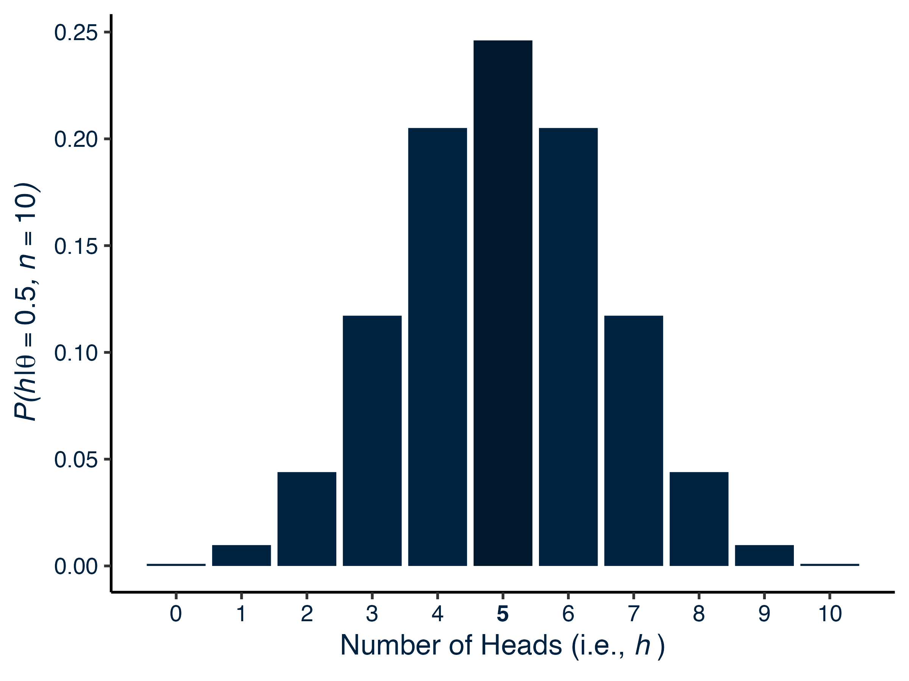

---
title: "Probability, Likelihood, and Maximum Likelihood Estimation" 
draft: false
summary: 'Explanation of post' 
article_type: technical
output:
  bookdown::html_document2:
     keep_md: true
always_allow_html: true
bibFile: content/technical_content/em_algorithm/biblio.json    
tags: []
---   


```{r package_loading_1, include=F}
#load packages   
library(easypackages) 
packages <- c('devtools','tidyverse', 'RColorBrewer', 'parallel', 'data.table', 'kableExtra', 'ggtext', 'egg', 'papaja', 'shiny',
              'ggbrace', 'cowplot', 'knitr', 'RefManageR', 'reticulate', 'gluedown', 'formatR')
libraries(packages)  

#use_python(python = "/usr/local/bin/python3.9")

knitr::opts_chunk$set(comment = NA)
# knitr hook to use Hugo highlighting options
knitr::knit_hooks$set(
  source = function(x, options) {
  hlopts <- options$hlopts
    paste0(
      "```", "r ",
      if (!is.null(hlopts)) {
      paste0("{",
        glue::glue_collapse(
          glue::glue('{names(hlopts)}={hlopts}'),
          sep = ","
        ), "}"
        )
      },
      "\n", glue::glue_collapse(x, sep = "\n"), "\n```\n"
    )
  }
)

chunk_class <- function(before, options, envir) {
    class_name = options$class_name

    
    if (!is.null(before)) { 
      
        lines <- unlist(strsplit(x = before, split = "\n")) #separate lines of code at \n
        n <- length(lines)  #determines numbers of lines
        
        #if (line_numbers) { 
           res <- paste0("<pre><code class='", class_name, "'>", before, "</code></pre>")
                            
                            #paste0("<pre><code class='", class_name, "'>", before, "</code></pre>")
        #}
        
       
          
          #res <- paste0("<pre>", paste0("<span class='line-number'>", 1:n,
                            #"</span><code class ='", class_name, "'>", lines, "</code>"), "</pre>")
    }
        return(res)
    
}

knitr::knit_hooks$set(output = chunk_class, preserve = TRUE)

#knitr::knit_hooks$set(output = function(x, options) { 
#  paste(c("<pre><code class = 'r-code'>",
#        gsub('^## Error', '**Error**', x),
#        '</pre></code>'), collapse = '\n')
#})

```


# Probability Mass Functions: The Probability of Observing Each Possible Outcome Given Specific Parameter Values

Consider an example where a researcher obtains a coin and believes it to be unbiased, $P(\theta) = P(head) = 0.50$. To test this hypothesis, the researcher intends to flip the coin 10 times and record the result as a `1` for heads and `0` for tails, thus obtaining a vector of 10 observed scores, $\mathbf{y} \in \\{0, 1 \\}^{10}$, where $n = 10$. Before collecting the data to test their hypothesis, the researcher would like to get an idea of the probability of observing any given number of heads given that the coin is unbiased and there are 10 coin flips, $P(\mathbf{y}|\theta, n)$. Thus, the outcome of interest is the number of heads, $h$, where $\\{h|0 \le h \le10\\}$. Because the coin flips have a dichotomous outcome and the result of any given flip is independent of all the other flips, the probability of obtaining any given number of heads will be distributed according to a binomial distribution, $h \sim B(n, h)$. To compute the probability of obtaining any given number of heads, the *binomial function* shown below in Equation \ref{eq:prob-mass-function} can be used:

\begin{align}
P(h|\theta, n) = {n \choose h}(\theta)^{h}(1-\theta)^{(n-h)},
\label{eq:prob-mass-function}
\end{align}

where ${n \choose h}$ gives the total number of ways in which $h$ heads (or successes) can be obtained in a series of $n$ attempts (i.e., coin flips) and $(\theta)^{h}(1-\theta)^{(n-h)}$ gives the probability of obtaining a given number of $h$ heads and $n-h$ tails in a given set of $n$ flips. Thus, the binomial function (Equation \ref{eq:prob-mass-function}) has an underlying intuition: To compute the probability of obtaining a given number of $h$ heads given $n$ flips and a certain $\theta$ probability of success, the probability of obtaining $h$ heads in a given set of $n$ coin flips, $(\theta)^{h}(1-\theta)^{(n-h)}$, is multiplied by the total number of ways in which $h$ heads can be obtained in $n$ coin flips ${n \choose h}$.

As an example, the probability of obtaining four heads ($h=4$) in 10 coin flips ($n = 10$) is calculated below. 

$$
\begin{alignat}{2}
P(h = 4|\theta = 0.50, n = 10) &= {10 \choose 4}(0.50)^{4}(1-0.50)^{(10-4)}   \nonumber \\\\
&= \frac{10!}{4! (10 - 4)!}(0.50)^{4}(1-0.50)^{(10-4)} \nonumber \\\\
&= 210(0.5)^{10}\nonumber \\\\
&= 0.205 \nonumber
\end{alignat}
$$
Thus, there are 210 possible ways of obtaining four heads in a series of 10 coin flips, with each way having a probability of $(0.5)^{10}$ of occurring. Altogether, four heads have a probability of .205 of occurring given a probability of heads of .50 and 10 coin flips. 

In order to calculate the probability of obtaining each possible number of heads in a series of 10 coin flips, the binomial function (Equation \ref{eq:prob-mass-function}) can be computed for each number. The resulting probabilities of obtaining each number of heads can then be plotted to produce a *probability mass function*: A distribution that gives the probability of obtaining each possible value of a discrete random variable[^1] (see Figure \ref{fig:prob-mass-binom}). Importantly, probability mass functions have two conditions: 1) the probability of obtaining each value is non-negative and 2) the sum of all probabilities is zero. The R code block below (lines <a href="#1">1--68</a>) produces a probability mass function for the binomial situation.


[^1]: Discrete variables have a countable number of discrete values. In the current example with ten coin flips ($n = 10$), the number of heads is a discrete variable because the number of heads, $h$, has a countable number of outcomes, $h \in \\{0, 1, 2, ..., n\\}$. 

```{r prob-mass-binom, echo=T, eval=T, results='hide', warning = F}
#create function that computes probability mass function with following arguments:
  ##num_trials = number of trials (10  [coin flips] in the current example)
  ##prob_success = probability of success (or heads; 0.50 in the current example)
  ##num_successes = number of successes (or heads; [1-10] in the current example)

compute_binom_mass_density <- function(num_trials, prob_success, num_successes){
  
  #computation of binomial term (i.e., number of ways of obtaining a given number of successes)
  num_success_patterns <- (factorial(num_trials)/(factorial(num_successes)*factorial(num_trials-num_successes)))
  
  #computation of the number of possible ways of obtaining a given number of successes (i.e., heads)
  prob_single_pattern <- (prob_success)^num_successes*(1-prob_success)^(num_trials-num_successes)
  
  
  probability <- num_success_patterns*prob_single_pattern
  
  pmf_df <- data.frame('probability' = probability, 
                   'num_successes' = num_successes, 
                   'prob_success' = prob_success, 
                   'num_trials' = num_trials)
  
  return(pmf_df)
}


num_trials <- 10
prob_success <- 0.5
num_successes <- 0:10  #manipulated variable 

prob_distribution <- compute_binom_mass_density(num_trials, prob_success, num_successes)

library (tidyverse) 
library(grDevices) #needed for italic()

#create data set for shaded rectangle that indicates the most likely value 
##index of highest probability 
highest_number_ind <- which.max(prob_distribution$probability) 
##most likely number of successes
most_likely_number <- prob_distribution$num_successes[highest_number_ind] 
##probability value of most likely number of successes
highest_prob <- max(prob_distribution$probability) 

rectangle_data <-data.frame(
  'xmin' = most_likely_number - 0.10, 
  'xmax' = most_likely_number + 0.10,
  'ymin' = 0,
  'ymax' = highest_prob)


#create pmf plot 
pmf_plot <- ggplot(data = prob_distribution, aes(x = num_successes, y = probability)) + 
  geom_bar(stat = 'identity', 
           fill =  ifelse(test = prob_distribution$num_successes == most_likely_number, 
                                no =  "#002241", 
                                yes = "#00182d")) +  #calculate sum of probability for each num_successes
 ## geom_rect(inherit.aes = F, 
 ##           data = rectangle_data, mapping = aes(xmin = xmin, xmax = xmax, ymin = ymin, ymax = ymax), 
 ##           fill = 'grey50', color = NA, alpha = 0.2) +
  scale_y_continuous(name = bquote(italic("P(h")*"|"*italic(theta == .(prob_success)*","~n == .(num_trials)*")"))) + 
  scale_x_continuous(name = bquote("Number of Heads (i.e., "*italic("h")~")"), 
                     breaks = seq(from = 0, to = 10, by = 1)) +
  theme_classic(base_family = "Helvetica", base_size = 18) +
  theme(axis.title.y = element_text(face = 'italic'), 
        
        #embolden the most likely number of heads 
        axis.text.x = 
          element_text(face = 
                         ifelse(test = prob_distribution$num_successes == most_likely_number, 
                                no =  "plain", 
                                yes = "bold")), 
        text = element_text(color = "#002241"),
        line = element_line(color = "#002241"), 
        axis.text = element_text(color = "#002241"))

ggsave(filename = 'images/pmf_plot.png', plot = pmf_plot, height = 6, width = 8)
```

<div class="figure">
  <div class="figDivLabel">
    <caption>
      <span class = 'figLabel'>Figure \ref{fig:prob-mass-binom}<span> 
    </caption>
  </div>
   <div class="figTitle">
    Probability Mass Function With an Unbiased Coin (<span class = "theta">&theta;</span> = 0.50) and Ten Coin Flips (n = 10)</span> 
  </div>
     
  
  <div class="figNote">
      <span><em>Note. </em> Number emboldened on the x-axis indicates the number of heads that is most likely to occur with an unbiased coin and 10 coin flips, with the corresponding bar in darker blue  indicating the corresponding probability.</span> 
  </div>
</div>

Figure \ref{fig:prob-mass-binom} shows the probability mass function that results with an unbiased coin ($\theta = 0.50$) and ten coin flips ($n = 10$). In looking across the probability values of obtaining each number of heads (x-axis), 5 heads is the most likely value, as indicated by the emboldened number on the x-axis and the bar above it with a darker blue color. As an aside, the R code below verifies the two conditions of probability mass functions for the current example (for a mathematical proof, see [Appendix A](#proofs)). 

```{r pmf-checks-code, echo=T, eval=T, results='hide', warning = F}
#Condition 1: All probability values have nonnegative values. 
sum(prob_distribution$probability >= 0) #11 nonnegative values 

#Condition 2: Sum of all probability values is 1. 
sum(prob_distribution$probability)  #1
```

```{r pmf-checks-output, class_name = 'r-code', results = 'hold', echo=F, eval=T}
#Condition 1: All probability values have nonnegative values. 
sum(prob_distribution$probability >= 0) #11 nonnegative values 

#Condition 2: Sum of all probability values is 1. 
sum(prob_distribution$probability)  #1
```

With a probability mass function that shows the probability of obtaining each possible number of heads, the researcher now has an idea of what outcomes to expect after flipping the coin 10 times. Unfortunately, the probability mass function in Figure \ref{fig:prob-mass-binom} gives no insight into the coin's probability of heads after data have been collected; in computing the probability mass function, the probability of heads ($\theta$) is fixed. Thus, the researcher must use a different type of distribution to estimate the coin's probability of heads. 


# Likelihood Distributions: The Probability of Observing Each Possible Set of Parameter Values Given a Specific Outcome

Continuing with the coin flipping example, the researcher flips the coin 10 times and obtains seven heads. With this data, the researcher wants to determine the probability value of heads that most likely produced the data. In other words, the researcher wants to find the value of $\theta$ that maximizes the possibility of observing the data, $\max_{\theta \in \Theta} P(h = 7, n = 10|\theta)$. Before continuing, it is vital to explain why the researcher is no longer dealing with probabilities and is instead dealing with likelihoods.  


## Likelihoods are not Probabilities


```{r likelihood-dist, echo=F}
num_trials <- 10
num_successes <- 7
prob_success <- seq(from = 0, to = 1, by = 0.01) #manipulated variable 

likelihood_distribution <- compute_binom_mass_density(num_trials = num_trials, num_successes =  num_successes, prob_success = prob_success)

ggplot(data = likelihood_distribution, aes(x = prob_success, y = probability)) + 
  geom_line() + 
  scale_y_continuous(name = bquote(paste(L, "(", theta[1], " | ", theta[2] == .(num_trials), ", ", y, ")"))) + 
  scale_x_continuous(name = bquote(paste("Probability of success (", theta, ")")), breaks = seq(0, 1, 0.1)) +
  theme_classic()

num_trials <- 7:100
num_successes <- 7 
prob_success <- 0.5 #manipulated variable 


```


Although probability density functions compute the probability that a set of data values have been observed given a fixed set of parameter valuess, we are seldom interested in this probability. Practitioners and researchers
are more interested in the probability that a certain set of parameter values characterize the larger population (i.e, $p(\theta|y)$). When trying to determine the most likely set of
parameter values, we use likelihood functions. Thus, the likelihood of a set of parameters given the observed data is represented as $L(\theta|y)$. Importantly, likelihoods do not 
represent the probability that a given set of parameter values defines the population (i.e., $P(\theta)$); we sample data and want to infer parameter values at the population level. With
probabilities, we assume knowledge of the population parameter values and calculate the probability of observing any given set of data. Using perhaps more relatable terms, the 
hypothesis is assumed to be true when calculating conditional probabilities and the data are varied. For likelihoods, the data is fixed and the hypothesis is varied. Note that Bayes
theorem can be used to convert likelihoods ($L(\theta|y)$) to probabilities ($P(\theta)$). 

To compute likelihoods, the function used to compute the above probabilities is used. Although confusing, the parameter values (the probability of success in this example [$\theta_1$])
are now being manipulated and not the data (see Figure \@ref(fig:likelihood-dist). Importantly, the sum of all the likelihoods does not sum to 1 ($\int^n_0 f(y|n, \theta) \neq 1$), 
which explains why likelihoods are sometimes called *unnormalized probabilities*. Although it seems unintuitive that the sum of the likelihoods is not 1, remember that likelihoods do not
describe the probability of a set of parameter being true (i.e., $p(\theta)$); if they did, then the integral would sum to 1. Given that we have two parameters, we can also produce 
another likelihood function by changing the values of the number of trials $\theta_1$ (see Figure \@ref(likelihood-dist2)). A joint likelihood function can be produced by varying 
both parameters simultaneously. 

```{r likelihood-dist2, echo=F}
num_trials <- 30
num_successes <- 21
prob_success <- seq(from = 0, to = 1, by = 0.01) #manipulated variable 

likelihood_distribution <- compute_binom_mass_density(num_trials, prob_success, num_successes)

ggplot(data = likelihood_distribution, aes(x = prob_success, y = probability)) + 
  geom_line() + 
  scale_y_continuous(name = bquote(paste(L, "(", theta[1], " | ", theta[2] == .(num_trials), ", ", y, ")"))) + 
  scale_x_continuous(name = bquote(paste("Probability of success (", theta, ")")), breaks = seq(0, 1, 0.1)) +
  theme_classic()

likelihood_distribution[ 51,] 
prob_distribution$probability

p <- seq(from = 0, to = 1.00, by = 0.00001)

likelihood <- p^6 * (1-p)^4
sum(likelihood)*0.003968254

```

## Resources 
Myung (2003); Etz(2018); https://www.youtube.com/watch?v=IhoEwC9R8pA; https://www.youtube.com/watch?v=w3drLH-DFpE; 


# Maximum Likelihood Estimation: Estimating the Set of Parameter Values That Most Likely Produce a Specific Outcome

With a formula to compute likelihood distributions, a common goal is to find the set of parameter values that have the highest likelihood. That is, we want to find the set of parameter
values that maximize the probability of producing the observed data ($\theta_{MLE}$). To find $\theta_{MLE}$, we must find the vector $\theta$ that produces the highest likelihood
value. Mathematically, this means that we find the value on the likelihood curve where the change with respect to $\theta$ is zero ($\frac{\delta L(\theta|y)}{\delta \theta} = 0$). 
Revisiting our likelihood function, it becomes apparent that computing the partial derivative of the likelihood function with respect to $\theta$ becomes computationally unfeasible when the
number of observations reaches even that of a small sample size (e.g.,$n=100$). With the derivative of the Bernoulli equation involving a length combination of the quotient, product, and chain rules, the derivative of a multi-iteration likelihood function would be completely intractable. 

$$  
\begin{aligned}

L(\theta|y = y_1, y_2, ... , y_{100}) &= f_1(y_1|\theta)f_2(y_2|\theta)...f_{100}(y_{100}|\theta) \\
 &= \Bigg({\theta_1 \choose y_1}(\theta_2)^{y_1}(1-\theta_2)^{(\theta_1-y_1)}\Bigg)\Bigg({\theta_1 \choose y_2}(\theta_2)^{y_2}(1-\theta_2)^{(\theta_1-y_2)}\Bigg)...\Bigg({\theta_1 \choose y_n}(\theta_2)^{y_n}(1-\theta_2)^{(\theta_1-y_n)}\Bigg) \\ 
 L(\theta|y) &= \prod^{100}_{i=1}f_i(y_i|\theta)

\end{aligned}
$$
\noindent
To enable an efficient computation of the derivative, we apply a log transformation to the equation to drastically simplify the equation 

$$
\log[ L(\theta|y)] = \log \Big[{\theta_1 \choose y_1}\Big] + y\log[(\theta_2)] + (\theta_1-y)\log(1-\theta_2)
$$
\noindent
Taking the partial derivative with respect to $\theta$, we get 

$$  
\begin{aligned}
\frac{\delta L}{\delta \theta_2} &= \frac{\delta}{\delta \theta_2}  \Bigg(\log \Big[{\theta_1 \choose y_1}\Big] + y\log[(\theta_2)] + (\theta_1-y)\log(1-\theta_2) \Bigg) \\ 
&= 0 + y(\frac{1}{\theta_2}) + (\theta_1-y)(-1)(\frac{1}{1-\theta_2}) \\ 
0 &= \frac{y}{\theta_2}- \frac{\theta_1-y}{1-\theta_2} \\ 
\frac{\theta_1-y}{1-\theta_2} &= \frac{y}{\theta_2} \\ 
\theta_2\theta_1 - \theta_2y &= y - \theta_2y \\ 
\theta_2\theta_1 &=y \\
\theta_2 &= \frac{y}{\theta_1}

\end{aligned}
$$
\noindent
Therefore, the maximum of the likelihood function is found by dividing the observed number of successes ($y$) by the number of trials ($\theta_1$). Returning to the previous example where 7 successes ($y_1 = 7$) occurred across 10 coin flips ($\theta_1 = 10$), the value of success probability that maximizes the probability of observing the data is 
$\theta_2 = \theta_{MLE} \frac{7}{10} = .70$. To make this example more realistic, consider that, across 10 $k$ iterations where 10 coin flips occur in each iteration, the number of 
successes is $y = [1, 6, 4, 7, 3, 4 ,5, 10, 5, 3]$. At this point, it may seem daunting to compute the partial derivative of the resulting likelihood function with respect to $\theta_2$
because the equation will contain $n=10$ product terms. Thankfully, we can derive a more general equation for calculating the value of $\theta_2$ where the likelihood function is maximized. Consider a simple example where there are only two coin flips ($y = [y_1, y_2]$). 

$$  
\begin{aligned}
&= 0 + y_1(\frac{1}{\theta_2}) + (\theta_1-y_1)(-1)(\frac{1}{1-\theta_2}) + y_2(\frac{1}{\theta_2}) + (\theta_1-y_2)(-1)(\frac{1}{1-\theta_2}) \\ 
0 &= \frac{y_1}{\theta_2}- \frac{\theta_1-y_1}{1-\theta_2} + \frac{y_2}{\theta_2}- \frac{\theta_1-y_2}{1-\theta_2} \\ 
\frac{2\theta_1-y_1-y_2}{1-\theta_2} &= \frac{y_1 + y_2}{\theta_2} \\ 
2\theta_1\theta_2 - \theta_2y_1 -\theta_2y_2  &= y_1 + y_2 - \theta_2y_1 -\theta_2y_2 \\ 
2\theta_1\theta_2  &=y \\
\theta_2 &= \frac{y_1 + y_2}{2\theta_1} = \frac{\sum^{n}_{i=1} y_i}{k\theta_1}

\end{aligned}
$$
\noindent
Therefore, the value of $\theta_2$ where the likelihood function is maximized is `r `theta_2`. 

```{r multitrial-likelihood, echo=F}
y <-c(1, 6, 4, 7, 3, 4 ,5, 10, 5, 3)
theta_1 <- 10
k <- 10

theta_2 <- sum(y)/(k*theta_1)

```

### Maximum likelihood estimation with a continuous variable (closed-form solution)

Let's now consider a situation where we collect a series of 100 data points defined by a mean and variance. Given that the data are continuous, the Gaussian distribution function can be
used to model the data such that the probability of observing a given data point ($Y_i$) given a specific mean($\mu$) and variance ($\sigma$) is 

$$ P(Y_i|\sigma, \mu) = \frac{1}{\sqrt{2\pi\sigma^2}}e\Big(\frac{-Y_i - \mu Y_i}{2\sigma^2})    $$
\noindent 
and the likelihood of observing a given set of parameters can be computed using 

$$
\begin{aligned}
L(\sigma^2, \mu) &= \prod^n_{i=1} f(Y_i|\sigma^2, \mu) = \prod^n_{i=1}\frac{1}{\sqrt{2\pi\sigma^2}}e^{\Big(-\frac{(Y_i - \mu)^2}{2\sigma^2}\Big)} \\ 
\end{aligned}
$$
\noindent
Note that, in addition to taking the log likelihood to reduce computation time, the log likelihood of the Gaussian density function is used to avoid dealing with excessively small values. Computers lose accuracy with very small values(known as *underflow*) and so using log likelihoods prevents computations from incurring numerical error. The log likelihood Gaussian equation is obtained
by applying the product and power rules of logarithms. Given that the equation contains Euler's number, we will use log of base $e$ or the natural log ($\ln$). Before apply the log 
transformation, some simplifying is necessary. Let's begin with the first part of the Gaussian likelihood function. Given that it is independent of the observations, it is a constant. 
The product of a constant is the constant raised to the number of times it is computed ($n$ times)

$$ 
\begin{aligned}
\prod^n_{i=1}\frac{1}{\sqrt{2\pi\sigma^2}} &= \Big(\frac{1}{\sqrt{2\pi\sigma^2}} \Big)^n \\ 
 &= (2\pi\sigma^2)^{-\frac{n}{2}}
\end{aligned} 

$$
\noindent
Moving on to the second part. 

$$ 
\begin{aligned}
\prod^n_{i=1}e^{\Big(-\frac{(Y_i - \mu Y_i)^2}{2\sigma^2}\Big)} &= \prod^n_{i=1}e^{\Big(-\frac{1}{2\sigma^2}(Y_i - \mu)^2\Big)} \\ 
 &= e^{\Big(-\frac{1}{2\sigma^2}\sum_{i=1}^n(Y_i - \mu)^2\Big)}
\end{aligned} 

$$
\noindent
Combining the simplifications for the first and second portions, we get 

$$ 
\begin{aligned}
L(\sigma^2, \mu) &= \prod^n_{i=1}(2\pi\sigma^2)^{-\frac{1}{2}}e^{\Big(-\frac{1}{2\sigma^2}(Y_i - \mu)^2\Big)} \\ 
&= (2\pi\sigma^2)^{-\frac{n}{2}}e^{\Big(-\frac{1}{2\sigma^2}\sum_{i=1}^n(Y_i - \mu)^2\Big)}

\end{aligned} 

$$


$$ 
\begin{aligned}
\text{Apply product rule } &= \ln \Big((\sqrt{2\pi\sigma^2})^{-\frac{n}{2}}\Big) + \ln \Bigg(e^{\Big(-\frac{1}{2\sigma^2}\sum_{i=1}^n(Y_i - \mu)^2\Big)}\Bigg) \\ 
\text{Apply power rule } &=-\frac{n}{2}\ln \Big((\sqrt{2\pi\sigma^2}) + -\frac{1}{2\sigma^2}\sum_{i=1}^n(Y_i - \mu Y_i)^2 \ln(e) \\ 
\ln L(\sigma^2, \mu)  &= -\frac{n}{2}\ln (\sqrt{2\pi\sigma^2}) -\frac{1}{2\sigma^2}\sum_{i=1}^n(Y_i - \mu)^2  \\ 

\end{aligned}

$$

Each parameter can be solved for by taking the derivative with respect to that parameter. To solve for $\mu$, 
$$\begin{aligned}
\frac{\delta \ln L}{\delta \mu} &= \frac{\delta}{\delta \mu} \Bigg(-\frac{n}{2}\ln (\sqrt{2\pi\sigma^2}) -\frac{1}{2\sigma^2}\sum_{i=1}^n(Y_i - \mu)^2\Bigg) \\ 
&= 0 - \frac{\delta}{\delta \mu} \underbrace{\Big(-\frac{1}{2\sigma^2}\sum_{i=1}^n(Y_i - \mu)^2 \Big)}_{\text{product rule}} \\ 
&= \sum_{i=1}^n\frac{\delta}{\delta \mu}(-\frac{1}{2\sigma^2}) \cdot(Y_i - \mu)^2  + -\frac{1}{2\sigma^2} \cdot \frac{\delta}{\delta \mu}(Y_i - \mu)^2 \\
&= \sum_{i=1}^n \Bigg( 0 -\frac{1}{2\sigma^2} \cdot \frac{\delta}{\delta \mu}(Y_i - \mu)^2 \Bigg) \\ 
&= -\frac{1}{2\sigma^2}  \sum_{i=1}^n (\frac{\delta}{\delta \mu}(Y_i - \mu)^2) \\ 
&=-\frac{1}{2\sigma^2}  \sum_{i=1}^n 2(Y_i - \mu) \cdot -1 \\ 
&= \frac{1}{\sigma^2}  \sum_{i=1}^n (Y_i - \mu) \\ 
\text {Set  } \frac{\delta \ln L}{\delta \mu} = 0 \\ 
0 &= \frac{1}{\sigma^2}  \sum_{i=1}^n (Y_i - \mu) \\ 
0 &= \sum_{i=1}^n y_i - \sum_{i=1}^n \mu \\ 
0 &= \sum_{i=1}^n y_i - n\mu \\ 
\mu &= \frac{1}{n}\sum_{i=1}^n y_i

\end{aligned}$$
\noindent
If $\sigma^2$ is solved for, we get 

$$
\begin{aligned}

\frac{\delta \ln L}{\delta \sigma^2} &= \frac{1}{2\sigma^2} \Big(-n + \frac{1}{\sigma^2} \sum_{i=1}^n(y_i - \mu)^2 \Big) \\ 
\text {Setting } \frac{\delta \ln L}{\delta \sigma^2} = 0 \\
0 &= \frac{1}{2\sigma^2} \Big(-n + \frac{1}{\sigma^2} \sum_{i=1}^n(y_i - \mu)^2 \Big) \\ 
n\sigma^2 &=  \sum_{i=1}^n(y_i - \mu)^2  \\ 
\sigma^2 &= \frac{1}{n}  \sum_{i=1}^n(y_i - \mu)^2  \\ 


\end{aligned}
$$

```{r gaussian_dist, echo=F}
#generate scores from Gaussian distribution 
mu <- 5
sd <- 5
n <- 500

ind_scores <- rnorm(n = n, mean = mu, sd = sd)

mu_mle <- mean(ind_scores)
sigma_mle <- var(ind_scores)

compute_log_like <- function(ind_scores, parameters){
  
  mu_value <- parameters[1]
  sd_value <- parameters[2]

  n <- length(ind_scores)
  
  log_like <- -.5*n*log(2*pi) -.5*n*log(sd_value^2) - (1/(2*sd_value^2))*sum((ind_scores-mu_value)^2)
  return(-log_like)
}

sd_values <- seq(from = 1, to = 10, by=1)
mu_values <- seq(from = 1, to = 10, by=1)

#find maximum likelihood estimates 
MLE_estimates <- optim(par=c(1,1), compute_log_like, 
      ind_scores = ind_scores, 
      method = "L-BFGS-B",  
      hessian=TRUE, 
      lower = c(0, 0),   
      upper = c(10, 10))
                    
# Examine estimates
MLE_par <- MLE_estimates$par
MLE_SE <- sqrt(diag(solve(MLE_estimates$hessian)))
MLE <- data.table(param = c("mu", "sd"),
                  estimates = MLE_par,
                  sd = MLE_SE)

kable(MLE)
compute_log_like(ind_scores, parameters = c(4.959401, 4.841803)) #returns same value of 1498.113


```

Returning to our example, we can then compute the maximum likelihood estimates for $\mu$ and $\sigma^2$ using the above closed-form solutions. Therefore, $\mu_{MLE}= $ `r mu_mle` and 
$\sigma^2_{MLE} = $ `r sigma_mle`. 

## Resources 
http://jrmeyer.github.io/machinelearning/2017/08/18/mle.html
https://machinelearningmastery.com/a-gentle-introduction-to-jensens-inequality/

# References




# Appendix A: Proof That the Binomial Function is a Probability Mass Function  {#proof-pmf}

To prove that the binomial function is a probability mass function, two outcomes must be shown: 1) all probability values are non-negative and 2) the sum of all probabilities is 1. 

For the first condition, the impossibility of negative values occurring in the binomial function becomes obvious when individually considering the binomial coefficient, $n \choose k$, and the binomial factors, $p^k (1-p)^{n-k}$. With respect to the binomial coefficient, $n \choose k$, it is always nonnegative because it is the product of two non-negative numbers; the number of trials, $n$, and the number of successes can never be negative. With respect to the binomial factors, the resulting value is always nonnegative because all the term are nonnegative; in addition to the number of trials and successes ($n, k$, respectively),  the probability of success and failure are also always nonnegative ($p, k \in \\[0,1\\]$). Therefore, probabilities can be conceptualized as the product of a nonnegative binomial coefficient and a nonnegative binomial factor, and so is alwasy nonnegative. 

For the second condition, th 

The binomial function is defined as:

$$f(k;n,p) = \binom{n}{k} p^k (1-p)^{n-k}$$

where $\binom{n}{k}$ is the binomial coefficient, $p$ is the probability of success, and $n$ is the number of trials.


To show that all values of the binomial function sum to 1, we need to consider the sum of the function over all possible values of $k$ from 0 to $n$. That is, we need to show that:

$$\sum_{k=0}^{n} \binom{n}{k} p^k (1-p)^{n-k} = 1$$

The binomial function gives the probability of getting $k$ successes in $n$ trials, where the probability of success in each trial is $p$. The sum on the left-hand side of the equation is the probability of getting 0 successes, 1 success, 2 successes, and so on, up to $n$ successes in $n$ trials.

The proof relies on the fact that the sum of probabilities of all possible outcomes of a random experiment is always equal to 1. In this case, the random experiment is the binomial experiment with $n$ trials and probability of success $p$.

To prove the equation, we use the binomial theorem, which states that:

$$(x+y)^n = \sum_{k=0}^{n} \binom{n}{k} x^k y^{n-k}$$

Setting $x=p$ and $y=1-p$, we can rewrite the binomial function as:

$$f(k;n,p) = \binom{n}{k} p^k (1-p)^{n-k} = \binom{n}{k} (p(1-p))^k (1-p)^n$$

Using the binomial theorem with $x=p$ and $y=1-p$, we get:

$$(p+(1-p))^n = \sum_{k=0}^{n} \binom{n}{k} p^k (1-p)^{n-k}$$

Substituting this expression for the sum on the left-hand side of the equation, we get:

$$\sum_{k=0}^{n} \binom{n}{k} p^k (1-p)^{n-k} = (p+(1-p))^n = 1^n = 1$$

Therefore, we have shown that the sum of the binomial function over all possible values of $k$ is always equal to 1, which means that the total probability of all possible outcomes in a binomial experiment is always equal to 1, as expected.


# Appendix B: Proof That Likelihoods are not Probabilities  {#proof-likelihood}

To proove that the binomial function is a probability mass function, two outcomes must be shown: 1) all probability values are non-negative and 2) the sum of all probabilities is 1.


Sure, let me try to simplify the proof.

The binomial function is defined as:

$$f(k;n,p) = \binom{n}{k} p^k (1-p)^{n-k}$$

where $\binom{n}{k}$ is the binomial coefficient, $p$ is the probability of success, and $n$ is the number of trials.


To show that all values of the binomial function sum to 1, we need to consider the sum of the function over all possible values of $k$ from 0 to $n$. That is, we need to show that:

$$\sum_{k=0}^{n} \binom{n}{k} p^k (1-p)^{n-k} = 1$$

The binomial function gives the probability of getting $k$ successes in $n$ trials, where the probability of success in each trial is $p$. The sum on the left-hand side of the equation is the probability of getting 0 successes, 1 success, 2 successes, and so on, up to $n$ successes in $n$ trials.

The proof relies on the fact that the sum of probabilities of all possible outcomes of a random experiment is always equal to 1. In this case, the random experiment is the binomial experiment with $n$ trials and probability of success $p$.

To prove the equation, we use the binomial theorem, which states that:

$$(x+y)^n = \sum_{k=0}^{n} \binom{n}{k} x^k y^{n-k}$$

Setting $x=p$ and $y=1-p$, we can rewrite the binomial function as:

$$f(k;n,p) = \binom{n}{k} p^k (1-p)^{n-k} = \binom{n}{k} (p(1-p))^k (1-p)^n$$

Using the binomial theorem with $x=p$ and $y=1-p$, we get:

$$(p+(1-p))^n = \sum_{k=0}^{n} \binom{n}{k} p^k (1-p)^{n-k}$$

Substituting this expression for the sum on the left-hand side of the equation, we get:

$$\sum_{k=0}^{n} \binom{n}{k} p^k (1-p)^{n-k} = (p+(1-p))^n = 1^n = 1$$

Therefore, we have shown that the sum of the binomial function over all possible values of $k$ is always equal to 1, which means that the total probability of all possible outcomes in a binomial experiment is always equal to 1, as expected.


# Appendix C: Proof of Relation Between Beta and Gamma Functions  {#proof-likelihood}
# Appendix D: Proof of Relation Between Gamma and Factorial Functions  {#proof-likelihood}


