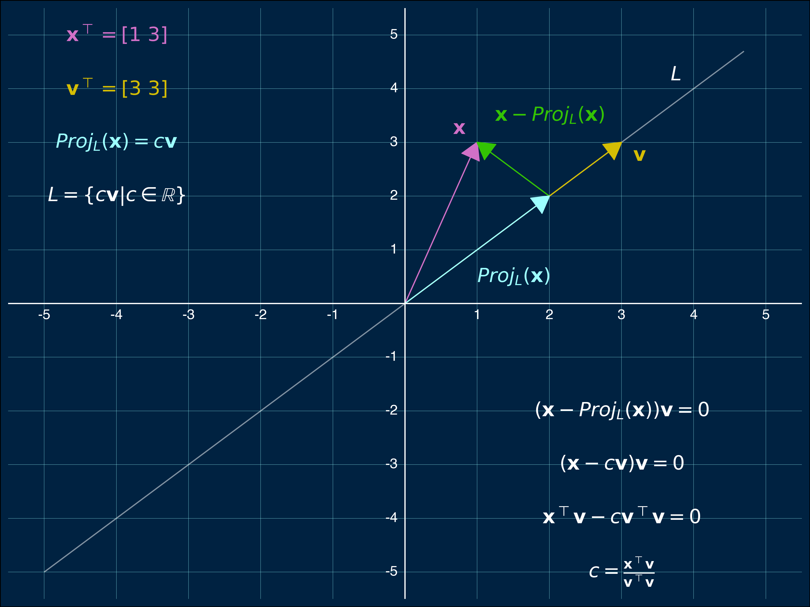
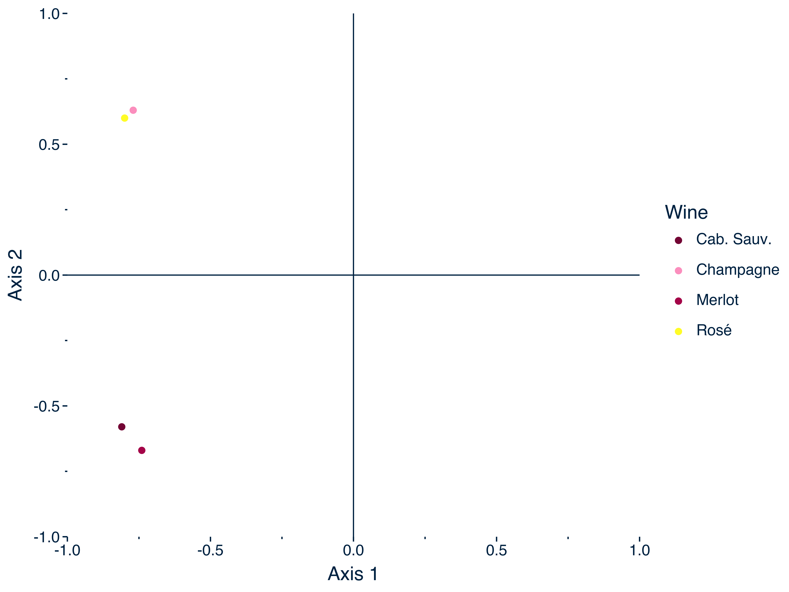
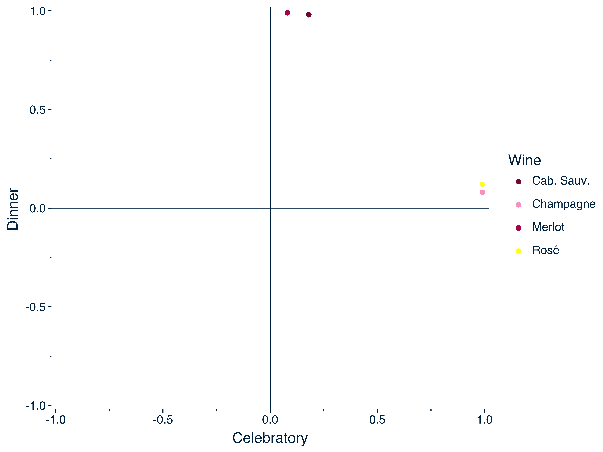
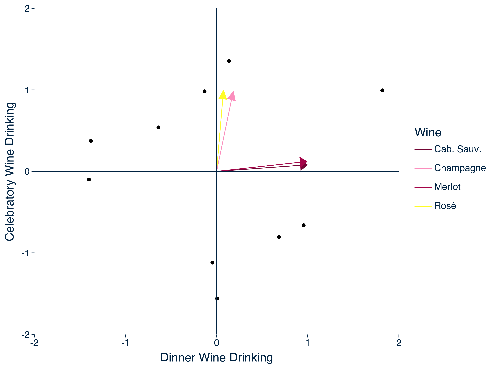

---
title: "The Theory of the Singular Value Decomposition and its Relation to Principal Component Analysis" 
draft: false
summary: "This whitepaper explicates the geometry of the singular value decomposition and its deep connection to principal component analysis. Geometrically, the singular value decomposition shows that every matrix can be sequentially decomposed into a rotation followed by stretching and/or dimension change and then followed by another rotation. At a deeper level, the singular value decomposition provides eigenvectors that define principal axes onto which original variables and scores can be projected to, respectively, provide loadings and principal component scores. Using rotations, the loadings and principal component scores can be transformed into having more interpretable values."
date: "2025-02-21"
article_type: technical
output:
  bookdown::html_document2:
     keep_md: true
header-includes: 
  - \usepackage{blkarray}
always_allow_html: true
bibFile: content/technical_content/svd/refs.json    
imgThumbnail: ""
tags: []
---   


Three points require mentioning before beginning this whitepaper. First, I used Python and R code throughout this whitepaper and often imported objects created in Python into R for creating plots. To use Python and R coinjointly, I used the `reticulate` package made for R and created a conda environment to run Python code (see lines <a href="#2">2--12</a> below). 

```r 
library(reticulate)

#create and use conda environment
conda_create(envname = 'blog_posts',  python_version = '3.10.11')
use_condaenv(condaenv = 'blog_posts')

#install packages in conda environment
py_packages <- c('numpy', 'pandas', 'scikit-learn', "plotnine", "statsmodels", "manim", "factor_analyzer")
conda_install(envname = 'blog_posts', packages = py_packages, pip=T)

#useful for checking what packages are loaded
py_list_packages(envname = 'blog_posts', type = 'conda')
```

Second, the Python packages and modules in the Python code block are needed to run all the Python code in this paper (see lines <a href="#15">15--22</a> below). 

```r {language=python}
import math 
import numpy as np
import pandas as pd
import plotnine as pt

from sklearn import decomposition
from sklearn.decomposition import PCA
from sklearn.preprocessing import StandardScaler
from factor_analyzer.rotator import Rotator
from factor_analyzer import FactorAnalyzer
```


Third, although I often include code in papers so that readers can explore concepts, I decided to not include the Python code I used to create mathematical animations given the considerable length of the script. For readers interested in how I created my animations, I used the [manim](#https://www.manim.community) library and my source code can be viewed in [this script](#https://github.com/sebsciarra/HugoWebsite/blob/main/content/technical_content/svd/anim.py). 


# Introduction 

In this whitepaper, I provide a deep dive into the math underlying the singular value decomposition and use this as a foundation to explain the connection with principal component analysis. To this end, I provide a detailed proof of the singular value decomposition and explain the linear algebra necessary for understanding its geometry. I then explain the meaning of the singular value decomposition by synthesizing the parts needed to run a principal component analysis. To address all these points, the following sections will follow sequentially: 

1) A review of linear algebra
2) The singular value decomposition and its visualization
3) Proving the singular value decomposition
4) Understanding the singular value decomposition by synthesizing principal component analysis

# A Review of Linear Algebra 

## Some Important Fundamentals {#fundamentals}

In this section, I provide some fundamentals of linear algebra that are necessary for understanding the geometry of the singular value decomposition. To this end, I explain the following four points: 

1) Matrices define basis vectors
2) Matrix-vector multiplication transforms bases by computing weighted vector sums
3) Dot products are 1-dimensional cases of matrix-vector multiplication
4) Dot products provide orthogonal projection lengths with normalized vectors

### Matrices Define Basis Vectors 

Basis vectors can be understood as the coordinates used to define some *n*-dimension space, $\mathbb{R}^n$. Beginning with the familiar standard basis vectors---that is, vectors with only one non-zero element equivalent to one---are often used to define *n*-dimensional spaces. As an example, consider a two-dimensional space, $\mathbb{R}^2$. To span $\mathbb{R}^2$ (i.e., define any vector in $\mathbb{R}^2$), the standard basis vectors of $\mathbf{b}\_{e\_x} = \[1, 0\]$ and $\mathbf{b}\_{e\_y}= \[0, 1\]$ can be used, and these vectors can be combined to form the basis matrix shown below in Equation \ref{eq:standardMatrix}: 


$$
\begin{spreadlines}{0.5em}
\begin{align}
\mathbf{B}_e = \begin{bmatrix} 
1 & 0 \\\\
0 & 1
\end{bmatrix}. 
\label{eq:standardMatrix}
\end{align}
\end{spreadlines}
$$
Note that each column of $\mathbf{B}_e$ represents a basis vector.

If $\mathbf{b}\_{e\_x}$ is multiplied by one and $\mathbf{b}\_{e\_y}$ is multiplied by two, the vector $\mathbf{g}_e = \[1, 2\]$ is obtained, and this is shown below in Animation \ref{anim:standardBasis}. 


{{< insert-video "media/videos/anim/480p15/standardBasis.mp4" "standardBasis" "Coordinates of Vector $\mathbf{g}_e$ in Standard Basis (Equation \ref{eq:standardMatrix})" "Using the standard basis vectors of $\mathbf{b}_{e_x} = [1, 0]$ and $\mathbf{b}_{e_y} = [0, 1]$, the pink vector ($\mathbf{g}$) has coordinates defined by $\mathbf{g}_e = [2, 1]$.">}}


Importantly, outside from the standard basis vectors being familiar and simple, there isn't always a strong justification for using them in applied settings. Thus, non-standard basis vectors are often used in applied settings. As an example of non-standard basis vectors, consider defining $\mathbb{R}^2$ with basis vectors $\mathbf{b}\_{n\_x} = \[0, 1\]$ and $\mathbf{b}\_{n\_y} = \[1, 2\]$, which are defined as a matrix below in Equation \ref{eq:nonStandardBasis}: 

$$
\begin{spreadlines}{0.5em}
\begin{align}
\mathbf{B}_n = \begin{bmatrix} 
0 & 1 \\\\
1 & 2
\end{bmatrix}. 
\label{eq:nonStandardBasis}
\end{align}
\end{spreadlines}
$$

To define $\mathbf{g}_e$ in the non-standard basis of Equation \ref{eq:nonStandardBasis}, the vector coordinates of $\mathbf{g}_n = \[1.5, 0.5\]$ are used, and this is shown below in Animation \ref{anim:nonStandardBasis}. (In later sections, I will show how to obtain coordinates in non-standard bases.)


{{< insert-video "media/videos/anim/480p15/nonStandardBasis.mp4" "nonStandardBasis" "Coordinates of Vector $\mathbf{g}$ in Non-Standard Basis (Equation \ref{eq:nonStandardBasis}) " "Using the non-standard basis vectors of $\mathbf{b}_{n_x} = [1, 2]$ and $\mathbf{b}_{n_y} = [0, 1]$, the pink vector ($\mathbf{g}$) has coordinates defined by $\mathbf{g}_n = [1.5, 0.5]$." >}}


### Matrix-Vector Multiplication Transforms Bases by Computing Weighted Vector Sums 

With matrices defining basis vectors, this also allows them to apply transformations. To understand how matrices apply transformations, consider again the non-standard basis of 

$$
\begin{spreadlines}{0.5em}
\begin{align}
\mathbf{B}_n = \begin{bmatrix} 
0 & 1 \\\\
1 & 2
\end{bmatrix}. 
\tag{\ref{eq:nonStandardBasis} revisited}
\end{align}
\end{spreadlines}
$$

In post-multiplying $\mathbf{B}_n$ by $\mathbf{g}_n = \[1.5, 0.5\]$, the first basis vector, $\mathbf{b}\_{n_x} = \[0, 1\]$, is multiplied by 1.5 and the second basis vector, $\mathbf{b}\_{n_y} = \[1, 2\]$, is multiplied by 0.5. Each weighted composite is then summed to produce $\mathbf{g}_e$. 


$$
\begin{spreadlines}{0.75em}
\begin{align}
\mathbf{B}_e \mathbf{v} &= \begin{bmatrix} 
0 & 1 \\\\
1 & 2
\end{bmatrix} 
\begin{bmatrix} 
1.5 \\\\ 0.5
\end{bmatrix} \label{eq:weighted-sum-ns} \\\\
&= 1.5 \begin{bmatrix} 
0 \\\\ 1
\end{bmatrix}  + 
0.5 \begin{bmatrix} 
1 \\\\ 2
\end{bmatrix} \nonumber \\\\
&= \begin{bmatrix} 
2 \\\\ 1
\end{bmatrix}.
\end{align}
\end{spreadlines}
$$

Animation \ref{anim:weightedSum} below shows how matrix-vector multiplication of Equation \ref{eq:weighted-sum-ns} transforms bases by computing weighted vector sums. The summing of weighted basis vectors is then shown to be equivalent to applying a shearing transformation (as specified by $\mathbf{B}_n$) to the entire matrix space. 

{{< insert-video "media/videos/anim/480p15/weightedSumMatrix.mp4" "weightedSum" "Geometry of Matrix-Vector Multiplication from Equation \ref{eq:weighted-sum-ns})" "The example in this animation shows that pre-multiplying a vector by a matrix of basis vectors simply involves taking the weighted sum of basis matrices. Specifically, the first basis vector of $\mathbf{B}_n$, $\mathbf{b}_x = [1, 0]$, is multiplied by 1.5 and the second basis vector, $\mathbf{b}_x = [1, 2]$, is multiplied by 0.5. Both weighted basis vectors are then summed to give $\mathbf{g}_e = [2, 1]$." >}}


### Dot Products are 1-Dimensional Cases of Matrix-Vector Multiplication 

Although it may not be obvious, dot products are simply 1-dimensional cases of matrix-vector multiplication. That is, dot products also transform bases by computing weighted vector sums. The only nuance is that the transformations applied by dot products occur in a 1-dimensional space (i.e., a line). To understand the geometry of dot products, consider two vectors of $\mathbf{a} = \[1, 2\]$ and $\mathbf{b} = \[3, 1\]$. In computing the dot produict between these vectors, $\mathbf{a}^\top \mathbf{b}$, basis vectors still exist, but they are now 1-dimensional. More specifically, the first basis vector of $\mathbf{b}$, $b_x = 3$, is multiplied by 1 and the second basis vector, $b_y = 1$, is multiplied by 2. I have provided Animation \ref{anim:dot-product} to clearly explain the geometry of dot products. 

$$
\begin{spreadlines}{0.75em}
\begin{align}
\mathbf{ab} &= \begin{bmatrix} 1 & 2 \end{bmatrix}\begin{bmatrix} 3 \\ \\ 1 \end{bmatrix} \label{eq:dot-product} \\\\
&= 1(3) + 2(1) \nonumber \\\\
&= 5 \nonumber
\end{align}
\end{spreadlines}
$$

{{< insert-video "media/videos/anim/480p15/dotProduct.mp4" "dot-product" "Geometry of Dot Product Multiplication from Equation \ref{eq:dot-product}" "Dot products are shown to transform bases into a 1-dimensional space. In this animation, the dot product is shown between the two vectors of $\mathbf{a} = [1, 2]$ and $\mathbf{b} = [3, 1]$. As with matrix-vector multiplication, a transformation still occurs, but it occurs in a 1-dimension space. More specifically, the first basis vector of $\mathbf{b}$, $b_x = 3$, is multiplied by 1 and the second basis vector, $b_y = 1$, is multiplied by 2." >}}


### Dot Products Provide Orthgonal Projection Lengths With Normalized Vectors {#dot-products}

One focal process of principal component analysis is the computation of *orthogonal projections*: The value of one variable on another basis. In the context of principal component analysis, analysts want to know how scores on one variable translate into scores on another variable that exists in a lower dimension, As it turns out, dot products accomplish this task because the vectors being projected onto are normalized.  That is, when computing orthogonal projections of a vector, $\mathbf{x}$, onto a normalized vector $\mathbf{v}$, $Proj_\mathbf{v}(\mathbf{x})$, the equation is simply that of the dot product: 

$$
\begin{align}
Proj_\mathbf{v}(\mathbf{x}) = \mathbf{xv}
\label{eq:dot-product-proj}
\end{align}
$$

To understand how Equation \ref{eq:dot-product-proj} is derived, an understanding of orthogonal projections is necessary. To this end, I provide a visualization below in Figure \ref{fig:proj-plot}. To begin, the task shown in Figure \ref{fig:proj-plot} is to find the value of $\mathbf{x}$ on $\mathbf{v}$. For the purposes of comprehension, $\mathbf{v}$ can be conceptualized as another basis that defines the span of $L=c\mathbf{v}$, and we want to know the orthogonal projection of $\mathbf{x}$ on this basis. The solution to this problem becomes obvious once two facts become evident. First, the orthogonal projection will be some $c$ scalar multiple of  $\mathbf{v}$, $Proj_L(\mathbf{x}) = c\mathbf{v}$. Second, because the projection is orthogonal, then a vector must exist that has a null dot product with the projection. This is indeed the case: $(\mathbf{x} -Proj_L(\mathbf{x}))$ is orthogonal with $\mathbf{v}$. Given these two points, then Equation \ref{eq:proj-eq} below for the orthogonal projection can be obtained. 

$$
\begin{spreadlines}{0.5em}
\begin{align}
(\mathbf{x} - Proj_L(\mathbf{x}))\mathbf{v} &= 0 \nonumber \\\\
(\mathbf{x} -c\mathbf{v})\mathbf{v} &= 0 \nonumber \\\\
\mathbf{x}^\top \mathbf{v} - c\mathbf{v}^\top \mathbf{v} &= 0 \nonumber \\\\
c &= \frac{\mathbf{x}^\top \mathbf{v}}{\mathbf{v}^\top \mathbf{v}} \label{eq:proj-eq}
\end{align}
\end{spreadlines}
$$
If the vector being projected onto is normalized, then it has length of 1 (i.e., $\mathbf{v}^\top\mathbf{v}=1$), and simply computing the dot product provides the orthogonal projection (i.e., Equation \ref{eq:dot-product-proj} is obtained). 

<div class="figure">
  <div class="figDivLabel">
    <caption>
      <span class = 'figLabel'>Figure \ref{fig:proj-plot}<span> 
    </caption>
  </div>
   <div class="figTitle">
    <span>Visualization of Vector Projection</span>
  </div>
     
  <div class="figNote">
  <span><em>Note. </em>The process for deriving projections (Equation \ref{eq:proj-eq}) is visualized. The depicted objective is to find the value of $\mathbf{x}$ on $\mathbf{v}$. For the purposes of comprehension, $\mathbf{v}$ can be conceptualized as another basis that defines the span of $L=c\mathbf{v}$, and we want to know the orthogonal projection of $\mathbf{x}$ on this basis. The solution to this problem becomes obvious once two facts become evident. First, the orthogonal projection will be some $c$ scalar multiple of $\mathbf{v}$, $Proj_L(\mathbf{x}) = c\mathbf{x}$. Second, because the projection is orthogonal, then a vector must exist that has a null dot product with the projection. This is indeed the case: $(\mathbf{x} -Proj_L(\mathbf{x}))$ is orthogonal with $\mathbf{v}$. For readers interested in producing this visualization, the Python code is provided below in lines <a href="#23">23--125</a>.</span>
  </div>
</div>


```r {language=python}
# Define vectors
x = np.array([3, 3])
v = np.array([1, 3])

# scalar multiplier for projection 
c = v.T.dot(x)/(x.dot(x))
v_proj = c*x

# Create DataFrame for vectors
df_vectors = pd.DataFrame({
    'x_start': [0, 0, v_proj[0], 0],  
    'y_start': [0, 0, v_proj[1], 0],
    'x_end': [v[0], x[0], v[0], 2],
    'y_end': [v[1], x[1], v[1], 2],
    'label': ['x', 'v', 'x_vproj','v_proj'], 
    'color': ["#d170c7","#d4bd04", "#33c304","#9DFFFF"]})


# Define line span of x (t * x for t in [-2, 2])
t_values = np.linspace(-5, 5, 100)
x_span = t_values * x[0]
y_span = t_values * x[1]

df_line = pd.DataFrame({'x': x_span, 'y': y_span})

# Create a dataframe for tick labels (for easier annotation)
ticks = range(-5, 6)  # From -5 to 5

df_xticks = pd.DataFrame({
    "x": [i for i in ticks if i != 0],  # Exclude 0
    "y": [0] * (len(ticks) - 1),  # Same length after filtering
    "label": [str(i) for i in ticks if i != 0]  # Exclude 0 from labels
})

df_yticks = df_xticks.copy()
df_yticks['x'] = df_xticks['y']
df_yticks['y'] = df_xticks['x']

# dataframe for annotations 
df_annotations = pd.DataFrame({
    "x": [-4, -4, -4, 0.75, 3.25, 1.5, 2, -4, 3.75, 3, 3, 3, 3], 
    "y": [5, 4, 3, 3.25, 2.75, 0.5, 3.5, 2, 4.25, -2, -3, -4, -5],  
    "label": [r"$\mathbf{x}^\top = [ 1 \ 3 ]$",  
              r"$\mathbf{v}^\top = [ 3 \ 3 ]$",
              r"$Proj_L(\mathbf{x}) = c\mathbf{v}$", 
              r"$\mathbf{x}$",
              r"$\mathbf{v}$",
              r"$Proj_L(\mathbf{x})$",
              r"$\mathbf{x} - Proj_L(\mathbf{x})$",
              r"$L = \{c\mathbf{v} | c \in \mathbb{R}\}$", 
              r"$L$", 
              r"$(\mathbf{x} - Proj_L(\mathbf{x}))\mathbf{v} = 0 $",
              r"$(\mathbf{x} - c\mathbf{v})\mathbf{v} = 0$",
              r"$\mathbf{x}^\top \mathbf{v} - c\mathbf{v}^\top \mathbf{v} = 0$",
              r"$c = \frac{\mathbf{x}^\top \mathbf{v}}{\mathbf{v}^\top \mathbf{v}}$"],
    "color": ["#d170c7", "#d4bd04", "#9DFFFF", 
              "#d170c7", "#d4bd04", "#9DFFFF", "#33c304", "white", "white", 
              "white", "white" , "white", "white"],  
    "size": [14]*13})


# Create plot
plot_proj = (pt.ggplot() +
    
    # Specify vectors 
    pt.geom_line(df_line, pt.aes(x='x', y='y'), alpha=0.5, color="white") +  
    pt.geom_segment(data=df_vectors,
                    mapping=pt.aes(x='x_start', y='y_start', xend='x_end', yend='y_end'),
                    arrow=pt.arrow(type="closed", length=0.12, angle=30), 
                    color=df_vectors['color']) +

    # Add vector labels 
    pt.geom_text(data=df_annotations,
                 mapping=pt.aes(x="x", y="y", label="label"),
                 color=df_annotations['color'], size=df_annotations['size']) +

    pt.geom_hline(yintercept=0, color="white") +  
    pt.geom_vline(xintercept=0, color="white") +  
    
    # Remove default tick labels and minor grid lines
    pt.scale_x_continuous(limits=(-5, 5), breaks=range(-5, 6), minor_breaks=[]) +    
    pt.scale_y_continuous(limits=(-5, 5), breaks=range(-5, 6), minor_breaks=[]) +   

    # Manually place x-axis tick labels ON the hline
    pt.geom_text(df_xticks, pt.aes(x='x', y='y', label='label'), 
                 color="white", size=10, va="top", nudge_y=-0.1) +  

    # Manually place y-axis tick labels ON the vline
    pt.geom_text(df_yticks, pt.aes(x='x', y='y', label='label'), 
                 color="white", size=10, ha="right", nudge_x=-0.1, nudge_y=0) +

    pt.theme_minimal(base_family='Helvetica', base_size=14) +    
    pt.theme(
        text=pt.element_text(color="#002241"),
        plot_background=pt.element_rect(fill="#002241"),  
        panel_background=pt.element_rect(fill="#002241"),  
        panel_grid_major=pt.element_line(color="#9DFFFF", size=0.3, alpha=0.5),  
        axis_title=pt.element_blank(),  # Remove axis titles
        axis_ticks=pt.element_blank(),  # Remove tick marks
        axis_text=pt.element_blank(),  # Remove default tick labels
        legend_position="none"))
        
plot_proj.save("images/proj_plot.png", dpi=500, width=8, height=6)
```

## Visualizations of Elementary Matrices  

As explained in the previous section, matrix multiplication transforms bases by computing weighted vector sums. As it turns out, there are three fundamental transformations that constitute every possible matrix transformation: 1) Rotation, 2) stretching, and 3) changing dimension. Importantly, each fundamental transformation corresponds to a particular type of matrix, and I will provide visualizations for each of these matrices. Below is a brief summary of the matrices and their transformations (note, there is technically a fourth type of transformation that un-transforms): 

1) Diagonal matrices stretch basis vectors.
2) Orthonormal matrices rotate basis vector.
4) Inverse matrices un-transform basis vectors.
4) Rectangular matrices change the dimension space.

I also provide a geometric overview of eigenvectors and eigenvalues given their central importance to singular value decomposition and principal component analysis. 


### Diagonal Matrices Stretch Basis Vectors{#diagonal}

Animation \ref{anim:diagonalMatrix} below shows that diagonal matrices simply stretch the basis vectors that define a space. In the current example, the matrix of 

$$
\begin{align}
\mathbf{D} = \begin{bmatrix}
2 & 0 \\\\
0 & 3
\end{bmatrix}
\end{align}
$$
stretches the first basis vector, $\mathbf{b}\_{e_x} = \[1, 0\]$, by a factor of two such that it becomes $\mathbf{b}\_{d_x} = \[2, 0\]$ and the second basis vector, $\mathbf{b}\_{e_y} = \[0, 1\]$, by a factor of three such that it becomes $\mathbf{b}\_{d_y} = \[0, 3\]$. As a result, the vector of $\mathbf{g}_e = \[2, 1\]$ becomes $\mathbf{g}_e = \[4, 3\]$. 


{{< insert-video "media/videos/anim/480p15/diagonalMatrix.mp4" "diagonalMatrix" "Geometry of Matrix Multiplication From Diagonal Matrix" "The example in this animation shows the geometry of pre-multiplying a vector, $\mathbf{g}_e = [2, 1]$, by the diagonal matrix $\mathbf{D}$. In this case, the space spanned by the standard basis vectors is stretched. Specifically, the first basis vector, $\mathbf{b}_{e_x} = [1, 0]$, is stretched by a factor of two such that it becomes $\mathbf{b}\_{d_x} = [2, 0]$ and the second basis vector,  $\mathbf{b}_{e_y} = [0, 1]$, is stretched by a factor of three such that it becomes $\mathbf{b}\_{d_y} = [0, 3]$. As a result, the vector of $\mathbf{g}_e = [2, 1]$ becomes $\mathbf{g}_e = [4, 3]$.">}}

### Orthonormal Matrices Only Rotate Basis Vectors (Length and Angle Preserving){#orthonormal}

Animation \ref{anim:orthonormalMatrix} below shows that orthonormal matrices simply rotate the basis vectors that define a space. In the current example, the matrix of 

$$
\begin{align}
\mathbf{Q} = \begin{bmatrix}
\frac{\sqrt{2}}{2} & \frac{\sqrt{2}}{2} \\\\
-\frac{\sqrt{2}}{2} & \frac{\sqrt{2}}{2} \label{eq:mat-orthonormal}
\end{bmatrix}
\end{align}
$$
rotates the first basis vector, $\mathbf{b}\_{e_x} = \[1, 0\]$, clockwise to $\mathbf{b}\_{q_x} = \[\frac{\sqrt{2}}{2}, -\frac{\sqrt{2}}{2}\]$, and the second basis vector, $\mathbf{b}\_{e_y} = \[0, 1\]$, to $\mathbf{b}\_{q_y} = \[\frac{\sqrt{2}}{2}, \frac{\sqrt{2}}{2}\]$. As a result, the vector of $\mathbf{g}_e = \[2, 1\]$ becomes $\mathbf{g}_e = \[3\frac{\sqrt{2}}{2}, -\frac{\sqrt{2}}{2}\]$. 

 
{{< insert-video "media/videos/anim/480p15/orthonormalMatrix.mp4" "orthonormalMatrix" "Geometry of Orthonormal Matrix Multiplication" "The example in this animation shows the geometry of pre-multiplying a vector, $\mathbf{g}_e = [2, 1]$, by the orthonormal matrix $\mathbf{Q}$. In this case, the first basis vector, $\mathbf{b}_{e_x} = [1, 0]$, is rotated clockwise to $\mathbf{b}_{q_x} = [\frac{\sqrt{2}}{2}, -\frac{\sqrt{2}}{2}]$, and the second basis vector, $\mathbf{b}_{e_y} = [0, 1]$, is rotated clockwise to $\mathbf{b}_{q_y} = [\frac{\sqrt{2}}{2}, \frac{\sqrt{2}}{2}]$. As a result, the vector of $\mathbf{g}_e = [2, 1]$ becomes $\mathbf{g}_q = [3\frac{\sqrt{2}}{2}, -\frac{\sqrt{2}}{2}]$.">}}


Importantly, orthonormal matrices only rotate vector spaces. That is, there is no stretching/compressing of the vector space; vectors lengths remain unchanged and so do angles between vectors. In mathematical terms, orthonormal matrices preserve lengths and matrices and, given the ease with which each of these statements can be proven, I show each proof in turn. 

Beginning with the length-preserving property of orthonormal matrices, consider the formula for computing vector lengths in Equation \ref{eq:vectorLengths} below: 

$$
\begin{align}
\text{Length} &= \sum^{n}\_{i=1} v_i^2 = <\mathbf{v}, \mathbf{v}> = \lVert\mathbf{v} \rVert^2_2. 
\label{eq:vectorLengths}
\end{align}
$$
By applying Equation \ref{eq:vectorLengths} above to the length of a vector that is transformed by some orthonormal matrix, $\mathbf{Qv}$, it becomes clear that the vector's length remains unchanged. 

$$
\begin{spreadlines}{0.5em}
\begin{align}
 \lVert \mathbf{Qv} \rVert^2_2 &= (\mathbf{Qv})^\top \mathbf{Qv} \nonumber \\\\
 &= \mathbf{v}^\top\underbrace{\mathbf{Q}^\top\mathbf{Q}}\_{=\mathbf{I}}\\mathbf{v} \nonumber \\\\
 &= \mathbf{v}^\top\mathbf{v} \label{eq:lengthEquality} \qquad\qquad _\blacksquare 
\end{align}
\end{spreadlines}
$$

As an example of the length-preserving property of orthonormal matrices, the Python code block below (lines <a href="#126">126--134</a>) shows that length of the original vector, $\mathbf{g}_e = \[2, 1\]$, and its orthonormal-transformed version, $\mathbf{g}_q = \[3\frac{\sqrt{2}}{2}, -\frac{\sqrt{2}}{2}\]$, remains unchanged.

```r {language=python}
# original vector
g_e = np.array([2, 1]) 

# transformed vector
g_q = np.array([3*(np.sqrt(2))/2, -np.sqrt(2)/2]) 
                
# lengths of each vector
print(g_e.dot(g_e), "\n",
      np.round(g_q.dot(g_q), 6))
```
<pre><code class='python-code'>5 
 5.0
</code></pre>


Ending with the angle-preserving feature of orthonormal matrices, consider the formula to computing the angles between two vectors, $\mathbf{v}$ and $\mathbf{w}$, shown below in Equation \ref{eq:anglesPreserve}:

$$
\begin{align}
\cos(\theta) &= \frac{\mathbf{v}^\top\mathbf{w}}{\lVert \mathbf{v} \rVert^2_2 \lVert \mathbf{w} \rVert^2_2} 
\label{eq:anglesPreserve}  \\\\
\end{align}
$$

By applying Equation \ref{eq:anglesPreserve} above to the angles between vectors following an orthonormal transformation, $\mathbf{Qv}$ and $\mathbf{Qw}$, it becomes clear that the angle between them remains unchanged (note how the proof shown in Equation \ref{eq:lengthEquality} above is used in the below proof). 

$$
\begin{align}
\cos(\theta) &= \frac{\mathbf{Qv}^\top\mathbf{Qw}}{\lVert \mathbf{Qv} \rVert^2_2 \lVert \mathbf{Qw} \rVert^2_2} \nonumber \\\\
&= \frac{\mathbf{v}^\top \mathbf{Q}^\top  \mathbf{Qw}}{(\mathbf{v}^\top \mathbf{Q}^\top  \mathbf{Qv}) (\mathbf{w}^\top \mathbf{Q}^\top  \mathbf{Qw})} \nonumber \\\\ 
\text{Note: } & \mathbf{Q}^\top\mathbf{Q} = \mathbf{I} \nonumber \\\\
&= \frac{\mathbf{v}^\top\mathbf{w}}{\lVert \mathbf{v} \rVert^2_2 \lVert \mathbf{w} \rVert^2_2} \qquad\qquad _\blacksquare  \\\\
\end{align}
$$

As an example of the angle-preserving property of orthonormal matrices, the Python code block below (lines <a href="#137">137--150</a>) shows that the angle between the original standard basis vectors, $\mathbf{b}\_{e_x} = \[1, 0\]$ and $\mathbf{b}\_{e_y} = \[1, 0\]$, and their orthonormal-transformed versions, $\mathbf{Qb}\_{e_x}$ and $\mathbf{Qb}\_{e_y}$, remains unchanged. 

```r {language=python}
# original standard basis 
b_ex = np.array([1, 0])
b_ey = np.array([0, 1])

# orthonormal basis 
Q = np.array([[np.sqrt(2)/2, np.sqrt(2)/2], 
              [-np.sqrt(2)/2, np.sqrt(2)/2]])
                
# angle between original basis vectors
original_angle = np.arccos(b_ex.dot(b_ey)/(np.linalg.norm(b_ex) * np.linalg.norm(b_ey)))
transformed_angle =  np.arccos(b_ex.T.dot(Q.T).dot(Q).dot(b_ey)/(np.linalg.norm(Q.dot(b_ex)) * np.linalg.norm(Q.dot(b_ey))))

print(math.degrees(original_angle), "\n",
      math.degrees(transformed_angle))
```
<pre><code class='python-code'>90.0 
 90.0
</code></pre>


### Inverse Matrices Un-Transform Basis Vectors{#matrix-inverse}

Animation \ref{anim:inverseMatrix} shows that matrix inverses transform vector spaces in the opposite direction and magnitude of their non-inverted counterparts. In this way, matrix inverses can be conceptualized as un-transforming vector spaces. Within Animation \ref{anim:inverseMatrix}, the space is first transformed using the orthonormal matrix of 

$$
\begin{align}
\mathbf{Q} = \begin{bmatrix}
\frac{\sqrt{2}}{2} & \frac{\sqrt{2}}{2} \\\\
-\frac{\sqrt{2}}{2} & \frac{\sqrt{2}}{2} \tag{\ref{eq:mat-orthonormal} revisited}
\end{bmatrix}.
\end{align}
$$

The vector space is then un-transformed and brought back to the standard basis by applying the inverse of $\mathbf{Q}$. By applying $\mathbf{Q}^{-1}$, the basis vectors are rotated back to become the standard basis vectors, $\mathbf{b}\_{e_x}$ and $\mathbf{b}\_{e_y}$, and the transformed vector of $\mathbf{g}_n = \[\frac{3\sqrt{2}}{2}, -\frac{\sqrt{2}}{2}\]$ returns back to its original standard basis coordinates of $\mathbf{g}_e = \[2, 1\]$. 


{{< insert-video "media/videos/anim/480p15/inverseMatrix.mp4" "inverseMatrix" "Geometry of Inverse Matrix Multiplication" "The example in this animation shows the geometry of pre-multiplying a vector, $\mathbf{g}_e = [2, 1]$, by the orthonormal matrix $\mathbf{Q}$, and then pre-multiplying the transformed vector, $\mathbf{g}_n$, by $\mathbf{Q}^{-1}$. By applying $\mathbf{Q}^{-1}$, the basis vectors are rotated back to become the standard basis vectors, $\mathbf{b}_{e_x}$ and $\mathbf{b}_{e_y}$, and the transformed vector of $\mathbf{g}_n = [\frac{3\sqrt{2}}{2}, -\frac{\sqrt{2}}{2}]$ returns back to its original standard basis coordinates of $\mathbf{g}_e = [2, 1]$.">}}


### Rectangular Matrices Change Dimension Space {#rectangular}

So far, I have only shown linear transformations that result from applying square matrices. When multiplying spaces by square matrices, the input and output dimension spaces are the same. When multiplying by rectangular matrices, however, the dimensions of the input and output spaces are different; that is, rectangular matrices change the dimension space. As an example, Animation \ref{anim:rectangularMatrix} below shows the transformation that results from applying the rectangular matrix of 

$$
\begin{align}
\mathbf{B}_r = \begin{bmatrix}
1 & 2
\end{bmatrix}.
\end{align}
$$
The matrix $\mathbf{B}_r$ takes an input space of two dimensions and returns values in an output space of one dimension. Thus, two-dimension vectors become scalars (i.e., one dimensional). In this case, the first basis vector, $\mathbf{b}\_{e_x} = \[1, 0\]$, is transformed to become a scalar value of $\textrm{b}\_{r_x}=1$, and, likewise, the second basis vector, $\mathbf{b}\_{e_y} = \[0, 1\]$, becomes $\textrm{b}\_{r_y}=2$. As a result, the vector of $\mathbf{g}_e = \[2, 1\]$ becomes $\textrm{g}_r = \[4\]$.

{{< insert-video "media/videos/anim/480p15/rectangularMatrix.mp4" "rectangularMatrix" "Geometry of Rectangular Matrix Multiplication" "The example in this animation shows the geometry of pre-multiplying a vector, $\mathbf{g}_e = [2, 1]$, by the rectangular matrix $\mathbf{B}_r$.  In this case, the first basis vector, $\mathbf{b}_{e_x} = [1, 0]$, is transformed to become a scalar (i.e., one-dimensional) value of $\textrm{b}_{r_x}=1$, and, likewise, the second basis vector, $\mathbf{b}_{e_y} = [0, 1]$, becomes $\textrm{b}_{r_y}=2$. As a result, the vector of $\mathbf{g}_e = [2, 1]$ becomes $\textrm{g}_r = [4]$.">}}

Importantly, because the input and output dimensions spaces are different, the input and output vector live in different dimension spaces, and so no input vector can lie in the span of any output vector (and vice-versa). 


### Eigenvectors (and Eigenvalues)

Due to the inherent connection between eigenvectors and singular value decomposition, it is necessary to provide an overview of the geometry of eigenvectors. That being said, although it is useful to understand the geometry of eigenvectors, their importance in singular value decomposition comes more from their meaning (which will be explained in later sections) and less so from their geometry. Nonetheless, I briefly present the geometry of eigenvectors and eigenvalues.

Animation \ref{anim:eigenvectorMatrix} below shows that eigenvectors remain on their span following some linear transformation and eigenvalues represent the extent to which the eigenvectors are stretched. The geometry of eigenvectors and eigenvalues is summarized in Equation \ref{eq:eigenvector} below 

$$
\begin{align}
\mathbf{Av} = \lambda \mathbf{v}.
\label{eq:eigenvector}
\end{align}
$$

In words, if some eigenvector, $\mathbf{v}$, is pre-multiplied by a (square) matrix, $\mathbf{A}$, then the resulting vector is simply a scalar multiplication of $\mathbf{v}$, where $\lambda$ represents the scalar value. As an example from Animation \ref{anim:eigenvectorMatrix} shown below, when the eigenvector $\mathbf{v}_1 = \[\frac{\sqrt{2}}{2}, \frac{\sqrt{2}}{2}\]$ remains on its span following a pre-multiplication 

$$
\mathbf{A} = \begin{bmatrix}
1 & 1 \\\\
0 & 2
\end{bmatrix}, 
$$
because the resulting vector, $\lambda\mathbf{v}_1$ is simply twice the value of $\mathbf{v}_1$. In Animation \ref{anim:eigenvectorMatrix}, the light blue lines represent the eigenbases and each eigenvector remains on its basis following a linear transformation by $\mathbf{A}$. 

{{< insert-video "media/videos/anim/480p15/eigenvectorMatrix.mp4" "eigenvectorMatrix" "Geometry of Eigenvectors and Eigenvalues" "Eigenvectors of the matrix $\mathbf{A}$ are shown to remain on their span (light blue lines) following a linear transformation applied by $\mathbf{A}$. The first eigenvector, $\mathbf{v}_1$, is multiplied by two, $\lambda_1 = 2$, and the second eigenvector, $\mathbf{v}_2$, is multiplied by a one, $\lambda_2= 1$, following as linear transformation of $\mathbf{A}$.">}}


One last important point to note is that only square matrices can have eigenvectors because non-square (or rectangular matrices) change the dimension space (see section on [rectangular matrices](#rectangular)). Because rectangular matrices change the dimension space, it is impossible for any vector to remain on its span.

# The Singular Value Decomposition and its Visualization
 
Having covered the necessary fundamentals, I will introduce the singular value decomposition and its geometry. In short, any matrix $\mathbf{A} \in \mathbb{R}^{n \times p}$ ($\mathbf{A}$ can also be complex) can be decomposed such that  

$$
\begin{align}
\mathbf{A} &= \mathbf{U}\Sigma \mathbf{V}^\top
\label{eq:svd}, 
\end{align}
$$
where each of the three matrices in the decomposition has the following characteristics: 

1. $\mathbf{U} \in \mathbb{R}^{(n \times n)}$: left singular vectors of $\mathbf{A}$, which are the eigenvectors of $\mathbf{A}\mathbf{A}^\top$. Because symmetric matrices have full sets of orthonormal eigenvectors (see [Appendix A3](#full-set)), $\mathbf{U}$ is orthonormal. 
2. $\mathbf{\Sigma} \in \mathbb{R}^{(n \times m)}$: rectangular matrix with *singular values* along its diagonal. Singular values are equivalent to the square roots of the eigenvalues of $\mathbf{A}\mathbf{A}^\top$ (or equivalently of $\mathbf{A}^\top\mathbf{A}$) divided by $N -1$ (see Equation \ref{eq:singToEig}).
3. $\mathbf{V} \in \mathbb{R}^{(m \times m)}$: right singular vectors of $\mathbf{A}$, which are the eigenvectors of $\mathbf{A}^\top\mathbf{A}$. Because symmetric matrices have full sets of orthonormal eigenvectors (see [Appendix A3](#full-set)), $\mathbf{V}$ is orthonormal. 

Applying what I presented previously in the [fundamentals of linear algebra](#fundamentals), the singular value decomposition implies that the linear transformation applied by any matrix can be broken down into three constituent transformations in the following order: 

1) Rotation: $\mathbf{V}^\top$ is an orthonormal matrix and so rotates basis vectors (see section on [orthonormal matrices](#orthonormal)). The astute reader will notice that the transpose of an orthogonal matrix is equivalent to its inverse, so $\mathbf{V}^\top$ is more technical an un-rotation of basis vectors. 
2) Stretching with possible dimension change: because $\mathbf{\Sigma}$ only has nonzero values along its diagonal, these values will stretch basis vectors (see section on [diagonal matrices](#diagonal)).  The dimension space can also change following a transformation by $\Sigma$. For example, if the number of rows, $n$, is less than the number of columns $p$, then the $p-n$ remaining columns of $\mathbf{\Sigma}$ will contain zeroes that will remove the $p-n$ remaining dimensions of $\mathbf{V}^\top$.
3) Rotation: $\mathbf{U}$ is an orthonormal matrix and thus rotates basis vectors (see section on [orthonormal matrices](#orthonormal)).


Animation \ref{anim:svdMatrix} below provides an geometric visualization of each transformation applied by each matrix of the singular value decomposition. First, it is shown that $\mathbf{A}$ transforms the standard basis vectors such that $\mathbf{b_x}$ becomes $[2, 0]$, $\mathbf{b_y}$ becomes $[1, 2]$, and $\mathbf{b_z}$ becomes $[1, 3]$. The second animation then shows that each standard basis vector lands on its coordinates after three transformations in the order of a rotation, stretching (with a dimension reduction), and a rotation. First, the (transposed) matrix of right singular vectors is orthonormal and so applies a rotation. Second, the matrix of singular values is off-diagonal and so applies a stretching of basis vectors along with a reduction in the dimension (from $\mathbb{R}^3$ to $\mathbb{R}^2$. Third, and last, the matrix of left singular vectors applies a rotation of the basis vectors.

{{< insert-video "media/videos/anim/480p15/svd_anim_proof.mp4" "svdMatrix" "Visualization of the Three Transformations That Constitute the Singular Value Decomposition" "An animation of each matrix of the singular valude decomposition of $\mathbf{A}$. First, it is shown that $\mathbf{A}$ transforms the standard basis vectors such that $\mathbf{b_x}$ becomes $[2, 0]$, $\mathbf{b_y}$ becomes $[1, 2]$, and $\mathbf{b_z}$ becomes $[1, 3]$. The second animation then shows that each standard basis vector lands on its coordinates after three transformations in the order of a rotation, stretching (with possible dimension change), and a rotation. First, the (transposed) matrix of right singular vectors is orthonormal and so applies a rotation. Second, the matrix of singular values is off-diagonal and so applies a stretching of basis vectors along with a reduction in the dimension (from $\mathbb{R}^3$ to $\mathbb{R}^2$. Third, and last, the matrix of left singular vectors applies a rotation of the basis vectors.">}}


# Proving the Singular Value Decomposition

With an geometric understanding of the singular value decomposition, I now provide a proof. Consider the symmetric matrix produced by $\mathbf{A}^\top\mathbf{A}$. Because is it symmetric, it has a full set of orthonormal eigenvectors (see [Appendix A3](#full-set)) and so can be re-expressed as 

$$
\begin{align}
\mathbf{A}^\top\mathbf{A} &= \mathbf{V \Lambda V}^\top. 
\label{eq:symRexp}
\end{align}
$$
Because $\mathbf{\Lambda}$ is a diagonal matrix (of eigenvalues), it can be square-rooted to obtain the singular values (and divided by $N-1$, see see Equation \ref{eq:singToEig})).

$$
\begin{align}
\mathbf{\Sigma} &= \frac{\mathbf{\Lambda}^{\frac{1}{2}}}{N-1}
\label{eq:matrixRoot}
\end{align}
$$
Equation \ref{eq:matrixRoot} can then replace $\mathbf{\Lambda}$ in Equation \ref{eq:symRexp} to obtain 

$$
\begin{align}
\mathbf{V \Lambda V}^\top &= \mathbf{V \mathbf{\Sigma}^\top \mathbf{\Sigma} V}^\top = \mathbf{A}^\top\mathbf{A}.
\end{align}
$$
Although it may not look it, the singular value decomposition is proven once we consider two truths. First, $\mathbf{V} \mathbf{\Sigma}^\top$  (or conversely $\mathbf{\Sigma V}^\top$) and $\mathbf{A}^\top$ (or conversely $\mathbf{A}$ are both positive semi-definite matrices (see [Appendix B](#pos-semi)). Second, because the matrix product of each positive semi-definite matrix is equivalent, the condition of unitary freedom is satisfied and so there must exist some orthonormal matrix, $\mathbf{U}$, that can be used to translate between the basis vectors of each matrix (see [Appendix C](#unitary)). Mathematically, 

$$
\begin{spreadlines}{0.5em}
\begin{align*}
\mathbf{A}^\top\mathbf{A} &= \mathbf{V \mathbf{\Sigma}^\top \mathbf{\Sigma} V}^\top \\\\
\text{Let } \mathbf{B} = \mathbf{\Sigma V}^\top \\\\
\mathbf{A}^\top\mathbf{A} &=  (\mathbf{\Sigma V}^\top)^\top (\mathbf{\Sigma V}^\top) \\\\
&=\mathbf{B}^\top \mathbf{B}  \\\\
\therefore \mathbf{A} &= \mathbf{UB} \\\\
&=\mathbf{U}\Sigma \mathbf{V}^\top \qquad\qquad _\blacksquare
\end{align*}
\end{spreadlines}
$$

# Understanding the Singular Value Decomposition by Synthesizing Principal Component Analysis

In this section, I will provide a deeper explanation of the singular value decomposition by synthesizing the pre-requisites for running a principal component analysis. Briefly, principal component analysis provides a method for mapping some data set of *n* variables onto some lower-dimension subspace consisting of only *m* dimensions. To this end, three objects must be computed to run a principal component analysis: 

1) The number of *principal axes*: the number of (lower) *m* dimensions that the original *n* variables can be mapped to.
2) *Loadings*: correlations between original variables and principal axes. By computing loadings, the meaning of the principal axes can be determined. 
3) *Principal component scores*: scores of respondents on the principal axes. 


Using the three matrices from the singular value decomposition, I will explain how to compute each of the above objects. 

Two points deserve mention. First,  a varimax rotation will be applied to the loadings to render the results more interpretable, thus facilitating an understanding of the singular value decomposition. Note that, although using varimax rotation adds some complexity to the computation of the loadings and principal component scores, it will be explained in the sections that follow. Second, to facilitate learning in this section, I will apply formulas using a generated data of wine drinkers. 


## A Guiding Example: Wine Drinkers {#description}

Briefly, a data set of 10 wine drinkers' ratings of four wines will be used to explain the meaning of the singular value decomposition. Wine ratings (on a 0--100-point scale) are provided for four wines of 1) cabernet sauvignon (CS), 2) merlot (M), 3) rosé (R), and 4) champagne (Ch).

$$
\begin{align}
    \mathbf{A} = 
    \begin{array}{c}
        \begin{array}{cccc}
            \text{CS} & \text{M} & \text{Ch} & \text{R} \\\\
        \end{array} \\\\
        \left[
        \begin{array}{cccc}
            73 & 76 & 58 & 61 \\\\
            73 & 71 & 55 & 55 \\\\
            84 & 88 & 71 & 71 \\\\
            80 & 80 & 69 & 73 \\\\
            47 & 49 & 40 & 39 \\\\
            54 & 49 & 69 & 69 \\\\
            46 & 46 & 63 & 66 \\\\
            63 & 61 & 89 & 89 \\\\
            70 & 67 & 90 & 90 \\\\
            59 & 58 & 79 & 76 \\\\
        \end{array}
        \right]
    \end{array}
    \label{eq:wineData}
\end{align}
$$

Importantly, for understanding the relation between singular value decomposition and principal component analysis , I generated the wine ratings such that there are two dimensions of wine drinking:

1) *Dinner Wine Drinking*: prefers drinking red wines such as cabernet sauvignon (CS) and merlot (M).
2) *Celebratory Wine Drinking*: prefers drinking champagne (Chp) and rosé (R).

To foreshadow, because of how I generated the data, there will be two principal axes that account for the majority of the variance.

The R code block below (lines <a href="#153">153--204</a>) contains the code I used to generate the wine drinker data.

```r 
library(tidyverse)
library(Matrix)

# set means of each variable for dinner and celebratory wine drinkers (dwd, cwd)
means_dwd = c(81, 82, 68, 69)
means_cwd = c(63, 61, 83, 83)

sd = rep(x = 3, times=4)

# create covariance matrix
cor_var_12 <-  .75
cor_var_34 <-  .75

cor_var_13 <- 0
cor_var_14 <- cor_var_13

cor_var_23 <- cor_var_13
cor_var_24 <- cor_var_13

# covariance for dinner wine drinkers
cov <- diag(sd^2)
cov[2, 1] <- cor_var_12 * sd[1]^2

cov[3, 1] <- cor_var_13 * sd[1]^2
cov[3, 2] <- cor_var_23 * sd[1]^2

cov[4, 1] <- cor_var_14 * sd[1]^2
cov[4, 2] <- cor_var_24 * sd[1]^2
cov[4, 3] <- cor_var_34 * sd[1]^2


# covariance for celebratory wine drinkers
cov_cwd <- diag(sd^2)
cov_cwd[4, 3] <- cor_var_12 * sd[1]^2

cov_cwd[3, 1] <- cor_var_13 * sd[1]^2
cov_cwd[3, 2] <- cor_var_23 * sd[1]^2

cov_cwd[4, 1] <- cor_var_14 * sd[1]^2
cov_cwd[4, 2] <- cor_var_24 * sd[1]^2
cov_cwd[2, 1] <- cor_var_34 * sd[1]^2

cov_cwd[upper.tri(cov_cwd)] <- t(cov_cwd)[upper.tri(cov_cwd)]

# Number of samples
n <- 5

set.seed(27)
df_dwd = round(MASS::mvrnorm(n = n, mu = means_dwd, Sigma = cov, empirical = T) + rnorm(n = n, mean = 0, sd = 10))
df_cwd = round(MASS::mvrnorm(n = n, mu = means_cwd, Sigma = cov_cwd, empirical = T) + rnorm(n = n, mean = 0, sd = 10))

df_wine_drinkers <- rbind(df_dwd, df_cwd)
```


## Determining the Number of Principal Axes {#point-1}

The number of principal component to extract can be determined by using the matrix of singular values, $\mathbf{\Sigma}$. Two points must be explained to understand this point. First, singular values can be converted to eigenvalues. Second, eigenvalues represent the amount of variance (in terms of original variables) accounted for by an eigenvector (also called a *principal axis*). 

Beginning with the first point, singular values can be converted to eigenvalues such that 

$$
\begin{spreadlines}{0.5em}
\begin{align}
\frac{\mathbf{X}^\top \mathbf{X}}{N-1} &= \frac{\mathbf{V\Sigma^\top V}}{N-1} \\\\
\mathbf{E} &= \frac{\mathbf{\Sigma} ^2}{N-1} 
\label{eq:singToEig}
\end{align}
\end{spreadlines}
$$


Ending with the second point, eigenvalues represent the amount of variance (in terms of the number of original variables) accounted for by eigenvectors. Consider a mean-centered matrix $\mathbf{A} \in \mathbb{R}^{m \times n}$ with a covariance matrix 

$$
\begin{align}
\mathbf{C} &= \frac{\mathbf{A}^\top\mathbf{A}}{n-1}
\end{align}
$$

and eigenvectors $\mathbf{v}_1, ..., \mathbf{v}_n$. Importantly, to compute the variance accounted for by a given eigenvector, $\mathbf{v}_i$, the projections of the data onto the eigenvector are first needed. The projected values can be obtained using the dot product (see [dot product](#dot-products))
$$
\begin{align}
\mathbf{y} = \mathbf{Av}_i,
\end{align}
$$

with the variance of the projected values then being 

$$
\begin{spreadlines}{0.5em}
\begin{align}
\mathbf{C}_y &= \frac{\mathbf{y}^\top\mathbf{y}}{n-1} \nonumber \\\\
&= \frac{(\mathbf{Av}_i)^\top \mathbf{Av}_i}{n-1} \nonumber \\\\
&= \frac{\mathbf{v}_i^\top\mathbf{A}^\top \mathbf{Av_i}}{n-1} \nonumber \\\\
&= \mathbf{v}_i^\top \mathbf{C} \mathbf{v}_i 
\label{eq:eigInter}
\end{align}.
\end{spreadlines}
$$

Because $\mathbf{v}_i$ is an eigenvector of the covariance matrix, $\mathbf{C}$, the eigenvector equation (Equation \ref{eq:eigenvector}) can be leveraged to simplify Equation \ref{eq:eigInter} above and prove that an eigenvalue represents that amount of total variance accounted for by an eigenvector. Note that, because $\mathbf{v}_i$ is a unit vector, $\mathbf{v}_i \mathbf{v}_i = 1$, 

$$
\begin{spreadlines}{0.5em}
\begin{align}
\text{Let } \quad \mathbf{C}\mathbf{v}_i &= \lambda \mathbf{v}_i, \nonumber \\\\
\mathbf{C}_y &= \mathbf{v}_i^\top \lambda \mathbf{v}_i, \nonumber \\\\
&= \lambda \underbrace{\mathbf{v}_i^\top \mathbf{v}_i}\_{=1} \nonumber \\\\
&= \lambda \nonumber \qquad\qquad _\blacksquare
\end{align}.
\end{spreadlines}
$$
Using the singular value matrix then, the number of principal component to retain can be determined. First, eigenvalues are indeed obtained using Equation \ref{eq:singToEig} (see Python code below in lines <a href="#205">205--224</a>).

```r {language=python}
# Matrix of wine ratings 
A = pd.DataFrame({"Cab. Sauv.": [73, 73, 84, 80, 47, 54, 46, 63, 70, 59], 
                  "Merlot":     [76, 71, 88, 80, 49, 49, 46, 61, 67, 58],
                  "Champagne":  [58, 55, 71, 69, 40, 69, 63, 89, 90, 79],
                  "Rosé":       [61, 55, 71, 73, 39, 69, 66, 89, 90, 76]})

# standardize data
df_std = (A - A.mean())/A.std(ddof=1)

# Step 1) Compute SVD
U, S, V_t = np.linalg.svd(df_std)

# Step 2) Compute eigenvalues of correlation matrix 
df_corr = A.corr()  # or use df_std.T.dot(df_std)/9
eig_vals = np.linalg.eigvals(df_corr)

# Step 3) Convert singular values to eigenvalues and confirm all values are identical
eig_converted = S**2/(df_std.shape[0] - 1)

np.testing.assert_array_equal(eig_vals.round(4), eig_converted.round(4))
```


Second, eigenvalues can be used to determine the number of principal axes to retain. Although several rules exist for choosing the number of principal axes to retain (for a review, see ), the decision in this example is simple as the data were generated such that only two meaningful principal axes exist (i.e., dinner and celebratory wine drinkers). An examination of the eigenvalues confirms this as the first two principal axes account for 99.5% of the total variance (or 3.98 out of 4 possible variables; see line <a href="#225">225</a>).

```r {language=python}
(eig_converted.cumsum()/eig_converted.sum()).round(3)
```
<pre><code class='python-code'>array([0.611, 0.995, 0.998, 1.   ])
</code></pre>


## Computing Loadings and Applying Varimax Rotation

Now that the number of principal axes have been decided, I now show how to determine their meaning. Because loadings are not always guaranteed to be meaningful (due to the problem of rotational indeterminacy), I show how rotations can be used to render principal axes more interpretable. As a result, this section constitutes three parts: 

1) Computing loadings
2) Rotational indeterminacy
3) Applying varimax rotation


### Computing Loadings {#computing-loadings}

Understanding how to compute loadings simply requires understanding that loadings are correlations between the original variables and the principal axes. Thus, loadings can be computed by obtaining correlations between scores on the original variables and scores on the principal axes. Mathematically, I'll show that this is equivalent to computing 

$$
\begin{align}
\mathbf{L} &= \mathbf{VE}^{\frac{1}{2}} = corr(\mathbf{X}, \mathbf{P}), 
\label{eq:loadings_eq}
\end{align}
$$
where $\mathbf{V}$ is the matrix of eigenvectors, $\mathbf{E}$ is the diagonal matrix of corresponding eigenvalues, $\mathbf{X}$ contains the standardized wine ratings, and $\mathbf{P}$ contains the standardized scores on the principal axes (i.e., standardized principal component scores).

To prove Equation \ref{eq:loadings_eq}, I will first demonstrate the following two proofs: 

$$
\begin{spreadlines}{0.5em}
\begin{align}
corr(\mathbf{X}, \mathbf{P}) = \frac{\mathbf{X}^\top\mathbf{P}}{N-1}
\label{eq:loadings-p1} \\\\
\mathbf{P} = \mathbf{U}\sqrt{N-1}
\label{eq:loadings-p2}
\end{align}
\end{spreadlines}
$$
Once the above two points have been proven, Equation \ref{eq:loadings_eq} will be a simple corollary. 

First, Equation \ref{eq:loadings-p1} is proven below by using the equation for the correlation (or loadings; $l$) between one wine's ratings, $\mathbf{x}$, and their corresponding scores on one principal axis, $\mathbf{p}$, is obtained by

$$
\begin{align}
corr(\mathbf{x}, \mathbf{p}) = l &= \frac{cov(\mathbf{x}, \mathbf{p})}{sd(\mathbf{x}) sd(\mathbf{p})} \nonumber \\\\
&= \frac{\frac{\mathbf{x^\top p}}{N-1}}{\sqrt{\frac{\lVert \mathbf{x} \rVert}{N-1}} \sqrt{\frac{\lVert \mathbf{p} \rVert}{N-1}}}\nonumber \\\\
&= \frac{\frac{\mathbf{x^\top p}}{N-1}}{\sqrt{\frac{N-1}{N-1}} \sqrt{\frac{N-1}{N-1}}} \nonumber \\\\
&= \frac{\mathbf{x^\top p}}{N-1}
\label{eq:correlation}
\end{align}
$$

Note that, because $\mathbf{x}$ and $\mathbf{p}$ are standardized, their lengths are equivalent to $N-1$ (see [Appendix D](#length-proof)). To finish this first proof, Equation \ref{eq:correlation} can be transformed into its matrix form where the computation computes a matrix of loadings, $\mathbf{L}$, that contains loadings of each variable of wine scores onto each principal axis 

$$
\begin{align}
\mathbf{L}= \frac{\mathbf{X}^\top\mathbf{P}}{N-1}. \qquad\qquad _\blacksquare
\end{align}
$$

Second, I now show how to compute the matrix of standardized principal component scores, $\mathbf{P}$. Conceptually, principal component scores represent projections of the original variables onto the principal axes. Given that projections are simply obtained by computing dot products (see [dot products](#dot-products)), the unstandardized principal component scores can be obtained with 

$$
\begin{spreadlines}{0.5em}
\begin{align}
\mathbf{P}_{unstd} &= \mathbf{X}\mathbf{V} \label{eq:dot-prod-scores} \\\\
&= (\mathbf{U\Sigma V}^\top \mathbf{V}) \nonumber \\\\
&=\mathbf{U\Sigma}.
\label{eq:pc-scores}
\end{align}
\end{spreadlines}
$$

To standardize the principal component scores, they must be divided by their standard deviations, $\mathbf{\sigma}_s$. Fortunately, computing $\mathbf{\sigma}_s$ is rather simple because the unstandardized principal component scores are already mean centered (this results because the left singular eigenvectors, $\mathbf{U}$, are normalized). Therefore, no centering is required to compute the standard deviations, and so  

$$
\begin{spreadlines}{0.5em}
\begin{align}
\mathbf{\sigma}_s &= \sqrt{\frac{ \mathbf{P}\_{unstd}^\top\mathbf{P}\_{unstd}}{N-1}} \nonumber \\\\
&= \sqrt{\frac{\mathbf{\Sigma}^\top \mathbf{U}^\top \mathbf{U\Sigma}}{N-1}} \nonumber \\\\
&= \sqrt{\frac{\mathbf{\Sigma}^2}{N-1}} \nonumber \\\\ 
&= \frac{\mathbf{\Sigma}}{\sqrt{N-1}} \label{eq:pc-std}. 
\end{align}
\end{spreadlines}
$$

Proving Equation \ref{eq:loadings-p2} now simply using Equation \ref{eq:pc-std} to standardize the principal component scores (Equation \ref{eq:pc-scores}). 

$$
\begin{spreadlines}{0.5em}
\begin{align}
\mathbf{P}_{std} &= \frac{\mathbf{P}\_{unstd}}{\mathbf{\sigma}_s} \nonumber \\\\
&= \frac{\mathbf{U\Sigma}}{\frac{\mathbf{\Sigma}}{\sqrt{N-1}}} \nonumber \\\\
&= \mathbf{U}\sqrt{N-1}. \qquad\qquad _\blacksquare
\end{align}
\end{spreadlines}
$$

Having proven Equations \ref{eq:loadings-p1}--\ref{eq:loadings-p2}, proving Equation \ref{eq:loadings_eq} becomes a simple exercise that simply requires using substituing for $\mathbf{P}$ and using the singular value decomposition of $\mathbf{X}^\top$.

$$
\begin{spreadlines}{0.5em}
\begin{align}
\mathbf{L} &= \frac{\mathbf{X}^\top\mathbf{P}_{std}}{N-1} \nonumber \\\\
&= \frac{\mathbf{X}^\top \mathbf{U}\sqrt{N-1}}{N-1}\nonumber \\\\ 
&= \frac{\mathbf{V \Sigma} \mathbf{U}^\top \mathbf{U}}{\sqrt{N-1}} \nonumber \\\\ 
&= \frac{\mathbf{V \Sigma}}{\sqrt{N-1}}  \nonumber \\\\
&= \mathbf{VE}^{\frac{1}{2}} \qquad\qquad _\blacksquare
\tag{\ref{eq:loadings_eq} revisited}
\end{align}
\end{spreadlines}
$$


Using the data set of wine drinkers, I now apply the above equations to compute the loadings. To preface (and as mentioned in the [description of the data](#description)), the principal axes were generated such that one measures dinner wine drinking (high loadings of cabernet sauvignon and merlot) and the other one measures celebratory wine drinking (high loadings of champagne and rosé). Using the wine rating data, I now provide Python code (lines <a href="#227">227--260</a> below) to compute the loadings using Equation \ref{eq:loadings_eq}. 

```r {language=python}
# standardize data
df_std = (A - A.mean())/A.std(ddof=1)

# Step 1) Compute SVD
U, S, V_t = np.linalg.svd(df_std)
V = V_t.T

# Step 2) Compute eigenvalues of correlation matrix 
df_corr = A.corr()  # or use df_std.T.dot(df_std)/9
eig_vals = np.linalg.eigvals(df_corr)

# Step 3) Convert singular values to eigenvalues 
num_obs = df_std.shape[0]
eig_converted = S**2/(num_obs - 1)

# Step 4) Run PCA and compute loadings using VE^0.5
pca = decomposition.PCA(n_components=2)
pca_scores = pca.fit_transform(df_std) # needed to obtain components 
pca_loadings = pca.components_.T * np.sqrt(pca.explained_variance_)

# Step 5) Use SVD matrices to compute loadings and verify both computations are equivalent
svd_loadings_1 = df_std.T.dot(U[ : ,:2]) * np.sqrt(num_obs - 1)/(num_obs - 1)
svd_loadings_2 = V[ : ,:2].dot(np.diag(np.sqrt(eig_converted[0:2])))


# Step 6) Show that all computations of the loadings are equivalent 
# round each array to 4 decimal places
pca_loadings = np.round(pca_loadings, 4) *-1. # NOTE: multiply by -1 to ensure equivalence
svd_loadings_1 = np.round(svd_loadings_1, 4)
svd_loadings_2 = np.round(svd_loadings_2, 4)

assert (np.array_equal(pca_loadings, svd_loadings_1) and 
                      np.array_equal(svd_loadings_2, svd_loadings_2) == True), """
                      Loading computations are different."""
```


### Rotational Indeterminacy 

Although loadings can be computed using the matrices of singular value decomposition (which I will call the unrotated loadings), they aren't guaranteed to be meaningful. For instance, consider the set of loadings computed in the previous [section](#computing-loadings) and shown below in Table \ref{tab:loading-table} (created using Python and R code blocks) and their alignment with how the data were generated. To recall, I generated the wine rating data such that two dimensions of wine drinking existed: 

1) *Dinner Wine Drinking*: prefers drinking red wines such as cabernet sauvignon (CS) and merlot (M).
2) *Celebratory Wine Drinking*: prefers drinking champagne (Chp) and rosé (R).

Given how the wine ratings were generated, there should be two general patterns of loadings. In one pattern, cabernet sauvignon and merlot should have high loadings on one principal axis and low loadings on the other axis. With the second pattern, it is simply the opposite of the first one; that is, champagne and rosé will have high loadings on the other principal axis and low loadings on the principal axis with which cabernet sauvignon and merlot have high loadings. In looking at Table \ref{tab:loading-table}, the loadings do not remotely reflect the expected patterns. All the wine have high and negative loadings on the first principal axis and moderate loadings on the second axis. Therefore, in the current example, the unrotated loadings bear no resemblance with expected pattern and are difficult to interpret (the R and Python code below in lines <a href="#261">261--272</a> produce Table \ref{tab:loading-table}). 

```r {language=python}
# matrix of unrotated loadings 
loadings = pd.DataFrame(data=pca_loadings,
             index=[df_std.columns], 
             columns=['Axis 1', 'Axis 2']).reset_index().round(2)
loadings.rename(columns={'level_0': 'Wine'}, inplace=True)
```


```r 
kbl(py$loadings, booktabs = TRUE, format = 'html', 
    align = c('l', 'c', 'c'),
    caption = '(Unrotated) Loadings of Each Wine on Each Principal Axis',    
    escape = F, 
    table.attr = "style='width:300px;'") %>%
    kable_styling(position = 'center') %>%
    column_spec(column = c(2,3), width = "75px")
```
<table style="width:300px; color: black; margin-left: auto; margin-right: auto;" class="table">
<caption>(\#tab:loading-table)(Unrotated) Loadings of Each Wine on Each Principal Axis</caption>
 <thead>
  <tr>
   <th style="text-align:left;"> Wine </th>
   <th style="text-align:center;"> Axis 1 </th>
   <th style="text-align:center;"> Axis 2 </th>
  </tr>
 </thead>
<tbody>
  <tr>
   <td style="text-align:left;"> Cab. Sauv. </td>
   <td style="text-align:center;width: 75px; "> -0.81 </td>
   <td style="text-align:center;width: 75px; "> -0.58 </td>
  </tr>
  <tr>
   <td style="text-align:left;"> Merlot </td>
   <td style="text-align:center;width: 75px; "> -0.74 </td>
   <td style="text-align:center;width: 75px; "> -0.67 </td>
  </tr>
  <tr>
   <td style="text-align:left;"> Champagne </td>
   <td style="text-align:center;width: 75px; "> -0.77 </td>
   <td style="text-align:center;width: 75px; "> 0.63 </td>
  </tr>
  <tr>
   <td style="text-align:left;"> Rosé </td>
   <td style="text-align:center;width: 75px; "> -0.80 </td>
   <td style="text-align:center;width: 75px; "> 0.60 </td>
  </tr>
</tbody>
</table>


To understand why loadings are not always meaningful, it is important to understand *rotational determinacy*. Mathematically speaking, an infinite number of loading sets exist that all account for the amount of cumulative variance. Thus, although the loadings in Table \ref{tab:loading-table} were obtained with closed-form solutions, there is nothing unique about them. The non-uniqueness of the above loadings can be better understood by plotting them. Figure \ref{fig:loading-plot} shows the unrotated loadings plotted onto each principal axis. Rotational indeterminacy becomes clear in understanding that the x- and y-axes in Figure \ref{fig:loading-plot} can be rotated in an infinite number of ways that each account for the same amount of cumulative variance (i.e., the eigenvalues sums will be identical). 

<div class="figure">
  <div class="figDivLabel">
    <caption>
      <span class = 'figLabel'>Figure \ref{fig:loading-plot}<span> 
    </caption>
  </div>
   <div class="figTitle">
    <span>Unrotated Loadings of Wines Onto Principal Axes</span>
  </div>
     
  <div class="figNote">
  <span><em>Note. </em>Unrotated loadings for cabernet sauvignon, champagne, merlot, and rosé are shown on two principal axes. In this case, it is difficult to assign any meaning to the principal axes. The Python code in lines <a href="#273">273--291</a> produced this plot. </span>
  </div>
</div>


```r {language=python}
# add colors
loadings['color'] = ['#730534', '#A40448', '#FB8EBD', '#FFFC27']
color_dict = dict(zip(loadings['Wine'], loadings['color']))

plot_loadings = (pt.ggplot(data=loadings, mapping=pt.aes(x='Axis 1', y='Axis 2', group='Wine', color='Wine')) + 
                 pt.geom_point(size=2) + 
                 pt.scale_color_manual(values=color_dict) + 
                 pt.scale_x_continuous(limits=(-1, 1), expand=(0, 0)) +  # Set x-axis limits
                 pt.scale_y_continuous(limits=(-1, 1), expand=(0, 0)) +  # Set y-axis limits
                 pt.geom_hline(yintercept=0, color="#002241") +
                 pt.geom_vline(xintercept=0, color="#002241") + 
                 pt.theme_classic(base_family = 'Helvetica', base_size = 14) + 
                 pt.theme(text=pt.element_text(color="#002241"), 
                          axis_line=pt.element_blank(), 
                          axis_ticks=pt.element_line(color="#002241"),
                          axis_text=pt.element_text(color="#002241")))
        
#save as .png
plot_loadings.save("images/loading_plot.png", width=8, height=6, dpi=1000)
```


To show rotational indeterminacy, I apply four rotations to the unrotated loadings obtained with the wine rating data (see Figure \ref{fig:loading-plot}/Table \ref{tab:loading-table}) and show that the amount of variance accounted for by each rotation is equivalent (see Python code block below in lines <a href="#292">292--309</a>).

```r {language=python}
# compute four different rotated loadings
varimax = Rotator(method="varimax")
oblimax = Rotator(method="oblimax")
quartimax = Rotator(method="quartimax")
equamax = Rotator(method="equamax")

varimax_loadings = varimax.fit_transform(pca_loadings)
oblimax_loadings = oblimax.fit_transform(pca_loadings)
quartimax_loadings = quartimax.fit_transform(pca_loadings)
equamax_loadings = equamax.fit_transform(pca_loadings)

# assert each set of loadings accounts for same amount of variance
assert len(set([
    np.sum(pca_loadings**2).round(4),
    np.sum(varimax_loadings**2).round(4),
    np.sum(oblimax_loadings**2).round(4),
    np.sum(quartimax_loadings**2).round(4),
    np.sum(equamax_loadings**2).round(4)])) == 1, """The rotated loadings are not all equivalent"""
```


### Applying Varimax Rotation

Having computed unrotated loadings and explained rotational indeterminacy, I now apply a rotation to the loadings. As an aside, given the inevitability of rotational indeterminacy, one immediate question centers around how to handle this issue. Unfortunately, there is no simple solution and readers interested in a historical discussion of this issue can consult chapters 10--11 of . In the current case, I apply varimax rotation because it maximizes the loadings of each variable onto each principal axis (this rotation is also one of the more common ones) and allows a meaningful interpretation of the principal axes. In looking at Table \ref{tab:varimax-table}/Figure \ref{fig:varimax-plot}, the varimax-rotated loadings reflect the structure with which the data were generated: The wines of cabernet sauvignon and merlot load highly onto what I now call the *dinner wine drinking* principal axis and the wines of rosé and champagne load onto what I now call the *celebratory wine drinking* principal axis (the R and Python code below in lines <a href="#310">310--333</a> produce Table \ref{tab:varimax-table}). 

```r {language=python}
# compute four different rotated loadings
varimax = Rotator(method="varimax")
varimax_loadings = varimax.fit_transform(pca_loadings)

# matrix of unrotated loadings 
df_varimax = pd.DataFrame(data=varimax_loadings,
             index=[df_std.columns], 
             columns=['Celebratory', 'Dinner']).reset_index().round(2)

# NOTE: loadings are multiplied by -1 since there is nothing mathematically incorrect with this (see 
# discussion on rotational indeterminacy) and because this multiplication provides loadings that 
# make greater conceptual sense
cols = ['Celebratory', 'Dinner']
df_varimax[cols] = df_varimax[cols] * -1
             
df_varimax.rename(columns={'level_0': 'Wine'}, inplace=True)
```


```r 
kbl(py$df_varimax, booktabs = TRUE, format = 'html', 
    align = c('l', 'c', 'c'),
    caption = 'Varimax-Rotated Loadings of Each Wine on Each Principal Axis',    
    escape = F, 
    table.attr = "style='width:300px;'") %>%
    kable_styling(position = 'center') %>%
    column_spec(column = c(2,3), width = "75px") %>%
    add_header_above(c(" " = 1, "Wine Drinking Preferece" = 2))
```
<table style="width:300px; color: black; margin-left: auto; margin-right: auto;" class="table">
<caption>(\#tab:varimax-table)Varimax-Rotated Loadings of Each Wine on Each Principal Axis</caption>
 <thead>
<tr>
<th style="empty-cells: hide;border-bottom:hidden;" colspan="1"></th>
<th style="border-bottom:hidden;padding-bottom:0; padding-left:3px;padding-right:3px;text-align: center; " colspan="2"><div style="border-bottom: 1px solid #ddd; padding-bottom: 5px; ">Wine Drinking Preferece</div></th>
</tr>
  <tr>
   <th style="text-align:left;"> Wine </th>
   <th style="text-align:center;"> Celebratory </th>
   <th style="text-align:center;"> Dinner </th>
  </tr>
 </thead>
<tbody>
  <tr>
   <td style="text-align:left;"> Cab. Sauv. </td>
   <td style="text-align:center;width: 75px; "> 0.18 </td>
   <td style="text-align:center;width: 75px; "> 0.98 </td>
  </tr>
  <tr>
   <td style="text-align:left;"> Merlot </td>
   <td style="text-align:center;width: 75px; "> 0.08 </td>
   <td style="text-align:center;width: 75px; "> 0.99 </td>
  </tr>
  <tr>
   <td style="text-align:left;"> Champagne </td>
   <td style="text-align:center;width: 75px; "> 0.99 </td>
   <td style="text-align:center;width: 75px; "> 0.08 </td>
  </tr>
  <tr>
   <td style="text-align:left;"> Rosé </td>
   <td style="text-align:center;width: 75px; "> 0.99 </td>
   <td style="text-align:center;width: 75px; "> 0.12 </td>
  </tr>
</tbody>
</table>

<div class="figure">
  <div class="figDivLabel">
    <caption>
      <span class = 'figLabel'>Figure \ref{fig:varimax-plot}<span> 
    </caption>
  </div>
   <div class="figTitle">
    <span>Varimax-Rotated Loadings of Wines Onto Principal Axes</span>
  </div>
     
  <div class="figNote">
    <span><em>Note. </em>Rotated loadings for cabernet sauvignon, champagne, merlot, and rosé are shown on two principal axes. In this case, meaning can easily be assigned the principal axes. The first principal axis (x-axis) can be conceptualized as representing  a *celebratory wine drinking* tendency as it has high loadings from the wines of champagne and rosé. The second principal axis (y-axis) can be conceptualized as a *dinner wine drinking* tendency as it has high loadings from the wines of cabernet sauvignon and merlot. The Python code block in lines <a href="#334">334--352</a> produce this plot.</span>
  </div>
</div>

```r {language=python}
# add colors
df_varimax['color'] = ['#730534', '#A40448', '#FB8EBD', '#FFFC27']
colors_dict = dict(zip(df_varimax['Wine'], df_varimax['color']))

plot_loadings = (pt.ggplot(data=df_varimax, mapping=pt.aes(x='Celebratory', y='Dinner', group='Wine', color='Wine')) + 
                 pt.geom_point(size=2) + 
                 pt.scale_color_manual(values=colors_dict) + 
                 pt.scale_x_continuous(limits=(-1.02, 1.02), expand=(0, 0)) +  # Set x-axis limits
                 pt.scale_y_continuous(limits=(-1.02, 1.02), expand=(0, 0)) +  # Set y-axis limits
                 pt.geom_hline(yintercept=0, color="#002241") +
                 pt.geom_vline(xintercept=0, color="#002241") + 
                 pt.theme_classic(base_family = 'Helvetica', base_size = 14) + 
                 pt.theme(text=pt.element_text(color="#002241"), 
                          axis_line=pt.element_blank(), 
                          axis_ticks=pt.element_line(color="#002241"),
                          axis_text=pt.element_text(color="#002241")))
        
#save as .png
plot_loadings.save("images/varimax_loading_plot.png", width=8, height=6, dpi=1000)
```


## Computing Principal Component Scores with Rotated Loadings

Having obtained the rotated loadings, the principal component scores can be computed with rotated loadings. Importantly, before computing the rotated principal component scors, two points require explanation. First, to more explicitly explain a previous statement, principal component scores can simply be obtained by computing the dot products between the standardized data and the eigenvectors (which are normalized; see [dot products](#dot-products)). 

$$
\begin{align}
\mathbf{P}\_{unstd} &= \mathbf{X}\mathbf{V} 
\tag{\ref{eq:dot-prod-scores} revisited}
\end{align}
$$
To show that Equation \ref{eq:dot-prod-scores} does indeed provide the principal component scores, I provide code below to provide this (see Python code in lines <a href="#353">353--370</a> below). 

```r {language=python}
# standardize data
df_std = (A - A.mean())/A.std(ddof=1)

# Step 1) Compute SVD
U, S, V_t = np.linalg.svd(df_std)
V = V_t.T

# Step 2) Run PCA and compute PCA scores 
pca = decomposition.PCA(n_components=2)
pca_scores = pca.fit_transform(df_std) 

# Step 3) Use SVD matrices to compute PCA scores (*multiply ny -1 to ensure signs are consistent)
pca_scores_svd = df_std.dot(V[ : , :2])*-1

# assert that both computations are identical
differences = np.abs(pca_scores - pca_scores_svd)

assert (differences.round(5) == 0).all().all() == True, '''PCA scores are not equivalent.'''
```

Second, scaled (but unstandardized) principal components scores can be computed using the loadings such that

$$
\begin{spreadlines}{0.5em}
\begin{align}
\mathbf{P}_{scaled} &= \mathbf{X}\mathbf{V}\mathbf{E}^{\frac{1}{2}} \nonumber \\\\
&=\mathbf{XL} \label{eq:pca-loadings-scores}
\end{align}
\end{spreadlines}
$$
Using Equation \ref{eq:pca-loadings-scores}, the standard deviations of the principal component scores for each principal axis now match the eigenvalues (with the unscaled scores, the variances match the eigenvalues; see Python code block below in lines <a href="#371">371--388</a>).

```r {language=python}
# standardize data
df_std = (A - A.mean())/A.std(ddof=1)

# Step 1) Compute SVD
U, S, V_t = np.linalg.svd(df_std)
V = V_t.T

# Step 2) Use SVD matrices to compute PCA scores (*multiply ny -1 to ensure signs are consistent) 
# and scaled PCA scores
pca_scores_svd = df_std.dot(V[ : , :2])*-1

# compute scaled PCA scores
loadings = V[: , :2].dot(np.sqrt(np.diag((S[0:2]**2)/9)))
pca_scores_scaled = df_std.dot(loadings)


assert (pca_scores_svd.var().round(4) == pca_scores_scaled.std().round(4)).all() == True, \
"""Scaling of PCA scores is incorrect."""
```


Having covered some necessary preqrequisites, the computation of rotated principal component scores can be explained. The crux of the issue with computing rotated principal component scores is that rotations such as varimax cause the loadings to lose their orthogonality. To prove this, I show that $\mathbf{A}^\top\mathbf{A} = \mathbf{D}$, where $\mathbf{D}$ is a diagonal matrix, for the unrotated loadings but not for the rotated loadings (see Python code in lines <a href="#389">389--418</a> below). 

```r {language=python}
# standardize data
df_std = (A - A.mean())/A.std(ddof=1)

# Step 1) Compute SVD
U, S, V_t = np.linalg.svd(df_std)
V = V_t.T

# Step 2) Compute unrotated loadings
unrotated_loadings = V[: , :2].dot(np.sqrt(np.diag((S[0:2]**2)/9)))

# Step 3 Compute rotated lodaings 
varimax = Rotator(method="varimax")
varimax_loadings = varimax.fit_transform(unrotated_loadings)


# Step 4) Show that unrotated loadings are orthogonal but not rotated loadings
unrot_orth = unrotated_loadings.T.dot(unrotated_loadings)
rot_orth = varimax_loadings.T.dot(varimax_loadings)

# Create a diagonal matrix from the diagonal elements
unrotated_diagonal = np.diag(np.diag(unrot_orth))
rotated_diagonal = np.diag(np.diag(rot_orth))

# Check if the original matrix is equal to the diagonal matrix
is_diagonal = np.allclose(unrot_orth, unrot_orth, atol=1e-5)
not_diagonal = np.allclose(rot_orth, rotated_diagonal, atol=1e-5)

# Assert that the matrix is diagonal
assert (is_diagonal == True and not_diagonal==False), """Check computation of 
rotated and unrotated loadings."""
```

Because the rotated loadings are not orthogonal, using them to compute principal component scores (Equation \ref{eq:pca-loadings-scores}) would result in principal axes that do not account for difference amounts of variance than expected by the eigenvalues. Therefore, some form of correction matrix is required. As it turns out, a correction matrix, $\mathbf{Q}^{-1}$, can be computed. 

The derivation of $\mathbf{Q}^{-1}$ is actually quite simple. Because the goal is to compute principal component scores whose principal axis variabilities reflect those of the eigenvalues, we first need to compute the variance-covariance of the variance-covariance matrix and then apply an inversion to this matrix. Recall that matrix inversions un-transform basis vectors (see [matrix inverses](#matrix-inverse), and so applying $\mathbf{Q}^{-1}$ ensures that the principal component scores maintain the variance structure implied by the eigenvectors. Thus, Equation \ref{eq:loadings-inverse} below is obtained. 

$$
\begin{align}
\mathbf{Q}^{-1} = (\mathbf{L}\_{rotated}^\top\mathbf{L}\_{rotated})^{-1}
\label{eq:loadings-inverse}
\end{align}
$$

Using Equation \ref{eq:loadings-inverse}, the computation for the principal component scores can be modified to obtain the rotated principal component scores, $\mathbf{P}_{rotated}$, such that

$$
\begin{align}
\mathbf{P}_{rotated} = \mathbf{XLQ}^{-1}. 
\label{eq:rotated-pca-scores}
\end{align}
$$
To show Equation \ref{eq:rotated-pca-scores} is indeed correct, I provide the below Python code. Note that the scores obtained with Equation \ref{eq:rotated-pca-scores} are identical to the scores returned with the `FactorAnalyzer` functions and only differ by a scaling factor (see Python code below in lines <a href="#419">419--439</a>). 

```r {language=python}
# standardize data
df_std = (A - A.mean())/A.std(ddof=1)

# Step 1) Compute SVD
U, S, V_t = np.linalg.svd(df_std)
V = V_t.T

# Step 2 Compute rotated lodaings 
unrotated_loadings = V[: , :2].dot(np.sqrt(np.diag((S[0:2]**2)/9)))
varimax = Rotator(method="varimax")
varimax_loadings = varimax.fit_transform(unrotated_loadings)

# Step 3) Compute correction matrix Q
Q = (varimax_loadings.T.dot(varimax_loadings))
rotated_scores = df_std.dot(varimax_loadings).dot(np.linalg.inv(Q))

# Step 4) Show computation of PC scores is identical to using built-in function (barring a 
# scaling factor)
varimax_fac = FactorAnalyzer(rotation='varimax', n_factors=2, method='principal')
varimax_fac.fit(df_std)
factor_scores = varimax_fac.transform(df_std)
```


Like the loadings, the rotated principal component scores can also be plotted. For comprehensiveness, I superimpose the factor loadings from Figure \ref{fig:varimax-plot} as vectors and each wine drinker's ratings principal component score as a dot in Figure \ref{fig:biplot}. 

<div class="figure">
  <div class="figDivLabel">
    <caption>
      <span class = 'figLabel'>Figure \ref{fig:biplot}<span> 
    </caption>
  </div>
   <div class="figTitle">
    <span>Principal Component Biplot</span>
  </div>
     
  <div class="figNote">
    <span><em>Note. </em>Biplot shows rotated loadings and rotated principal component scores. The vectors represent the loadings of cabernet sauvignon, champagne, merlot, and rosé onto each of the principal axes and the dots represent each wine drinker's principal component score. The first principal axis (x-axis) represents *celebratory wine drinking* as it has high loadings with champagne and rosé. The second principal axis (y-axis) represents *dinner wine drinking* as it has high loadings with cabernet sauvignon and merlot. The Python code below in lines x<a href="#440">440--490</a> produces this plot. </span>
  </div>
</div>

```r {language=python}
# standardize data
df_std = (A - A.mean())/A.std(ddof=1)

# Step 1) Compute SVD
U, S, V_t = np.linalg.svd(df_std)
V = V_t.T

# Step 2 Compute rotated lodaings 
unrotated_loadings = V[: , :2].dot(np.sqrt(np.diag((S[0:2]**2)/9)))
varimax = Rotator(method="varimax")

df_loadings = pd.DataFrame(varimax.fit_transform(unrotated_loadings)) * -1
df_loadings.rename(columns= {0: 'Dinner Wine Drinking', 
                             1: 'Celebratory Wine Drinking'}, inplace=True)
df_loadings[['x_start', 'y_start']] = 0
df_loadings['Wine'] = ['Champagne', 'Rosé', 'Cab. Sauv.', 'Merlot']
df_loadings['color'] = ['#FB8EBD', '#FFFC27', '#730534', '#A40448']
color_dict = dict(zip(df_loadings['Wine'], df_loadings['color']))

# Step 3) Compute correction matrix Q
Q = (varimax_loadings.T.dot(varimax_loadings))
df_rot_scores = pd.DataFrame(df_std.dot(varimax_loadings).dot(np.linalg.inv(Q)))
df_rot_scores.rename(columns={0: 'Dinner Wine Drinking', 
                              1: 'Celebratory Wine Drinking'}, inplace=True)

# create biplot
biplot = (pt.ggplot(data=df_rot_scores, mapping=pt.aes(x='Dinner Wine Drinking', 
                                              y='Celebratory Wine Drinking')) + 
  # add PCA scores                                          
  pt.geom_point() + 
  # add loadings 
  pt.geom_segment(data=df_loadings,
                  mapping=pt.aes(x='x_start', y='y_start', 
                                 xend='Dinner Wine Drinking', yend='Celebratory Wine Drinking',
                                 color='Wine'),
                  arrow=pt.arrow(type="closed", length=0.12, angle=30)) +
  pt.scale_color_manual(values=color_dict) + 
  
  # scale specifications 
  pt.geom_hline(yintercept=0, color="#002241") +
  pt.geom_vline(xintercept=0, color="#002241") + 
  pt.scale_x_continuous(limits=(-2, 2), expand=(0, 0), minor_breaks=[]) +  # Set x-axis limits
  pt.scale_y_continuous(limits=(-2, 2), expand=(0, 0), minor_breaks=[]) +  # Set y-axis limits

  pt.theme_classic(base_family = 'Helvetica', base_size = 14) + 
  pt.theme(text=pt.element_text(color="#002241"), 
           axis_line=pt.element_blank(), 
           axis_ticks=pt.element_line(color="#002241"),
           axis_text=pt.element_text(color="#002241")))
           
biplot.save("images/pca_biplot", dpi=500, width=8, height=6)
```


# Conclusion 

In summary, this whitepaper explicated the geometry of the singular value decomposition and its underlying meaning in relation to principal component analysis. Geometrically, the singular value decomposition shows that every matrix can be sequentially decomposed into a rotation followed by stretching and/or dimension change and then followed by another rotation. At a deeper level, the singular value decomposition provides eigenvectors that define principal axes onto which original variables and scores can be projected to, respectively, provide loadings and principal component scores. Using rotations, the loadings and principal component scores can be transformed into having more interpretable values. 


# Acknowledgments

I'd like to thank [David Stanley](#https://scholar.google.ca/citations?hl=en&user=krwVUm4AAAAJ&view_op=list_works&sortby=pubdate) for providing assistance in generating the wine rating data and providing insights into principal component rotations. 

# References



# Appendix A: Proof of Spectral Theorem {#spectral}

The spectral theorem has three propositions that I prove in turn: 

1) Symmetric matrices must have at least one eigenvalue (and, therefore, at least one eigenvector).
2) For any symmetric matrix $\mathbf{S}$, all of its eigenvalues are real. 
3) For any symmetric matrix $\mathbf{S}$, an orthonormal set of eigenvectors exists that spans the space of $\mathbf{S}$. In other words, a full set of orthogonal eigenvectors exists. 


## Appendix A1: Intuition For Why Symmetric Matrices Must Have at Least One Eigenvalue and Eigenvector{#one-eig}

To understand why all symmetric matrices have at least one eigenvalue, it is important to first understand how eigenvalues are obtained. To derive an eigenvalue, the equation of 

$$
\begin{align}
\mathbf{Av} = \lambda \mathbf{v} 
\tag{\ref{eq:eigenvector} revisited}
\end{align}
$$

can be re-expressed below in Equation \ref{eq:eigenvalue}:

$$
\begin{align}
\mathbf{Av} - (\lambda \mathbf{I})\mathbf{v} = 0 \nonumber \\\\
(\mathbf{A} - \lambda \mathbf{I})\mathbf{v} = 0 
\label{eq:eigenvalue}
\end{align}
$$
At this point, a brief discussion of determinants is apropos. Geometrically, determinants represent the extent to which a matrix changes the space spanned by a set of basis vectors changes (for an excellent video, see [3blue1brown](https://www.youtube.com/watch?v=Ip3X9LOh2dk)). Importantly, if a matrix has a zero-value determinant, it applies a transformation that converts the space spanned by a set of basis vectors to zero. In the current case where only one vector is under consideration, $\mathbf{v}$, if the  matrix of $(\mathbf{A} - \lambda \mathbf{I})$ has a determinant of zero, then $\mathbf{v}$ will go to zero after pre-multiplication (Equation \ref{eq:eigenvalue}). Therefore, to solve Equation \ref{eq:eigenvalue} above, we need to find the eigenvalue, $\lambda$, that, when subtracted from the diagonal of $\mathbf{A}$, causes $\mathbf{A}$ to have a zero-value determinant. 

Fortunately, the fundamental theorem of algebra guarantees that any square matrix will have at least one eigenvalue (real or complex) if some constant $\lambda$ is subtracted from the diagonal. Although outside the context of this paper,  a great explanation of this proof can be found at [fundamental theorem of linear algebra](https://www.youtube.com/watch?v=shEk8sz1oOw); note that this video provides an explanation for there being at least one complex eigenvalue). 

To provide a basic intuition for why square matrices must have at least one eigenvalue (whether complex or real), it is important to realize that the determinant equation is simply a polynomial one and that polynomial equations always have at least one root (whether complex or real). For example, consider the 2x2 matrix 

$$
\mathbf{A} = \begin{bmatrix}
5 - \lambda & 4 \\\\
3 & 1 - \lambda. 
\end{bmatrix}
$$
The determinant of $\mathbf{A}$ is then 

$$
\begin{spreadlines}{0.5em}
\begin{align}
\det|A| &= (5-\lambda)(1-\lambda) - 4(3) \\\\
&= \lambda^2 - 6\lambda -7 
\end{align}
\end{spreadlines}
$$
and the eigenvalues are 

$$
\begin{spreadlines}{0.5em}
\begin{align}
0 &= (\lambda -7)(\lambda + 1) \\\\
\lambda &=7, -1
\end{align}
\end{spreadlines}
$$
Although the determinant of a 2x2 matrix is a rather simple case, it generalizes to larger matrices and more complex polynomial equations. Because the existence of at least eigenvalue is guaranteed for square matrices, then there will be at least one eigenvector that accompanies the eigenvalue.

## Appendix A2: Proof That All Eigenvalues of Symmetric Matrices are Real 

In the previous section, an argument was provided for why all square matrices must have at least one eigenvalue (and consequently at least one eigenvector). In this section, I will provide a proof that symmetric matrices only have real eigenvalues. As some necessary background, it is first important to have a basic understanding of complex numbers and complex conjugates. A complex number, $z$, can be conceptualized as the sum of a real-number, $a$, and imaginary component, $bi$, as shown below in Equation \ref{eq:complexNum}:

$$ 
\begin{align}
z = a + bi.
\label{eq:complexNum}
\end{align}
$$

Importantly, complex numbers have corresponding entities called *complex conjugates*, $\bar{z}$, that have real components of equivalent magnitude and imaginary components of equivalent magnitude in the opposite direction. Given the complex number defined above in Equation \ref{eq:complexNum}, its complex conjugate would be defined as 

$$
\begin{align}
\bar{z} = a - bi.
\label{eq:complexConjugate}
\end{align}
$$

In circumstances where a complex number is equivalent to its conjugate, the imaginary component does not exist, and so the complex and its conjugate are equivalent to the real number $a$ (see derivation below). 

$$
\begin{spreadlines}{0.5em}
\begin{align*}
\text{If } z &= \bar{z}, \\\\
\text{then } a + bi &= a - bi \\\\ 
bi &= -bi \\\\
i &= 0 \\\\
z &= \bar{z} = a. 
\end{align*}
\end{spreadlines}
$$
With a basic understanding of complex numbers, I will now prove that the eigenvalues of any given symmetric matrix, $\mathbf{A}$, are real. That is, for any set of eigenvectors $\mathbf{v}$, the complex and complex conjugate eigenvalues (i.e., $\lambda$ and $\bar{\lambda}$, respectively) are equivalent. To prove that the eigenvalues are real, I will derive complex and complex conjugate forms of an eigenvalue-based equation. Before doing do, it is important to first obtain the complex conjugate of the eigenvector equation, shown below in Equation \ref{eq:complexConjEig}:

$$
\begin{align}
\mathbf{A\bar{v}} &= \bar{\lambda} \bar{\mathbf{v}}. 
\label{eq:complexConjEig}
\end{align}
$$
Note that the matrix $\mathbf{A}$ has no complex conjugate because it consists of only real numbers. Using Equation \ref{eq:complexConjEig}, we can now derive complex and complex conjugate forms of an eigenvalue-based equation that are equivalent. As a reminder, $\mathbf{A}=\mathbf{A}^\top$ because  $\mathbf{A}$ is symmetric. 

$$
\begin{spreadlines}{0.5em}
\begin{align}
\mathbf{Av} &= \lambda \mathbf{v} \quad \text{Post-multiply by} \quad \bar{\mathbf{v}} \nonumber \\\\
(\mathbf{Av})^\top\bar{\mathbf{v}} &=  (\lambda \mathbf{v})^\top \bar{\mathbf{v}} \nonumber \\\\ 
 &= \lambda\mathbf{v}^\top\bar{\mathbf{v}} \label{eq:eigComplex} \\\\ 
(\mathbf{Av})^\top\bar{\mathbf{v}} &=  \mathbf{v}^\top\mathbf{A}^\top\bar{\mathbf{v}} \nonumber \\\\
&=  \mathbf{v}^\top\mathbf{A}\bar{\mathbf{v}} \quad \text{Substitute} \quad \mathbf{A}\bar{\mathbf{v}}=\bar{\lambda} \bar{\mathbf{v}} (\text{Equation } \ref{eq:complexConjEig}) \nonumber \\\\
&= \mathbf{v}^\top\bar{\lambda} \bar{\mathbf{v}} \nonumber \\\\
&= \bar{\lambda}\mathbf{v}^\top\mathbf{v} 
\label{eq:eigComplexConj} \qquad\qquad _\blacksquare
\end{align}
\end{spreadlines}
$$
Given that  the complex and complex conjugate equations of Equations \ref{eq:eigComplex} and \ref{eq:eigComplexConj}, respectively, are equivalent (note that they are both equivalent to $(\mathbf{Av})^\top\bar{\mathbf{v}}$), any eigenvalue contained within $\lambda$ must then be real.  

## Appendix A3: Proof That Symmetric Matrices Have Full Sets of Orthonormal Eigenvectors{#full-set}

At this point, I have proven that symmetric matrices have real eigenvalues and that there must be at least one eigenvalue with a corresponding eigenvector. With this information, it can now be proven that symmetric matrices have full sets of orthonormal eigenvectors. That is, when applying the transformation of a symmetric matrix, there exists a set of orthonormal eigenvectors that span the entire space of the symmetric matrix. 

To prove that symmetric matrices have full sets of orthogonal eigenvectors, I show that any symmetric matrix can be diagonalized by an orthonormal matrix. This proof applies the Gram-Schmidt procedure to a symmetric matrix to generate a set of orthonormal vectors that is then shown to diagonalize the symmetric matrix. Mathematically then, and central to the spectral theorem, any symmetric matrix $\mathbf{A}$ can be transformed into a diagonal matrix, $\Lambda$, using a matrix of eigenvectors, $\mathbf{V}$, such that 

$$
\begin{align}
\Lambda & = \mathbf{V}^{-1}\mathbf{AV}, 
\label{eq:eigenMatrix}
\end{align}
$$

where $\Lambda$ is a diagonal matrix of eigenvalues. Importantly, because $\mathbf{V}$ is obtained with the Grahm-Schmidt process, the eigenvectors are orthonormal. 

To prove Equation \ref{eq:eigenMatrix} for any symmetric matrix, I provide a two-step proof below. First, I apply the Gram-Schmidt procedure to some symmetric matrix to obtain a full set of orthonormal vectors and show that the first basis vector of $\mathbf{A}$ can be diagonalized. Second, I show that the remaining columns of $\mathbf{V}$ are also eigenvectors by showing they can be diagonalized. 

Beginning with the first step of the proof, a symmetric matrix, $\mathbf{A}$, can be orthonormalized by applying the Gram-Schmidt procedure to obtain a matrix $\mathbf{P}$ (for an explanation of the Gram-Schmidt procedure, see this [video](https://www.youtube.com/watch?v=rHonltF77zI)) such that each column of $\mathbf{P}$ is an orthonormal vector. Importantly, $\mathbf{P}$ can be applied to $\mathbf{A}$ to obtain 

$$
\begin{align*}
\mathbf{B} & = \mathbf{P}^{\mathrm{T}}\mathbf{AP}, 
\end{align*}
$$
which is symmetric because 

$$
\begin{spreadlines}{0.5em}
\begin{align*}
\mathbf{B} &= \mathbf{B} ^{\mathrm{T}} \\\\
&= (\mathbf{P}^{\mathrm{T}}\mathbf{AP})^{\mathrm{T}} \\\\
&= (\mathbf{PA}^{\mathrm{T}}) \mathbf{P} \\\\ 
&=  \mathbf{P}^{\mathrm{T}}\mathbf{AP}
\end{align*}
\end{spreadlines}
$$
Additionally, and important for the first step of this proof, the first column of $\mathbf{A}$ can be diagonalized because the first column of $\mathbf{P}$ is assumed to be an eigenvector, of which there must be at least one for a symmetric matrix (for an explanation, see [Appendix A1](#one-eig)). Mathematically then, the first column of $\mathbf{B}$ follows a diagonal form (i.e., it only has one nonzero value) such that 

$$
\begin{spreadlines}{0.5em}
\begin{align*}
&= \mathbf{Be}_1 \\\\
&=  \mathbf{P}^{\mathrm{T}}\mathbf{A} \underbrace{\mathbf{Pe}_1}\_{\mathbf{v}_1} \\\\
&= \mathbf{P}^{\mathrm{T}}\underbrace{\mathbf{Av}}\_{\lambda\mathbf{v}} \\\\
&= \lambda \mathbf{P}^{\mathrm{T}}\mathbf{v} \\\\
&= \lambda \begin{bmatrix} 1 \\\\ 0 \\\\ 0   \end{bmatrix}.
\end{align*}
\end{spreadlines}
$$
Because $\mathbf{B}$ is symmetric, the first row then has the same structure as the first column, and so $\mathbf{B}$ follows a diagonal structure in the first row and column (see Equation \ref{eq:orthonormalInitial} below) such that

$$
\begin{spreadlines}{0.5em}
\begin{align}
\mathbf{B} &= \begin{bmatrix}  
\lambda & 0 & \cdots & 0 \\\\
0 & \mathbf{C}  \\\\
\vdots \\\\
0
\end{bmatrix}
\label{eq:orthonormalInitial}
\end{align}
\end{spreadlines}
$$
where $\mathbf{C} \in \mathbb{R}^{(n-1) \times (n-1)}$ and represents the remainder of $\mathbf{B}$.

Having shown that the first column of a symmetric matrix an be diagonalized, I now show in this second part of the proof that the remaining columns of a symmetric matrix can be diagonalized. In other words, there exists some orthonormal matrix $\mathbf{Q}$ such that 

$$
\begin{align}
\mathbf{Q}^{-1}\mathbf{CQ} = \mathbf{D}, 
\label{eq:fullEigen}
\end{align}
$$
where $\mathbf{D}$ is a diagonal matrix. To prove Equation \ref{eq:fullEigen} above, I first define 

$$
\mathbf{V} = \mathbf{P}\begin{bmatrix}1 & 0 \nonumber \\\\
0  &\mathbf{Q} \end{bmatrix}.
$$
As with $\mathbf{B}$, $\mathbf{V}$ is also equal to its inverse because it is orthogonal (inherited from $\mathbf{Q}$).

$$
\begin{spreadlines}{0.5em}
\begin{align*}
\mathbf{V} &= \mathbf{V}^{-1}  \nonumber \\\\
&= \begin{bmatrix}  
1 & 0 & \cdots & 0 \\\\
0 & \mathbf{Q}^{-1}  \\\\
\vdots \\\\
0
\end{bmatrix}\mathbf{P}^{-1}  \nonumber \\\\
&= \begin{bmatrix}  
1 & 0 & \cdots & 0 \\\\
0 & \mathbf{Q}^{\mathrm{T}}  \\\\
\vdots \\\\
0
\end{bmatrix}\mathbf{P}^{\mathrm{T}}   \nonumber
\end{align*}
\end{spreadlines}
$$

Now, the central component of the spectral theorem can be proven by showing that $\mathbf{V}^{-1}\mathbf{A}\mathbf{V}$ yields a diagonal matrix. 

$$
\begin{spreadlines}{0.5em}
\begin{align*}
\mathbf{V}^{-1}\mathbf{A}\mathbf{V} &= \begin{bmatrix}  
1 & 0 & \cdots & 0 \\\\
0 & \mathbf{Q}^{-1}  \\\\
\vdots \\\\
0
\end{bmatrix} \mathbf{P}^{-1} \mathbf{A} \mathbf{P} \begin{bmatrix}  
1 & 0 & \cdots & 0 \\\\
0 & \mathbf{Q}  \\\\
\vdots \\\\
0
\end{bmatrix} \\\\
&= \begin{bmatrix}  
1 & 0 & \cdots & 0 \\\\
0 & \mathbf{Q}^{-1}  \\\\
\vdots \\\\
0
\end{bmatrix} \mathbf{B} \begin{bmatrix}  
1 & 0 & \cdots & 0 \\\\
0 & \mathbf{Q}  \\\\
\vdots \\\\
0
\end{bmatrix}  \nonumber \\\\ 
&= \begin{bmatrix}  
1 & 0 & \cdots & 0 \\\\
0 & \mathbf{Q}^{-1}  \\\\
\vdots \\\\
0
\end{bmatrix} \begin{bmatrix}  
\lambda & 0 & \cdots & 0 \\\\
0 & \mathbf{C}  \\\\
\vdots \\\\
0
\end{bmatrix} \begin{bmatrix}  
1 & 0 & \cdots & 0 \\\\
0 & \mathbf{Q}  \\\\
\vdots \\\\
0
\end{bmatrix}  \nonumber \\\\ 
&= \begin{bmatrix}  
\lambda  & 0 & \cdots & 0 \\\\
0 & \mathbf{Q}^{-1}\mathbf{CQ}  \\\\
\vdots \\\\
0
\end{bmatrix} \\\\
&= \begin{bmatrix}  
\lambda & 0 & \cdots & 0 \\\\
0 & \mathbf{D}  \\\\
\vdots \\\\
0
\end{bmatrix}  \nonumber \qquad\qquad _\blacksquare 
\end{align*}
\end{spreadlines}
$$
Therefore, symmetric matrices can be fully diagonalized because they must have full sets of eigenvectors that are orthonormal. 


# Appendix B: $AA^\top$ is a Positive Semi-Definite Matrix {#pos-semi}

A positive semi-definite matrix, $\mathbf{P}$, is one whose product with any nonzero vector, $\mathbf{v}$, is greater than or equal to zero such that 

$$
\begin{align}
\mathbf{v}^\top \mathbf{Pv} \ge 0
\label{eq:psd}
\end{align}.
$$
If we replace $\mathbf{P}$ with the symmetric matrix of $\mathbf{A}^\top\mathbf{A}$, the condition above in Equation \ref{eq:psd} is met because the computation becomes a dot product or the 2-norm of identical vectors. In simpler terms, 

$$ 
\begin{align*}
\mathbf{v}^\top \mathbf{A}^\top\mathbf{Av} \ge 0
\end{align*}
$$
because $\mathbf{v}^\top\mathbf{A}^\top$ and $\mathbf{Av}$ result in identical vectors. Therefore, 

$$ 
\begin{align}
\mathbf{v}^\top \mathbf{A}^\top\mathbf{Av} \ge 0 \nonumber \\\\
\lVert \mathbf{Av}\rVert^2 \ge 0 \qquad\qquad _\blacksquare
\end{align}
$$

# Appendix C: Unitary Freedom of Positive Semi-Definite Matrices{#unitary}

In this section, I will first state the unitary freedom of positive semi-definite matrices and will then provide an intuitive explanation. In formal terms, this property of positive semi-definite matrices states that, given
$\mathbf{B}, \mathbf{C} \in \mathbb{R}^{m \times n}$ and 

$$
\begin{align}
\mathbf{B}^\top\mathbf{B} = \mathbf{C}^\top\mathbf{C}, 
\label{eq:unitaryFreedom}
\end{align}
$$

then there must exist some orthogonal matrix $\mathbf{Q} \in \mathbb{R}^{m \times n}$ that allows us to go from one positive semi-definite matrix to another. Mathematically then, we can define 

$$
\begin{align}
\mathbf{B} = \mathbf{QC}
\end{align}
$$

$$
\begin{align}
\mathbf{B}^\top\mathbf{B} &= \mathbf{QC}^\top\mathbf{QC} \nonumber \\\\
&= \mathbf{C}^\top \mathbf{Q}^\top \mathbf{QC} \nonumber \\\\
&=\mathbf{C}^\top\mathbf{C} \qquad\qquad _\blacksquare
\end{align} 
$$

Although the math above is indeed true, it does not provide an intuitive understanding for why there must exist an orthogonal matrix that allows us to translate between the two matrices. Therefore, I now provide an intuitive explanation for this proof. 

As discussed in the section on [orthonormal matrices](#orthonormal), these matrices simple rotate basis vectors and so the vector lengths and angles between them remain unchanged. Therefore, in looking at Equation \ref{eq:unitaryFreedom}, the basis vectors of $\mathbf{B}$ and $\mathbf{C}$ must have identical lengths and angles. 

Beginning with the lengths of $\mathbf{B}$ and $\mathbf{C}$, the lengths are identical because the 2-norm of each $i$ basis vector in either matrix produces the outcome value (e.g., $\mathbf{A}_i$). Mathematically, 

$$
\begin{spreadlines}{0.5em}
\begin{align}
\mathbf{B}^\top\mathbf{B} = \mathbf{C}^\top\mathbf{C} = \mathbf{A} \\\\
\begin{bmatrix}
\rule[.5ex]{5ex}{0.5pt} & \mathbf{b}_1 & \rule[.5ex]{5ex}{0.5pt} \\\\
\rule[.5ex]{5ex}{0.5pt} & \mathbf{b}_2 & \rule[.5ex]{5ex}{0.5pt} \\\\
& \vdots  \\\\
\rule[.5ex]{5ex}{0.5pt} & \mathbf{b}_n & \rule[.5ex]{5ex}{0.5pt}
\end{bmatrix}
\begin{bmatrix}
\rule[-1ex]{0.5pt}{2.5ex} & \rule[-1ex]{0.5pt}{2.5ex} & \rule[-1ex]{0.5pt}{2.5ex} &  \rule[-1ex]{0.5pt}{2.5ex} \\\\
\mathbf{b}_1 & \mathbf{b}_2 & \cdots &  \mathbf{b}_n \\\\
\rule[-1ex]{0.5pt}{2.5ex} & \rule[-1ex]{0.5pt}{2.5ex} & \rule[-1ex]{0.5pt}{2.5ex}
\end{bmatrix} 
& = \mathbf{A}
\nonumber \\\\ 
\begin{bmatrix}
\rule[.5ex]{5ex}{0.5pt} & \mathbf{c}_1 & \rule[.5ex]{5ex}{0.5pt} \\\\
\rule[.5ex]{5ex}{0.5pt} & \mathbf{c}_2 & \rule[.5ex]{5ex}{0.5pt} \\\\
& \vdots \\\\
\rule[.5ex]{5ex}{0.5pt} & \mathbf{c}_n & \rule[.5ex]{5ex}{0.5pt}
\end{bmatrix}
\begin{bmatrix}
\rule[-1ex]{0.5pt}{2.5ex} & \rule[-1ex]{0.5pt}{2.5ex} & \rule[-1ex]{0.5pt}{2.5ex} & \rule[-1ex]{0.5pt}{2.5ex} \\\\
\mathbf{c}_1 & \mathbf{c}_2 & \cdots &  \mathbf{c}_n \\\\
\rule[-1ex]{0.5pt}{2.5ex} & \rule[-1ex]{0.5pt}{2.5ex} & \rule[-1ex]{0.5pt}{2.5ex}
\end{bmatrix} 
& = \mathbf{A}
\nonumber \\\\ 
\lVert \mathbf{b_i} \rVert^2_2 = \lVert \mathbf{c_i} \rVert^2_2 &= \mathbf{A}_i
\label{eq:identicalLengths}
\end{align}. 
\end{spreadlines}
$$

Ending with the relative angles between the basis vectors, consider any two basis vectors in the matrices of $\mathbf{B}$ and $\mathbf{C}$, $\mathbf{b}_i,\mathbf{b}_j$ and $\mathbf{c}_i,\mathbf{c}_j$. If the two matrices satisfy the unitary freedom condition (Equation \ref{eq:unitaryFreedom}), then the dot product between any corresponding sets of two basis vectors will be equivalent. Mathematically, 

$$
\begin{spreadlines}{0.5em}
\begin{align}
\mathbf{B}^\top\mathbf{B} &= \mathbf{C}^\top\mathbf{C} = \mathbf{A} \\\\
\mathbf{b}_i \mathbf{b}_j &= \mathbf{c}_i \mathbf{c}_j = \mathbf{a}\_{ij}. 
\label{eq:equalDotProducts}
\end{align}
\end{spreadlines}
$$

In looking at the formula for the angle between two vectors below

$$
\begin{spreadlines}{0.5em}
\begin{align}
\cos(\theta) &= \frac{\mathbf{v}^\top\mathbf{w}}{\lVert \mathbf{v} \rVert^2_2 \lVert \mathbf{w} \rVert^2_2},
\tag{\ref{eq:anglesPreserve} revisited}
\end{align}
\end{spreadlines}
$$

and applying the equality of vectors lengths (Equation \ref{eq:identicalLengths}) and dot products (Equation \ref{eq:equalDotProducts}), it becomes evident that the angle between any sets of two vectors, $\mathbf{b}_i,\mathbf{b}_j$ and $\mathbf{c}_i,\mathbf{c}_j$, must be identical be. Mathematically, 

$$
\begin{spreadlines}{0.5em}
\begin{align}
\cos(\theta) = \frac{\mathbf{b}_i^\top\mathbf{b}_j}{\lVert \mathbf{b}_i \rVert^2_2 \lVert \mathbf{b}_j \rVert^2_2} &= \frac{\mathbf{c}_i^\top\mathbf{c}_j}{\lVert \mathbf{c}_i \rVert^2_2 \lVert \mathbf{c}_j \rVert^2_2} \nonumber \\\\
=\frac{\mathbf{a}\_{ij}}{\lVert \mathbf{b}_i \rVert^2_2 \lVert \mathbf{b}_j \rVert^2_2} &= \frac{\mathbf{a}\_{ij}}{\lVert \mathbf{c}_i \rVert^2_2 \lVert \mathbf{c}_j \rVert^2_2} \nonumber
\end{align}.
\end{spreadlines}
$$

To summarize, if two positive semi-definite matrices satisfy the condition of unitary freedom (Equation \ref{eq:unitaryFreedom}), then the basis vectors of each matrix will have identical lengths and the angles between any two sets of corresponding basis vectors will have identical angles. This equivalence of angles and lengths means that there must exist some orthonormal matrix that can be used to translate between the two positive semi-definite matrices. $\qquad\qquad _\blacksquare$


# Appendix D: Proof That the Lenth of Standardized Variable Equals $N-1$ {#length-proof}

If $\mathbf{z}$ is a standardized variable with $N$ observations, then 

$$
\begin{align}
\lVert \mathbf{z} \rVert_2^2 &= \sum\_{i=1}^N \mathbf{s}_i^2 = N-1,
\label{eq:length-proof}
\end{align}
$$
To prove Equation \ref{eq:length-proof} above, consider first the computation of standarizing a variable $\mathbf{x}$  

$$
\begin{align}
\mathbf{z} = \frac{\mathbf{x}_i - \mathbf{x}}{\mathbf{s}_x},
\label{eq:eq-standardize}
\end{align}
$$
where $\mathbf{s}_x$ is the standard deviation of $\mathbf{x}$. Equation \ref{eq:eq-standardize} can be substituted into Equation \ref{eq:length-proof}

$$
\begin{align}
\lVert \mathbf{z} \rVert_2^2= \Bigg(\frac{\mathbf{x}_i - \mathbf{x}}{\mathbf{s}_x}\Bigg)^2. 
\label{eq:proof2}
\end{align}
$$

Because the the standard deviation equation is

$$
\begin{align}
\mathbf{s}_x = \sqrt{\frac{\sum\_{i=1}^N (\mathbf{x}_i - \bar{\mathbf{x}})^2}{N-1}}
\end{align}
$$
then Equation \ref{eq:proof2} becomes

$$
\begin{align}
\lVert \mathbf{z} \rVert &= \Bigg(\frac{\sum\_{i=1}^N (\mathbf{x}_i = \bar{\mathbf{x}})}{\sqrt{\frac{\sum\_{i=1}^N (\mathbf{x}_i = \bar{\mathbf{x}})^2}{N-1}}}\Bigg)^2 \nonumber  \\\\ 
&= \frac{\sum\_{i=1}^N (\mathbf{x}_i = \bar{\mathbf{x}})^2 (N-1)}{\sum\_{i=1}^N (\mathbf{x}_i = \bar{\mathbf{x}})^2 } \nonumber \\\\
&= N-1 \qquad\qquad _\blacksquare
\end{align} 
$$

