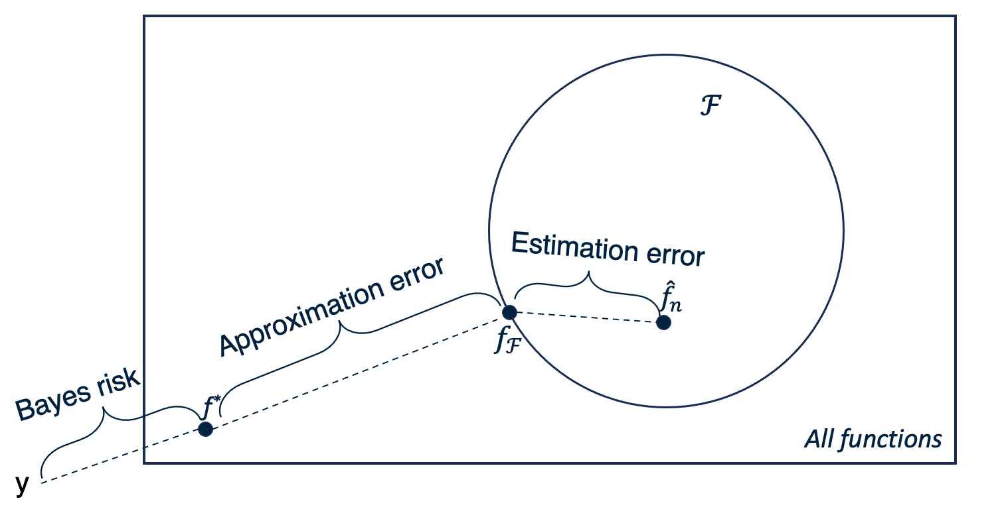
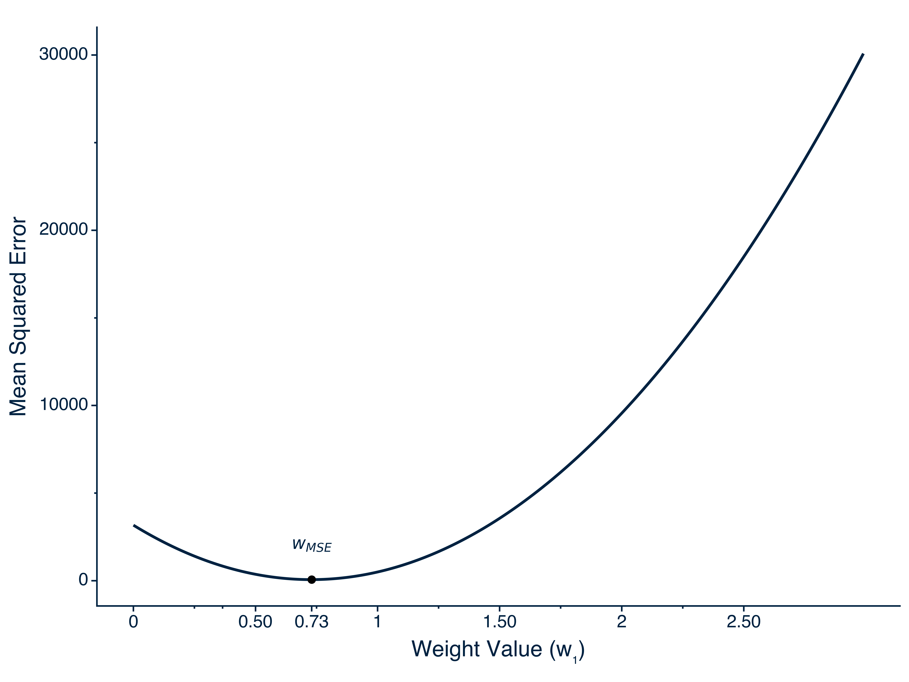
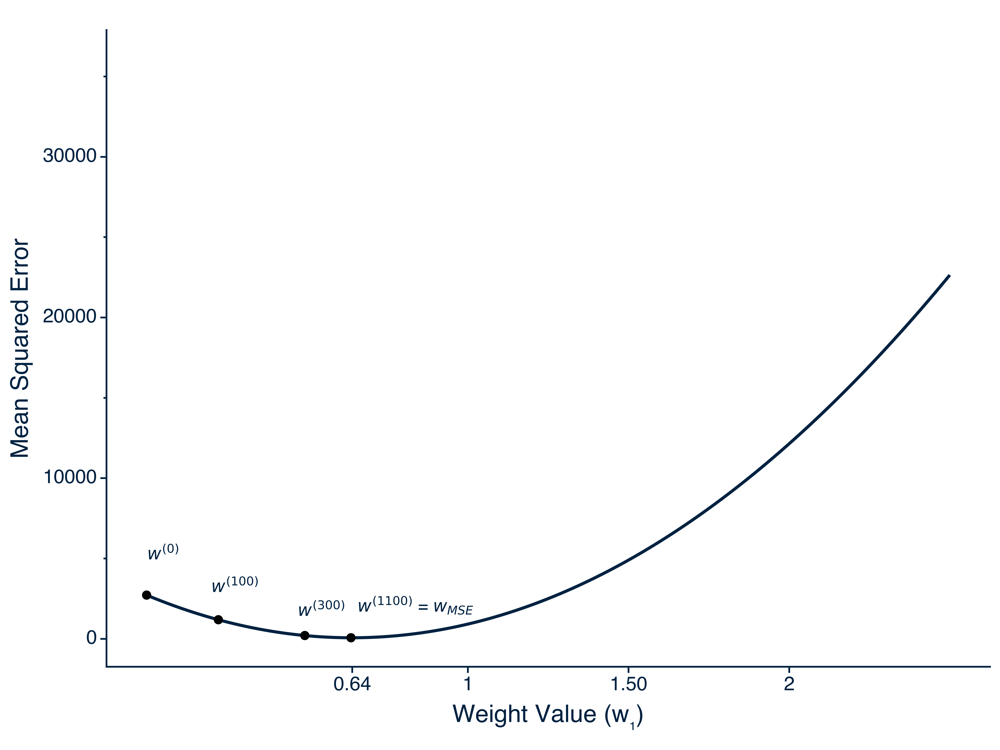
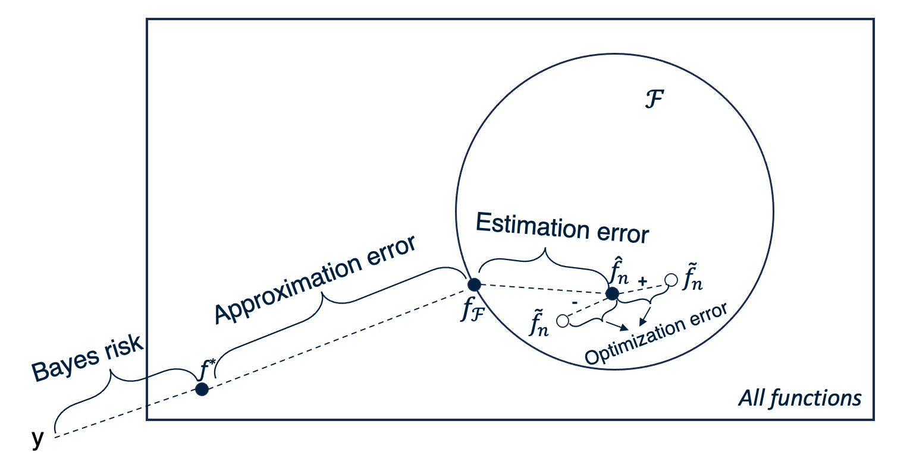
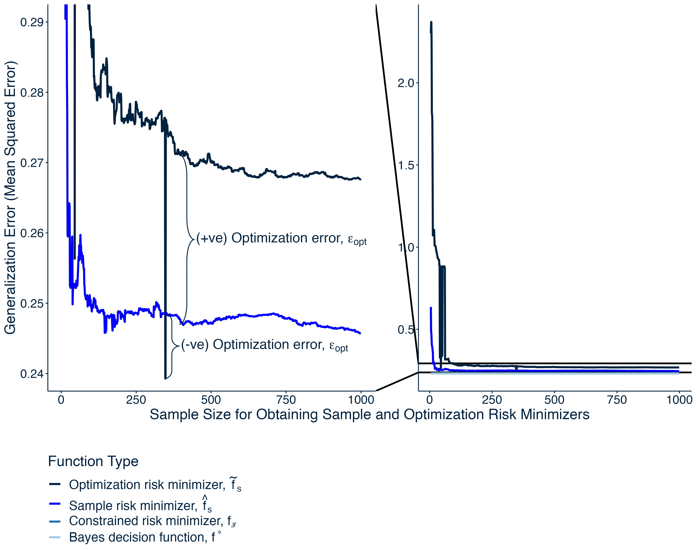
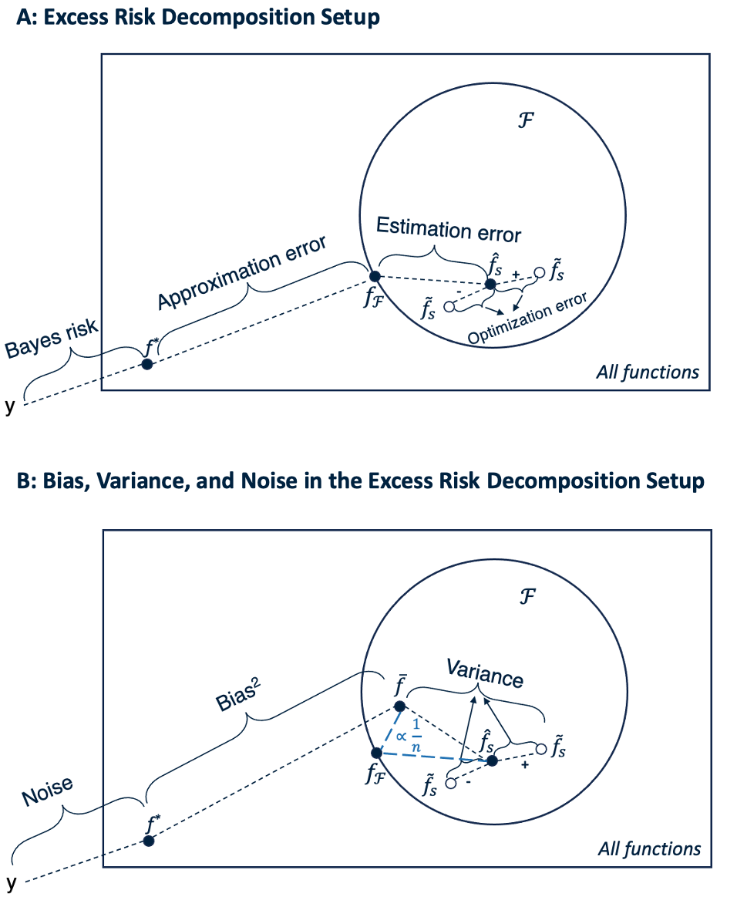

---
title: "The Game of Supervised Machine Learning: Understanding the Setup, Players, and Rules   " 
draft: false
summary: '' 
date: "`r format(Sys.Date(), '%Y-%m-%d')`"
article_type: technical
output:
  bookdown::html_document2:
     keep_md: true
always_allow_html: true
header-includes: 
  - \usepackage{algpseudocode}
#bibFile: content/technical_content/understanding_ML/refs.json    
tags: []
---   


```{r package_loading_1, include=F}
#load packages   
library(easypackages) 
packages <- c('devtools','tidyverse', 'reticulate', 'RColorBrewer', 'ggforce', 'latex2exp', 'ggbrace')
libraries(packages)  

knitr::opts_chunk$set(comment = NA, echo = TRUE, eval = TRUE, warning = FALSE)
# knitr hook to use Hugo highlighting options
knitr::knit_hooks$set(
  source = function(x, options) {
  hlopts <- options$hlopts
    paste0(
      "```", "r ",
      if (!is.null(hlopts)) {
      paste0("{",
        glue::glue_collapse(
          glue::glue('{names(hlopts)}={hlopts}'),
          sep = ","
        ), "}"
        )
      },
      "\n", glue::glue_collapse(x, sep = "\n"), "\n```\n"
    )
  }
)

chunk_class <- function(before, options, envir) {
    class_name = options$class_name

    
    if (!is.null(before)) { 
      
        lines <- unlist(strsplit(x = before, split = "\n")) #separate lines of code at \n
        n <- length(lines)  #determines numbers of lines
        
        #if (line_numbers) { 
           res <- paste0("<pre><code class='", class_name, "'>", before, "</code></pre>")
                            
                            #paste0("<pre><code class='", class_name, "'>", before, "</code></pre>")
        #}
        
       
          
          #res <- paste0("<pre>", paste0("<span class='line-number'>", 1:n,
                            #"</span><code class ='", class_name, "'>", lines, "</code>"), "</pre>")
    }
        return(res)
    
}

knitr::knit_hooks$set(output = chunk_class, preserve = TRUE)

#knitr::knit_hooks$set(output = function(x, options) { 
#  paste(c("<pre><code class = 'r-code'>",
#        gsub('^## Error', '**Error**', x),
#        '</pre></code>'), collapse = '\n')
#})

options(reticulate.autocomplete = TRUE)


#create and use conda environment
#conda_create(envname = 'blog_posts',  python_version = '3.10.11')
use_condaenv(condaenv = 'blog_posts')

#install packages in conda environment
py_packages <- c('numpy', 'pandas', 'scikit-learn', "plotnine", "statsmodels")
#conda_install(envname = 'blog_posts', packages = "trun_mvnt") 
#install_tensorflow(method = 'conda', envname = 'blog_posts')#can take long time (~10 minutes)
#useful for checking what packages are loaded
#py_list_packages(envname = 'blog_posts', type = 'conda')

#pandoc content/coding_tricks/em_demo/refs.bib -t csljson -o content/coding_tricks/em_demo/refs.json
```

Two points require mentioning before beginning this demonstration post on the expectation-maximization (EM) algorithm. First, given that this post focuses on providing demonstrations of the EM algorithm, any readers seeking a deeper understanding of this algorithm can consult my technical post on the [EM algorithm](https://sebastiansciarra.com/technical_content/em/). Second, Python and R code are used throughout this post such that objects created in Python are brought into R for plotting. To use Python and R interchangeably, I use the `reticulate` package made for R and create a conda environment to use Python (see lines <a href="#1">1--12</a> below).


```{r python-r-setup, eval=F, echo=T} 
library(reticulate)

#create and use conda environment
conda_create(envname = 'blog_posts',  python_version = '3.10.11')
use_condaenv(condaenv = 'blog_posts')

#install packages in conda environment
py_packages <- c('numpy', 'pandas', 'scipy')
conda_install(envname = 'blog_posts', packages = py_packages)

#useful for checking what packages are loaded
py_list_packages(envname = 'blog_posts', type = 'conda')
```


I use the following Python modules for this whitepaper. Note that I download the `trun_mvnt` Python module from GitHub. 

```{bash, engine = 'bash',  echo=T, eval=T, results = 'hide', hlopts=list( language = 'bash')}
git clone https://github.com/ralphma1203/trun_mvnt.git
```

```{python modules, echo=T, eval=T,  class_name = 'python-code', hlopts=list(language = 'python')}
from trun_mvnt import trun_mvnt as tvm
import numpy as np
import pandas as pd
import sklearn
import scipy
from sklearn.metrics import mean_squared_error
import statsmodels.formula.api as smf
from functools import partial
import plotnine as pt
import concurrent.futures
```

```{bash, engine = 'bash',  echo=F, eval=T, hlopts=list( language = 'bash')}
rm -r trun_mvnt
```

# Introduction 

In supervised machine learning, the goal is to predict. Whether the focus is to predict churn rates (among employes and/or customers), regions with high potential for growth, or something as innocuous as fruit fly behaviour, supervised machine learning can be used to solve these problems. Although a near endless number of models can be deployed to predict a given outcome, it is important that data scientists not rely on trial and error to find effective models and, instead, make purposeful decisions. To do so, it important that that data scientists understand the game of machine learning. 

To explain the game of supervised machine learning, I will do so in six parts. First, I will provide a necessary background by presenting a formal model of learning. Second, I will provide a general framework for understanding the game of supervised machine learning. Third, I will introduce the 'players' (i.e., bias, variance, and noise) of supervised machine learning by decomposing squared error. Fourth, I will explain the behaviours of bias, variance, and noise by presenting the bias-variance tradeoff. Fifth, I will explain the rules of supervised machine learning and how to succeed, Sixth, and last, I will provide an overview of situations where the rules of supervised machine learning cannot be applied. 

# A Formal Model of Learning 

To provide the context of supervised machine learning, I begin with a formal model of learning and present it in three parts. First, I will present the learning context. Second, I will present the learning model. Third, and last, I will present the selection of models. 

## Learning Context

In this section, I will present the learning context. Consider an example where a tourist arrives in a new country and wants to learn how to identify a good wine without opening the bottle. Given her experience with wine, she decides to use two features: 1) the weather that occurred for the particular year the wine was produced and 2) the winemaking quality. Both features are ranked on a 1--10 scale (where 1 indicates poor weather/winemaking quality and 10 indicates excellent weather/winemaking quality). To determine the effectiveness of this approach, she decides to taste the wines of several vineyards and, for each wine, rate the quality of the weather during the year, the winemaking quality, and then taste each wine and provide a rating (1--10 scale). After collecting the data, the tourist plans to take a subset of the data to train her models. In more formal terms, there are two components that would be considered as learning inputs: 

1) *Feature space* ($\mathbf{X}$): the set of features used for prediction. In the current example, the features of weather ($\mathbf{x}_1$) and winemaking quality ($\mathbf{x}_2$) for each wine are stored in a matrix, $\mathbf{X} = \[\mathbf{x}_1, \mathbf{x}_2\]$, with each row being an observation such that $\mathbf{x} = {x_1, x_2}$. Mathematically, we can represent the feature space as $\mathbf{X} = \[1, 10\]^2$. 
2) *Outcome space* ($\mathbf{Y}$): the set of variables being predicted. Because there is only one outcome variable of the wine quality ratings, the outcome space is simply a vector, $\mathbf{y}_1$. Given that wine quality ratings range from 1 to 10, the outcome space can be represented as $\mathbf{Y} = \[1, 10\]$. 

Together, the feature and outcome spaces comprise the data collected by the tourist such that, for each $m$ wine, there is a feature vector/outcome pair, $\mathbf{x}_m, y_m$.

Importantly, the tourist does not and never assumes *realizability*: That the features of weather and winemaking quality completely predict wine quality ratings. Instead, she assumes that, for a given pair of weather and winemaking quality values, there is a distribution of plausible wine ratings, which introduces stochasticity (randomness). Dropping the realizability assumption in the current example is certainly intuitive. Wine quality is affected by many factors outside of weather and winemaking quality such as soil quality, altitude, and age of the vines. Importantly, even if the tourist were to collect data for all the variables that affect wine quality, realizability (i.e., a one-to-one mapping between the predictors and and the outcome) would not occur because of the aforementioned stochasticity (randomness) and measurement error.[^1]

[^1]: Although measurement error is unlikely with directly observable variables (or manifest variables) such as altitude, measurement error is likely be incurred when measuring a variable such as winemaking quality because it is not directly observable; it is a latent variable that must be approximated using indicators (e.g., cleanliness of winemaking procedure, treatment of grapes, winemaker's motives, etc.). 

To reflect the uncertainty that follows from dropping realizability (also known as *agnostic learning*), the tourist assumes a joint distribution over the feature and outcome spaces. In contrast to the realizability setting where there is a one-to-one mapping function between the feature and outcome spaces, $f: \mathbf{X} \rightarrow \mathbf{Y}$, a probabilistic relation between the feature and outcome spaces is specified. Specifically, I assume a joint distribution over the feature and outcome spaces, $\mathcal{D}(\mathbf{X}, \mathbf{Y})$, such that a distribution of possible outcomes exists for any given set of feature values, $\mathcal{D}((x, y)|x)$. By conceptualizing the feature-outcome space as probabilistic, the tourist can account for measurement error and stochasticity. 


## Learning Model 

With a setup for the learning context, I will present a learning model. Revisiting the wine assessment example, the tourist has now returned from the vineyards and recorded information on each $n$ wine regarding the weather ($x_1$), winemaking quality ($x_2$), and quality of the wine ($y$). The tourist then takes a large subset of the data for training models and uses weather and winemaking quality to predict wine quality. To evaluate her models, she decides to use the mean squared error loss such that 

$$
\begin{align} 
MSE &= \frac{\sum^n_{i=1}\big(f(\mathbf{x}_i) - y_i\big)^2}{n} = \frac{\sum^n\_{i=1} \ell \ \big(f(\mathbf{x}_i), y_i\big)^2}{n}
\label{eq:mean-sq-error}
\end{align} 
$$

where $n$ is the number of observations/sample size in the data set and $i$ is an individual observation. Under ideal circumstances, the tourist would know the joint distribution underlying the feature and outcome spaces, $D(\mathbf{X}, \mathbf{Y})$, to obtain an unbiased estimate of the *generalization/true error* or *risk* of a function: The error on unseen data. Obtaining the generalization error is important because it indicates how well a model will perform when deployed. If the tourist knows the joint distribution, then the generalization error can be computed as the expected squared loss such that 

$$
\begin{align} 
L_{\mathcal{D}}(f) = \mathbb{E}\[\ell \ \big(f(\mathbf{x}), y\big)^2\],
\end{align} 
$$

where $L_D(f)$ is the loss of $f$ with respect to the joint distribution, $\mathcal{D}$. Unfortunately, because the joint distribution is seldom known in practice, generalization error cannot be directly computed. 

Although generalization is not directly computable, one solution is to compute loss on a collected. By using a sample of collected data, the strong law of large numbers indicates that, as the number of observations approaches infinity, the loss obtained on the sample data will approach the generalization error (see Equation \ref{eq:gen-error-approx}):

$$
\begin{align}
\lim_{n \rightarrow \infty} \frac{\sum\_{i=1}^n (f(\mathbf{x}_i) - y_i)^2}{n} &= L\_{\mathcal{D}}(f). 
\end{align}
$$

Therefore, to obtain an approximation of the generalization error, loss can be computed on a sample, which is often called the *empirical loss* and represented as 

$$
\begin{align} 
L_S(f) = \frac{\sum_{i=1}^n\big(f(\mathbf{x}_i) - y_i\big)^2}{n}.
\label{eq:training-loss}
\end{align} 
$$

It should be noted that a minimum sample size is required for the empirical loss to estimate the generalization error within some margin of error. This minimum sample size depends on several factors such as the complexity of the class of functions being used (or hypothesis class), obtaining a bad sample that leads to a generalization error above a certain amount, and the probability of obtaining a bad sample (for detailed explanations, see [this course](https://www.youtube.com/watch?v=b5NlRg8SjZg&list=PLPW2keNyw-usgvmR7FTQ3ZRjfLs5jT4BO) on the theory of machine learning).  

## Model Selection

Because the empirical loss provides an approximation of the general loss, one strategy for finding the function with the lowest generalization error, $f^\ast$, is to find the function with the lowest empirical loss. This approach of finding the function with the lowest empirical loss is often called *empirical risk minimization*. Mathematically, empirical risk minimization can be represented as 

$$
\begin{align}
f^\ast &= \underset{f}{\arg\min} \ Ls(f), 
\label{eq:erm}
\end{align}
$$

where $f^\ast$ is function in the set of all possible functions, $f$, that obtains the lowest empirical loss. 

Two points deserve mention with respect to $f^\ast$. First, it is often called the *empirical risk minimizer* because it obtains the lowest empirical loss. Second, in the current example, because empirical risk minimization occurs over the set of all possible functions, $f^*$, then the best possible function will inevitably exist in this set. The best possible function (i.e., the function with the lowest generalization error) is often called the *Bayes decision function*. Because we assume agnostic learning (i.e., that no function can perfectly predict the outcome), the Bayes decision function will have nonzero loss, which is often called the *Bayes risk*.


# Excess Risk Decomposition: A Setup for Understanding Supervised Machine Learning

In the sections that follow, I will provide a general framework or setup for understanding how three types of error inevitably emerge in the formal model of supervised learning presented above. This framework is often called excess risk decomposition (Bousquet ...) because the errors occur in addition to the Bayes risk. For a lecture on excess risk decomposition, see [Bloomberg - Lecture 5](https://www.youtube.com/watch?time_continue=1472&v=YA_CE9jat4I&embeds_referring_euri=https%3A%2F%2Fbloomberg.github.io%2F&source_ve_path=MjM4NTE&feature=emb_title). Excess risk can be represented mathematically as shown below in Equation \ref{eq:excess-risk}:

$$
\begin{align}
\text{Excess risk } = \epsilon_{app} + \epsilon_{est} + \epsilon_{opt}, 
\label{eq:excess-risk}
\end{align}
$$
where $\epsilon_{app}$ represents approximation error, $\epsilon_{est}$ represents estimation error, and  $\epsilon_{opt}$ represents optimization error. 

In the sections that follow, I will explain each type of error and provide Python code to simulate it. Importantly, before explaining each type of error, a data set is first required. Therefore, I first will first provide an overview of the data generation procedure for the wine assessment example. 

## Preamble: Data Generation Procedure{#data-generation}

In the wine assessment example, there two features and one outcome. For the features, the tourist collected data on weather and winemaking quality and computed composite scores for each feature on a 1--10 scale. For the outcome, the tourist tasted each wine and similarly calculated composite scores for wine quality on a 1--10 scale (1 indicates a poor wine and 10 indicates an excellent wine). To simulate these data, I will assume agnostic learning and, therefore, use a joint distribution over the feature and outcome spaces, with the features of weather ($\mathbf{x}_1$) and winemaking quality ($\mathbf{x}_2$) being normally distributed such that

$$
\begin{spreadlines}{0.5em}
\begin{align*}
\mathbf{X} &= \[\mathbf{x}_1, \mathbf{x}_2\] \sim \mathcal{N}(\mu, \Sigma) \cdot \mathbb{I}(\mathbf{x}_1, \mathbf{x}_2 \in \[1, 10\]), \\\\
\mu &= \[5, 7\] \text{ and} \\\\
\sigma &= \[1.2, 1.4\] \\\\
\end{align*}
\end{spreadlines}
$$

with the covariance matrix

$$
\begin{spreadlines}{0.5em}
\begin{align*}
\rho_{x_1, x_2} &= .35  \text{ and} \\\\
\Sigma &= \begin{bmatrix} 
\sigma^2_1  & \rho_{x_1, x_2}\sigma_1\sigma_2 \\\\
\rho_{x_1, x_2}\sigma_1\sigma_2 & \sigma^2_2
\end{bmatrix}.
\end{align*}
\end{spreadlines}
$$

Note that a truncated normal distribution was used to generate data for the features such that all the values for each feature fell between 1 and 10 (inclusive). To generate the outcome values for wine quality, I used the regression equation shown below in Equation \ref{eq:outcome-generate}:

$$
\begin{spreadlines}{0.5em}
\begin{align}
\mathbf{y} &= \mathbf{Xw} + \mathbf{e}, \text { where}
\label{eq:outcome-generate} \\\\
\mathbf{X} &= \[\mathbf{x}_1, \mathbf{x}_2, \mathbf{x}_1^2, \mathbf{x}_2^2, \mathbf{x}_1\mathbf{x}_2\], \nonumber \\\\
\mathbf{w} &= \[0.3 ,  0.1 ,  0.07, -0.1 ,  0.1\], \text{ and} \nonumber \\\\
\mathbf{e} &\sim \mathcal{N}(\mu = 0, \sigma = 1.5). \nonumber 
\end{align}
\end{spreadlines}
$$

Because Equation \ref{eq:outcome-generate} produced outcome values that were not scaled within a 1--10 range, I used min-max normalization formula shown below in Equation \ref{eq:rescale} to scale the outcome values of wine quality within a 1--10 range such that 

$$
\begin{align}
\mathbf{y}_{scaled} = a + \frac{(\mathbf{y} - \min(\mathbf{y}))(b-a)}{\max(\mathbf{y})-\min(\mathbf{y})}
\label{eq:rescale},
\end{align}
$$

where $a$ indicates the new lower limit (i.e., 1), $b$ indicates the new upper limit (i.e., 10), $\min(y)$ indicates the old lower limit, and $\max(y)$ indicates the old upper limit. To compute the old lower limit, I used the lowest possible value for $\mathbf{x}_1$ and the highest possible value for $\mathbf{x}_2$ of 10, which, in turn, set the values for the polynomial features ($\mathbf{x}^2_1, \mathbf{x}^2_2$) and interaction feature ($\mathbf{x}_1\mathbf{x}_2$). I then subtracted an error value that corresponded to three standard deviations below the mean, yielding the following computation for the old lower limit in Equation \ref{eq:old-lower-limit}:

$$
\begin{spreadlines}{0.5em}
\begin{align}
\text{Old lower limit } &= \mathbf{w}^\top \[1, 10, 1, 100, 10] - 3(1.5) 
\label{eq:old-lower-limit} \\\\
&=-12.13. \nonumber
\end{align}
\end{spreadlines}
$$

To compute the old upper limit, I used the highest possible values for $\mathbf{x}_1$ and $\mathbf{x}_2$ of 10, which, in turn, set the values for the polynomial features ($\mathbf{x}^2_1, \mathbf{x}^2_2$) and interaction feature ($\mathbf{x}_1\mathbf{x}_2$). I then added an error value that corresponded to three standard deviations above the mean, yielding the following computation for the old upper limit in Equation \ref{eq:old-upper-limit}:

$$
\begin{spreadlines}{0.5em}
\begin{align}
\text{Old lower limit } &= \mathbf{w}^\top \[10, 10, 10, 100, 100] + 3(1.5) 
\label{eq:old-upper-limit} \\\\
&=15.50. \nonumber
\end{align}
\end{spreadlines}
$$

With the outcome variable of wine quality being scaled, the population regression coefficients can also be scaled by first computing a scaling factor (Equation \ref{eq:scaling}) and then multiplying the old regression weights by the scaling factor (Equation \ref{eq:scaled-weights}).

$$
\begin{spreadlines}{0.5em}
\begin{align}
\text{Scaling factor} &= \frac{\text{New scale range}}{\text{Old scale range}} 
\label{eq:scaling} \\\\
&= \frac{10 - 1}{15.50 - (-12.13)}  \nonumber \\\\
&=  0.33 \nonumber \\\\
\mathbf{w}_{scaled} &= \mathbf{w}(0.33)  
\label{eq:scaled-weights} \\\\
&= [0.10, 0.03, 0.02, -0.03,  0.03] \label{eq:scaled-values}
\end{align}
\end{spreadlines}
$$

Lastly, the new scaled intercept value can be computed by first computing the mean of each feature in $\bar{\mathbf{X}}$, taking the weighted sum of the rescaled weights and mean of each feature, $ \mathbf{w}_{scaled}^\top\bar{\mathbf{X}}$, and then subtracting this value from the mean outcome value, $\bar{\mathbf{y}}$ (see Equation \ref{eq:scaled-intercept}). 

$$
\begin{align}
\text{intercept}_{ scaled} &= \bar{\mathbf{y}} - \mathbf{w}^\top\_{scaled} \bar{\mathbf{X}}
\label{eq:scaled-intercept}
\end{align}
$$

To generate the feature data, I first copied the `trun_mvnt` module from GitHub and installed it in my current project directory using the below Bash code. 

```{bash, engine = 'bash',  eval=F, hlopts=list( language = 'bash')}
git clone https://github.com/ralphma1203/trun_mvnt.git
```

The Python code block below (lines <a href="#2">2--108</a>) defines the functions that generate the data for the wine example such that there are two features (`weather`, `winemaking_quality`) and one outcome variable (`wine_quality`). The outcome variable is created using Equation \ref{eq:outcome-generate} and then scaled using Equation \ref{eq:rescale}. 

```{python data-generation-functions, echo=T, eval=T,  class_name = 'python-code', hlopts=list(language = 'python')}
def compute_rescaling_factor(new_upper_limit = 10, new_lower_limit = 1):
  
  old_lower_limit = np.dot(a = provide_weights(), b = np.array([1, 10, 1, 100, 10])) - 3*(1.5)
  old_upper_limit = np.dot(a = provide_weights(),b = np.array([10, 10, 100, 100, 100])) + 3*(1.5)
  
  #formula components 
  new_scale_range = new_upper_limit - new_lower_limit
  old_scale_range = old_upper_limit - old_lower_limit
  
  rescaling_factor = new_scale_range / (old_upper_limit - old_lower_limit)
  
  return(rescaling_factor)


def rescale_outcome_variable(data, new_lower_limit = 1, new_upper_limit = 10):
  
  #scale outcome variable to a 1--10 scale 
  '''old_lower_limit: assume smallest scores for features with positive weights and largest scores for 
  features with negative weights'''
  '''old_upper_limit: assume largest scores for features with positive weights and smallest scores for 
  features with negative weights'''
  ##assume highest/lowest possible error scores are +-4 SDs 
  ##reminder: population function = ax + by + cx^2 + dy^2 + e(xy) + error
  old_lower_limit = np.dot(a = provide_weights(), b = np.array([1, 10, 1, 100, 10])) - 3*(1.5)
  old_upper_limit = np.dot(a = provide_weights(), b = np.array([10, 10, 100, 100, 100])) + 3*(1.5)
  
  #formula components 
  lower_limit_center = (data["wine_quality"] - old_lower_limit) 
  new_scale_range = new_upper_limit - new_lower_limit
  old_scale_range = old_upper_limit - old_lower_limit
  
  data["wine_quality"] = pd.DataFrame(data = 1 + (lower_limit_center * new_scale_range)/old_scale_range, 
                                                  columns = ["wine_quality"])
                                                  
  return data


def compute_outcome_variable(data):
  
  # Feature columns
  #feature_cols = pd.concat(objs=[data, np.sin(data["weather"]), data["winemaking_quality"]**2, 
  #data.prod(axis=1)], axis=1)
  feature_cols = pd.concat(objs=[data, data**2, data.prod(axis=1)], axis=1)
  
  # Error 
  error = np.random.normal(loc=0, scale=1.5, size=data.shape[0])
  
  # Compute outcome variable of wine quality
  data["wine_quality"] =  np.dot(a=feature_cols, b=provide_weights()) + error
  
  return data


def provide_weights():
  
  b_weight_weather = 0.3
  b_weight_winemaking = 0.1
  b_weight_weather_squared = 0.07
  b_weight_winemaking_squared = -0.1
  b_weight_weather_winemaking = 0.1

  weights = np.array([b_weight_weather, b_weight_winemaking, 
                      b_weight_weather_squared, b_weight_winemaking_squared, b_weight_weather_winemaking])
             
  return weights


def generate_trunc_predictors(mu, sd, cov_matrix, sample_size, 
                              lower_limits = 1, upper_limits = 10, seed = 27):
  
  # Upper and lower limits for variables
  lower_limits = np.repeat(lower_limits, len(mu))
  upper_limits = np.repeat(upper_limits, len(mu))

  # Generate samples from multivariate distribution
  sample_size = int(sample_size)
  D = np.diag(np.ones(len(mu)))
  np.random.seed(seed)

  truncated_data = pd.DataFrame(tvm.rtmvn(n=sample_size, Mean=mu, Sigma=cov_matrix,
                                                lower=lower_limits, upper=upper_limits, D=D),
                                columns=["weather", "winemaking_quality"])

  return truncated_data


def create_covariance_matrix(sd, rho):
  
  #diagonal 
  diagonal = np.square(sd)

  # Create a lower triangular matrix with zeros
  n = len(mu)
  cov_matrix = np.zeros((n, n))

  #Fill lower and upper triangles of covariance matrix 
  cov_matrix[np.tril_indices(n, -1)] = rho_weather_winemaking * np.prod(sd)
  cov_matrix = cov_matrix + cov_matrix.T

  #Fill diagonal of covariance matrix
  np.fill_diagonal(a = cov_matrix, val = sd)
  
  return cov_matrix


def generate_mult_trunc_normal(cov_matrix, mu, sd, rho, sample_size, seed = 27):

  #generate predictors
  data_mult_trunc_normal = generate_trunc_predictors(mu = mu, sd = sd, cov_matrix = cov_matrix, 
                                                     sample_size = sample_size, seed = seed)
                                                     
  #generate outcome variable
  data_mult_trunc_normal = compute_outcome_variable(data = data_mult_trunc_normal)
  
  #scale outcome variable
  data_mult_trunc_normal = rescale_outcome_variable(data = data_mult_trunc_normal)
  
  return(data_mult_trunc_normal)
```

The Python code block below (lines <a href="#109">109--118</a>) generates the multivariate normal normal such that all values for the features and outcome variables are truncated between values of 1 and 10. Importantly, because we are generating the data, we can adopt an omniscient approach in the winemaking example and generate one data for computing empirical loss and another data set for computing generalization error. Note that the sample size used for the generalization error is substantially larger so that generalization error can be accurately estimated.

```{python data-generation, echo=T, eval=T,  class_name = 'python-code', hlopts=list(language = 'python')}
#set the population means and SDs for weather and winemaking quality
mu = [5, 7]
sd = [1.2, 1.7]

#population correlation
rho_weather_winemaking =  0.35 
cov_matrix = create_covariance_matrix(sd = sd, rho =  rho_weather_winemaking)
emp_sample_size = 150
gen_sample_size = 1e4

#data used to compute empirical loss; note seed = 27 by default
data_emp_loss = generate_mult_trunc_normal(cov_matrix = cov_matrix, mu = mu, sd = sd, 
                                             rho = rho_weather_winemaking, sample_size = emp_sample_size)
                                             
#data used to compute generalization error 
data_gen_error = generate_mult_trunc_normal(cov_matrix = cov_matrix, mu = mu, sd = sd, 
                                             rho = rho_weather_winemaking, sample_size = gen_sample_size)
```

## Approximation Error: The Result of Having to Constrain Empirical Loss Minimization 

To obtain an approximation of a function's ability to make accurate predictions on unseen data (i.e., generalization), the strong law of large numbers indicated that, with sufficient sample size, the performance on sample data would be sufficient. As a corollary, empirical risk minimization then suggested that the best possible function could be identified by determining the function that obtained the lowest empirical loss. Unfortunately, empirical risk minimization inevitably fails when optimizing over over all possible functions. One method to prevent empirical risk minimization from failing is to constrain optimization to a set of functions. Although constraining empirical risk minimization provides a solution, it creates approximation error. 

In the section that follow, I will explain three points. First, I will explain how empirical risk minimization fails. Second, I will explain how constraining empirical risk minimization can prevent overfitting. Third, I will explain how approximation error is an inevitable outcome of constraining empirical risk minimization. 


### Overfitting: The Failure of Empirical Risk Minimization 

To recall, empirical risk minimization assumes that the function with the lowest generalization error can be identified by simply determining the function with the lowest empirical loss. Mathematically, 

$$
\begin{align}
f^* &=\underset{f}{\arg\min} \ Ls(f).
\tag{\ref{eq:erm} $\$ revisited}
\end{align}
$$

Although optimizing empirical loss over all possible functions makes theoretical sense, it is impractical for two reasons. First, doing so is computationally demanding. Second, and perhaps most important, optimizing generalization error over all possible functions will likely result in *overfitting*: When the generalization error of a function is considerably higher than its empirical loss because the function's high complexity has caused it to (over)fit sample-specific information.  

Overfitting commonly occurs as an outcome of minimizing empirical loss over a set of functions that is too complex or large. As an example of overfitting, I compute empirical loss and generalization error over the set of polynomial models up to the ninth order ($P = 9$) such that 

$$
\begin{align}
f \in \mathcal{O}:f(\mathbf{x}_i) &= \text{int} + \bigg(\sum\_{p=1}^{P} w\_{p_1} x^p\_{1_i} + w\_{p_2} x^p\_{2_i}\bigg) + \mathbb{I}\_{(P\ge 2)}\bigg(\sum\_{p=1}^{P-1}\sum\_{q=1}^{P-1} w\_{pq} x^p\_{1_i} x^q\_{2_i}\bigg),
\label{eq:all-functions}
\end{align}
$$

where $f(\mathbf{x}\_i)$ represents the predicted wine quality value for $i^{th}$ wine, which is the sum of an intercept ($\text{int}$), the weighted sum of the corresponding $i^{th}$ weather ($x_{1_i}$) and winemaking quality ($x_{2_i}$), and the weighted sum of all possible two-way corresponding interactions. Note that, in Equation \ref{eq:all-functions}, interactions are only computed if the specified polynomial order is greater than or equal to 2, $\mathbb{I}_({P \ge 2)}$. The Python code block below contains functions that compute the generalization error and empirical loss (using mean squared error; see Equation \ref{eq:mean-sq-error}) for each polynomial model with an order in the specified range. 

```{python overfitting-functions, eval=T, echo=T,  class_name = 'python-code', hlopts=list(language = 'python')}
def compute_emp_gen_error(equation, data_emp_loss, data_gen_error):
  
  model = smf.ols(data = data_emp_loss, formula = equation).fit()
  y_test = model.predict(data_gen_error)
  
  emp_loss = mean_squared_error(y_true = data_emp_loss['wine_quality'], y_pred = model.fittedvalues)
  gen_error = mean_squared_error(y_true = data_gen_error['wine_quality'], y_pred = y_test)

  return {'emp_loss': emp_loss, 
          'gen_error': gen_error}


def gen_poly_reg_eq(poly_order, include_interactions = False):
  
  #compute polynomial terms for predictors
  weather_pred = ' + '.join(['np.power(weather, {})'.format(ord_value) for ord_value in range(1, poly_order+1)])
  winemaking_quality_pred = ' + '.join(['np.power(winemaking_quality, {})'.format(ord_value) 
                            for ord_value in range(1,poly_order+1)])
                            
  # Compute all two-way interactions between weather and winemaking_quality
  if include_interactions and poly_order > 1:
    
    interaction_terms = ' + '.join(['np.multiply(np.power(weather, {}), np.power(winemaking_quality, {}))'.format(p1, p2)
                                   for p1 in range(1, poly_order)
                                   for p2 in range(1, poly_order)])
                                 
    predictors = ' + '.join([weather_pred, winemaking_quality_pred, interaction_terms])
  
  else: 
        predictors = ' + '.join([weather_pred, winemaking_quality_pred])
  
  #create regression equation
  equation = "wine_quality ~ {}".format(predictors)
  
  return equation 


def compute_all_emp_gen_errors(data_emp_loss, data_gen_error, poly_order_range, include_interactions = False):

  #create all polynomial equations within the desired range
  gen_poly_reg_eq_partial = partial(gen_poly_reg_eq, include_interactions = include_interactions)
  
  poly_equations = list(map(gen_poly_reg_eq_partial, poly_order_range))
  
  #create partial version of function with data_emp_loss and data_gen_error fixed
  emp_gen_error_partial = partial(compute_emp_gen_error, data_emp_loss = data_emp_loss, 
                                     data_gen_error = data_gen_error)
                                     
  #for each polynomial equation, compute empirical loss and generalization error
  all_emp_gen_errors = list(map(emp_gen_error_partial,  poly_equations))
  
  #convert dictionnary to dataframe and then compute polynomial orders by using row indexes
  df_emp_gen_errors = pd.DataFrame(all_emp_gen_errors)
  poly_orders = pd.Series([poly_order for poly_order in poly_order_range], name = "poly_order")
  
  #concatenate poly_orders and dataframe to create complete dataframe
  df_emp_gen_errors = pd.concat([poly_orders, df_emp_gen_errors], axis = 1)
  
  return df_emp_gen_errors
```

If empirical risk minimization is followed, then the function with the highest polynomial order would be chosen as the function with the lowest generalization error. Figure \ref{fig:emp-loss} shows that empirical loss decreases almost linearly as polynomial order increases. The Python code block below computes and plots empirical loss for each polynomial model up to the ninth order. 

```{python erm, eval=F, echo=T,  class_name = 'python-code', hlopts=list(language = 'python')}
#data used to compute empirical loss 
data_emp_loss = generate_mult_trunc_normal(cov_matrix = cov_matrix, mu = mu, sd = sd, 
                                             rho = rho_weather_winemaking, sample_size = emp_sample_size)
                                             
#compute empirical loss and generalization error for polynomial models up to ninth order
df_emp_gen_errors = compute_all_emp_gen_errors(data_emp_loss = data_emp_loss, data_gen_error = data_gen_error,
                                           include_interactions = True, poly_order_range=range(1, 10))
  
#set inplace = False to keep gen_error in original data frame
df_emp_loss = df_emp_gen_errors.drop("gen_error", axis=1, inplace = False)

#create empirical loss plot
emp_plot_plot = (
    pt.ggplot(data = df_emp_loss, 
              mapping=pt.aes(x = "poly_order", y = "emp_loss")) + 
    pt.geom_line(size=1, color = "#9ECAE1") + 
    pt.scale_x_continuous(name = "Polynomial Order", breaks = range(1, 10)) + 
    pt.scale_y_continuous(name = "Error Value (Mean Squared Error)") + # breaks=range(0, 601, 100)) + 
    pt.theme_classic(base_family = 'Helvetica', base_size = 14) + 
    pt.theme(text = pt.element_text(color = "#002241"), 
             axis_line = pt.element_line(color = "#002241"),
             axis_ticks = pt.element_line(color = "#002241"), 
             axis_text = pt.element_text(color = "#002241"))
)
        
#save as .png
emp_plot_plot.save("images/plot_emp_loss.png", width = 8, height = 6, dpi = 1000)
```

<div class="figure">
  <div class="figDivLabel">
    <caption>
      <span class = 'figLabel'>Figure \ref{fig:emp-loss}<span> 
    </caption>
  </div>
   <div class="figTitle">
    <span>Empirical Loss as Function of Polynomial Order</span>
  </div>
     
  
  <div class="figNote">
  <span><em>Note. </em>Empirical loss decreases almost linearly as a function of polynomial order. Note that mean squared error is used as the error metric (see Equation \ref{eq:mean-sq-error}) and polynomial models are constructed using Equation \ref{eq:all-functions}.</span> 
  </div>
</div>

If generalization error is examined, however, then the conclusion of empirical risk minimization to use the highest-order polynomial model results in a highly undesirable outcome. Figure \ref{fig:overfit-plot} shows that, while empirical loss decreases as model's polynomial order increases, generalization error suddenly increases exponentially after the seventh polynomial order. Specifically, while empirical loss remains below 1 across all polynomial orders, the generalization error goes from a value of approximately 7.11 at the seventh polynomial order to a value of approximately 823.25 at the ninth polynomial order. Thus, although the most complex polynomial model results in the lowest empirical loss, it results in the highest generalization error, and so would perform the worst if used to make predictions on new data. The Python code block below computes and plots the empirical loss and generalization error for each polynomial model up to the ninth order.


```{python erm-failure, eval=F, echo=T,  class_name = 'python-code', hlopts=list(language = 'python')}
#convert to long format
df_emp_gen_errors_long = df_emp_gen_errors.melt(id_vars = "poly_order", 
                                                value_vars = ['emp_loss', 'gen_error'], 
                                                var_name = "error_type", 
                                                value_name = "error_value")

# Define color palette for each error type
color_palette = {'emp_loss': '#9ECAE1', 'gen_error': '#002241'}

overfitting_plot = (
    pt.ggplot(data = df_emp_gen_errors_long, 
              mapping=pt.aes(x = "poly_order", y = "error_value", 
                             factor = "error_type", color = "error_type")) + 
    pt.geom_line(size=1) + 
    pt.scale_x_continuous(name = "Polynomial Order", breaks = range(1, 10)) + 
    pt.scale_y_continuous(name = "Error Value (Mean Squared Error)") + # breaks=range(0, 601, 100)) + 
    pt.labs(color = "Error Type") + 
    pt.scale_color_manual(values = color_palette, 
                          labels = {'emp_loss': 'Empirical Loss', 'gen_error': 'Generalization Error'}) + 
    pt.theme_classic(base_family = 'Helvetica', base_size = 14) + 
    pt.theme(text = pt.element_text(color = "#002241"), 
             axis_line = pt.element_line(color = "#002241"),
             axis_ticks = pt.element_line(color = "#002241"), 
             axis_text = pt.element_text(color = "#002241"))
)
        
#save as .png
overfitting_plot.save("images/overfitting_curve.png", width = 8, height = 6, dpi = 1000)
```

<div class="figure">
  <div class="figDivLabel">
    <caption>
      <span class = 'figLabel'>Figure \ref{fig:overfit-plot}<span> 
    </caption>
  </div>
   <div class="figTitle">
    <span>Depiction of Positive Relation Between Overfitting and Model Complexity</span>
  </div>
     
  
  <div class="figNote">
  <span><em>Note. </em>The dark blue line indicates the generalization error and the light blue line indicates the empirical loss. The empirical loss becomes considerably greater than the generalization error (i.e., overfitting) at a polynomial order of eight. Specifically, while empirical loss remains below 1 across all polynomial orders, the generalization error goes from a value of approximately 7.11 at the seventh polynomial order to a value of approximately 823.25 at the ninth polynomial order. Note that mean squared error is used as the error metric (see Equation \ref{eq:mean-sq-error}) and polynomial models are constructed using Equation \ref{eq:all-functions}. </span> 
  </div>
</div>

Given that the previous example showed how overfitting occurred with just a subset of complex functions, it then becomes apparent that overfitting is inevitable if all functions. Overfitting presents a serious issue to practitioners because it can lead to the use of models that make highly inaccurate predictions and cause organizations to incur severe costs. Fortunately, the occurence overfitting can be reduced by modifying the method of empirical risk minimization.


### Reducing the Chance of Overfitting: Constrained Empirical Risk Minimization{#constrained-erm}

Although overfitting is inevitable when all possible functions are considered, it is conceivable that a function with low generalization error can still be found if only a subset of functions are considered. By restricting the set of function over which to optimize empirical loss, it may be possible to largely prevent overfitting. This approach of restricting the set of functions over which to optimize empirical loss is known as  *constrained empirical risk minimization* and can be represented mathematically as

$$
\begin{align}
f_\mathcal{F} =  \underset{\mathcal{f \in F}}{\arg \min} \ L_s(f), 
\end{align}
$$

where $\mathcal{F}$ represents the constrained set of functions.

Returning to the wine example, the tourist may have knowledge that allows her to constrain the set of functions over which to optimize empirical loss. Specifically, she will only consider polynomial functions up to the fifth order and omit the two-way interaction terms because of how introduce complexity in an exponential way with respect polynomial order; that is, they grow exponentially in number as a function of polynomial order. Thus, the restricted set of functions over which the tourist will optimize empirical loss is 


$$
\begin{align}
f \in \mathcal{F}:f(\mathbf{x}_i) &= \text{int} + \bigg(\sum\_{p=1}^{P} w\_{p_1} x^p\_{1_i} + w\_{p_2} x^p\_{2_i}\bigg),
\label{eq:constrained-functions}
\end{align}
$$

where $P = 5$. Figure \ref{fig:constrained-erm} below shows the empirical loss and generalization error as a function of polynomial order with constrained empirical risk minimization (see Python clode block below for corresponding code). Across all polynomial orders, empirical loss provides a close approximation of generalization error. Thus, the tourist has prevented the occurrence of overfitting by implementing constrained risk minimization. As an aside, a proof of the learning success of constrained empirical risk minimization can be found in [Section 2.3.1](https://www.cs.huji.ac.il/~shais/UnderstandingMachineLearning/understanding-machine-learning-theory-algorithms.pdf#page=94) of Shalev-Schwartz and Ben-David (2004). 

```{python constrained-erm, eval=F, echo=T,  class_name = 'python-code', hlopts=list(language = 'python')}
#compute empirical loss and generalization error for polynomial models up to fifth order
df_emp_gen_errors = compute_all_emp_gen_errors(data_emp_loss = data_emp_loss, 
                                               data_gen_error = data_gen_error,
                                               include_interactions = False, 
                                               poly_order_range=range(1, 6))

#convert to long format
df_emp_gen_errors_long = df_emp_gen_errors.melt(id_vars = "poly_order", 
                                                value_vars = ['emp_loss', 'gen_error'], 
                                                var_name = "error_type", 
                                                value_name = "error_value")

# Define color palette for each error type
color_palette = {'emp_loss': '#9ECAE1', 'gen_error': '#002241'}

contrained_erm_plot = (
    pt.ggplot(data = df_emp_gen_errors_long, 
              mapping=pt.aes(x = "poly_order", y = "error_value", 
                             factor = "error_type", color = "error_type")) + 
    pt.geom_line(size=1) + 
    pt.scale_x_continuous(name = "Polynomial Order", breaks = range(1, 10)) + 
    pt.scale_y_continuous(name = "Error Value (Mean Squared Error)") + # breaks=range(0, 601, 100)) + 
    pt.labs(color = "Error Type") + 
    pt.scale_color_manual(values = color_palette, 
                          labels = {'emp_loss': 'Empirical Loss', 'gen_error': 'Generalization Error'}) + 
    pt.theme_classic(base_family = 'Helvetica', base_size = 14) + 
    pt.theme(text = pt.element_text(color = "#002241"), 
             axis_line = pt.element_line(color = "#002241"),
             axis_ticks = pt.element_line(color = "#002241"), 
             axis_text = pt.element_text(color = "#002241"))
)
        
#save as .png
contrained_erm_plot.save("images/constrained_erm_plot.png", width = 8, height = 6, dpi = 1000)
```

<div class="figure">
  <div class="figDivLabel">
    <caption>
      <span class = 'figLabel'>Figure \ref{fig:constrained-erm}<span> 
    </caption>
  </div>
   <div class="figTitle">
    <span>Empirical Loss and Generalization Error When Using Constrained Empirical Risk Minimization</span>
  </div>
     
  
  <div class="figNote">
  <span><em>Note. </em>The dark blue line indicates the generalization error and the light blue line indicates the empirical loss.  Across all polynomial orders, empirical loss provides a close approximation of generalization error. Note that mean squared error is used as the error metric (see Equation \ref{eq:mean-sq-error}) and polynomial models are constructed from Equation \ref{eq:constrained-functions}. </span> 
  </div>
</div>

In using constrained empirical risk minimization, the tourist can select the empirical risk minimizer and accurately predict wine quality for unseen data. With constrained empirical risk minimization optimization, an upper limit is placed on the complexity of functions, and, to the extent that complexity is limited, the incidence of overfitting will be reduced. As an aside, other methods such as regularized regression (for a review, see) and bagging (see [here](https://towardsdatascience.com/ensemble-methods-bagging-boosting-and-stacking-c9214a10a205)) can be used to combat overfitting. Although constrained empirical risk minimization appears is a solution, it is by no means a perfect solution, as will be discussed in the next section.


#### Model Selection in Practice: Train, Validate, and Test{#model-practice}

Before proceeding to discuss the limitations of constrained empirical risk minimization, a discussion regarding model selection in practice is apropos. Up to this point, I used two data sets to compute empirical loss and generalization error, with the data set for generalization error being considerably large in order to obtain an accurate estimate. Given that I generated the data with Python functions, I could easily use two different data sets for computing empirical loss and generalization error. Unfortunately, the privilege of generating data with functions does exist in practice: Data must be collected and are, therefore, finite. 

Although data are finite in practice, practitioners still want to accomplish three goals of developing models, comparing them, and then estimating how well the best model performs on unseen data (i.e., generalization error). Models that perform the best on unseen data are chosen for deployment. Importantly, practitioners must prevent overfitting in accomplishing each goal. To do so, they split the data into the following three parts:

1) *Training set*: data used to develop models and obtain parameter estimates. 
2) *Validation set*: data used to obtain estimate of each model's generalization error so that models can be compared. Because validation data is new (with respect to the training data), overfitting is unlikely, and so the model that obtains the lowest validation error is assumed to be the best model. 
3) *Test set*: data serves as a last check that the best model identified using the validation set is indeed the best model. Because many models may be compared using the validation set, it is conceivable that one model may outperform all the other ones by overfitting on patterns/noise specific to the validation set. To ensure this is not the case, empirical loss is computed on the test set. 

Three points deserve mention with respect to model selection in practice. First, more refined approaches exist for model selection such as cross validation (see [Section 7.10](https://hastie.su.domains/Papers/ESLII.pdf#page=260) in Haste et al. (2017)) and [bagging](https://medium.com/towards-data-science/ensemble-methods-bagging-boosting-and-stacking-c9214a10a205). Second, the way in which data are trained, validated, and tested should resemble how the model will be used after deployment. For example, if a model will be used to make predictions one month into the future, it should be trained, validated, and tested such that training data do not include data points within one month of when predictions will be made. Third, deciding the sample size of each set is an important decision, and a good dicussion on this issue can be found [here](https://stackoverflow.com/questions/13610074/is-there-a-rule-of-thumb-for-how-to-divide-a-dataset-into-training-and-validatio). 

### The Irreducible Error That Results From Constrained Empirical Risk Minimization: Approximation Error

Although constrained empirical risk minimization reduces the incidence of overfitting, it is not without its limitations. By constraining the set of functions over which to optimize empirical loss, it is unlikely that the best possible function (i.e., Bayes decision function) will exist in the constrained set. Figure \ref{fig:approx-error} depicts the set of all functions and the constrained set of functions, $\mathcal{F}$. Although the Bayes decision function, $f^\ast$, exists in the set of all functions, it does not exist in the constrained set of functions. Thus, even the the best function in the constrained set of functions, $f_\mathcal{F}$---which I call the *constrained empirical risk minimizer*---will have a generalization error greater than that of the Bayes decision function, with the difference between the two functions constituting *approximation error* (see Equation \ref{eq:approx-error} below). 

$$
\begin{align}
\text{Approximation error }\hspace{0.25cm} (\epsilon_{app}) \hspace{0.25cm} &=  L_D(f_{\mathcal{F}}) - L_D(f^\ast) 
\label{eq:approx-error}
\end{align}
$$
Moreover, in looking at Figure \ref{fig:approx-error}, it is also apparent that approximation error increases to the extent that empirical risk minimization is constrained. As empirical minimization is constrained, the generalization error of the constrained empirical risk minimizer ($\mathcal{F}$) will increase, causing approximation error to increase.

<div class="figure">
  <div class="figDivLabel">
    <caption>
      <span class = 'figLabel'>Figure \ref{fig:approx-error}<span> 
    </caption>
  </div>
   <div class="figTitle">
    <span>Constrained Empirical Risk Minimization Results in Approximation Error</span>
  </div>
     
  
  <div class="figNote">
  <span><em>Note. </em>The Bayes decision function, $f^\ast$, has a non-zero generalization error (Bayes risk) because agnostic learning is assumed (i.e., a probabilistic relation between features and outcomes).  Because the Bayes decision function does not exist in the constrained set of functions, $\mathcal{F}$, the best function in the constrained set of functions, $f_\mathcal{F}$, will have a generalization error greater than that of the Bayes decision function, with the difference between the two functions constituting approximation error (see Equation \ref{eq:approx-error}).</span> 
  </div>
</div>

Returning to the wine example with the tourist, approximation error can be obtained by calculating the difference between the Bayes decision function and the constrained empirical risk minimizer. Beginning with the Bayes decision function, the scaled population regression weights from Equation \ref{eq:scaled-values} can be used to compute predictions. The difference between the predictions and actual wine quality values are used to compute the Bayes risk (or generalization error of the Bayes decision function). Ending with the constrained empirical risk minimizer, Figure \ref{fig:constrained-erm} indicated that the polynomial function with order of two resulted in the lowest generalization error. The Python code block below constructs a function for computing the Bayes risk. 


```{python bayes-decision, eval=T, echo=T,  class_name = 'python-code', hlopts=list(language = 'python')}
def compute_bayes_features(data): 
  
  #Feature columns
  predictors = data[["weather", "winemaking_quality"]]
  bayes_features = pd.concat(objs=[predictors, predictors**2, predictors.prod(axis=1)], axis=1)
  
  return bayes_features


def compute_bayes_intercept(data):
  
  bayes_features = compute_bayes_features(data = data)
 
  # Intercept 
  intercept = np.mean(data["wine_quality"]) - np.sum(provide_weights() * compute_rescaling_factor() *
  np.mean(bayes_features, axis=0))
  
  return intercept
  

def compute_bayes_risk(data):
  
  bayes_features = compute_bayes_features(data = data)
  
  #Compute intercept
  intercept = compute_bayes_intercept(data = data)

  #Compute predictions for wine quality
  test_pred = intercept + np.dot(a= bayes_features, b=provide_weights() * compute_rescaling_factor())
  
  # Compute mean squared error
  bayes_risk = mean_squared_error(y_true = data['wine_quality'], y_pred = test_pred)
  
  return bayes_risk
```

The Python code block below computes the approximation error by calculating the difference between the Bayes risk and the generalization error of the constrained empirical risk minimizer. Note that I generated another large data set to obtain a close approximation of the best possible function in the constrained set (i.e., get the best possible parameter estimates for the second-order polynomial model with no interactions).

```{python approximation-error, echo=T, eval=T,  class_name = 'python-code', results = 'hold', hlopts=list(language = 'python')}
best_in_class_sample_size = 1e4

#use large data set to obtain a close approximation of the best possible estimates for the second-order 
#polynomial model (without interactions)
data_best_in_class = generate_mult_trunc_normal(cov_matrix = cov_matrix, mu = mu, sd = sd, 
                                             rho = rho_weather_winemaking, sample_size = best_in_class_sample_size, seed=7)
                                             
#Bayes risk 
bayes_risk = compute_bayes_risk(data = data_gen_error)

#compute empirical loss and generalization error for polynomial models up to fifth order
constrained_erm = compute_all_emp_gen_errors(data_emp_loss = data_best_in_class, 
                                             data_gen_error = data_gen_error,
                                             include_interactions = False, 
                                             poly_order_range=range(2, 3))
                                             
#compute approximation error
approx_error = constrained_erm["gen_error"][0] - bayes_risk

print('Approximation error:', np.round(a = approx_error, decimals = 5))
```

To show approximation error, I plot the Bayes decision function and the constrained empirical risk minimizer below in Figure \ref{fig:epp-error}. The left hand plot represents a magnified version of the right hand plot between the y-axis values of .243 and .244. The difference in generalization error between the Bayes decision function ($f^\ast$, light blue line) and the constrained empirical risk minimizer ($\hat{f}\_\mathcal{F}$; medium blue line) constitutes approximation error (see Equation \ref{eq:app-error}). Importantly, both functions do not vary across the x-axis because the x-axis represents the sample size used for model development, and both functions' generalization errors are not affected by the sample size used for model development. The R code block below (lines...) contains the code for creating Figure \ref{fig:app-error}. 


<div class="figure">
  <div class="figDivLabel">
    <caption>
      <span class = 'figLabel'>Figure \ref{fig:app-error}<span> 
    </caption>
  </div>
   <div class="figTitle">
    <span>Depiction of Approximation Error: The Difference in Generalization Error Between the Bayes Decision Function and the Constrained Empirical Risk Minimizer</span>
  </div>
     
  
  <div class="figNote">
  <span><em>Note. </em>The left hand plot represents a magnified version of the right hand plot between the y-axis values of .243 and .244. The difference in generalization error between the Bayes decision function ($f^\ast$, light blue line) and the constrained empirical risk minimizer ($\hat{f}\_\mathcal{F}$; medium blue line) constitutes approximation error (see Equation \ref{eq:app-error}). Importantly, both functions do not vary across the x-axis because the x-axis represents the sample size used for model development, and both functions' generalization errors are not affected by the sample size used for model development.</span> 
  </div>
</div>

```{r approx-error-plot,  echo=T, eval=F}
#create long version of df_est_error where function (bayes, constrained minimizer, or sample minimizer) is a
#categorical variable
df_app_error <- data.frame("sample_size" = 5:1000, 
                           "bayes_risk" =  py$bayes_risk, 
                           "constr_min" = py$constrained_erm$gen_error)

df_app_error_long <- df_app_error %>%
  pivot_longer(cols = "bayes_risk":"constr_min", names_to = "function_type", values_to = "gen_error",
               names_ptypes = factor())

df_app_error_long$function_type <- factor(x = df_app_error_long$function_type, 
                                          levels = c("constr_min", "bayes_risk"))
                                                   

labels <- c(TeX('Constrained risk minimizer, $f_\u2131$'), 
            TeX('Bayes decision function, $f^*$'))


line_color <-  setNames(c("#2171B5", "#9ECAE1"), levels(df_app_error_long$function_type))

#create data set for braces that show estimation and approximation error. 
##see https://stackoverflow.com/questions/45221783/ggforce-facet-zoom-labels-only-on-zoomed-example
data_brace_app_error <- data.frame("x" = c(250, 300), 
                                   "y" = c(py$constrained_erm$gen_error, py$bayes_risk), 
                                   "zoom" = T)

label_app_error <- "Approximation error, $\\epsilon_{app}$"

app_error_plot <- ggplot(data = df_app_error_long, mapping = aes(x = sample_size, y = gen_error, 
                                               group = function_type, 
                                               color = function_type)) + 
 geom_line(linewidth = 1.2) +
 scale_color_manual(name = "Function Type", values = line_color, labels = labels)  +
 labs(x = "Sample Size for Model Development", 
      y = "Generalization Error (Mean Squared Error)", 
      color = "Function Type") +
  scale_y_continuous(limits = c(0.243, 0.248)) +
  facet_zoom(ylim = c(0.243, .244),  zoom.size = 1.2, zoom.data = zoom)  +
  
 #approximation error brace
 geom_brace(inherit.aes = F, data = data_brace_app_error, 
            mapping = aes(x = x, y = y,  label=TeX(label_app_error, output="character")), 
             color = '#002241', labelsize = 6, rotate = 90, labeldistance = 5, 
            parse = T) + 
  
  theme_classic(base_family = "Helvetica") + 
  theme(legend.text.align = 0, #left align text
        legend.text = element_text(size = 14),
        legend.title = element_text(size = 15), 
        axis.title  = element_text(size = 15), 
        axis.text = element_text(size = 14, color = "#002241"), 
        text = element_text(color = "#002241"),,
        axis.line = element_line(color = "#002241"), 
        axis.ticks = element_line(color =  "#002241")) 

ggsave(plot = app_error_plot, filename = 'images/app_error_plot.png', width = 12, height = 6, dpi = 1000)
```

## Estimation Error: The Result of Having Limited Amount of Data

In constraining empirical risk minimization, the empirical risk minimizer is only guaranteed to be found to the extent that sample size is large. Given that large sample sizes cannot always be obtained in practice, then the empirical risk minimizer, $f_\mathcal{F}$, is unlikely to be obtained. Instead, analyzing the obtained sample will result in some imperfect estimation of $f_\mathcal{F}$, which I will call the *sample risk minimizer* and denote as $\hat{f}\_n$. Figure \ref{fig:est-error-concept} below shows that, as a result of having a limited sample size, the sample risk minimizer, $\hat{f}\_n$, results in a generalization error that is greater than that of the constrained empirical risk minimizer, $f_\mathcal{F}$. The extent to which the generalization error of the sample risk minimizer is greater than that of the constrained empirical risk minimizer is often called *estimation error*, and is represented below in Equation \ref{eq:est-error}:

$$
\begin{align}
\text{Estimation error}\hspace{0.25cm} (\epsilon_{est})  \hspace{0.25cm} &=  L_D(\hat{f}_n) - L_D(f\_{\mathcal{F}}) \\label{eq:est-error}
\end{align}
$$

<div class="figure">
  <div class="figDivLabel">
    <caption>
      <span class = 'figLabel'>Figure \ref{fig:est-error-concept}<span> 
    </caption>
  </div>
   <div class="figTitle">
    <span>Constrained Empirical Risk Minimization Results in Approximation Error</span>
  </div>
     
  
  <div class="figNote">
 <span><em>Note. </em>The Bayes decision function, $f^\ast$, has a non-zero generalization error (Bayes risk) because agnostic learning is assumed (i.e., a probabilistic relation between features and outcomes).  Because the Bayes decision function does not exist in the constrained set of functions, $\mathcal{F}$, the best function in the constrained set of functions, $f_\mathcal{F}$, will have a generalization error greater than that of the Bayes decision function, with the difference between the two functions constituting approximation error (see Equation \ref{eq:approx-error}). Unfortunately, $f_\mathcal{F}$, can only be obtained to the extent that a very large data exists. Because practitioners often have limited data, only an estimated version of $f_\mathcal{F}$ will be obtained, $\hat{f}_n$, which I call the sample risk minimizer. Because the sample risk is an imperfect estimate of $f_\mathcal{F}$, it will necessarily have greater generalization error that is called estimation error.</span> 
  </div>
</div>


Returning to the wine example, Figure \ref{fig:est-error} below shows that, with limited sample size, the sample risk minimizer will always have greater generalization error than the constrained empirical risk minimizer. Note that the left hand plot represents a magnified version of the right hand plot between the y-axis values of .243 and .2475. The difference in generalization error between the sample risk minimizer ($\hat{f}_n$, blue line) and the constrained empirical risk minimizer ($\hat{f}\_\mathcal{F}$; medium blue line) constitutes estimation error (see Equation \ref{eq:est-error}). The difference in generalization error between the constrained empirical risk minimizer ($\hat{f}\_\mathcal{F}$; medium blue line) and the Bayes decision function constitutes approximation error (see Equation \ref{eq:approx-error}). Importantly, the x-axis only represents the sample size used to obtain the sample risk minimizer ($\hat{f}_n$); recall that the constrained empirical risk minimizer ($\hat{f}_n$, blue line) was obtained with a very large data set (technically, an infinitely large data) and the Bayes decision function ($f^\ast$) represents the true data-generating function.  


<div class="figure">
  <div class="figDivLabel">
    <caption>
      <span class = 'figLabel'>Figure \ref{fig:est-error}<span> 
    </caption>
  </div>
   <div class="figTitle">
    <span>Generalization Error of Sample Risk Minimizer, $L_D(\hat{F}_n)$, is Always Greater Than That of Constrained Empirical Risk Minimizer, $f_\mathcal{F}$</span>
  </div>
     
  
  <div class="figNote">
  <span><em>Note. </em>The left hand plot represents a zoomed version of the right hand plot between the y-axis values of .243 and .2475. The difference in generalization error between the sample risk minimizer ($\hat{f}_n$, blue line) and the constrained empirical risk minimizer ($\hat{f}_\mathcal{F}$; medium blue line) constitutes estimation error (see Equation \ref{eq:est-error}). The difference in generalization error between the constrained empirical risk minimizer ($\hat{f}_\mathcal{F}$; medium blue line) and the Bayes decision function constitutes approximation error (see Equation \ref{eq:approx-error}). Importantly, the x-axis only represents the sample size used to obtain the sample risk minimizer ($\hat{f}_n$); recall that the constrained empirical risk minimizer ($\hat{f}_n$, blue line) was obtained with a very large data set (technically, an infinitely large data) and the Bayes decision function ($f^\ast$) represents the true data-generating function. </span> 
  </div>
</div>


To construct Figure \ref{fig:est-error} above, I followed three steps. First, I used a large data set (`data_best_in_class`) to identify the constrained empirical risk minimizer, $f\_\mathcal{F}$, from the (constrained) set of functions defined in Equation \ref{eq:constrained-functions} (see Python code block above). Briefly, only polynomial functions up to the fifth order of weather and winemaking quality were allowed to predict wine quality in the constrained set of functions. Second, to obtain each sample risk minimizer, $\hat{f}_n$, I sampled data (without replacement) from the same large data set used to obtain the constrained empirical risk minimizer and then extracted the lowest generalization error value from the function in the constrained set (see Equation \ref{eq:constrained-functions} and Python code block below).[^3] Third, I computed the Bayes risk, $L_D(f^\ast)$. Importantly, to obtain an accurate estimation of each function's generalization error, I was computed mean squared error on another large data set (`data_gen_error`). The R code block below (lines ...) contains the code for creating Figure \ref{fig:est-error}. 
 
[^3]: The astute reader might notice that I eschewed the method of empirical risk minimization in selecting the sample risk minimizer, $\hat{f}_n$. That is, instead of picking the polynomial function that resulted in the lowest empirical loss, I picked the polynomial function with the lowest generalization error. Two reasons exist for why I used the the function with the lowest generalization error as the sample risk minimizer. First, doing so provides a stronger demonstration that the generalization error of the sample risk minimizer is alwasy greater than or equal to the constrained empirical risk minimizer, $f\_{\mathcal{F}}$. Second, using the function with the lowest generalization error aligns more closely with how models are selected in practice (see sectoin on [Model Selection in Practice](#model-practice)). 

```{python estimation-error,  echo=T, eval=F,  class_name = 'python-code', results = 'hold', hlopts=list(language = 'python')}
def compute_sample_risk_gen_error(sample_size, data_best_in_class , data_gen_error, 
                                  poly_order_range=range(1, 6)): 
  
  # Use random_state to ensure reproducibility and prevent resampling from adding noise to estimates
  gen_errors = compute_all_emp_gen_errors(data_emp_loss = data_best_in_class.sample(n=sample_size, random_state=27),
                                          data_gen_error = data_gen_error,
                                          include_interactions = False,
                                          poly_order_range = poly_order_range)['gen_error']
                                          
  # Return generalization error of sample risk minimizer
  return gen_errors.min()


# Fix the arguments except for sample_size and then use map to vectorize over sample size values
compute_sample_risk_gen_error_partial = functools.partial(compute_sample_risk_gen_error,
                                                          data_best_in_class = data_best_in_class,
                                                          data_gen_error = data_gen_error,
                                                          poly_order_range = range(1, 5))

# Call the partial function with est_sample_sizes
est_sample_sizes = range(5, 1000)
est_gen_errors = list(map(compute_sample_risk_gen_error_partial, est_sample_sizes))

#Create data frame
pd_est_error = pd.DataFrame({"sample_size": np.array(est_sample_sizes), 
                             "sample_risk_gen_error": est_gen_errors})
                             
#Create .csv file
pd_est_error.to_csv("est_error_.csv")
```


```{r est-error-plot,  echo=T, eval=F}
#load in dataset
df_est_error <- read_csv(file = "est_error.csv")

#create long version of df_est_error where function (bayes, constrained minimizer, or sample minimizer) is a
#categorical variable
df_est_error["bayes_risk"] <- py$bayes_risk
df_est_error["constr_min"] <- py$constrained_erm$gen_error

df_est_error_long <- df_est_error %>%
  pivot_longer(cols = "sample_risk_gen_error":"constr_min", names_to = "function_type", values_to = "gen_error",
               names_ptypes = factor())

df_est_error_long$function_type <- factor(x = df_est_error_long$function_type, 
                                          levels = c("sample_risk_gen_error", "constr_min", "bayes_risk"))
                                                   

labels <- c(TeX('Sample risk minimizer, $\\hat{f}_n$'),
            TeX('Constrained risk minimizer, $f_\u2131$'), 
            TeX('Bayes decision function, $f^*$'))


line_color <-  setNames(c("blue", "#2171B5", "#9ECAE1"), levels(df_est_error_long$function_type))

#create data set for braces that show estimation and approximation error. 
##see https://stackoverflow.com/questions/45221783/ggforce-facet-zoom-labels-only-on-zoomed-example
brace_x_start <- which.min(df_est_error$sample_risk_gen_error[1:250]) #find minimum value in first 250 values
brace_x_end <- brace_x_start + 50

data_brace_est_error <- data.frame("x" = c(brace_x_start, brace_x_end), 
                                   "y" = c(df_est_error$sample_risk_gen_error[brace_x_start], 
                                           py$constrained_erm$gen_error), 
                                   "zoom" = T)
                                   
label_est_error <- "Estimation error, $\\epsilon_{est}$"

est_error_plot <- ggplot(data = df_est_error_long, mapping = aes(x = sample_size, y = gen_error, 
                                               group = function_type, 
                                               color = function_type)) + 
 geom_line(linewidth = 1.2) +
 scale_color_manual(name = "Function Type", values = line_color, labels = labels)  +
  labs(x = "Sample Size for Obtaining Sample Risk Minimizer", y = "Generalization Error (Mean Squared Error)", 
       color = "Function Type") +
  facet_zoom(ylim = c(0.243, .2475),  zoom.size = 1.2, zoom.data = zoom)  +
  
 #estimation error brace
 geom_brace(inherit.aes = F, data = data_brace_est_error,
            mapping = aes(x = x, y = y,  label=TeX(label_est_error, output="character")), 
             color = '#002241', labelsize = 6, rotate = 90, labeldistance = 5, 
            parse=T) + 
  
  theme_classic(base_family = "Helvetica") + 
  theme(legend.text.align = 0, #left align text
        legend.text = element_text(size = 16),
        legend.title = element_text(size = 18), 
        axis.title  = element_text(size = 18), 
        axis.text = element_text(size = 15, color = "#002241"), 
        text = element_text(color = "#002241"),,
        axis.line = element_line(color = "#002241"), 
        axis.ticks = element_line(color =  "#002241")) 

ggsave(plot = est_error_plot, filename = 'images/est_error_plot.png', width = 12, height = 6, dpi = 1000)
```


## Optimization Error: The Result of Imperfect Optimization

To understand optimization error, I will first provide brief overviews of two topics. First, I will describe the typical way of obtaining regression weights (i.e., using closed-form solutions). Second, I will provide an overview of gradient descent and how, given enough iterations, it can be used to arrive at the weights obtained with the closed-form solution. After explaining these two topics, I will show how optimization error can be introduced by using an insufficient number of iterations in the gradient descent algorithm.  

### A Brief Review of Using Closed-Form Solutions to Obtain Regression Weights

Returning to our wine example, the tourist wanted to use weather and winemaking quality to predict wine quality. Together, weather ($\mathbf{x}_1$) and winemaking quality ($\mathbf{x}_2$) constituted the set of features, $\mathbf{X} = \[\mathbf{x}_1^\top, \mathbf{x}_2^\top\]$, with wine quality representing the outcome vector, $\mathbf{y}$. Thus, using $\mathbf{X}$, the tourist wanted to compute predicted values for wine quality such that 

$$
\begin{align}
\hat{\mathbf{y}} = \mathbf{Xw}.
\end{align}
$$

To determine the accuracy of predictions for wine quality, the tourist uses the mean squared error such that 

$$
\begin{align}
\ell_{MSE} = \frac{1}{n} \lVert \mathbf{y} - \mathbf{Xw} \rVert^2_2.
\label{eq:mse-matrix}
\end{align}
$$

Note that Equation \ref{eq:mse-matrix} is simply a matrix version of the scalar mean squared error function presented in Equation\ref{eq:mean-sq-error}. To obtain accurate predictions for wine quality, the tourist decides to find some set of weights that minimizes the mean squared error. Mathematically, 

$$
\begin{align}
\mathbf{w}_{MSE} &= \underset{\mathbf{w}}{\arg\min} \ \frac{1}{n} \lVert \mathbf{y} - \mathbf{Xw} \rVert^2_2 \nonumber \\\\ 
&=  \underset{\mathbf{w}}{\arg\min}  \ \frac{1}{n} (\mathbf{y} - \mathbf{Xw})^\top (\mathbf{y} - \mathbf{Xw}) \nonumber \\\\ 
&=  \underset{\mathbf{w}}{\arg\min}  \ \frac{1}{n} (\mathbf{y}^\top\mathbf{y} - 2\mathbf{w}^\top\mathbf{X}^\top\mathbf{y} + \mathbf{w}^\top\mathbf{X}^\top\mathbf{X}\mathbf{w}).
\end{align}
$$

To find $\mathbf{w}_{MSE}$, it can be solved for after computing the gradient of the mean squared error with respect to $\mathbf{w}$ and setting it to zero (see below).[^2] Note that I provide Equation \ref{eq:grad-resid} because it shows how the gradient is positively related to the size of the residual (i.e., $\mathbf{y} - \mathbf{Xw}$). 

[^2]: Note that, for the formula of $\mathbf{w}\_{MSE}$ in Equation \ref{eq:weight-mse-min} to be computable, the columns of $\mathbf{X}$ must be linearly independent. Linear independence guarantees that $(\mathbf{X}^\top\mathbf{X})^{-1}$ exists and that $\mathbf{w}\_{MSE}$ is the best solution. For a more detailed explanation see, [Lecture 5 - Gradient Descent and Least Squares](https://uchicago.hosted.panopto.com/Panopto/Pages/Viewer.aspx?id=bbd55a27-0fa6-4855-85f2-adbf01393f3a). Note that, although the lecture uses the sum of squares as the loss function, the conclusions obtained in this paper are identical to those obtained with mean squared error. 

$$
\begin{align}
\nabla_\mathbf{w} MSE &= \frac{\partial\ MSE}{\partial \ \mathbf{w}} = \frac{1}{n} \frac{\partial}{\partial \ \mathbf{w}} \bigg(\mathbf{y}^\top\mathbf{y} - 2\mathbf{w}^\top\mathbf{X}^\top\mathbf{y} + \mathbf{w}^\top\mathbf{X}^\top\mathbf{X}\mathbf{w}\bigg) \nonumber \\\\ 
&=\frac{1}{n}\bigg(0 - 2\mathbf{X}^\top\mathbf{y} + 2\mathbf{X}^\top\mathbf{X}\mathbf{w}\bigg) \nonumber \\\\ 
 &= \frac{1}{n} \bigg(2\mathbf{X}^\top(\underbrace{\mathbf{Xw} - \mathbf{y}}\_{\text{Residual}})\bigg)
 \label{eq:grad-resid} \\\\
\text{Set } \ \nabla_\mathbf{w}  MSE &= 0 \nonumber \\\\ 
0 &= - 2\mathbf{X}^\top\mathbf{y} + 2\mathbf{X}^\top\mathbf{X}\mathbf{w} \nonumber \\\\
\mathbf{X}^\top\mathbf{y} &= \mathbf{X}^\top\mathbf{X}\mathbf{w} \nonumber \\\\
\mathbf{w}_{MSE} &= (\mathbf{X}^\top\mathbf{X})^{-1}\mathbf{X}^\top\mathbf{y}
\label{eq:weight-mse-min}
\end{align} 
$$

To show that $\mathbf{w}\_{MSE}$ does indeed contain the set of weights that minimizes the mean squared error, I will first compute $\mathbf{w}\_{MSE}$ using Equation \ref{eq:weight-mse-min} and then show that it indeed minimizes the mean squared error. Beginning with the computation of $\mathbf{w}_{MSE}$, I compute it using the wine data set I generated in the section on [Data Generation](#data-generation) (see the Python code block between lines ..., which I repeat below). 

```{python data-gen-repeat, echo=T, eval=T,  class_name = 'python-code', results = 'hold', hlopts=list(language = 'python')}
#set the population means and SDs for weather and winemaking quality
mu = [5, 7]
sd = [1.2, 1.7]

#population correlation
rho_weather_winemaking =  0.35 
cov_matrix = create_covariance_matrix(sd = sd, rho =  rho_weather_winemaking)
emp_sample_size = 225
gen_sample_size = 1e4

#data used to compute empirical loss; note seed = 27 by default
data_emp_loss = generate_mult_trunc_normal(cov_matrix = cov_matrix, mu = mu, sd = sd, 
                                             rho = rho_weather_winemaking, sample_size = emp_sample_size)
```  

The Python code block below computes $\mathbf{w}_{MSE}$ and finds that 

$$
\begin{align}
\mathbf{w}_{MSE} &= \[0.73,  1.06, -0.01, -0.10\]
\label{eq:mse-min}
\end{align}
$$

```{python  w-mse-solution, echo=T, eval=T,  class_name = 'python-code', results = 'hold', hlopts=list(language = 'python')}
def extract_feature_outcome_data(data, sample_size = 10, sample_data = False, poly_order = 2):
  
  if sample_data: 
    data = data.sample(n = sample_size, random_state=27)
  
  #gather necessary components for matrix-matrix multiplications 
  original_features = data[["weather", "winemaking_quality"]]
  features = pd.concat(objs = [original_features**order for order in range(1, poly_order + 1)], axis = 1).to_numpy()
  
  outcome = data[["wine_quality"]].to_numpy()
  
  return {"features": features, 
          "outcome": outcome}


def compute_weight_min_MSE(data, poly_order = 2):
  
  #gather necessary components for matrix-matrix multiplications 
  dict_data = extract_feature_outcome_data(data = data, poly_order = poly_order)
  features = dict_data["features"]
  outcome = dict_data["outcome"]
  
  #compute w_MSE = 
  w_mse = np.linalg.inv(np.transpose(features).dot(features)).dot(np.transpose(features)).dot(outcome)
  
  return w_mse.ravel()


w_mse = compute_weight_min_MSE(data = data_emp_loss)

print("Best weights:", np.round(a = w_mse, decimals = 2))
```


Ending with the visualization of $\mathbf{w}_{MSE}$, I now show that it indeed results in the lowest mean squared error value. To construct a more palatable visualization of the mean squared error (i.e., using two dimensions), I only allow the first weight to vary ($w_1$) and fix the values of the remaining three weights. Thus, the x-axis shows the values for the first weight and the y-axis represents the mean squared error value. I construct this plot using the Python code block below and show it in Figure \ref{fig:mse-plot}. When the first regression weight value ($w_1$) is 0.73, the lowest mean squared error value is obtained, and this matches with the result in Equation \ref{eq:mse-min} of using the closed-form solution in Equation \ref{eq:weight-mse-min}.

 
```{python  w-mse-figure, echo=T, eval=F,  class_name = 'python-code', results = 'hold', hlopts=list(language = 'python')}
def compute_ind_MSE(data, w_guess, poly_order = 2):
 
  #gather necessary components for matrix-matrix multiplications 
  dict_data = extract_feature_outcome_data(data = data, poly_order = poly_order)
  features = dict_data["features"]
  outcome = dict_data["outcome"]
  
  #construct vector of weights
  #in w_initial, the three weight values come from the least mean squares solution. 
  w_initial = np.array([1.05928459, -0.01280733, -0.09713313])
  w_initial =  np.insert(arr = w_initial, obj = 0, values = w_guess)
  
  #MSE = (XX)^-1Xy
  yy = np.transpose(outcome).dot(outcome)
  wXy = np.transpose(w_initial).dot(np.transpose(features)).dot(outcome)
  wXXw = np.transpose(w_initial).dot(np.transpose(features)).dot(features).dot(w_initial)
  
  mse = yy - 2*wXy + wXXw
  
  return mse 


def compute_all_MSE_loss_values(data, w_guess_list):
  
  #return flattened array
  all_mse_loss_values = np.concatenate([compute_ind_MSE(data, guess) for guess in w_guess_list]).ravel()
  
  #create dataframe with guesses and corresponding MSE values
  df_mse = pd.DataFrame({"w_guess": w_guess_list, 
                         "mse_value": all_mse_loss_values})
  
  return df_mse


df_mse_values = compute_all_MSE_loss_values(data = data_emp_loss, w_guess_list = np.arange(start = 0, stop = 3, step= 0.01))


w_mse1 = df_mse_values.iloc[np.argmin(df_mse_values["mse_value"])].to_frame().transpose()


mse_plot = (pt.ggplot(data = df_mse_values, mapping = pt.aes(x = "w_guess", y = "mse_value")) + 
  pt.geom_line(size = 1, color = "#002241") + 
  pt.geom_point(data = w_mse1, size = 2) +
  pt.scale_x_continuous(breaks = np.insert(arr = np.arange(0, 3, 0.5), obj = 0, values = 0.73))+
  pt.labs(x = "Weight Value (w₁)", y = "Mean Squared Error") + 
  pt.annotate(geom = 'text', x=w_mse1['w_guess'], y=w_mse1['mse_value'] + 2e3,
                      label="$w_{MSE}$", color="#002241") +
  pt.theme_classic(base_family = 'Helvetica', base_size = 14) + 
  pt.theme(text = pt.element_text(color = "#002241"), 
           axis_line = pt.element_line(color = "#002241"),
           axis_ticks = pt.element_line(color = "#002241")))

#save plot     
mse_plot.save("images/mse_plot.png", width = 8, height = 6, dpi = 1000)
```

<div class="figure">
  <div class="figDivLabel">
    <caption>
      <span class = 'figLabel'>Figure \ref{fig:mse-plot}<span> 
    </caption>
  </div>
   <div class="figTitle">
    <span>Mean Squared Error Value as a Function of Regression Weight Value</span>
  </div>
     
  
  <div class="figNote">
  <span><em>Note. </em>The lowest mean squared error value is obtained when the first regression weight value ($w_1$) is 0.73, which matches with the result in Equation \ref{eq:mse-min} of using the closed-form solution in Equation \ref{eq:weight-mse-min}.</span> 
  </div>
</div>

### A Brief Review of Gradient Descent 

In looking at Figure \ref{fig:mse-plot}, the best regression weight ($\mathbf{w}_{MSE}$) occurs at the trough of the mean squared error function. In the previous section, the weight value at the trough was solved for analytically by setting the gradient to zero and solving for $\mathbf{w}$ (see Equation \ref{eq:weight-mse-min}). In this section, I will arrive at the trough not through an analytical method, but by descending the mean squared error function in Figure \ref{eq:mse-plot} until the trough is reached. This method of descending a function until a trough is reached is known as *gradient descent*. Using pseudocode, I represent the gradient descent algorithm below in Algorithm \ref{alg:grad_descent}.

<pre id="grad_descent" class="pseudocode"  data-line-number=true >
    % This quicksort algorithm is extracted from Chapter 7, Introduction to Algorithms (3rd edition)
    \begin{algorithm}
    \caption{Gradient Descent}
    \begin{algorithmic}
    \REQUIRE{Function for computing loss function, $\ell_{MSE}$ (see Equation $\ref{eq:mse-matrix}$)}
    \INPUT{Initial guess for weights $\mathbf{w}^{(0)}$} 
    \PROCEDURE{gradientDescent}{$K, \epsilon, \tau$}
      \STATE{$k = 0$}
     \WHILE{$k < K$ \AND $\lVert \mathbf{w}^{(k)} - \mathbf{w}^{(k+1)} \rVert^2_2 < \epsilon$} 
     \STATE{$\mathbf{w}^{(k+1)} = \mathbf{w}^{(k)} - \tau \nabla_{\mathbf{w}}\ell_{MSE}(\mathbf{w}^{(k)})$.} 
     \STATE{$k \mathrel{+}= 1$}
     \STATE{$k \mathrel{+}= 1$}
     
      \ENDWHILE
    \ENDPROCEDURE
    \end{algorithmic}
    \end{algorithm}
</pre>


Thus, weights are updated by travelling in the negative gradient direction until either the squared norm (i.e., square of sum of squared differences) is less than than some error value ($\epsilon$) or $K$ iterations are reached. Importantly, the step size ($\tau$) controls how much we move in the negative gradient direction. Although outside the scope of the current discussion, the step size value must not be too small or too large; if too small, too much time will be needed to reach the trough and, if too large, the trough may never be reached because the algorithm will jump around too much. 

The Python code block below (lines ...) contains functions necessary for computing gradient descent. 

```{python  gradient-descent-functions, echo=T, eval=T,  class_name = 'python-code', results = 'hold', hlopts=list(language = 'python')}
def compute_gradient(features, outcome, weights, num_samples):
    # Compute predictions (Xw using current weights
    predictions = np.dot(features, weights)
    
    # Compute the error (difference between predictions and target, Xw - y)
    residuals = outcome - predictions
    
    # Compute the gradient of the cost function with respect to weights (2X(Xw - ))
    gradient = -2 * np.dot(features.T, residuals) / num_samples
    
    return gradient
    
      
def gradient_descent(data, initial_weights, learning_rate = 0.01, num_iterations = 1000, poly_order = 2, 
                     epsilon = 1e-20, expedite_algorithm = False, return_log = False):
   
    #gather necessary components for matrix-matrix multiplications 
    dict_data = extract_feature_outcome_data(data = data, poly_order = poly_order)
    features = dict_data["features"]
    outcome = dict_data["outcome"].ravel()
  
    # Initialize weights and variable that stores all weights on each iteration 
    all_weights = initial_weights #variable necessary for logging weight values after each iteration 
    weights = np.array(initial_weights)
    num_samples = len(features)
    
    iteration = 0
    diff = float('inf')  # Set an initial large value to ensure the loop runs at least once
    
    """loop proceeds until either maximum number of iterations is reaches or the difference 
    becomes less than the desired error"""
    while iteration < num_iterations and diff > epsilon:
      
      gradient = compute_gradient(features = features, outcome = outcome, 
                                  weights = weights, num_samples = num_samples)
      
      # Update weights using the gradient and learning rate
      weights -= learning_rate * gradient
      
      #if desired, I expedite the algorithm by setting all the weights except the first one to the 
      #values obtained by the closed-form solution in each iteration
      if expedite_algorithm:
         weights[1:] = compute_weight_min_MSE(data = data, poly_order = poly_order)[1:]
  
      #update iteration number and check if difference in weights is less than epsilon
      iteration += 1
      diff = np.sum(np.square(learning_rate * gradient))
      
      if return_log:
        all_weights = np.vstack(tup = (all_weights, weights))
        
        
    if return_log:
      #create dataframe
      col_names = ["{}{}".format('w', str(weight_num)) for weight_num in range(1, len(all_weights) + 1)]
      df_all_weights = pd.DataFrame(data = np.array(all_weights),
                                    columns = ['w1', 'w2', 'w3', 'w4'])
                                    
      #insert iteration number 
      df_all_weights.insert(0, "iteration_num", df_all_weights.index)
  
      return df_all_weights
    else:
      return weights
```


In Figure \ref{fig:gradient-plot}, I plot the same mean squared error function as in Figure \ref{fig:mse-plot}, but show how the gradient descent algorithm arrives at the best regression weights. After each iteration, the mean squared error value decreases because the algorithm descends the function by travelling in the negative gradient direction. After iteration 1100, the algorithm arrives at the best regression weights, $\mathbf{w}_{MSE}$. Note that the Python code block below (lines ...) contains the code for producing  Figure \ref{fig:gradient-plot}. 

<div class="figure">
  <div class="figDivLabel">
    <caption>
      <span class = 'figLabel'>Figure \ref{fig:gradient-plot}<span> 
    </caption>
  </div>
   <div class="figTitle">
    <span>Regression Weight Estimates Obtained With Gradient Descent</span>
  </div>
     
  
  <div class="figNote">
  <span><em>Note. </em>The lowest mean squared error value is obtained when the first regression weight value ($w_1$) is 0.73, which matches with the result in Equation \ref{eq:mse-min} of using the closed-form solution in Equation \ref{eq:weight-mse-min}.</span> 
  </div>
</div>

```{python  gradient-descent, echo=T, eval=F,  class_name = 'python-code', results = 'hold'}
np.random.seed(27) #ensure reproducibility
initial_weights = np.random.uniform(low = 0, high = 1, size = 3)
initial_weights = np.insert(arr = initial_weights, obj = 0, values = 0)

df_gradient_weights = gradient_descent(data = data_emp_loss, initial_weights = initial_weights,  num_iterations= 1100, learning_rate=0.0001, epsilon = 1e-20, expedite_algorithm=True, return_log=True)

#obtain MSE values that correspond to each of the weight values in each gradient descent iteration
df_gradient_weights["mse_value"] = compute_all_MSE_loss_values(data = data_emp_loss, w_guess_list = df_gradient_weights["w1"])["mse_value"]


#only extract specific rows for plotting (rows 1, 101, and 301)
df_gradient_weights_plot = df_gradient_weights.iloc[[0,100, 300, df_gradient_weights.shape[0] - 1]]

#add a column for the latex math that will be printed
df_gradient_weights_plot["latex_math"] = ["${}^{}$".format('w', '{(' + str(i) + ')}') for i in df_gradient_weights_plot["iteration_num"]]
df_gradient_weights_plot["latex_math"].iloc[-1]  = df_gradient_weights_plot["latex_math"].iloc[-1] + " = $w_{MSE}$"


gradient_plot = (pt.ggplot(data = df_mse_values, mapping = pt.aes(x = "w_guess", y = "mse_value")) + 
  pt.geom_line(size = 1, color = "#002241") + 
  pt.geom_point(size = 2, data = df_gradient_weights_plot, mapping = pt.aes(x = "w1", y = "mse_value")) + 
  pt.geom_text(data=df_gradient_weights_plot, 
               mapping=pt.aes(x = "w1", y = "mse_value", label = "latex_math"),
               nudge_y = [2.5e3, 2e3, 1.5e3, 2e3],  
               nudge_x = [0.05, 0.05, 0.05, 0.2], 
               size = 10, color = "#002241") +
  
  pt.scale_x_continuous(limits = [0, 2.5], 
                        breaks = np.insert(arr = np.arange(0, 2.50, 0.5), obj = 0, values = 0.73)) +
  pt.labs(x = "Weight Value (w₁)", y = "Mean Squared Error") + 
  pt.theme_classic(base_family = 'Helvetica', base_size = 14) + 
  pt.theme(text = pt.element_text(color = "#002241"), 
           axis_line = pt.element_line(color = "#002241"),
           axis_ticks = pt.element_line(color = "#002241")))

#save plot     
gradient_plot.save("images/gradient_plot.png", width = 8, height = 6, dpi = 1000)
```


### Creating Optimization Error by Limiting the Number of Gradient Descent Iterations

Given that the gradient descent requires many iterations to arrive at the best possible parameter estimates, the number of iterations can be limited to create optimization error. By limiting the number of gradient descent iterations, the set of obtained estimates will be less optimal than the set of estimates obtained with a closed-form solution and, therefore, result in greater generalization error. The increase in generalization error that results from using a suboptimal optimization algorithm is *optimization error*, and is represented below in Equation \ref{eq:opt-error}:

$$
\begin{align}
\text{Optimization error } \hspace{0.25cm} (\epsilon_{opt}) = L_D(\tilde{f}_n) - L_D(\hat{f}_n), 
\label{eq:opt-error}
\end{align}
$$

where $L_D(\tilde{f}_n)$ represents generalization error of the model where parameter estimates were obtained with a suboptimal optimization algorithm and $L_D(\hat{f}_n)$ represents generalization error of the sample risk minimizer. Importantly, I will call $L_D(\tilde{f}_n)$ the *optimization risk minimizer*. 

Figure \ref{fig:opt-error-diagram} provides a visual for conceptualizing optimization error. If no closed-form solution exists for computing parameter estimates, then some optimization algorithm must be used. If optimization is imperfect, it will obtain estimates that are less optimal than those obtained with the closed-form solution. These less optimal estimates introduce additional generalization error called optimization error (see Equation \ref{eq:opt-error}). Importantly, optimization error can be negative. Because the optimization algorithm descends the gradient of an empirical loss function, it is possible that, when optimization is imperfect, the suboptimal estimates actually result in model that has lower generalization error.

<div class="figure">
  <div class="figDivLabel">
    <caption>
      <span class = 'figLabel'>Figure \ref{fig:opt-error-diagram}<span> 
    </caption>
  </div>
   <div class="figTitle">
    <span>Suboptimal Optimization Results in Optimization Error</span>
  </div>
     
  
  <div class="figNote">
  <span><em>Note. </em>The Bayes decision function, $f^\ast$, exists in the set of all functions, but it does not exist in the constrained set of functions, $\mathcal{F}$. Thus, the best function in the constrained set of functions, $f_\mathcal{F}$, will have a generalization error greater than that of the Bayes decision function, with the difference between the two functions constituting approximation error (see Equation \ref{eq:approx-error} below). Unfortunately, $f_\mathcal{F}$, can only be obtained to the extent that a very large data exists. Because practitioners often have limited data, only an estimated version of $f_\mathcal{F}$ will be obtained, $\hat{f}_n$, which I call the sample risk minimizer. Because the sample risk is an imperfect estimate of $f_\mathcal{F}$, it will necessarily have greater generalization error that is called estimation error. If no closed-form solution exists for obtaining parameter estimates, optimization error will become some non-zero value. Importantly, optimization error can be negative. Because the optimization algorithm descends the gradient of an empirical loss function, it is possible that, when optimization is imperfect, the suboptimal estimates actually result in model that has lower generalization error.</span> 
  </div>
</div>

Returning to the wine example, the tourist was interested in using weather and winemaking quality to predict wine quality. To do so, the tourist decided to consider a constrained set of polynomial functions up to the fifth order where weather and winemaking quality are used to predict wine quality (see Equation \ref{eq:constrained-functions}). To compute optimization error in the current setting ($L_D(\tilde{f}_n)$), the tourist has to complete two steps. First, in accordance with model development practices (see [Model Development in Practice](#model-development)), the tourist has to determine the polynomial function with the best generalization error. Second, to obtain parameter estimates that are suboptimal relative to the closed-form estimates obtained with the sample risk minimizer ($\hat{f}_n$), the tourist uses gradient descent with a limited number of iterations. Specifically, gradient descent is used where the maximum number of iterations is 500 ($k = 500$), the learning rate is 0.005 ($\tau = 0.005$), and the error value is $1e-20$.


<pre id="grad_descent_ex" class="pseudocode"  data-line-number=true >
    \begin{algorithm}
    \caption{Limited Gradient Descent}
    \begin{algorithmic}
    \REQUIRE{Function for computing loss function, $\ell_{MSE}$ (see Equation $\ref{eq:mse-matrix}$)}
    \INPUT{Initial guess for weights $\mathbf{w}^{(0)}$, $K = 500$, $\epsilon = 1e-20$, $\tau = 0.005$} 
    \PROCEDURE{gradientDescent}{$K, \epsilon, \tau$}
      \STATE{$k = 0$}
     \WHILE{$k < K$ \AND $\lVert \mathbf{w}^{(k)} - \mathbf{w}^{(k+1)} \rVert^2_2 < \epsilon$} 
     \STATE{$\mathbf{w}^{(k+1)} = \mathbf{w}^{(k)} - \tau \nabla_{\mathbf{w}}\ell_{MSE}(\mathbf{w}^{(k)})$.} 
     \STATE{$k \mathrel{+}= 1$}
      \ENDWHILE
    \ENDPROCEDURE
    \end{algorithmic}
    \end{algorithm}
</pre>


The Python code block below (see lines ...) contains the functions needed to compute the generalization error of optimization risk minimizers. 

```{python  optimization-error-functions, echo=T, eval=F,  class_name = 'python-code', results = 'hold', hlopts=list(language = 'python')}
def determine_best_polynomial_model(data_sample, data_gen_error, 
                                     poly_order_range=range(1, 6)):
                                       
  #Use random_state to ensure reproducibility and prevent resampling from adding noise to estimates
  emp_gen_errors = compute_all_emp_gen_errors(data_emp_loss = data_sample,
                                              data_gen_error = data_gen_error,
                                              include_interactions = False,
                                              poly_order_range = poly_order_range)
  
  return emp_gen_errors
                                    

def compute_opt_gen_error(opt_weights, poly_order, data_gen_error):
  
  #gather necessary components for matrix-matrix multiplications 
  dict_data = extract_feature_outcome_data(data = data_gen_error, poly_order = poly_order)
  features = dict_data["features"]
  outcome = dict_data["outcome"].ravel()
  
  #compute predictions and generalization error
  predictions = np.dot(features, opt_weights)
  gen_error = mean_squared_error(y_true = outcome, y_pred = predictions)

  return gen_error


def get_opt_risk_min(sample_size, data_best_in_class, data_gen_error, num_iterations = 500):
  
  #Step 1: Using empirical risk minimization to determine the polynomial model order that results in the lowest 
  #empirical loss 
  data_sample = data_best_in_class.sample(n = sample_size, random_state = 27)
  df_all_emp_gen_errors = determine_best_polynomial_model(data_sample = data_sample, 
                                                          data_gen_error = data_gen_error)
  
  best_model_poly_order = df_all_emp_gen_errors["poly_order"][df_all_emp_gen_errors["gen_error"].idxmin()]

  #Step 2: Obtain regression weights for the polynomial order model by running gradient descent. 
  ##I fix learning rate to 1e-5 and number of iterations to 500
  np.random.seed(27)
  initial_weights = np.random.uniform(low = 0, high = 1, size = 2*best_model_poly_order)

  opt_weights = gradient_descent(data = data_sample, initial_weights = initial_weights, 
                                 num_iterations = num_iterations, return_log = False, learning_rate = 5e-3,
                                 poly_order = best_model_poly_order, expedite_algorithm = True)

  #Step 3: Use the number of columns in features data set to generate random guesses for regression 
  #weight starting values
  opt_gen_error = compute_opt_gen_error(opt_weights = opt_weights, poly_order = best_model_poly_order,
                                        data_gen_error = data_gen_error)
  
  return opt_gen_error
```


The Python code block below (see lines ...) computes the generalization error of optimization risk minimizers for each sample size between 5 and 1000. Because of the long processing time needed to compute all the generalization error values, I provide the data set containing these values here.  

```{python  optimization-error, echo=T, eval=F,  class_name = 'python-code', results = 'hold', hlopts=list(language = 'python')}
# Fix the arguments except for sample_size and then use map to vectorize over sample size values
get_opt_risk_min_partial = functools.partial(get_opt_risk_min,
                                                 data_best_in_class = data_best_in_class,
                                                 data_gen_error = data_gen_error)
                                                
# Call the partial function with est_sample_sizes
start_time = time.time()

opt_sample_sizes = range(5, 1000)
with concurrent.futures.ThreadPoolExecutor(max_workers = 3) as executor:
    opt_gen_errors = list(executor.map(get_opt_risk_min_partial, opt_sample_sizes))
    
end_time = time.time()
end_time - start_time #450.7537488937378

#Create data frame
df_opt_error = pd.DataFrame({"sample_size": np.array(opt_sample_sizes), 
                             "opt_gen_error": opt_gen_errors})

df_opt_error.to_csv("opt_error_fast.csv", index = False)
```


Figure \ref{fig:opt-error} below shows the generalization error of optimization risk minimizers as a function of sample size. As sample size increases, the generalization error of optimization risk minimizer ($L_D(\tilde{f}_n)$) tends to decrease, but it should be noted that several spikes exist with even large sample sizes due to the algorithm not obtaining an optimal set of parameter estimates. The difference between $L\_D(\tilde{f}_n)$ (dark blue line) and the generalization error of the sample risk minimizer ($L_D(\hat{f}\_n)$, blue line) is shown by the brace and represents optimization error (see Equation \ref{eq:opt-error}). For reference, I also show the constrained empirical risk minimizer ($f\_\mathcal{F}$, medium blue line) and the Bayes decision function ($f^\ast$, light blue).

<div class="figure">
  <div class="figDivLabel">
    <caption>
      <span class = 'figLabel'>Figure \ref{fig:opt-error}<span> 
    </caption>
  </div>
   <div class="figTitle">
    <span>Depiction of Optimization Error: The Difference in Generalization Error Between the Optimization and Sample Risk Minimizers</span>
  </div>
     
  
  <div class="figNote">
  <span><em>Note. </em>The left hand plot represents a zoomed version of the right hand plot between the y-axis values of .243 and .29. The difference in generalization error between the optimization risk minimizer ($\tilde{f}_n$, dark blue line) and the sample risk minimizer ($\hat{f}_n$; medium blue line) constitutes optimization error (see Equation \ref{eq:opt-error}). Importantly, the x-axis only represents the sample size used to obtain the sample and optimization risk minimizers ($\hat{f}_n$ and $\tilde{f}_n$, respectively); recall that the constrained empirical risk minimizer ($\hat{f}_\mathcal{F}$, blue line) was obtained with a very large data set (technically, an infinitely large data) and the Bayes decision function ($f^\ast$) represents the true data-generating function.</span> 
  </div>
</div>


The R code block below (see lines ...) plots Figure \ref{fig:opt-error} above. 

```{r opt-error-plot,  echo=T, eval=F}
#read in .csv file
df_opt_error <- read_csv(file = "opt_error.csv")

#create long version of df_est_error where function (bayes, constrained minimizer, or sample minimizer) is a
#categorical variable
df_est_error["opt_gen_error"] <- df_opt_error$opt_gen_error

df_est_error_long <- df_est_error %>%
  pivot_longer(cols = "sample_risk_gen_error":"opt_gen_error", names_to = "function_type", values_to = "gen_error",
               names_ptypes = factor())

df_est_error_long$function_type <- factor(x = df_est_error_long$function_type, 
                                          levels = c("opt_gen_error", "sample_risk_gen_error", "constr_min",
                                                     "bayes_risk"))
                                                   
labels <- c(TeX('Optimization risk minimizer, $\\tilde{f}_n$'),
            TeX('Sample risk minimizer, $\\hat{f}_n$'),
            TeX('Constrained risk minimizer, $f_\u2131$'), 
            TeX('Bayes decision function, $f^*$'))

line_color <-  setNames(c("#002241", "blue", "#2171B5", "#9ECAE1"), levels(df_est_error_long$function_type))

#create data set for braces that show estimation and approximation error. 
##see https://stackoverflow.com/questions/45221783/ggforce-facet-zoom-labels-only-on-zoomed-example
brace_x_start <- which.min(df_est_error$opt_gen_error[1:500]) #find minimum value in first 250 values
brace_x_end <- brace_x_start + 50

data_brace_opt_error <- data.frame("x" = c(brace_x_start, brace_x_end), 
                                   "y" = c(df_est_error$opt_gen_error[brace_x_start], 
                                           df_est_error$sample_risk_gen_error[brace_x_start]), 
                                   "zoom" = T)
                                   
label_opt_error <- "Optimization error, $\\epsilon_{opt}$"


opt_error_plot <- ggplot(data = df_est_error_long, mapping = aes(x = sample_size, y = gen_error, 
                                               group = function_type, 
                                               color = function_type)) + 
 geom_line(size = 1.2) +
 scale_color_manual(name = "Function Type", values = line_color, labels = labels)  +
 labs(x = "Sample Size for Obtaining Sample and Ooptimization Risk Minimizers", 
      y = "Generalization Error (Mean Squared Error)", 
      color = "Function Type") +
  facet_zoom(ylim = c(0.243, .29),  zoom.size = 1.2, zoom.data = zoom)  +
  
 #optimization error brace
 geom_brace(inherit.aes = F, data = data_brace_opt_error,
            mapping = aes(x = x, y = y,  label=TeX(label_opt_error, output="character")), 
             color = '#002241', labelsize = 6, rotate = 90, labeldistance = 5, 
            parse=T)  + 

  theme_classic(base_family = "Helvetica") + 
  theme(legend.text.align = 0, #left align text
        legend.text = element_text(size = 16),
        legend.title = element_text(size = 18), 
        axis.title  = element_text(size = 18), 
        axis.text = element_text(size = 15, color = "#002241"), 
        text = element_text(color = "#002241"),,
        axis.line = element_line(color = "#002241"), 
        axis.ticks = element_line(color =  "#002241")) 


ggsave(plot = opt_error_plot, filename = 'images/opt_error_plot.png', width = 12, height = 6)
```


## Summary of Excess Risk Decomposition 

Excess risk decomposition provides a general framework for understanding the 'game' of machine learning. In this framework, three types of error exist. First, approximation error represents the difference in generalization error between the best possible function (Bayes decision function) and the best function in a constrained set of functions (constrained empirical risk minimizer). Thus, approximation error results from constraining empirical risk minimization, and increases to the extent that the constraint increases. 

Second, estimation error represents the difference in generalization error between the constrained empirical risk minimizer and the best function obtained on a sample (sample risk minimizer). With data often being limited in practice, estimation error increases as sample size decreases. 

Third, optimization error represents the difference in generalization error between sample risk minimizer and the best function obtained with an optimization algorithm. If no closed-form solution exists for obtaining parameter estimates, optimization error will be nonzero, and increase to the extent that the optimization problem is difficult. [^4]

[^4]: Optimization difficulty can be conceptualized as a function of the nonconvexity of the problem. In the current example, it is sufficient to conceptualize the nonconvexity of a problem as a function of sample size and the complexity of the function being considered. For a lecture series of nonconvex optimization, see [here](https://www.youtube.com/watch?v=eMFqg-B0oPE&list=PLpuGiWaHpPC2LBwHTYZM4Z48WeLVnTTko&index=2). 


# The Players of Supervised Machine Learning: Bias, Variance, and Noise

In supervised machine learning, bias, variance, and noise can be conceptualized as the 'players' of the game because they can be directly derived from the mean squared error loss function. In this section, I will show how mean squared error can be decomposed into bias, variance, and noise. I will then use the setup provided by excess risk decomposition to provide a deeper understanding of bias, variance, and noise. For a great lecture on this topic, see [Lecture 19 - Bias Variance Decomposition](https://www.cs.cornell.edu/courses/cs4780/2018fa/lectures/lecturenote12.html). 

## Decomposing Mean Squared Error Into Bias, Variance, and Noise 

Before decomposing mean squares error, it is important to become familiar with the following two components:

1) *Expected classifier*: the average function (i.e., average of each parameter estimate) obtained with infinite sampling of data of sample size $n$ from the joint distribution, $s \sim \mathcal{D}^n$. In the winemaking example, the expected classifier could be obtained if the tourist repeatedly sampled wines (making sure to record the weather, winemaking quality, and wine qialiuty), model each data set with the same model, and then compute average values for each parameter. Mathematically, the average function can be obtained by computing the integral of $f_s$ over all possible $s$ samples (see Equation \ref{eq:exp-class}) such that

\\[
\begin{align}
\bar{f} &= \mathbb{E}_{s\sim \mathcal{D}^n}\[f_s\] = \underset{s}{\int} f_s P(s) \partial s.
\label{eq:exp-class}
\end{align}
\\]

2) *Expected label*: the average value, $\bar{y}$, for a given $\mathbf{x}$. In the winemaking example, the expected label represents the average wine quality value for a given pair of weather and winemaking quality values. Because computing the expected label requires knowledge of the underlying distribution, it can only be obtained with the Bayes decision function, and so can be represented mathematically in several ways as shown below in Equation \ref{eq:exp-label}:

$$
\begin{align}
\bar{y} &= f^\ast(\mathbf{x}) = \mathbb{E}_{y|\mathbf{x}} \[y\] = \underset{y}{\int} y P(y) \partial y
\label{eq:exp-label}
\end{align}
$$

Now I will decompose mean squared error into bias, variance, and noise. In decomposing mean squared error, the tourist is interested in the how well a function performs on average for a given feature-outcome pair with unlimited sampling. That is, the tourist wants to compute the expected generalization error such that, if they were to sample some data set $s$ of sample size $n$ from the joint distribution $\mathcal{D}$, how well would the resulting model perform on som new feature-outcome pair $(\mathbf{x}, y)$ drawn from $\mathcal{D}$. Mathematically, the tourist wants to know 

$$
\begin{align}
\mathbb{E}_{(\mathbf{x}, y) \sim \mathcal{D} \\\\ s \sim \mathcal{D}^n} \ \Big[(f_s(\mathbf{x}) - y)^2\Big] &= \underset{s\mathbf{x}y}{\iiint}\Big(f_s(\mathbf{x}) - y\Big)^2 P(\mathbf{x}, y)P(x) \ \partial \mathbf{x} \partial y \partial s.  \label{eq:exp-gen-error}
\end{align}
$$
To decompose the expected generalization error shown in Equation \ref{eq:exp-gen-error} above, I will simply add and subtract the expected classifier of $\bar{f}(\mathbf{x})$ and simplify the resulting equation  

$$
\begin{spreadlines}{0.5em}
\begin{align}
\mathbb{E}\_{(\mathbf{x}, y) \sim \mathcal{D} \\\\ s \sim \mathcal{D}^n} \ \Big[(f_s(\mathbf{x}) - y)^2\Big] &= \mathbb{E}\_{(\mathbf{x}, y) \sim \mathcal{D} \\\\ \hspace{-0.3cm} s \sim \mathcal{D}^n}  \  \bigg[\Big(\underbrace{f_s(\mathbf{x}) - \bar{f}(\mathbf{x})}\_{a} + \underbrace{\bar{f}(\mathbf{x}) - y)}\_{b}\Big)^2\bigg] \nonumber \\\\ 
&=  \mathbb{E}\_{\mathbf{x} \sim \mathcal{D} \\\\  \hspace{-0.6cm}{s \sim \mathcal{D}^n}} \bigg[\Big(f_s(\mathbf{x})-\bar{f}(\mathbf{x})\Big)^2\bigg] + \mathbb{E}\_{(\mathbf{x}, y) \sim \mathcal{D}} \bigg[ \Big(\bar{f}(\mathbf{x}) - y\Big)^2 \bigg] + 2 \ \mathbb{E}\_{(\mathbf{x}, y) \sim \mathcal{D} \\\\ \hspace{-0.3cm} s \sim \mathcal{D}^n}\Bigg[\bigg(\Big(f_s(\mathbf{x}) − \bar{f}(\mathbf{x})\Big)\Big(\bar{f}(\mathbf{x})−y) \bigg)   \Bigg] 
\label{eq:exp-gen-exp}
\end{align}
\end{spreadlines}
$$

A closer inspection of the last term in Equation \ref{eq:exp-gen-exp} below shows that it is zero.

$$
\begin{spreadlines}{0.5em}
\begin{align*}
 2\ \mathbb{E\}_{(\mathbf{x}, y) \sim \mathcal{D} \\\\ s \sim \mathcal{D}^n}\Bigg[\bigg(\Big(f_s(\mathbf{x}) − \bar{f}(\mathbf{x})\Big)\Big(\bar{f}(\mathbf{x})−y) \bigg) \Bigg] &= 2\ \mathbb{E}\_{(\mathbf{x}, y)}\Bigg[ \mathbb{E}\_{ s \sim \mathcal{D}^n} \bigg[\Big(\big(f_s(\mathbf{x}) − \bar{f}(\mathbf{x})\big)\big(\bar{f}(\mathbf{x}) - y\big) \Big) \bigg] \Bigg]  \\\\ 
 &= 2\ \mathbb{E}\_{(\mathbf{x}, y) \sim \mathcal{D}}\Bigg[ \bigg(\Big(\underbrace{\bar{f}(\mathbf{x}) - \bar{f}(\mathbf{x})\Big)}\_{=0}\Big(\bar{f}(\mathbf{x}) - y\Big)\bigg)\Bigg] \\\\
 &= 0 
\end{align*}
\end{spreadlines}
$$

Thus, Equation \ref{eq:exp-gen-exp} becomes 

$$
\begin{spreadlines}{0.5em}
\begin{align}
\mathbb{E}\_{(\mathbf{x}, y) \sim \mathcal{D} \\\\ s \sim \mathcal{D}^n} \ \Big[(f_s(\mathbf{x}) - y)^2\Big] &= \underbrace{\mathbb{E}\_{\mathbf{x} \sim \mathcal{D} \\\\ s \sim \mathcal{D}^n} \bigg[\Big(f_s(\mathbf{x})-\bar{f}(\mathbf{x})\Big)^2\bigg]}\_{\text{variance}} + \mathbb{E}\_{(\mathbf{x}, y) \sim \mathcal{D}} \bigg[ \Big(\bar{f}(\mathbf{x}) - y\Big)^2 \bigg],
\label{eq:var-decomp}
\end{align}
\end{spreadlines}
$$

with the first term representing *variance*: The squared difference between the prediction of a given model trained on single data set, $f_s(\mathbf{x})$, and the expected classifier, $\bar{f}(\mathbf{x})$. Now I will decompose the second term in Equation \ref{eq:var-decomp} above into bias (squared) and noise by adding and subtracting the expected classifier, $f^\ast(\mathbf{x})$. 

$$
\begin{spreadlines}{0.5em}
\begin{align}
\mathbb{E}\_{(\mathbf{x}, y) \sim \mathcal{D}} \bigg[ \Big(\bar{f}(\mathbf{x}) - y\Big)^2 \bigg] &= \mathbb{E}\_{(\mathbf{x}, y) \sim \mathcal{D}} \Bigg[\bigg( \underbrace{\Big(\bar{f}(\mathbf{x}) - f^\ast(\mathbf{x})\Big)}\_{a} + \underbrace{\Big(f^\ast(\mathbf{x}) - y\Big)}\_{b}\bigg)^2\Bigg] \nonumber \\\\
&= \mathbb{E}_{\mathbf{x} \sim \mathcal{D}}  \Bigg[ \underbrace{\Big(\bar{f}(\mathbf{x}) - f^\ast(\mathbf{x})\Big)^2}\_{\text{Bias}^2} \Bigg] + \mathbb{E}\_{(\mathbf{x}, y)  \sim \mathcal{D}} \Bigg[ \underbrace{\Big(f^\ast(\mathbf{x}) - y\Big)^2}\_{\text{Noise}}\Bigg] + 2 \ \mathbb{E}\_{(\mathbf{x}, y) \sim \mathcal{D}} \Bigg[ \Big(\bar{f}(\mathbf{x}) - f^\ast(\mathbf{x})\Big) \Big(f^\ast(\mathbf{x}) - y\Big) \Bigg]
\label{eq:bias-noise}
\end{align}
\end{spreadlines}
$$

Importantly, Equation \ref{eq:bias-noise} contains bias (squared) and noise. Using the math in Equation \ref{eq:bias-noise}, the following definitions can be deduced for bias and noise: 

1. *Bias*: the difference between the prediction of the average function and the Bayes decision function (i.e., best possible function), $\bar{f}(\mathbf{x}) - f^\ast(\mathbf{x})$. 
2. *Noise*: the squared difference between the Bayes decision function and the actual outcome value,  $f^\ast(\mathbf{x}) - y$.

With respect to the last term in  Equation \ref{eq:bias-noise}, it is zero, which can be shown by expanding over the expectation, as shown below.

$$
\begin{spreadlines}{0.5em}
\begin{align*}
 2 \ \mathbb{E}\_{(\mathbf{x}, y) \sim \mathcal{D}} \Bigg[ \Big(\bar{f}(\mathbf{x}) - f^\ast(\mathbf{x})\Big) \Big(f^\ast(\mathbf{x}) - y\Big) \Bigg] &= 2\ \mathbb{E}\_{\mathbf{x} \sim \mathcal{D}} \Bigg[ \mathbb{E}\_{y|\mathbf{x} } \bigg[ \Big(\bar{f}(\mathbf{x}) - f^\ast(\mathbf{x})\Big) \Big(f^\ast(\mathbf{x}) - y\Big) \bigg]\Bigg]  \\\\ 
&= 2\ \mathbb{E}\_{\mathbf{x} \sim \mathcal{D}} \bigg[ \Big(\bar{f}(\mathbf{x}) - f^\ast(\mathbf{x})\Big) \underbrace{\Big(f^\ast(\mathbf{x}) - f^\ast(\mathbf{x})\Big)}\_{=0}\bigg] \\\\
&= 0
\end{align*}
\end{spreadlines}
$$


Therefore, the initial expression of the expected mean error squared error presented in Equation \ref{eq:exp-gen-error} decomposes into the sum of variance, bias (squared), and noise, as shown below in Equation \ref{eq:exp-decomp}:

$$
\begin{spreadlines}{0.5em}
\begin{align}
\mathbb{E}\_{(\mathbf{x}, y) \sim \mathcal{D} \\\\ s \sim \mathcal{D}^n} \ \Big[(f_s(\mathbf{x}) - y)^2\Big] &= \underbrace{\mathbb{E}\_{\mathbf{x} \sim \mathcal{D} \\\\ s \sim \mathcal{D}^n} \bigg[\Big(f_s(\mathbf{x})-\bar{f}(\mathbf{x})\Big)^2\bigg]}\_{\text{Variance}} + \mathbb{E}\_{\mathbf{x} \sim \mathcal{D}}  \Bigg[ \underbrace{\Big(\bar{f}(\mathbf{x}) - f^\ast(\mathbf{x})\Big)^2}\_{\text{Bias}^2} \Bigg] + \mathbb{E}\_{(\mathbf{x}, y)  \sim \mathcal{D}} \Bigg[ \underbrace{\Big(f^\ast(\mathbf{x}) - y\Big)^2}\_{\text{Noise}}\Bigg]. 
\label{eq:exp-decomp}
\end{align}
\end{spreadlines}
$$

## Situating Bias, Variance, and Noise in the Excess Risk Decomposition Setup

With the mean squared error function decomposing into the sum of bias(squared), variance, and noise (see Equation \ref{eq:exp-decom}), I will now present this decomposition in the excess risk decomposition setup. In Figure \ref{fig:bias-var-diagram} below, the set of all functions is contained in the large rectangle and the constrained set of functions, $\mathcal{F}$, is contained in the smaller circle. As a reminder, the constrained set of functions must be considered, $\mathcal{F}$, to prevent overfitting and reduce the computational burden of finding a model with low generalization error (for a review, see section on [Constrained Empirical Risk Minimization](#constrained-erm)). 

To present bias, variance, and noise within the excess risk decomposition setup, three points must be made. First, Bayes risk (panel A) corresponds to the same error defined by noise (panel B). With both the Bayes risk and noise, the error being defined corresponds to the generalization error of the Bayes decision function (i.e., the difference between the best possible prediction, $f^\ast(\mathbf{x})$, and the actual obtained value, $y$). 


Second, the gap between approximation error (panel A) and bias (squared, panel B) decreases as sample size increases (see medium blue text in Figure \ref{fig:bias-var-diagram}). As shown in panel A, approximation error represents the difference in generalization error between the Bayes decision function, $f^\ast$, and the constrained empirical risk minimizer, $f_\mathcal{F}$ (i.e., the best function in the constrained set of $\mathcal{F}$). As shown in panel B, bias (squared) represents the difference in generalization error between the Bayes decision function, $f^\ast$, and the average sample risk minimizer, $\hat{f}$. With limited sample size, $\hat{f}$ will always have greater generalization error than $f_\mathcal{F}$. Thus, bias (squared) will always be larger than approximation error with limited sample size. As sample size approaches infinity, however, $\hat{f}$ will become  $f_\mathcal{F}$. Thus, bias (squared) will become equivalent to approximation error with an infinite sample size. 
 
Third, and similar to bias, the gap between the sum of estimation and optimization error (panel A) and variance (panel B) similarly decreases as sample size increases (see medium blue text in  Figure \ref{fig:bias-var-diagram}). As shown in panel A, estimation error represents the difference in generalization error between the constrained empirical risk minimizer, $f_\mathcal{F}$, and the sample risk minimizer, $\hat{f}\_s$. As shown in panel B, variance represents the difference between the average sample risk minimizer, $\bar{f}$, and the sample risk minimizer, $\hat{f}\_s$. With limited sample size, $\hat{f}$ will always have greater generalization error than $f_\mathcal{F}$. Thus, variance will always be smaller than estimation error with limited sample size. As sample size approaches infinity, however, $\hat{f}$ will become  $f_\mathcal{F}$. Thus, variance will become equivalent to estimation error with an infinite sample size. 


<div class="figure">
  <div class="figDivLabel">
    <caption>
      <span class = 'figLabel'>Figure \ref{fig:bias-var-diagram2}<span> 
    </caption>
  </div>
   <div class="figTitle">
    <span>Depicting Bias, Variance, and Noise in the Excess Decomposition Setup</span>
  </div>
     
  
  <div class="figNote">
  <span><em>Note. </em></span> 
  </div>
</div>


# How the 'Players' of Machine Learning Behave: The Bias-Variance Tradeoff

Up until this point, I have provided a setup for the game of supervised machine learning and introduced the 'players'. I used the framework of excess risk decomposition to provide a setup for the game of supervised machine learning and decomposed mean squared error loss to introduce bias, variance, and noise as the 'players' of the game. In this section, I will describe how bias, variance, and noise behave. 

To understand the behaviour of bias, variance, and noise, I will explain two points that, together, make up the *bias-variance tradeoff*: The opposing behaviours of bias and variance as model complexity increases (see Figure \ref{fig:bias-var-plot}). For the purpose of this conversation, I will define model complexity as the number of parameters in a model. Thus, a sixth-order polynomial model would be considered more complex than a first-order polynomial model.

First, bias (squared) decreases as model complexity increases. In Figure \ref{fig:bias-var-plot}, the blue line shows the behaviour of bias (squared) as model complexity increases. When an overly simple model such as a first-order polynomial model is used, it will lead to *underfitting*: When a model deos capture important features that predict the outcome. In the wine example, wine quality was set as the outcome of a second-order polynomial model of weather and winemaking quality (along with an interaction term; see Equation \ref{eq:outcome-generate}). With a first-order polynomial model, the effect of the second-order predictors and the interaction will not be captured, and so, on average, the model's predictions will err relative to the population-generating model (i.e., the Bayes decision function). As model complexity increases, however, the effects of features previously uncaptured by simple models will be modelled. As a result of increasing complexity, predictions will, on average, converge to those of the Bayes decision function. 

Second, and opposite to bias, variance increases as model complexity increases. In Figure \ref{fig:bias-var-plot}, the medium blue line shows the behaviour of variance as model complexity increases. When an overly complex model such as a sixth-order polynomial model is used, the excessive number of parameters will model sample-specific patterns that, in reality, have no effect on the outcome variable. In other words, an overly complex model will overfit the data. In the wine example, wine quality was only set to be the outcome of a second-order polynomial model of weather and winemaking quality (along with an interaction term; see Equation \ref{eq:outcome-generate}). With a sixth-order polynomial model, weight values for features raised beyond the second order will be influenced by sample specific patterns. Given that sampling error causes considerable variability in sample-specific patterns, then the predictions of any given sixth-order polynomial model will, on average, differ considerably from the predictions of the average sixth-order polynomial model. As model complexity decreases, however, fewer parameters will exist, and so sample-specific patterns will be less likely to affect weights and, therefore, variance will decrease.

With bias and variance having opposite relations with model complexity, a tradeoff emerges. That is, an optimization problem emerges whereby variance tends to increase as bias decreases. Returning to the wine example, if the tourist focuses solely on reducing bias, then variance will increase exponentially, causing the generalization error (i.e., dark blue line of mean squared error in Figure \ref{fig:bias-var-plot}) to be considerably high. Conversely, if the tourist focuses solely on reducing variance, then bias will increase exponentially and cause generalization error (i.e., dark blue line of mean sqared error in Figure \ref{fig:bias-var-plot}). Thus, to obtain a model with desirable generalization error, an optimum must be identified whereby bias must be decreased without increasing variance too much. 

One last point must be mentioned with respect to noise. Noise remains constant as model complexity increases. In Figure \ref{fig:bias-var-plot}, the light blue line shows the behaviour of noise as model complexity increases. Noise represents the generalization error of the Bayes decision function; that is, the difference between the population model and the obtained outcome values. Because only there is only one Bayes decision function and one population model, they are not affected from the polynomial model used to analyze the data. Thus, noise is constant across model complexity.

<div class="figure">
  <div class="figDivLabel">
    <caption>
      <span class = 'figLabel'>Figure \ref{fig:bias-var-plot}<span> 
    </caption>
  </div>
   <div class="figTitle">
    <span>Depiction of the Bias-Variance Tradeoff</span>
  </div>
     
  
  <div class="figNote">
  <span><em>Note. </em></span> 
  </div>
</div>

```{python  bias-var-tradeoff-function, echo=T, eval=F,  class_name = 'python-code', results = 'hold', hlopts=list(language = 'python')}
def gen_sample_compute_weights(cov_matrix, mu, sd, rho, sample_size, seed, poly_order):
  
  #Generate sample (note that seed value is set to iteration number to ensure reproducibility)
  data_sample = generate_mult_trunc_normal(cov_matrix = cov_matrix, mu = mu, sd = sd, 
                                           rho = rho_weather_winemaking, sample_size = sample_size, 
                                           seed = seed)
  
  #compute weights using closed-form solution (w = (XX)^-1Xy)
  weights = compute_weight_min_MSE(data = data_sample, poly_order = poly_order)
    
  return weights
```


```{python  bias-var-tradeoff-loop, echo=T, eval=F,  class_name = 'python-code', results = 'hold', hlopts=list(language = 'python')}
#for each polynomial order model from 1-9, generate 1000 data sets and apply the model on each data set 
#compute the mean model and the difference in generalization error between each individual model
#and the mean model. Sample size for each generated data set will be fixed at 100. 

#set the population means and SDs for weather and winemaking quality
mu = [5, 7]
sd = [1.2, 1.7]

#population correlation
rho_weather_winemaking =  0.35 
cov_matrix = create_covariance_matrix(sd = sd, rho =  rho_weather_winemaking)
gen_sample_size = 1e5

#data used to compute generalization error 
data_gen_error = generate_mult_trunc_normal(cov_matrix = cov_matrix, mu = mu, sd = sd, 
                                             rho = rho_weather_winemaking, sample_size = gen_sample_size)

data_gen_error.to_csv('data_gen_error')


#initiate variables 
first_poly_order = 1
last_poly_order = 6
poly_model_orders = range(first_poly_order, last_poly_order+1)
num_iterations = 100
sample_size = 100

df_bias_var = pd.DataFrame(index = range(last_poly_order), 
                           columns = ['bias_squared', 'variance', 'noise', 'mse', 'mse_sum'])


start_time = time.time()
for poly_order in poly_model_orders:
  
  #numbers of columns corresponds to the 2*(poly_order) because there are
  #two predictors (weather, winemaking & quality)
  poly_order_weights = np.empty(shape = [num_iterations, poly_order*2])
  
  for iteration in range(0, num_iterations):
    
    new_sample_weights = gen_sample_compute_weights(cov_matrix = cov_matrix, mu = mu, sd = sd, 
                                                    rho = rho_weather_winemaking, sample_size = sample_size, 
                                                    seed = iteration, poly_order = poly_order)
                                           
    poly_order_weights[iteration ,] = new_sample_weights


  #1) Extract features and outcome from generalization error data 
  features = extract_feature_outcome_data(data = data_gen_error, poly_order = poly_order)["features"]
  outcome = extract_feature_outcome_data(data = data_gen_error, poly_order = poly_order)["outcome"]

  #2) Compute predictions of each sample model, the mean model (average sample risk minimizer), and 
  #the Bayes decision function 
  ##compute average sample risk minimizer, \bar{f},
  mean_weights = poly_order_weights.mean(axis = 0)
  
  ##Bayes decision function features + intercept 
  bayes_features = compute_bayes_features(data = data_gen_error)
  bayes_intercept = compute_bayes_intercept(data = data_gen_error)

  #predictions of each component
  pred_mean = np.dot(a = features, b = mean_weights)
  pred_sample = np.dot(a = features, b = np.transpose(poly_order_weights))
  ##recall that provide_weights() contains the population weights and has to be rescaled 
  pred_bayes = bayes_intercept + np.dot(a = bayes_features, b = compute_rescaling_factor() *
  provide_weights())
  
  #3) Compute components of mean squared error (bias squared, variance, and noise())
  bias_squared = np.mean(np.square(pred_bayes - pred_mean))
  variance = np.mean(np.square(np.transpose(pred_sample) - pred_mean)) 
  noise = compute_bayes_risk(data = data_gen_error)
  
  ##also compute mean squared error using formula and, as a test, by adding components 
  mse = np.mean(np.square(pred_sample - outcome))
  mse_sum = np.sum([bias_squared, variance, noise])
  
  #add values for each component to dataframe
  df_bias_var.iloc[poly_order - 1] = [bias_squared, variance, noise, mse, mse_sum]
  
end_time = time.time()
end_time - start_time #146.49782872200012
```


```{python  bias-var-tradeoff-plot, echo=T, eval=F,  class_name = 'python-code', results = 'hold', hlopts=list(language = 'python')}
df_bias_var.insert(0, "poly_order", df_bias_var.index + 1)

#convert to long format 
df_bias_var_long = df_bias_var.melt(id_vars = 'poly_order', 
                                    value_vars = ["bias_squared", "variance", "noise", "mse"], 
                                    var_name = "component", value_name = "value")

#reordered levels of of component column 
comp_releveled = ["mse", "bias_squared", "variance", "noise"]
df_bias_var_long['poly_order'] = df_bias_var_long['poly_order'].astype('int8')
df_bias_var_long['component'] = df_bias_var_long['component'].astype('category').cat.reorder_categories(comp_releveled)
df_bias_var_long['value'] = df_bias_var_long['value'].astype('float64')

# Define color palette for each error type
color_palette = {'mse': '#002241', 
                 'bias_squared': 'blue', 
                 'variance': '#2171B5', 
                 'noise': '#9ECAE1'}
                 
                 
plot_bias_var = (pt.ggplot(data = df_bias_var_long, 
           mapping = pt.aes(x = "poly_order", y = "value", 
                            group = "component", color = "component")) + 
  pt.geom_line(size = 1) + 
  pt.scale_x_continuous(name = "Order of Polynomial Model", breaks = range(1, 7)) + 
  pt.scale_y_continuous(name="Value (Mean of Squared Error)", limits = [0, 1.5], 
                         breaks = np.arange(0, 1.6, 0.5)) + 
                         
  #add custom colour palette + change legend labels
  pt.scale_color_manual(name = "Component",
                        values = color_palette, 
                        labels = {'mse': 'Mean squared error', 
                                  'bias_squared': 'Bias$^2$',
                                  'variance': 'Variance', 
                                  'noise': 'Noise'}) + 
  
  #custom styling
  pt.theme_classic(base_family = 'Helvetica', base_size = 14) + 
  pt.theme(legend_text = pt.element_text(size = 14),
           legend_title = pt.element_text(size = 15), 
           axis_title  = pt.element_text(size = 15), 
           axis_text = pt.element_text(size = 14, color = "#002241"), 
           text = pt.element_text(color = "#002241"),
           axis_line = pt.element_line(color = "#002241"), 
           axis_ticks = pt.element_line(color =  "#002241"),
           axis_ticks_minor_x = pt.element_blank())
)
        
plot_bias_var.save("images/plot_bias_var.png", width = 10, height = 6, dpi = 1000)
```


# Using the Bias-Variance Tradeoff to Develop Rules of Supervised Machine Learning

With an understanding of the behaviour of bias, variance, and noise, it is now possible to deduce rules of supervised machine learning.


<div class="figure">
  <div class="figDivLabel">
    <caption>
      <span class = 'figLabel'>Figure \ref{fig:bias-var-rules}<span> 
    </caption>
  </div>
   <div class="figTitle">
    <span>Depiction of the Bias-Variance Tradeoff</span>
  </div>
     
  
  <div class="figNote">
  <span><em>Note. </em></span> 
  </div>
</div>


```{python supervised-ml-rules, echo=T, eval=F,  class_name = 'python-code', results = 'hold', hlopts=list(language = 'python')}
#1) Generate CDFs
training_sample_size = np.linspace(start = 1, stop = 1000, num = 1000)

satiation_value_gen_error = 0.5
satiation_point_gen_error = 250

satiation_value_emp_loss = 0.495
satiation_point_emp_loss = 150


a_gen_error = np.log(1 - satiation_value_gen_error)/-satiation_point_gen_error
a_emp_loss = np.log(1 - satiation_value_emp_loss)/-satiation_point_emp_loss

M = 0.5
#curve generalization error 
curve_gen_error = -M*(1 - np.exp(-a_gen_error*training_sample_size)) + 1
curve_emp_loss = M*(1 - np.exp(-a_emp_loss*training_sample_size)) 

df_emp_gen_error_curve = pd.DataFrame({'training_sample_size': training_sample_size,
                                       'gen_error': curve_gen_error, 
                                       'emp_loss': curve_emp_loss})

df_emp_gen_error_curve_long = df_emp_gen_error_curve.melt(id_vars = 'training_sample_size', 
                                                          value_vars = ['gen_error', 'emp_loss'], 
                                                          var_name = "error_type", 
                                                          value_name = 'error_value')
                         
error_type_releveled = ["gen_error", "emp_loss"]
                                                          
df_emp_gen_error_curve_long["error_type"] = df_emp_gen_error_curve_long['error_type'].astype('category').cat.reorder_categories(error_type_releveled)
```


```{r bias-var-rules-plot, echo=T, eval=F}
#import Python data set 
df_emp_gen_error_curve_long <- py$df_emp_gen_error_curve_long

#data sets for plot
# Add a circle on top of the ggplot object at x=3, y=0.5 with a white interior
df_circle_high_variance = data.frame('x' = 130, 'y' = 0.3)
df_circle_high_bias = data.frame('x' = 830, 'y' = 0.42)

#text dataframe
df_text = data.frame("label" = c(TeX(input = "$\\textbf{Case} \\phantom{.} \\textbf{1}$", output = "character"),
                                 TeX(input = "$\\uparrow$Bias", output = "character"), 
                                 TeX(input = "$\\textbf{Case} \\phantom{.} \\textbf{2}$", output = "character"), 
                                 TeX(input = "$\\uparrow$Variance", output = "character")),
                      "x" = c(60, 47, 800, 825),
                      "y" = c(0.35, 0.28, 0.35, 0.28))


color_palette <-c('gen_error' = '#002241', 
                  'emp_loss' ='#9ECAE1')


#import python data sets 
plot_bias_var_rules <- ggplot(data = df_emp_gen_error_curve_long, 
       mapping = aes(x = training_sample_size, y = error_value, 
                      group = error_type, color = error_type)) + 
                            
  geom_point(inherit.aes = F, data = df_circle_high_variance, 
              mapping = aes(x=x, y=y), shape = 1, color =  "#002241", size = 70) + 

  geom_point(inherit.aes = F, data = df_circle_high_bias, 
                mapping = aes(x=x, y=y), shape = 1, color =  "#002241",  size = 70) + 
  geom_line(size = 1) +
  geom_hline(yintercept = 0.40, color = "#002241", linetype = "dashed")  +
   geom_text(inherit.aes = F, data = df_text, 
             mapping=aes(x=x, y=y, label=label),
              size=6, color="#002241", parse=T) + 

  scale_y_continuous(name = 'Mean Squared Error')+
  scale_x_continuous(name = "Sample Size for Empirical Loss")  +
  scale_color_manual(name = "Function Type", 
                     values = color_palette, 
                    labels = c(emp_loss = 'Empirical Loss', gen_error = 'Generalization Error')) +
  #custom styling
  theme_classic(base_family = 'Helvetica', base_size = 14) + 
  theme(legend.text = element_text(size = 14),
        legend.title = element_text(size = 15), 
        axis.title  = element_text(size = 15), 
        axis.text = element_text(size = 14, color = "#002241"), 
        text = element_text(color = "#002241"),
        axis.line = element_line(color = "#002241"), 
        axis.ticks = element_line(color =  "#002241"))


ggsave(filename = "images/plot_bias_var_rules.png", plot = plot_bias_var_rules, width = 10, height = 6, dpi = 1000)
```


# Boundary Conditions on the Rules of Machine Learning

# Conclusion

<script>
    pseudocode.renderClass("pseudocode");
</script>
