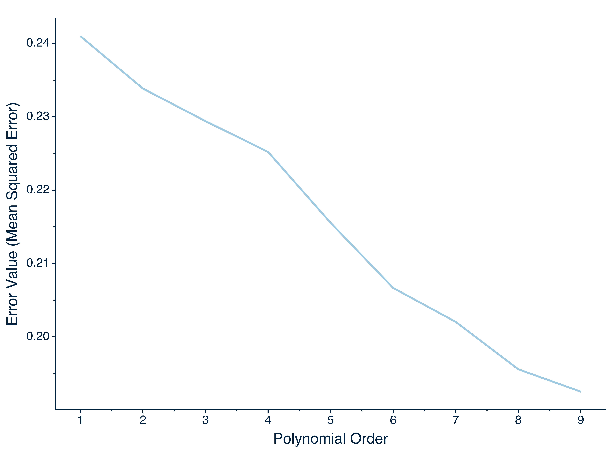
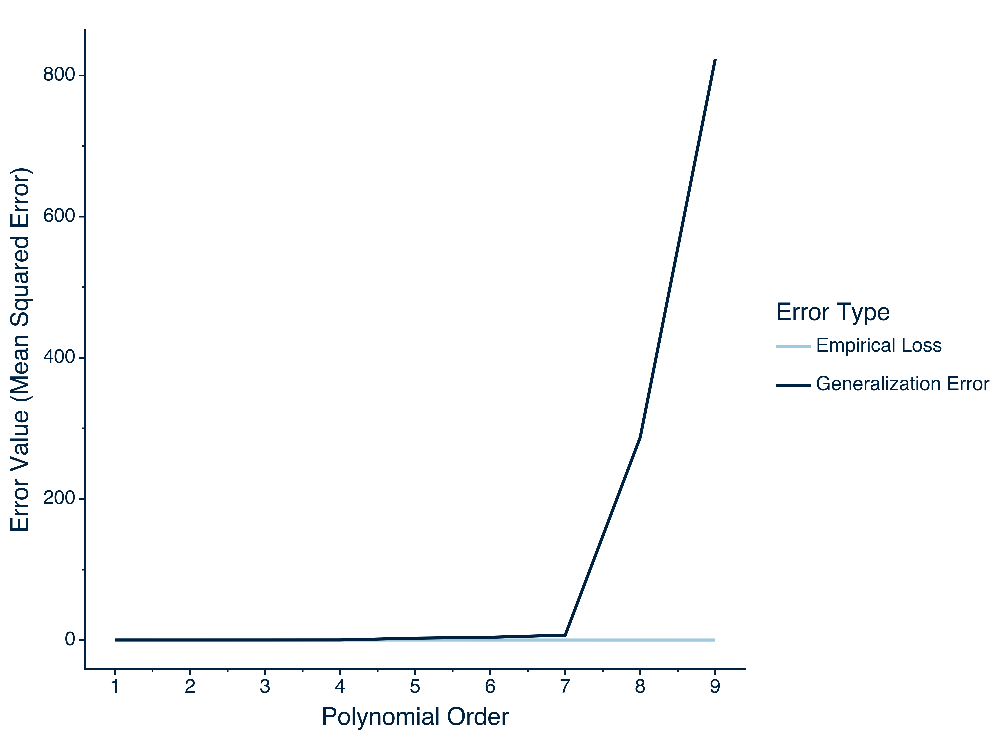

---
title: "The Game of Supervised Machine Learning: Understanding the Setup, Players, and Rules   " 
draft: true
summary: '' 
date: "2023-07-19"
article_type: technical
output:
  bookdown::html_document2:
     keep_md: true
always_allow_html: true
header-includes: 
#bibFile: content/technical_content/understanding_ML/refs.json    
tags: []
---   


Two points require mentioning before beginning this demonstration post on the expectation-maximization (EM) algorithm. First, given that this post focuses on providing demonstrations of the EM algorithm, any readers seeking a deeper understanding of this algorithm can consult my technical post on the [EM algorithm](https://sebastiansciarra.com/technical_content/em/). Second, Python and R code are used throughout this post such that objects created in Python are brought into R for plotting. To use Python and R interchangeably, I use the `reticulate` package made for R and create a conda environment to use Python (see lines <a href="#1">1--12</a> below).

```r 
library(reticulate)

#create and use conda environment
conda_create(envname = 'blog_posts',  python_version = '3.10.11')
use_condaenv(condaenv = 'blog_posts')

#install packages in conda environment
py_packages <- c('numpy', 'pandas', 'scipy')
conda_install(envname = 'blog_posts', packages = py_packages)

#useful for checking what packages are loaded
py_list_packages(envname = 'blog_posts', type = 'conda')
```

I use the following Python modules for this whitepaper. 

```r {language=python}
from trun_mvnt import trun_mvnt as tvm
import numpy as np
import pandas as pd
import sklearn
import scipy
from sklearn.metrics import mean_squared_error
import statsmodels.formula.api as smf
from functools import partial
import plotnine as pt
```

# Introduction 

In supervised machine learning, the goal is to predict. Whether the focus is to predict churn rates (among employes and/or customers), regions with high potential for growth, or something as innocuous as fruit fly behaviour, supervised machine learning can be used to solve these problems. Although a near endless number of models can be deployed to predict a given outcome, it is important that data scientists not rely on trial and error to find effective models and, instead, make purposeful decisions. To do so, it important that that data scientists understand the game of machine learning. 

To explain the game of supervised machine learning, I will do so in six parts. First, I will provide a necessary background by presenting a formal model of learning. Second, I will provide a general framework for understanding the game of supervised machine learning. Third, I will introduce the 'players' (i.e., bias, variance, and noise) of supervised machine learning by decomposing squared error. Fourth, I will explain the behaviours of bias, variance, and noise by presenting the bias-variance tradeoff. Fifth, I will explain the rules of supervised machine learning and how to succeed, Sixth, and last, I will provide an overview of situations where the rules of supervised machine learning cannot be applied. 

# A Formal Model of Learning 

To provide the context of supervised machine learning, I begin with a formal model of learning and present it in three parts. First, I will present the learning context. Second, I will present the learning model. Third, and last, I will present the selection of models. 

## Learning Context

In this section, I will present the learning context. Consider an example where a tourist arrives in a new country and wants to learn how to identify a good wine without opening the bottle. Given her experience with wine, she decides to use two features: 1) the weather that occurred for the particular year the wine was produced and 2) the winemaking quality. Both features are ranked on a 1--10 scale (where 1 indicates poor weather/winemaking quality and 10 indicates excellent weather/winemaking quality). To determine the effectiveness of this approach, she decides to taste the wines of several vineyards and, for each wine, rate the quality of the weather during the year, the winemaking quality, and then taste each wine and provide a rating (1--10 scale). After collecting the data, the tourist plans to take a subset of the data to train her models. In more formal terms, there are two components that would be considered as learning inputs: 

1) *Feature space* ($\mathbf{X}$): the set of features used for prediction. In the current example, the features of weather ($\mathbf{x}_1$) and winemaking quality ($\mathbf{x}_2$) for each wine are stored in a matrix, $\mathbf{X} = \[\mathbf{x}_1, \mathbf{x}_2\]$, with each row being an observation such that $\mathbf{x} = {x_1, x_2}$. Mathematically, we can represent the feature space as $\mathbf{X} = \[1, 10\]^2$. 
2) *Outcome space* ($\mathbf{Y}$): the set of variables being predicted. Because there is only one outcome variable of the wine quality ratings, the outcome space is simply a vector, $\mathbf{y}_1$. Given that wine quality ratings range from 1 to 10, the outcome space can be represented as $\mathbf{Y} = \[1, 10\]$. 

Together, the feature and outcome spaces comprise the data collected by the tourist such that, for each $m$ wine, there is a feature vector/outcome pair, $\mathbf{x}_m, y_m$.

Importantly, the tourist does not and never assumes *realizability*: That the features of weather and winemaking quality completely predict wine quality ratings. Instead, she assumes that, for a given pair of weather and winemaking quality values, there is a distribution of plausible wine ratings, which introduces stochasticity (randomness). Dropping the realizability assumption in the current example is certainly intuitive. Wine quality is affected by many factors outside of weather and winemaking quality such as soil quality, altitude, and age of the vines. Importantly, even if the tourist were to collect data for all the variables that affect wine quality, realizability (i.e., a one-to-one mapping between the predictors and and the outcome) would not occur because of the aforementioned stochasticity (randomness) and measurement error.[^1]

[^1]: Although measurement error is unlikely with directly observable variables (or manifest variables) such as altitude, measurement error is likely be incurred when measuring a variable such as winemaking quality because it is not directly observable; it is a latent variable that must be approximated using indicators (e.g., cleanliness of winemaking procedure, treatment of grapes, winemaker's motives, etc.). 

To reflect the uncertainty that follows from dropping realizability (also known as *agnostic learning*), the tourist assumes a joint distribution over the feature and outcome spaces. In contrast to the realizability setting where there is a one-to-one mapping function between the feature and outcome spaces, $f: \mathbf{X} \rightarrow \mathbf{Y}$, a probabilistic relation between the feature and outcome spaces is specified. Specifically, I assume a joint distribution over the feature and outcome spaces, $\mathcal{D}(\mathbf{X}, \mathbf{Y})$, such that a distribution of possible outcomes exists for any given set of feature values, $\mathcal{D}((x, y)|x)$. By conceptualizing the feature-outcome space as probabilistic, the tourist can account for measurement error and stochasticity. 


## Learning Model 

With a setup for the learning context, I will present a learning model. Revisiting the wine assessment example, the tourist has now returned from the vineyards and recorded information on each $n$ wine regarding the weather ($x_1$), winemaking quality ($x_2$), and quality of the wine ($y$). The tourist then takes a large subset of the data for training models and uses weather and winemaking quality to predict wine quality. To evaluate her models, she decides to use the mean squared error loss such that 

$$
\begin{align} 
MSE &= \frac{\sum^n_{i=1}\big(f(\mathbf{x}_i) - y_i\big)^2}{n} = \frac{\sum^n\_{i=1} \ell \ \big(f(\mathbf{x}_i), y_i\big)^2}{n}
\label{eq:mean-sq-error}
\end{align} 
$$

where $n$ is the number of observations/sample size in the data set and $i$ is an individual observation. Under ideal circumstances, the tourist would know the joint distribution underlying the feature and outcome spaces, $D(\mathbf{X}, \mathbf{Y})$, to obtain an unbiased estimate of the *generalization/true error* or *risk* of a function: The error on unseen data. Obtaining the generalization error is important because it indicates how well a model will perform when deployed. If the tourist knows the joint distribution, then the generalization error can be computed as the expected squared loss such that 

$$
\begin{align} 
L_{\mathcal{D}}(f) = \mathbb{E}\[\ell \ \big(f(\mathbf{x}), y\big)^2\],
\end{align} 
$$

where $L_D(f)$ is the loss of $f$ with respect to the joint distribution, $\mathcal{D}$. Unfortunately, because the joint distribution is seldom known in practice, generalization error cannot be directly computed. 

Although generalization is not directly computable, one solution is to compute loss on a collected. By using a sample of collected data, the strong law of large numbers indicates that, as the number of observations approaches infinity, the loss obtained on the sample data will approach the generalization error (see Equation \ref{eq:gen-error-approx}):

$$
\begin{align}
\lim_{n \rightarrow \infty} \frac{\sum\_{i=1}^n (f(\mathbf{x}_i) - y_i)^2}{n} &= L\_{\mathcal{D}}(f). 
\end{align}
$$

Therefore, to obtain an approximation of the generalization error, loss can be computed on a sample, which is often called the *empirical loss* and represented as 

$$
\begin{align} 
L_S(f) = \frac{\sum_{i=1}^n\big(f(\mathbf{x}_i) - y_i\big)^2}{n}.
\label{eq:training-loss}
\end{align} 
$$

It should be noted that a minimum sample size is required for the empirical loss to estimate the generalization error within some margin of error. This minimum sample size depends on several factors such as the complexity of the class of functions being used (or hypothesis class), obtaining a bad sample that leads to a generalization error above a certain amount, and the probability of obtaining a bad sample (for detailed explanations, see [this course](https://www.youtube.com/watch?v=b5NlRg8SjZg&list=PLPW2keNyw-usgvmR7FTQ3ZRjfLs5jT4BO) on the theory of machine learning).  

## Model Selection

Because the empirical loss provides an approximation of the general loss, one strategy for finding the function with the lowest generalization error, $f^\ast$, is to find the function with the lowest empirical loss. This approach of finding the function with the lowest empirical loss is often called *empirical risk minimization*. Mathematically, empirical risk minimization can be represented as 

$$
\begin{align}
f^\ast &= \underset{f}{\arg\min} \ Ls(f), 
\label{eq:erm}
\end{align}
$$

where $f^\ast$ is function in the set of all possible functions, $f$, that obtains the lowest empirical loss. 

Two points deserve mention with respect to $f^\ast$. First, it is often called the *empirical risk minimizer* because it obtains the lowest empirical loss. Second, in the current example, because empirical risk minimization occurs over the set of all possible functions, $f^*$, then the best possible function will inevitably exist in this set. The best possible function (i.e., the function with the lowest generalization error) is often called the *Bayes decision function*. Because we assume agnostic learning (i.e., that no function can perfectly predict the outcome), the Bayes decision function will have nonzero loss, which is often called the *Bayes risk*.


# A General Framework for Understanding the 'Game' of Machine Learning

In the sections that follow, I will provide a general framework for understanding how three types of error inevitably emerge in the formal model of learning presented above. This framework is often called excess risk decomposition (). For a lecture on excess risk decomposition, see [Bloomberg - Lecture 5](https://www.youtube.com/watch?time_continue=1472&v=YA_CE9jat4I&embeds_referring_euri=https%3A%2F%2Fbloomberg.github.io%2F&source_ve_path=MjM4NTE&feature=emb_title). Importantly, these three types of error can be conceptualized as components of generalization error. For each type of error, I will provide Python code that simulates it. 

In order to simulate each type of error with Python code, a data set is first required. Therefore, before explaining each type of error, I will first provide an overview of the data generation procedure for the wine assessment example. 

## Preamble: Data Generation Procedure{#data-generation}

In the wine assessment example, there two features and one outcome. For the features, the tourist collected data on weather and winemaking quality and computed composite scores for each feature on a 1--10 scale. For the outcome, the tourist tasted each wine and similarly calculated composite scores for wine quality on a 1--10 scale (1 indicates a poor wine and 10 indicates an excellent wine). To simulate these data, I will assume agnostic learning and, therefore, use a joint distribution over the feature and outcome spaces, with the features of weather ($\mathbf{x}_1$) and winemaking quality ($\mathbf{x}_2$) being normally distributed such that

$$
\begin{spreadlines}{0.5em}
\begin{align*}
\mathbf{X} &= \[\mathbf{x}_1, \mathbf{x}_2\] \sim \mathcal{N}(\mu, \Sigma) \cdot \mathbb{I}(\mathbf{x}_1, \mathbf{x}_2 \in \[1, 10\]), \\\\
\mu &= \[5, 7\] \text{ and} \\\\
\sigma &= \[1.2, 1.4\] \\\\
\end{align*}
\end{spreadlines}
$$

with the covariance matrix

$$
\begin{spreadlines}{0.5em}
\begin{align*}
\rho_{x_1, x_2} &= .35  \text{ and} \\\\
\Sigma &= \begin{bmatrix} 
\sigma^2_1  & \rho_{x_1, x_2}\sigma_1\sigma_2 \\\\
\rho_{x_1, x_2}\sigma_1\sigma_2 & \sigma^2_2
\end{bmatrix}.
\end{align*}
\end{spreadlines}
$$

Note that a truncated normal distribution was used to generate data for the features such that all the values for each feature fell between 1 and 10 (inclusive). To generate the outcome values for wine quality, I used the regression equation shown below in Equation \ref{eq:outcome-generate}:

$$
\begin{spreadlines}{0.5em}
\begin{align}
\mathbf{y} &= \mathbf{Xw} + \mathbf{e}, \text { where}
\label{eq:outcome-generate} \\\\
\mathbf{X} &= \[\mathbf{x}_1, \mathbf{x}_2, \mathbf{x}_1^2, \mathbf{x}_2^2, \mathbf{x}_1\mathbf{x}_2\], \nonumber \\\\
\mathbf{w} &= \[0.3 ,  0.1 ,  0.07, -0.1 ,  0.1\], \text{ and} \nonumber \\\\
\mathbf{e} &\sim \mathcal{N}(\mu = 0, \sigma = 1.5). \nonumber 
\end{align}
\end{spreadlines}
$$

Because Equation \ref{eq:outcome-generate} produced outcome values that were not scaled within a 1--10 range, I used min-max normalization formula shown below in Equation \ref{eq:rescale} to scale the outcome values of wine quality within a 1--10 range such that 

$$
\begin{align}
\mathbf{y}_{scaled} = a + \frac{(\mathbf{y} - \min(\mathbf{y}))(b-a)}{\max(\mathbf{y})-\min(\mathbf{y})}
\label{eq:rescale},
\end{align}
$$

where $a$ indicates the new lower limit (i.e., 1), $b$ indicates the new upper limit (i.e., 10), $\min(y)$ indicates the old lower limit, and $\max(y)$ indicates the old upper limit. To compute the old lower limit, I used the lowest possible value for $\mathbf{x}_1$ and the highest possible value for $\mathbf{x}_2$ of 10, which, in turn, set the values for the polynomial features ($\mathbf{x}^2_1, \mathbf{x}^2_2$) and interaction feature ($\mathbf{x}_1\mathbf{x}_2$). I then subtracted an error value that corresponded to three standard deviations below the mean, yielding the following computation for the old lower limit in Equation \ref{eq:old-lower-limit}:

$$
\begin{spreadlines}{0.5em}
\begin{align}
\text{Old lower limit } &= \mathbf{w}^\top \[1, 10, 1, 100, 10] - 3(1.5) 
\label{eq:old-lower-limit} \\\\
&=-12.13. \nonumber
\end{align}
\end{spreadlines}
$$

To compute the old upper limit, I used the highest possible values for $\mathbf{x}_1$ and $\mathbf{x}_2$ of 10, which, in turn, set the values for the polynomial features ($\mathbf{x}^2_1, \mathbf{x}^2_2$) and interaction feature ($\mathbf{x}_1\mathbf{x}_2$). I then added an error value that corresponded to three standard deviations above the mean, yielding the following computation for the old upper limit in Equation \ref{eq:old-upper-limit}:

$$
\begin{spreadlines}{0.5em}
\begin{align}
\text{Old lower limit } &= \mathbf{w}^\top \[10, 10, 10, 100, 100] + 3(1.5) 
\label{eq:old-upper-limit} \\\\
&=15.50. \nonumber
\end{align}
\end{spreadlines}
$$

With the outcome variable of wine quality being scaled, the population regression coefficients can also be scaled by first computing a scaling factor (Equation \ref{eq:scaling}) and then multiplying the old regression weights by the scaling factor (Equation \ref{eq:scaled-weights}).

$$
\begin{spreadlines}{0.5em}
\begin{align}
\text{Scaling factor} &= \frac{\text{New scale range}}{\text{Old scale range}} 
\label{eq:scaling} \\\\
&= \frac{10 - 1}{15.50 - (-12.13)}  \nonumber \\\\
&=  0.33 \nonumber \\\\
\mathbf{w}_{scaled} &= \mathbf{w}(0.33)  
\label{eq:scaled-weights} \\\\
&= [0.10, 0.03, 0.02, -0.03,  0.03] \label{eq:scaled-values}
\end{align}
\end{spreadlines}
$$

Lastly, the new scaled intercept value can be computed by first computing the mean of each feature in $\bar{\mathbf{X}}$, taking the weighted sum of the rescaled weights and mean of each feature, $ \mathbf{w}_{scaled}^\top\bar{\mathbf{X}}$, and then subtracting this value from the mean outcome value, $\bar{\mathbf{y}}$ (see Equation \ref{eq:scaled-intercept}). 

$$
\begin{align}
\text{intercept}_{ scaled} &= \bar{\mathbf{y}} - \mathbf{w}^\top\_{scaled} \bar{\mathbf{X}}
\label{eq:scaled-intercept}
\end{align}
$$

To generate the feature data, I first copied the `trun_mvnt` module from GitHub and installed it in my current project directory using the below Bash code. 

```r {language=bash}
git clone https://github.com/ralphma1203/trun_mvnt.git
```

The Python code block below (lines <a href="#2">2--108</a>) defines the functions that generate the data for the wine example such that there are two features (`weather`, `winemaking_quality`) and one outcome variable (`wine_quality`). The outcome variable is created using Equation \ref{eq:outcome-generate} and then scaled using Equation \ref{eq:rescale}. 

```r {language=python}
def compute_rescaling_factor(new_upper_limit = 10, new_lower_limit = 1):
  
  old_lower_limit = np.dot(a = provide_weights(), b = np.array([1, 10, 1, 100, 10])) - 3*(1.5)
  old_upper_limit = np.dot(a = provide_weights(),b = np.array([10, 10, 100, 100, 100])) + 3*(1.5)
  
  #formula components 
  new_scale_range = new_upper_limit - new_lower_limit
  old_scale_range = old_upper_limit - old_lower_limit
  
  rescaling_factor = new_scale_range / (old_upper_limit - old_lower_limit)
  
  return(rescaling_factor)


def rescale_outcome_variable(data, new_lower_limit = 1, new_upper_limit = 10):
  
  #scale outcome variable to a 1--10 scale 
  '''old_lower_limit: assume smallest scores for features with positive weights and largest scores for 
  features with negative weights'''
  '''old_upper_limit: assume largest scores for features with positive weights and smallest scores for 
  features with negative weights'''
  ##assume highest/lowest possible error scores are +-4 SDs 
  ##reminder: population function = ax + by + cx^2 + dy^2 + e(xy) + error
  old_lower_limit = np.dot(a = provide_weights(), b = np.array([1, 10, 1, 100, 10])) - 3*(1.5)
  old_upper_limit = np.dot(a = provide_weights(), b = np.array([10, 10, 100, 100, 100])) + 3*(1.5)
  
  #formula components 
  lower_limit_center = (data["wine_quality"] - old_lower_limit) 
  new_scale_range = new_upper_limit - new_lower_limit
  old_scale_range = old_upper_limit - old_lower_limit
  
  data["wine_quality"] = pd.DataFrame(data = 1 + (lower_limit_center * new_scale_range)/old_scale_range, 
                                                  columns = ["wine_quality"])
                                                  
  return data


def compute_outcome_variable(data):
  
  # Feature columns
  #feature_cols = pd.concat(objs=[data, np.sin(data["weather"]), data["winemaking_quality"]**2, data.prod(axis=1)], axis=1)
  feature_cols = pd.concat(objs=[data, data**2, data.prod(axis=1)], axis=1)

  
  # Error 
  error = np.random.normal(loc=0, scale=1.5, size=data.shape[0])
  
  # Compute outcome variable of wine quality
  data["wine_quality"] =  np.dot(a=feature_cols, b=provide_weights()) + error
  
  return data


def provide_weights():
  
  b_weight_weather = 0.3
  b_weight_winemaking = 0.1
  b_weight_weather_squared = 0.07
  b_weight_winemaking_squared = -0.1
  b_weight_weather_winemaking = 0.1

  weights = np.array([b_weight_weather, b_weight_winemaking, 
                      b_weight_weather_squared, b_weight_winemaking_squared, b_weight_weather_winemaking])
             
  return weights


def generate_trunc_predictors(mu, sd, cov_matrix, sample_size, 
                              lower_limits = 1, upper_limits = 10, seed = 27):
  
  # Upper and lower limits for variables
  lower_limits = np.repeat(lower_limits, len(mu))
  upper_limits = np.repeat(upper_limits, len(mu))

  # Generate samples from multivariate distribution
  sample_size = int(sample_size)
  D = np.diag(np.ones(len(mu)))
  np.random.seed(seed)

  truncated_data = pd.DataFrame(tvm.rtmvn(n=sample_size, Mean=mu, Sigma=cov_matrix,
                                                lower=lower_limits, upper=upper_limits, D=D),
                                columns=["weather", "winemaking_quality"])

  return truncated_data


def create_covariance_matrix(sd, rho):
  
  #diagonal 
  diagonal = np.square(sd)

  # Create a lower triangular matrix with zeros
  n = len(mu)
  cov_matrix = np.zeros((n, n))

  #Fill lower and upper triangles of covariance matrix 
  cov_matrix[np.tril_indices(n, -1)] = rho_weather_winemaking * np.prod(sd)
  cov_matrix = cov_matrix + cov_matrix.T

  #Fill diagonal of covariance matrix
  np.fill_diagonal(a = cov_matrix, val = sd)
  
  return cov_matrix


def generate_mult_trunc_normal(cov_matrix, mu, sd, rho, sample_size, seed = 27):

  #generate predictors
  data_mult_trunc_normal = generate_trunc_predictors(mu = mu, sd = sd, cov_matrix = cov_matrix, 
                                                     sample_size = sample_size, seed = 27)
                                                     
  #generate outcome variable
  data_mult_trunc_normal = compute_outcome_variable(data = data_mult_trunc_normal)
  
  #scale outcome variable
  data_mult_trunc_normal = rescale_outcome_variable(data = data_mult_trunc_normal)
  
  return(data_mult_trunc_normal)
```

The Python code block below (lines <a href="#109">109--118</a>) generates the multivariate normal normal such that all values for the features and outcome variables are truncated between values of 1 and 10. Importantly, because we are generating the data, we can adopt an omniscient approach in the winemaking example and generate one data for computing empirical loss and another data set for computing generalization error. Note that the sample size used for the generalization error is substantially larger so that generalization error can be accurately estimated.

```r {language=python}
#set the population means and SDs for weather and winemaking quality
mu = [5, 7]
sd = [1.2, 1.7]

#population correlation
rho_weather_winemaking =  0.35 
cov_matrix = create_covariance_matrix(sd = sd, rho =  rho_weather_winemaking)
emp_sample_size = 150
gen_sample_size = 1e4

#data used to compute empirical loss; note seed = 27 by default
data_emp_loss = generate_mult_trunc_normal(cov_matrix = cov_matrix, mu = mu, sd = sd, 
                                             rho = rho_weather_winemaking, sample_size = emp_sample_size)
                                             
#data used to compute generalization error 
data_gen_error = generate_mult_trunc_normal(cov_matrix = cov_matrix, mu = mu, sd = sd, 
                                             rho = rho_weather_winemaking, sample_size = gen_sample_size)
```

## Approximation Error: The Result of Having to Constrain Empirical Loss Minimization 

To obtain an approximation of a function's ability to make accurate predictions on unseen data (i.e., generalization), the strong law of large numbers indicated that, with sufficient sample size, the performance on sample data would be sufficient. As a corollary, empirical risk minimization then suggested that the best possible function could be identified by determining the function that obtained the lowest empirical loss. Unfortunately, empirical risk minimization inevitably fails when optimizing over over all possible functions. 


### Overfitting: The Failure of Empirical Risk Minimization 

To recall, empirical risk minimization assumes that the function with the lowest generalization error can be identified by simply determining the function with the lowest empirical loss. Mathematically, 

$$
\begin{align}
f^* &=\underset{f}{\arg\min} \ Ls(f).
\tag{\ref{eq:erm} $\$ revisited}
\end{align}
$$

Although optimizing empirical loss over all possible functions makes theoretical sense, it is impractical for two reasons. First, doing so is computationally demanding. Second, and perhaps most important, optimizing generalization error over all possible functions will likely result in *overfitting*: When the generalization error of a function is considerably higher than its empirical loss because the function's high complexity has caused it to (over)fit sample-specific information.  

Overfitting commonly occurs as an outcome of minimizing empirical loss over a set of functions that is too complex or large. As an example of overfitting, I compute empirical loss and generalization error over the set of polynomial models up to the ninth order ($P = 9$) such that 

$$
\begin{align}
f \in \mathcal{O}:f(\mathbf{x}_i) &= \text{int} + \bigg(\sum\_{p=1}^{P} w\_{p_1} x^p\_{1_i} + w\_{p_2} x^p\_{2_i}\bigg) + \mathbb{I}\_{(P\ge 2)}\bigg(\sum\_{p=1}^{P-1}\sum\_{q=1}^{P-1} w\_{pq} x^p\_{1_i} x^q\_{2_i}\bigg),
\label{eq:all-functions}
\end{align}
$$

where $f(\mathbf{x}\_i)$ represents the predicted wine quality value for $i^{th}$ wine, which is the sum of an intercept ($\text{int}$), the weighted sum of the corresponding $i^{th}$ weather ($x_{1_i}$) and winemaking quality ($x_{2_i}$), and the weighted sum of all possible two-way corresponding interactions. Note that, in Equation \ref{eq:all-functions}, interactions are only computed if the specified polynomial order is greater than or equal to 2, $\mathbb{I}_({P \ge 2)}$. The Python code block below contains functions that compute the generalization error and empirical loss (using mean squared error; see Equation \ref{eq:mean-sq-error}) for each polynomial model with an order in the specified range. 

```r {language=python}
def compute_emp_gen_error(equation, data_emp_loss, data_gen_error):
  
  model = smf.ols(data = data_emp_loss, formula = equation).fit()
  y_test = model.predict(data_gen_error)
  
  emp_loss = mean_squared_error(y_true = data_emp_loss['wine_quality'], y_pred = model.fittedvalues)
  gen_error = mean_squared_error(y_true = data_gen_error['wine_quality'], y_pred = y_test)

  return {'emp_loss': emp_loss, 
          'gen_error': gen_error}

def gen_poly_reg_eq(poly_order, include_interactions = False):
  
  #compute polynomial terms for predictors
  weather_pred = ' + '.join(['np.power(weather, {})'.format(ord_value) for ord_value in range(1, poly_order+1)])
  winemaking_quality_pred = ' + '.join(['np.power(winemaking_quality, {})'.format(ord_value) 
                            for ord_value in range(1,poly_order+1)])
                            
  # Compute all two-way interactions between weather and winemaking_quality
  if include_interactions and poly_order > 1:
    
    interaction_terms = ' + '.join(['np.multiply(np.power(weather, {}), np.power(winemaking_quality, {}))'.format(p1, p2)
                                   for p1 in range(1, poly_order)
                                   for p2 in range(1, poly_order)])
                                 
    predictors = ' + '.join([weather_pred, winemaking_quality_pred, interaction_terms])
  
  else: 
        predictors = ' + '.join([weather_pred, winemaking_quality_pred])
  
  #create regression equation
  equation = "wine_quality ~ {}".format(predictors)
  
  return equation 


def compute_all_emp_gen_errors(data_emp_loss, data_gen_error, poly_order_range, include_interactions = False):

  #create all polynomial equations within the desired range
  gen_poly_reg_eq_partial = partial(gen_poly_reg_eq, include_interactions = include_interactions)
  
  poly_equations = list(map(gen_poly_reg_eq_partial, poly_order_range))
  
  #create partial version of function with data_emp_loss and data_gen_error fixed
  emp_gen_error_partial = partial(compute_emp_gen_error, data_emp_loss = data_emp_loss, 
                                     data_gen_error = data_gen_error)
                                     
  #for each polynomial equation, compute empirical loss and generalization error
  all_emp_gen_errors = list(map(emp_gen_error_partial,  poly_equations))
  
  #convert dictionnary to dataframe and then compute polynomial orders by using row indexes
  df_emp_gen_errors = pd.DataFrame(all_emp_gen_errors)
  poly_orders =pd.Series([poly_order for poly_order in poly_order_range], name = "poly_order")
  
  #concatenate poly_orders and dataframe to create complete dataframe
  df_emp_gen_errors = pd.concat([poly_orders, df_emp_gen_errors], axis = 1)
  
  return df_emp_gen_errors
```

If empirical risk minimization is followed, then the function with the highest polynomial order would be chosen as the function with the lowest generalization error. Figure \ref{fig:emp-loss} shows that empirical loss decreases almost linearly as polynomial order increases. The Python code block below computes and plots empirical loss for each polynomial model up to the ninth order. 

```r {language=python}
#data used to compute empirical loss 
data_emp_loss = generate_mult_trunc_normal(cov_matrix = cov_matrix, mu = mu, sd = sd, 
                                             rho = rho_weather_winemaking, sample_size = emp_sample_size)
                                             
#compute empirical loss and generalization error for polynomial models up to ninth order
df_emp_gen_errors = compute_all_emp_gen_errors(data_emp_loss = data_emp_loss, data_gen_error = data_gen_error,
                                           include_interactions = True, poly_order_range=range(1, 10))
  
#set inplace = False to keep gen_error in original data frame
df_emp_loss = df_emp_gen_errors.drop("gen_error", axis=1, inplace = False)

#create empirical loss plot
emp_plot_plot = (
    pt.ggplot(data = df_emp_loss, 
              mapping=pt.aes(x = "poly_order", y = "emp_loss")) + 
    pt.geom_line(size=1, color = "#9ECAE1") + 
    pt.scale_x_continuous(name = "Polynomial Order", breaks = range(1, 10)) + 
    pt.scale_y_continuous(name = "Error Value (Mean Squared Error)") + # breaks=range(0, 601, 100)) + 
    pt.theme_classic(base_family = 'Helvetica', base_size = 14) + 
    pt.theme(text = pt.element_text(color = "#002241"), 
             axis_line = pt.element_line(color = "#002241"),
             axis_ticks = pt.element_line(color = "#002241"), 
             axis_text = pt.element_text(color = "#002241"))
)
        
#save as .png
emp_plot_plot.save("images/plot_emp_loss.png", width = 8, height = 6, dpi = 1000)
```

<div class="figure">
  <div class="figDivLabel">
    <caption>
      <span class = 'figLabel'>Figure \ref{fig:emp-loss}<span> 
    </caption>
  </div>
   <div class="figTitle">
    <span>Empirical Loss as Function of Polynomial Order</span>
  </div>
     
  
  <div class="figNote">
  <span><em>Note. </em>Empirical loss decreases almost linearly as a function of polynomial order. Note that mean squared error is used as the error metric (see Equation \ref{eq:mean-sq-error}) and polynomial models are constructed using Equation \ref{eq:all-functions}.</span> 
  </div>
</div>

If generalization error is examined, however, then the conclusion of empirical risk minimization to use the highest-order polynomial model results in a highly undesirable outcome. Figure \ref{fig:overfit-plot} shows that, while empirical loss decreases as model's polynomial order increases, generalization error suddenly increases exponentially after the seventh polynomial order. Specifically, while empirical loss remains below 1 across all polynomial orders, the generalization error goes from a value of approximately 7.11 at the seventh polynomial order to a value of approximately 823.25 at the ninth polynomial order. Thus, although the most complex polynomial model results in the lowest empirical loss, it results in the highest generalization error, and so would perform the worst if used to make predictions on new data. The Python code block below computes and plots the empirical loss and generalization error for each polynomial model up to the ninth order.


```r {language=python}
#convert to long format
df_emp_gen_errors_long = df_emp_gen_errors.melt(id_vars = "poly_order", 
                                                value_vars = ['emp_loss', 'gen_error'], 
                                                var_name = "error_type", 
                                                value_name = "error_value")

# Define color palette for each error type
color_palette = {'emp_loss': '#9ECAE1', 'gen_error': '#002241'}

overfitting_plot = (
    pt.ggplot(data = df_emp_gen_errors_long, 
              mapping=pt.aes(x = "poly_order", y = "error_value", 
                             factor = "error_type", color = "error_type")) + 
    pt.geom_line(size=1) + 
    pt.scale_x_continuous(name = "Polynomial Order", breaks = range(1, 10)) + 
    pt.scale_y_continuous(name = "Error Value (Mean Squared Error)") + # breaks=range(0, 601, 100)) + 
    pt.labs(color = "Error Type") + 
    pt.scale_color_manual(values = color_palette, 
                          labels = {'emp_loss': 'Empirical Loss', 'gen_error': 'Generalization Error'}) + 
    pt.theme_classic(base_family = 'Helvetica', base_size = 14) + 
    pt.theme(text = pt.element_text(color = "#002241"), 
             axis_line = pt.element_line(color = "#002241"),
             axis_ticks = pt.element_line(color = "#002241"), 
             axis_text = pt.element_text(color = "#002241"))
)
        
#save as .png
overfitting_plot.save("images/overfitting_curve.png", width = 8, height = 6, dpi = 1000)
```

<div class="figure">
  <div class="figDivLabel">
    <caption>
      <span class = 'figLabel'>Figure \ref{fig:overfit-plot}<span> 
    </caption>
  </div>
   <div class="figTitle">
    <span>Depiction of Positive Relation Between Overfitting and Model Complexity</span>
  </div>
     
  
  <div class="figNote">
  <span><em>Note. </em>The dark blue line indicates the generalization error and the light blue line indicates the empirical loss. The empirical loss becomes considerably greater than the generalization error (i.e., overfitting) at a polynomial order of eight. Specifically, while empirical loss remains below 1 across all polynomial orders, the generalization error goes from a value of approximately 7.11 at the seventh polynomial order to a value of approximately 823.25 at the ninth polynomial order. Note that mean squared error is used as the error metric (see Equation \ref{eq:mean-sq-error}) and polynomial models are constructed using Equation \ref{eq:all-functions}. </span> 
  </div>
</div>

Given that the previous example showed how overfitting occurred with just a subset of complex functions, it then becomes apparent that overfitting is inevitable if all functions. Overfitting presents a serious issue to practitioners because it can lead to the use of models that make highly inaccurate predictions and cause organizations to incur severe costs. Fortunately, the occurence overfitting can be reduced by modifying the method of empirical risk minimization.


### Reducing the Chance of Overfitting: Constrained Empirical Risk Minimization

Although overfitting is inevitable when all possible functions are considered, it is conceivable that a function with low generalization error can still be found if only a subset of functions are considered. By restricting the set of function over which to optimize empirical loss, it may be possible to largely prevent overfitting. This approach of restricting the set of functions over which to optimize empirical loss is known as  *constrained empirical risk minimization* and can be represented mathematically as

$$
\begin{align}
f_\mathcal{F} =  \underset{\mathcal{f \in F}}{\arg \min} \ L_s(f), 
\end{align}
$$

where $\mathcal{F}$ represents the constrained set of functions.

Returning to the wine example, the tourist may have knowledge that allows her to constrain the set of function over which to optimize empirical loss. Specifically, she will only consider polynomial functions up to the fifth order and omit the two-way interaction terms because of how introduce complexity in an exponential way with respect polynomial order; that is, they grow exponentially in number as a function of polynomial order. Thus, the restricted set of functions over which the tourist will optimize empirical loss is 


$$
\begin{align}
f \in \mathcal{F}:f(\mathbf{x}_i) &= \text{int} + \bigg(\sum\_{p=1}^{P} w\_{p_1} x^p\_{1_i} + w\_{p_2} x^p\_{2_i}\bigg),
\label{eq:constrained-functions}
\end{align}
$$

where $P = 5$. Figure \ref{fig:constrained-erm} below shows the empirical loss and generalization error as a function of polynomial order with constrained empirical risk minimization (see Python clode block below for corresponding code). Across all polynomial orders, empirical loss provides a close approximation of generalization error. Thus, the tourist has prevented the occurrence of overfitting by implementing constrained risk minimization. As an aside, a proof of the learning success of constrained empirical risk minimization can be found in [Section 2.3.1](https://www.cs.huji.ac.il/~shais/UnderstandingMachineLearning/understanding-machine-learning-theory-algorithms.pdf#page=94) of Shalev-Schwartz and Ben-David (2004). 

```r {language=python}
#compute empirical loss and generalization error for polynomial models up to fifth order
df_emp_gen_errors = compute_all_emp_gen_errors(data_emp_loss = data_emp_loss, 
                                               data_gen_error = data_gen_error,
                                               include_interactions = False, 
                                               poly_order_range=range(1, 6))

#convert to long format
df_emp_gen_errors_long = df_emp_gen_errors.melt(id_vars = "poly_order", 
                                                value_vars = ['emp_loss', 'gen_error'], 
                                                var_name = "error_type", 
                                                value_name = "error_value")

# Define color palette for each error type
color_palette = {'emp_loss': '#9ECAE1', 'gen_error': '#002241'}

contrained_erm_plot = (
    pt.ggplot(data = df_emp_gen_errors_long, 
              mapping=pt.aes(x = "poly_order", y = "error_value", 
                             factor = "error_type", color = "error_type")) + 
    pt.geom_line(size=1) + 
    pt.scale_x_continuous(name = "Polynomial Order", breaks = range(1, 10)) + 
    pt.scale_y_continuous(name = "Error Value (Mean Squared Error)") + # breaks=range(0, 601, 100)) + 
    pt.labs(color = "Error Type") + 
    pt.scale_color_manual(values = color_palette, 
                          labels = {'emp_loss': 'Empirical Loss', 'gen_error': 'Generalization Error'}) + 
    pt.theme_classic(base_family = 'Helvetica', base_size = 14) + 
    pt.theme(text = pt.element_text(color = "#002241"), 
             axis_line = pt.element_line(color = "#002241"),
             axis_ticks = pt.element_line(color = "#002241"), 
             axis_text = pt.element_text(color = "#002241"))
)
        
#save as .png
contrained_erm_plot.save("images/constrained_erm_plot.png", width = 8, height = 6, dpi = 1000)
```

<div class="figure">
  <div class="figDivLabel">
    <caption>
      <span class = 'figLabel'>Figure \ref{fig:constrained-erm}<span> 
    </caption>
  </div>
   <div class="figTitle">
    <span>Empirical Loss and Generalization Error When Using Constrained Empirical Risk Minimization</span>
  </div>
     
  
  <div class="figNote">
  <span><em>Note. </em>The dark blue line indicates the generalization error and the light blue line indicates the empirical loss.  Across all polynomial orders, empirical loss provides a close approximation of generalization error. Note that mean squared error is used as the error metric (see Equation \ref{eq:mean-sq-error}) and polynomial models are constructed from Equation \ref{eq:constrained-functions}. </span> 
  </div>
</div>

In using constrained empirical risk minimization, the tourist can select the empirical risk minimizer and accurate predict wine quality for unseen data. With constrained empirical risk minimization optimization, an upper limit is placed on the complexity of functions, and, to the extent that complexity is limited, the incidence of overfitting will be reduced. As an aside, other methods such as regularized regression (for a review, see) and bagging (see [here](https://towardsdatascience.com/ensemble-methods-bagging-boosting-and-stacking-c9214a10a205)) can be used to combat overfitting. Although constrained empirical risk minimization appears is a solution, it is by no means a perfect solution, as will be discussed in the next section.


#### Model Selection in Practice: Train, Validate, and Test

Before proceeding to discuss the limitations of constrained empirical risk minimization, a discussion regarding model selection in practice is apropos. Up to this point, I used two data sets to compute empirical loss and generalization error, with the data set for generalization error being considerably large in order to obtain an accurate estimate. Given that I generated the data with Python functions, I could easily use two different data sets for computing empirical loss and generalization error. Unfortunately, the privilege of generating data with functions does exist in practice: Data must be collected and are, therefore, finite. 

Although data are finite in practice, practitioners still want to accomplish three goals of developing models, comparing them, and then estimating how well the best model performs on unseen data (i.e., generalization error). Importantly, practitioners want to accomplish each goal and prevent overfitting. To do so, they split the data into three parts to accomplish each goal:

1) *Training set*: data used to develop models and obtain parameter estimates. 
2) *Validation set*: data used to obtain estimate of each model's generalization error so that models can be compared. Because validation data is new (with respect to the training data), overfitting is unlikely, and so the model that obtains the lowest validation error is assumed to be the best model. 
3) *Test set*: data serves as a last check that the best model identified using the validation set is indeed the best model. Because many models may be compared using the validation set, it is conceivable that one model may outperform all the other ones by overfitting on patterns/noise specific to the validation set. To ensure this is not the case, empirical loss is computed on the test set. 

Three points deserve mention with respect to model selection in practice. First, more refined approaches exist for model selection such as cross validation (see [Section 7.10](https://hastie.su.domains/Papers/ESLII.pdf#page=260) in Haste et al. (2017)) and [bagging](https://medium.com/towards-data-science/ensemble-methods-bagging-boosting-and-stacking-c9214a10a205). Second, the way in which data are trained, validated, and tested should resemble how the model will be used after deployment. For example, if a model will be used to make predictions one month into the future, it should be trained, validated, and tested such that training data do not include data points within one month of when predictions will be made. Third, deciding each sets sample size is an important decision, and a good dicussion on this issue can be found [here](https://stackoverflow.com/questions/13610074/is-there-a-rule-of-thumb-for-how-to-divide-a-dataset-into-training-and-validatio). 

### The Irreducible Error That Results From Constrained Empirical Risk Minimization: Approximation Error

Although constrained empirical risk minimization reduces the incidence of overfitting, it is not without its limitations. By constraining the set of functions over which to optimize empirical loss, it is unlikely that the best possible function (i.e., Bayes decision function) will exist in the constrained set. Figure \ref{fig:approx-error} depicts the set of all functions and the constrained set of functions, $\mathcal{F}$. Although the Bayes decision function, $f^\ast$, exists in the set of all functions, it does not exist in the constrained set of functions. Thus, the best function in the constrained set of functions will have a generalization error greater than that of the Bayes decision function, with the difference between the two functions constituting *approximation error* (see Equation \ref{eq:approx-error} below). 

$$
\begin{align}
\text{Approximation error} \hspace{0.25cm} &=  L_D(f_{\mathcal{F}}) - L_D(f^\ast) 
\label{eq:approx-error}
\end{align}
$$

<div class="figure">
  <div class="figDivLabel">
    <caption>
      <span class = 'figLabel'>Figure \ref{fig:approx-error}<span> 
    </caption>
  </div>
   <div class="figTitle">
    <span>Constrained Empirical Risk Minimization Results in Approximation Error</span>
  </div>
     
  
  <div class="figNote">
  <span><em>Note. </em>The Bayes decision function, $f^\ast$, exists in the set of all functions, but it does not exist in the constrained set of functions, $\mathcal{F}$. Thus, the best function in the constrained set of functions, $f_\mathcal{F}$, will have a generalization error greater than that of the Bayes decision function, with the difference between the two functions constituting $\textit{approximation error}$ (see Equation \ref{eq:approx-error} below). </span> 
  </div>
</div>

Returning to the wine example with the tourist, approximation error can be obtained by calculating the difference between the Bayes decision function and the constrained empirical risk minimizer. Beginning with the Bayes decision function, the scaled population regression weights from Equation \ref{eq:scaled-values} can be used to compute predictions. The difference between the predictions and actual wine quality values are used to compute the Bayes risk (or generalization error of the Bayes decision function). Ending with the constrained empirical risk minimizer, Figure \ref{fig:constrained-erm} indicated that the polynomial function with order of two resulted in the lowest generalization error. The Python code block below constructs a function for computing the Bayes risk. 


```r {language=python}
def compute_bayes_risk(data):
  
  # Feature columns
  predictors = data[["weather", "winemaking_quality"]]
  feature_cols = pd.concat(objs=[predictors, predictors**2, predictors.prod(axis=1)], axis=1)
  
  # Intercept 
  intercept = np.mean(data["wine_quality"]) - np.sum(provide_weights() * compute_rescaling_factor() * np.mean(feature_cols, axis=0))
  
  # Compute predictions for wine quality
  test_pred = intercept + np.dot(a=feature_cols, b=provide_weights() * compute_rescaling_factor())
  
  # Compute mean squared error
  bayes_risk = mean_squared_error(y_true = data['wine_quality'], y_pred = test_pred)
  
  return bayes_risk
```

The Python code block below computes the approximation error by calculating the difference between the Bayes risk and the generalization error of the constrained empirical risk minimizer. Note that I generated another large data set to get a close approximation of the best possible function in the constrained set (i.e., get the best possible parameter estimates for the second-order polynomial model with no interactions).

```r {language=python}
best_in_class_sample_size = 1e4

#use large data set to obtain a close approximation of the best possible estimates for the second-order 
#polynomial model (without interactions)
data_best_in_class = generate_mult_trunc_normal(cov_matrix = cov_matrix, mu = mu, sd = sd, 
                                             rho = rho_weather_winemaking, sample_size = best_in_class_sample_size, seed=7)
                                             
#Bayes risk 
bayes_risk = compute_bayes_risk(data = data_gen_error)

#compute empirical loss and generalization error for polynomial models up to fifth order
constrained_erm = compute_all_emp_gen_errors(data_emp_loss = data_best_in_class, 
                                             data_gen_error = data_gen_error,
                                             include_interactions = False, 
                                             poly_order_range=range(2, 3))
                                             
#compute approximation error
approx_error = constrained_erm["gen_error"][0] - bayes_risk

print('Approximation error:', np.round(a = approx_error, decimals = 5))
```
<pre><code class='python-code'>Approximation error: 0.00016
</code></pre>


## Estimation Error: The Result of Having Limited Amount of Data

In constraining empirical risk minimization, the empirical risk minimizer is only guaranteed to be found to the extent that sample size is large. Given that large sample sizes cannot always be obtained in practice, then the empirical risk minimizer, $f_\mathcal{F}$, is unlikely to result. Instead, analysis of the obtained sample will result in some imperfect estimation of $f_\mathcal{F}$, which I will call the *sample risk minimizer* and denote as $\hat{f}\_n$. Figure \ref{fig:est-error-concept} below shows that, as a result of having a limited sample size, the sample risk minimizer, $\hat{f}\_n$, results in a generalization error that is greater than that of the constrained empirical risk minimizer, $f_\mathcal{F}$. The extent to which the generalization error of the sample risk minimizer is greater than that of the constrained empirical risk minimizer is often called *estimation error*, and is represented below in Equation \ref{eq:est-error}:

$$
\begin{align}
\text{Estimation error}  \hspace{0.25cm} &=  L_D(\hat{f}_n) - L_D(f\_{\mathcal{F}}) 
\label{eq:est-error}
\end{align}
$$

<div class="figure">
  <div class="figDivLabel">
    <caption>
      <span class = 'figLabel'>Figure \ref{fig:est-error-concept}<span> 
    </caption>
  </div>
   <div class="figTitle">
    <span>Constrained Empirical Risk Minimization Results in Approximation Error</span>
  </div>
     
  
  <div class="figNote">
  <span><em>Note. </em>The Bayes decision function, $f^\ast$, exists in the set of all functions, but it does not exist in the constrained set of functions, $\mathcal{F}$. Thus, the best function in the constrained set of functions, $f_\mathcal{F}$, will have a generalization error greater than that of the Bayes decision function, with the difference between the two functions constituting approximation error (see Equation \ref{eq:approx-error} below). Unfortunately, $f_\mathcal{F}$, can only be found to the extent that a very large data set is obtained. Because practitioners often have limited data, only an estimated version of $f_\mathcal{F}$ will be obtained, $\hat{f}_n$, which I call the $\textit{aproximation error}$. Because the sample risk is an imperfect estimate of $f_\mathcal{F}$, it will necessarily have greater generalization error that is often called $\textit{estimation error}$.</span> 
  </div>
</div>


Returning to the wine example, Figure \ref{fig:est-error} below shows that, with limited sample size, the sample risk minimizer will always have greater generalization error than the constrained empirical risk minimizer. Note that the left hand plot represents a zoomed version of the right hand plot between the y-axis values of .243 and .2475. The difference in generalization error between the sample risk minimizer ($\hat{f}_n$, blue line) and the constrained empirical risk minimizer ($\hat{f}\_\mathcal{F}$; medium blue line) constitutes estimation error (see Equation \ref{eq:est-error}). The difference in generalization error between the constrained empirical risk minimizer ($\hat{f}\_\mathcal{F}$; medium blue line) and the Bayes decision function constitutes approximation error (see Equation \ref{eq:approx-error}). Importantly, the x-axis only represents the sample size used to obtain the sample risk minimizer ($\hat{f}_n$); recall that the constrained empirical risk minimizer ($\hat{f}_n$, blue line) was obtained with a very large data set (technically, an infinitely large data) and the Bayes decision function ($f^\ast$) represents the true data-generating function.  

<div class="figure">
  <div class="figDivLabel">
    <caption>
      <span class = 'figLabel'>Figure \ref{fig:est-error}<span> 
    </caption>
  </div>
   <div class="figTitle">
    <span>Generalization Error of Sample Risk Minimizer, $L_D(\hat{F}_n)$, is Always Greater Than That of Constrained Empirical Risk Minimizer, $f_\mathcal{F}$</span>
  </div>
     
  
  <div class="figNote">
  <span><em>Note. </em>The left hand plot represents a zoomed version of the right hand plot between the y-axis values of .243 and .2475. The difference in generalization error between the sample risk minimizer ($\hat{f}_n$, blue line) and the constrained empirical risk minimizer ($\hat{f}\_\mathcal{F}$; medium blue line) constitutes estimation error (see Equation \ref{eq:est-error}). The difference in generalization error between the constrained empirical risk minimizer ($\hat{f}\_\mathcal{F}$; medium blue line) and the Bayes decision function constitutes approximation error (see Equation \ref{eq:approx-error}). Importantly, the x-axis only represents the sample size used to obtain the sample risk minimizer ($\hat{f}_n$); recall that the constrained empirical risk minimizer ($\hat{f}_n$, blue line) was obtained with a very large data set (technically, an infinitely large data) and the Bayes decision function ($f^\ast$) represents the true data-generating function. </span> 
  </div>
</div>


To construct Figure \ref{fig:est-error} above, I implemented a two-step method. First, I used a large data set (`data_best_in_class`) to identify the constrained empirical risk minimizer, $f\_\mathcal{F}$, from the (constrained) set of functions defined in Equation \ref{eq:constrained-functions} (see Python code block above). Briefly, only polynomial functions of weather and winemaking quality were allowed to predict wine quality in the constrained set of functions. Second, to obtain each sample risk minimizer, $\hat{f}_n$, I sampled data (without replacement) from the same large data set used to obtain the constrained empirical risk minimizer and then extracted the lowest generalization error value from the function in the constrained set (see Equation \ref{eq:constrained-functions} and Python code block below). Note that I also computed the Bayes risk, $L_D(f^\ast)$, for reference. Importantly, generalization error for each function was computed using another large data set (`data_gen_error`).  


```r {language=python}
def compute_sample_risk_gen_error(sample_size, data_best_in_class , data_gen_error, 
                                  poly_order_range=range(1, 5)): 
  
  # Use random_state to ensure reproducibility and prevent resampling from adding noise to estimates
  gen_errors = compute_all_emp_gen_errors(data_emp_loss = data_best_in_class.sample(n=sample_size, random_state=27),
                                          data_gen_error = data_gen_error,
                                          include_interactions = False,
                                          poly_order_range = poly_order_range)['gen_error']
                                          
  # Return generalization error of sample risk minimizer
  return gen_errors.min()


# Fix the arguments except for sample_size and then use map to vectorize over sample size values
compute_sample_risk_gen_error_partial = functools.partial(compute_sample_risk_gen_error,
                                                          data_best_in_class = data_best_in_class,
                                                          data_gen_error = data_gen_error,
                                                          poly_order_range = range(1, 5))

# Call the partial function with est_sample_sizes
est_sample_sizes = range(5, 1000)
est_gen_errors = list(map(compute_sample_risk_gen_error_partial, est_sample_sizes))

#Create data frame
pd_est_error = pd.DataFrame({"sample_size": np.array(est_sample_sizes), 
                             "sample_risk_gen_error": est_gen_errors})
                             
#Create .csv file
pd_est_error.to_csv("est_error_.csv")
```


```r 
library(ggforce)
library(latex2exp)
library(ggbrace)

#create long version of df_est_error where function (bayes, constrained minimizer, or sample minimizer) is a
#categorical variable
py$df_est_error["bayes_risk"] <- py$bayes_risk
py$df_est_error["constr_min"] <- py$constrained_erm$gen_error

df_est_error_long <- py$df_est_error %>%
  pivot_longer(cols = "sample_risk_gen_error":"constr_min", names_to = "function_type", values_to = "gen_error",
               names_ptypes = factor())

df_est_error_long$function_type <- factor(x = df_est_error_long$function_type, 
                                          levels = c("sample_risk_gen_error", "constr_min", "bayes_risk"))
                                                   

labels <- c(TeX('Sample risk minimizer, $\\hat{f}_n$'),
            TeX('Constrained risk minimizer, $f_\u2131$'), 
            TeX('Bayes decision function, $f^*$'))


line_color <-  setNames(c("blue", "#2171B5", "#9ECAE1"), levels(df_est_error_long$function_type))
linetypes <-  setNames(c(1, 1, 1), levels(df_est_error_long$function_type))

#create data set for braces that show estimation and approximation error. 
##see https://stackoverflow.com/questions/45221783/ggforce-facet-zoom-labels-only-on-zoomed-example
brace_x_start <- which.min(py$df_est_error$sample_risk_gen_error[1:250]) #find minimum value in first 250 values
brace_x_end <- brace_x_start + 50

data_brace_approx_error <- data.frame("x" = c(brace_x_start, brace_x_end), 
                                   "y" = c(py$constrained_erm$gen_error, py$bayes_risk), 
                                   "zoom" = T)

data_brace_est_error <- data.frame("x" = c(brace_x_start, brace_x_end), 
                                   "y" = c(py$df_est_error$sample_risk_gen_error[brace_x_start], 
                                           py$constrained_erm$gen_error), 
                                   "zoom" = T)
                                   
label_approx_error <- "Approximation error, $L_D(f_\u2131) - L_D(f^*)$"
label_est_error <- "Estimation error, $L_D(\\hat{f}_n) - L_D(f_\u2131)$"

est_error_plot <- ggplot(data = df_est_error_long, mapping = aes(x = sample_size, y = gen_error, 
                                               group = function_type, 
                                               color = function_type, 
                                               linetype = function_type)) + 
 geom_line(size = 1.2) +
 scale_color_manual(name = "Function Type", values = line_color, labels = labels)  +
  scale_linetype_manual(name = "Function Type", values = linetypes, labels = labels) +
  labs(x = "Sample Size for Obtaining Sample Risk Minimizer", y = "Generalization Error (Mean Squared Error)", 
       color = "Function Type") +
  facet_zoom(ylim = c(0.243, .2475),  zoom.size = 1.2, zoom.data = zoom)  +
  
 #estimation error brace
 geom_brace(inherit.aes = F, data = data_brace_approx_error,
            mapping = aes(x = x, y = y,  label=TeX(label_approx_error, output="character")), 
             color = '#002241', labelsize = 5, rotate = 90, labeldistance = 5, 
            parse=T) + 
  
 #approximation error brace
 geom_brace(inherit.aes = F, data = data_brace_est_error, 
            mapping = aes(x = x, y = y,  label=TeX(label_est_error, output="character")), 
             color = '#002241', labelsize = 5, rotate = 90, labeldistance = 5, 
            parse = T) + 
  
  theme_classic(base_family = "Helvetica") + 
  theme(legend.text.align = 0, #left align text
        legend.text = element_text(size = 14),
        legend.title = element_text(size = 15), 
        axis.title  = element_text(size = 15), 
        axis.text = element_text(size = 14, color = "#002241"), 
        text = element_text(color = "#002241"),,
        axis.line = element_line(color = "#002241"), 
        axis.ticks = element_line(color =  "#002241")) 


ggsave(plot = est_error_plot, filename = 'images/est_error_plot.png', width = 12, height = 6, dpi = 1000)
```


## Optimization Error: The Result of Imperfect Optimization

To understand optimization error, it is first important to understand how regression weights have been obtained thus far. After this, I will explain how optimization error can be introduced by solving for regression weights using a different method by the name of gradient descent.  

Returning to our wine example, the tourist wanted to use weather and winemaking quality to predict wine quality. Together, weather ($\mathbf{x}_1$) and winemaking quality ($\mathbf{x}_2$) constituted the set of features, $\mathbf{X} = \[\mathbf{x}_1^\top, \mathbf{x}_2^\top\]$, with wine quality representing the outcome vector, $\mathbf{y}$. Thus, using $\mathbf{X}$, the tourist wanted to compute predicted values for wine quality such that 

$$
\begin{align}
\hat{\mathbf{y}} = \mathbf{Xw}.
\end{align}
$$

To obtain accurate predictions for wine quality, the tourist decided to find some set of weights that minimized the mean squared error (see Equation \ref{eq:mean-sq-error}). Mathematically, 

$$
\begin{align}
\mathbf{w}_{MSE} &= \underset{\mathbf{w}}{\arg\min} \ \frac{1}{n} \lVert \mathbf{y} - \mathbf{Xw} \rVert^2_2 \nonumber \\\\ 
&=  \underset{\mathbf{w}}{\arg\min}  \ \frac{1}{n} (\mathbf{y} - \mathbf{Xw})^\top (\mathbf{y} - \mathbf{Xw}) \nonumber \\\\ 
&=  \underset{\mathbf{w}}{\arg\min}  \ \frac{1}{n} (\mathbf{y}^\top\mathbf{y} - 2\mathbf{w}^\top\mathbf{X}^\top\mathbf{y} + \mathbf{w}^\top\mathbf{X}^\top\mathbf{X}\mathbf{w})
\end{align}
$$

To find $\mathbf{w}_{MSE}$, it can be solved for after computing the gradient of the mean squared error with respect to $\mathbf{w}$ and setting it to zero (see below):[^2]

[^2]: Note that, for the formula $\mathbf{w}_{MSE}$ in Equation \ref{eq:weight-mse-min} to be computable, the columns of $\mathbf{X}$ must be linearly independent. Linear independence guarantees that $(\mathbf{X}^\top\mathbf{X})^{-1}$ exists and that $\mathbf{w}_{MSE}$ is the best solution. For a more detailed explanation see, [Lecture 5 - Gradient Descent and Least Squares](https://uchicago.hosted.panopto.com/Panopto/Pages/Viewer.aspx?id=bbd55a27-0fa6-4855-85f2-adbf01393f3a). Note that, although the lectures uses the sum of squares as the loss function, the conclusions obtained are identical to those obtained with mean squared error. 

$$
\begin{align}
\nabla_\mathbf{w} MSE &= \frac{\partial\ MSE}{\partial \ \mathbf{w}} = \frac{1}{n} \frac{\partial}{\partial \ \mathbf{w}} \bigg(\mathbf{y}^\top\mathbf{y} - 2\mathbf{w}^\top\mathbf{X}^\top\mathbf{y} + \mathbf{w}^\top\mathbf{X}^\top\mathbf{X}\mathbf{w}\bigg) \nonumber \\\\ 
&=\frac{1}{n}\bigg(0 - 2\mathbf{X}^\top\mathbf{y} + 2\mathbf{X}^\top\mathbf{X}\mathbf{w}\bigg) \nonumber \\\\ 
 &= 2\mathbf{X}^\top(\mathbf{Xw} - \mathbf{y}) \\\\
\text{Set } \nabla_\mathbf{w}  MSE &= 0 \nonumber \\\\ 
0 &= - 2\mathbf{X}^\top\mathbf{y} + 2\mathbf{X}^\top\mathbf{X}\mathbf{w} \nonumber \\\\
\mathbf{X}^\top\mathbf{y} &= \mathbf{X}^\top\mathbf{X}\mathbf{w} \nonumber \\\\
\mathbf{w}_{MSE} &= (\mathbf{X}^\top\mathbf{X})^{-1}\mathbf{X}^\top\mathbf{y}
\label{eq:weight-mse-min}
\end{align}
$$

To show that $\mathbf{w}_{MSE}$ does indeed contain the set of weights that minimizes the mean squared error, I will first compute $\mathbf{w}_{MSE}$ using Equation \ref{eq:weight-mse-min} and then show that it indeed minimizes the mean squared error. Beginning with the computation of $\mathbf{w}_{MSE}$, I compute it using the wine data set I generated in the section on [Data Generation](#data-generation) (see the Python code block between lines ..., which I repeat below). 

```r {language=python}
#set the population means and SDs for weather and winemaking quality
mu = [5, 7]
sd = [1.2, 1.7]

#population correlation
rho_weather_winemaking =  0.35 
cov_matrix = create_covariance_matrix(sd = sd, rho =  rho_weather_winemaking)
emp_sample_size = 225
gen_sample_size = 1e4

#data used to compute empirical loss; note seed = 27 by default
data_emp_loss = generate_mult_trunc_normal(cov_matrix = cov_matrix, mu = mu, sd = sd, 
                                             rho = rho_weather_winemaking, sample_size = emp_sample_size)
```

The Python code block below computes $\mathbf{w}_{MSE}$ and finds that 

$$
\begin{align}
\mathbf{w}_{MSE} &= \[0.73,  1.06, -0.01, -0.10\]
\end{align}
$$

```r {language=python}
def extract_feature_outcome_data(data):
  
  #gather necessary components for matrix-matrix multiplications 
  original_features = data[["weather", "winemaking_quality"]]
  features = pd.concat(objs = [original_features, original_features**2], axis = 1).to_numpy()
  outcome = data[["wine_quality"]].to_numpy()
  
  return {"features": features, 
          "outcome": outcome}


def compute_weight_min_MSE(data):
  
  #gather necessary components for matrix-matrix multiplications 
  dict_data = extract_feature_outcome_data(data = data)
  features = dict_data["features"]
  outcome = dict_data["outcome"]
  
  #compute w_MSE = 
  w_mse = np.linalg.inv(np.transpose(features).dot(features)).dot(np.transpose(features)).dot(outcome)
  
  return w_mse.ravel()


w_mse = compute_weight_min_MSE(data = data_emp_loss)

print("Best weights:", np.round(a = w_mse, decimals = 2))
```
<pre><code class='python-code'>Best weights: [ 0.73  1.06 -0.01 -0.1 ]
</code></pre>


Ending with the visualization of $\mathbf{w}_{MSE}$, I now show that it indeed results in the lowest mean squared error value. To construct a more palatable visualization of the mean squared error function, I only allow the first weight to vary so that the function can be plotted on a 2-dimensional plot. 

 
```r {language=python}
def compute_ind_MSE(data, w_guess):
 
  #gather necessary components for matrix-matrix multiplications 
  dict_data = extract_feature_outcome_data(data = data)
  features = dict_data["features"]
  outcome = dict_data["outcome"]
  
  #construct vector of weights
  #w_initial = np.array([0.1, 0.07, -0.1])
  w_initial = np.array([1.05928459, -0.01280733, -0.09713313])
  w_initial =  np.insert(arr = w_initial, obj = 0, values = w_guess)
  
  #MSE = 
  y_trans_y = np.transpose(outcome).dot(outcome)
  wXy = np.transpose(w_initial).dot(np.transpose(features)).dot(outcome)
  wXXw = np.transpose(w_initial).dot(np.transpose(features)).dot(features).dot(w_initial)
  
  mse = y_trans_y - 2*wXy + wXXw
  
  return mse 


def compute_all_MSE_loss_values(data, w_guess_list):
  
  #return flattened array
  all_mse_loss_values = np.concatenate([compute_ind_MSE(data, guess) for guess in w_guess_list]).ravel()
  
  #create dataframe with guesses and corresponding MSE values
  df_mse = pd.DataFrame({"w_guess": w_guess_list, 
                         "mse_value": all_mse_loss_values})
  
  return df_mse


df_mse_values = compute_all_MSE_loss_values(data = data_emp_loss, w_guess_list = np.arange(start = 0, stop = 3, step= 0.01))


df_mse_values["w_guess"][np.argmin(df_mse_values["mse_value"])]


(pt.ggplot(data = df_mse_values, mapping = pt.aes(x = "w_guess", y = "mse_value")) + 
  pt.geom_line() + 
  pt.scale_x_continuous(name = "w") +
  pt.theme_classic(base_family = "Helvetica"))
  
  
orignal_features = data_emp_loss[["weather", "winemaking_quality"]]
features = pd.concat(objs = [original_features, original_features**2], axis = 1).to_numpy()
outcome = data_emp_loss[["wine_quality"]]


w_mse = np.linalg.inv(np.transpose(features).dot(features)).dot(np.transpose(features)).dot(outcome)
```


### A Brief Review of Gradient Descent 


# The 'Players' in Machine Learning: Bias, Variance, and Noise

# How the 'Players' of Machine Learning Behave: The Bias-Variance Tradeoff

# Using the Bias-Variance Tradeoff to Develop Rules of Machine Learning

# The Non-Universality of the Rules of Machine Learning


